# UML e arquitetura — Midas Marketplace

Versão 3.0 · Atualizado em 22 de agosto de 2026 · 32 seções · 34 diagramas Mermaid

## 1. Decisão arquitetural

### Estilo

Começar como **monólito modular orientado a domínios**, com três processos implantáveis:

1. API HTTP/BFF.
2. Gateway de chat em tempo real.
3. Workers assíncronos.

Essa decisão mantém transações e evolução simples no MVP. Limites de domínio, schemas, eventos e permissões já preparam extrações futuras. Microserviços prematuros aumentariam falhas distribuídas justamente nos fluxos de dinheiro e estado.

### Fundamentos

- PostgreSQL é a fonte canônica.
- Redis atende sessão, cache, presença e rate limit; não é fonte de verdade.
- Broker recebe eventos com entrega pelo menos uma vez.
- Outbox/inbox transacional e consumidores idempotentes evitam perda/duplicação.
- OpenSearch é projeção de busca, reconstruível.
- Object storage guarda mídia; KMS/Secrets Manager guarda chaves e segredos.
- Ledger é append-only, partidas dobradas e isolado por schema/credencial.
- PSP movimenta dinheiro real; Midas orquestra e registra obrigações.
- Preço entra somente por adaptador público/documentado/licenciado.
- Expiração de reserva, cancelamento do pagamento e reativação do anúncio formam uma única invariável entre agregados: o anúncio só volta a `ACTIVE` depois que o PSP confirmar canonicamente o intent como cancelado/expirado.
- Settlement tardio nunca libera entrega diretamente: entra em `PAYMENT_QUARANTINED` e só sai por reassociação atômica segura ou reembolso confirmado.
- Growth é CQRS de leitura: projeta fatos canônicos por `SellerAccount`, informa freshness e nunca autoriza mutação ou cria tenant paralelo.
- Ativo 3D é derivado versionado de `CatalogItem`/`CatalogAsset`: geração assíncrona, validação e revisão humana antecedem qualquer publicação.
- A inspeção 3D pública tem rota própria por item, `/itens/:slug/3d`: um `CatalogItem`, seu `Model3DArtifact` ativo e no máximo um canvas WebGL por vez.

## 2. Contexto do sistema

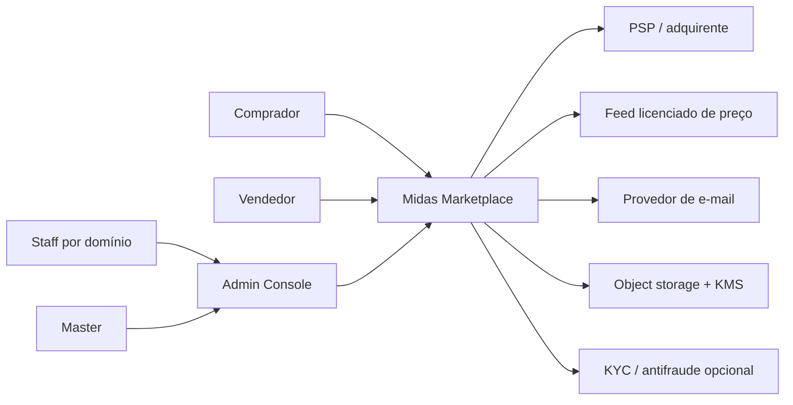
```mermaid
flowchart LR
    Buyer[Comprador] --> Midas[Midas Marketplace]
    Seller[Vendedor] --> Midas
    Staff[Staff por domínio] --> Admin[Admin Console]
    Master[Master] --> Admin
    Admin --> Midas
    Midas --> PSP[PSP / adquirente]
    Midas --> Price[Feed licenciado de preço]
    Midas --> Mail[Provedor de e-mail]
    Midas --> Storage[Object storage + KMS]
    Midas --> KYC[KYC / antifraude opcional]
```

### Responsabilidades externas

| Sistema | Responsabilidade |
|---|---|
| PSP | checkout, tokenização, Pix/cartão, captura, reembolso, chargeback, KYC/subconta e payout conforme contrato |
| Feed de preço | IDs, observações/candles em gold, proveniência, limites e licença |
| E-mail | envio, inbound parse, bounce, complaint e autenticação de domínio |
| Storage/KMS | objeto versionado, URLs assinadas, envelope encryption e rotação |
| KYC/risco | validação adicional quando política/PSP exigir |
| Motor 3D | inferência isolada por adapter versionado; nunca decide publicação nem altera catálogo diretamente |

## 3. Containers

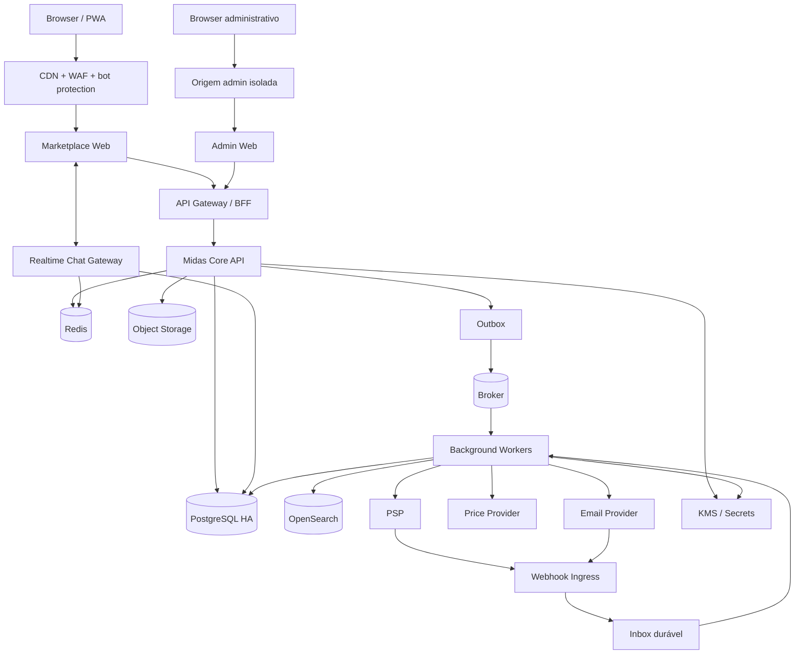
```mermaid
flowchart TB
    User[Browser / PWA] --> Edge[CDN + WAF + bot protection]
    Staff[Browser administrativo] --> AdminEdge[Origem admin isolada]
    Edge --> Web[Marketplace Web]
    AdminEdge --> AdminWeb[Admin Web]
    Web --> Gateway[API Gateway / BFF]
    AdminWeb --> Gateway
    Gateway --> Core[Midas Core API]
    Web <--> Realtime[Realtime Chat Gateway]
    Core --> PG[(PostgreSQL HA)]
    Core --> Redis[(Redis)]
    Core --> Object[(Object Storage)]
    Core --> Outbox[Outbox]
    Realtime --> PG
    Realtime --> Redis
    Outbox --> Broker[(Broker)]
    Broker --> Workers[Background Workers]
    Workers --> PG
    Workers --> Search[(OpenSearch)]
    Workers --> PSP[PSP]
    Workers --> Price[Price Provider]
    Workers --> Mail[Email Provider]
    PSP --> Hooks[Webhook Ingress]
    Mail --> Hooks
    Hooks --> Inbox[Inbox durável]
    Inbox --> Workers
    Core --> KMS[KMS / Secrets]
    Workers --> KMS
```

Admin usa CSP, origem, cookie, step-up e duração de sessão mais restritivos do que o marketplace público.

## 4. Bounded contexts

| Contexto | Dados próprios e responsabilidade |
|---|---|
| Identity | usuário, credencial, passkey, MFA, recuperação e sessão |
| IAM | roles, permissions, grants, política ABAC e delegação |
| Device Trust & Risk | vínculos, desafios, sinais, confiança e decisão |
| Catalog | itens, versões, stickers, taxonomia, imagens e proveniência |
| Listings & Moderation | rascunho, revisão, craft, prova de posse/disponibilidade, decisão, publicação e reserva |
| Offers & Conversation | sala pré-compra, mensagens, propostas e moderação |
| Market Data & Pricing | instrumentos, observações, candles, cotação e qualidade |
| Search & Discovery | índice, filtros, ranking e tombstones |
| Recommendation | eventos, afinidade, candidatos, ranking e impressão |
| Orders & Delivery | pedido, unidade, template de pronta-entrega, pacote consumido, sala, confirmações e cofre |
| Cart & Checkout | carrinho, linha, merge, revalidação, `CheckoutGroup` e criação coordenada de pedidos separados |
| Payments | intent, tentativa, evento PSP, capability registry, `PaymentResolutionCase`, solicitação humana de reembolso, execução de refund e chargeback |
| Ledger & Payouts | journal, posting, lote, hold, saldo, solicitação, allocation, tentativa, evidência e execução de saque |
| Disputes & Reputation | disputa, evidência, decisão, recurso, `OrderReview`, `ReputationProjection` e sanção |
| Progression & Rewards | policies, contribuições, níveis, rewards, badges, temporadas, ranking e prêmios |
| Customer Engagement & Consent | contatos protegidos, consentimentos, suppressions, lifecycle candidates, jornadas, campanhas, templates e dispatch |
| Promotions & Attribution | cupom, redemption, affiliate, link, touch, modelo de atribuição e comissão madura |
| Support & Mailbox | ticket, thread, e-mail, SLA e anexo |
| Notifications | e-mail transacional, inbox e push futuro |
| Administration | configuração tipada, flags, console, seller onboarding e emergência |
| Audit & Compliance | evento auditável, retenção, exportação, restrição/recurso e direitos do titular |
| Growth Analytics | catálogo semântico, projeções por plataforma/`SellerAccount`, funil, coorte, contribuição, timeline e qualidade |
| 3D Assets | fontes `CatalogAsset`, job assíncrono, `Model3DArtifact` GLB/PBR, validação, revisão, publicação e rollback |
| Public Content & SEO | conteúdo público, crawl policy, canonical, sitemap, hreflang, structured data, locale e health projection |

Regra: cada contexto escreve somente suas tabelas. Outros contextos recebem IDs e eventos versionados; não alteram cópias internas.

## 5. Componentes do backend


```mermaid
flowchart LR
    API[Core API] --> Auth[Auth Service]
    API --> PDP[Policy Decision Point]
    API --> Device[Device Trust]
    API --> Catalog[Catalog Service]
    API --> Listing[Listing Workflow]
    API --> Moderation[Moderation Service]
    API --> Proof[Ownership + Availability Proof]
    API --> Offer[Offer Service]
    API --> Order[Order Orchestrator]
    API --> Delivery[Delivery + Vault]
    API --> Payment[Payment Orchestrator]
    API --> PaymentCase[Payment Resolution Workflow]
    API --> Refund[Refund Request Workflow]
    API --> Ledger[Ledger Service]
    API --> PayoutOps[Payout Operations]
    API --> Dispute[Dispute Service]
    API --> Review[Review and Trust]
    API --> Progression[Progression Rewards Ranking]
    API --> Cart[Cart and Checkout Group]
    API --> Consent[Consent and Contact Vault]
    API --> Campaign[Campaign and Journey]
    API --> Promotion[Coupon Affiliate Attribution]
    API --> Studio[Studio Application Service]
    API --> SEO[Public Content and SEO]
    API --> Ticket[Ticket Service]
    API --> Config[Configuration]
    API --> Audit[Audit Writer]
    API --> Outbox[Outbox Writer]
    API --> GrowthQuery[Growth Query Service]
    API --> Model3D[3D Asset Workflow]

    Worker[Workers] --> Reconcile[Payment reconciliation]
    Worker --> Quarantine[Late payment quarantine]
    Worker --> RefundExec[Refund execution + reconciliation]
    Worker --> Revalidate[Listing revalidation]
    Worker --> Price[Price ingestion]
    Worker --> Project[Search projector]
    Worker --> Hold[Hold scheduler]
    Worker --> Payout[Payout processor]
    Worker --> Engagement[Lifecycle and engagement projector]
    Worker --> Dispatch[Channel dispatch and status]
    Worker --> Attribution[Attribution and commission projector]
    Worker --> Progress[Level badge ranking projector]
    Worker --> SEOProjector[Public page sitemap SEO projector]
    Worker --> Recommend[Recommendation builder]
    Worker --> Email[Email ingress/outbound]
    Worker --> Media[Media security pipeline]
    Worker --> Notify[Notification dispatcher]
    Worker --> GrowthProjector[Growth projectors + reconciliation]
    Worker --> Model3DWorker[3D generation + validation]
```

## 6. Modelo de classes


```mermaid
classDiagram
    class User
    class SellerAccount
    class SellerMembership
    class SellerOnboardingCase
    class Credential
    class WebAuthnCredential
    class Session
    class DeviceBinding
    class Role
    class Permission
    class CatalogItem
    class CatalogItemVersion
    class CatalogAsset
    class CatalogSubmission
    class CatalogItemRelation
    class ProductLifecyclePolicy
    class Model3DJob
    class Model3DArtifact
    class GrowthMetricDefinition
    class GrowthBucket
    class GrowthObjectContribution
    class Listing
    class ListingRevision
    class ListingUnit
    class ListingPlanPolicyVersion
    class ListingCommercialSnapshot
    class ReturnPolicySnapshot
    class Reservation
    class OwnershipProof
    class Craft
    class CraftSlot
    class Conversation
    class Message
    class Offer
    class PriceInstrument
    class PriceObservation
    class PriceCandle
    class Order
    class Cart
    class CartLine
    class CheckoutGroup
    class DeliveryRoom
    class DeliveryConfirmation
    class SecureDeliveryTemplate
    class SecureDeliveryPackage
    class Payment
    class PaymentAttempt
    class ProviderEvent
    class PaymentResolutionCase
    class PaymentCaseEvidence
    class PaymentCaseDecision
    class RefundRequest
    class RefundAttempt
    class JournalEntry
    class Posting
    class LedgerAccount
    class BalanceLot
    class Hold
    class PayoutRequest
    class PayoutAttempt
    class PayoutEvidence
    class OrderReview
    class ReputationProjection
    class ProgressionContribution
    class AccountLevelDefinition
    class AccountLevelAssignment
    class BadgeDefinition
    class BadgeAward
    class RewardDefinition
    class RewardAward
    class LeaderboardSeason
    class LeaderboardContribution
    class LeaderboardProjection
    class LeaderboardAward
    class ContactPoint
    class ConsentRecord
    class SuppressionEntry
    class Campaign
    class CampaignVersion
    class Journey
    class JourneyVersion
    class MessageTemplate
    class CreativeAsset
    class Dispatch
    class DeliveryAttempt
    class ChannelEvent
    class Coupon
    class CouponRedemption
    class AffiliateAccount
    class AttributionTouch
    class AttributionSnapshot
    class AffiliateCommission
    class MarketPolicy
    class CrawlPolicy
    class Dispute
    class DisputeEvidence
    class DisputeDecision
    class DisputeAppeal
    class RestrictionAppeal
    class AccountRestriction
    class DataRightsRequest
    class Ticket
    class TicketMessage

    User "1" --> "0..*" Credential
    User "1" --> "0..*" WebAuthnCredential
    User "1" --> "0..*" Session
    User "1" --> "0..*" DeviceBinding
    User "0..*" --> "0..*" Role
    Role "0..*" --> "0..*" Permission
    User "1" --> "0..*" SellerMembership
    SellerAccount "1" --> "1..*" SellerMembership
    SellerAccount "1" --> "0..*" SellerOnboardingCase
    SellerAccount "1" --> "0..*" Listing
    CatalogItem "1" --> "1..*" CatalogItemVersion
    CatalogItem "1" --> "0..*" CatalogAsset
    CatalogItem "1" --> "0..*" CatalogSubmission : receives
    CatalogItem "1" --> "0..*" CatalogItemRelation : source
    CatalogItemRelation "0..*" --> "1" CatalogItem : target
    CatalogItem "1" --> "1" ProductLifecyclePolicy
    CatalogItem "1" --> "0..*" Model3DJob
    CatalogItem "1" --> "0..*" Model3DArtifact
    CatalogAsset "1..*" --> "0..*" Model3DJob : source
    Model3DJob "1" --> "0..*" Model3DArtifact : produces
    GrowthMetricDefinition "1" --> "0..*" GrowthBucket
    SellerAccount "0..1" --> "0..*" GrowthBucket : scopes
    GrowthBucket "1" --> "0..*" GrowthObjectContribution
    Listing "1" --> "1..*" ListingRevision
    ListingRevision "1" --> "1" ListingCommercialSnapshot
    ListingRevision "1" --> "1" ReturnPolicySnapshot
    ListingCommercialSnapshot "0..*" --> "1" ListingPlanPolicyVersion
    Listing "1" --> "1" ListingUnit
    ListingUnit "1" --> "0..*" OwnershipProof
    ListingUnit "1" --> "0..*" Reservation
    ListingRevision "1" --> "0..1" Craft
    ListingRevision "1" --> "0..1" SecureDeliveryTemplate
    ListingUnit "1" --> "0..1" SecureDeliveryTemplate
    Craft "1" --> "4" CraftSlot
    CraftSlot "0..*" --> "0..1" CatalogItem : sticker
    Listing "1" --> "0..*" Conversation
    Conversation "1" --> "0..*" Message
    Conversation "1" --> "0..*" Offer
    CatalogItem "1" --> "0..*" PriceInstrument
    PriceInstrument "1" --> "0..*" PriceObservation
    PriceInstrument "1" --> "0..*" PriceCandle
    Listing "1" --> "0..1" Order
    User "1" --> "0..*" Cart
    Cart "1" --> "0..*" CartLine
    CartLine "0..*" --> "1" Listing
    Cart "1" --> "0..*" CheckoutGroup
    CheckoutGroup "1" --> "1..*" Order
    Order "1" --> "1" Reservation
    Order "1" --> "1" DeliveryRoom
    DeliveryRoom "1" --> "0..2" DeliveryConfirmation
    DeliveryRoom "1" --> "0..1" SecureDeliveryPackage
    SecureDeliveryTemplate "1" --> "0..1" SecureDeliveryPackage : consumed_as
    Order "1" --> "1..*" Payment
    Payment "1" --> "0..*" PaymentAttempt
    PaymentAttempt "1" --> "0..*" ProviderEvent
    Payment "1" --> "0..*" PaymentResolutionCase
    PaymentResolutionCase "1" --> "0..*" PaymentCaseEvidence
    PaymentResolutionCase "1" --> "0..*" PaymentCaseDecision
    Order "1" --> "0..*" RefundRequest
    RefundRequest "1" --> "0..*" RefundAttempt
    Payment "1" --> "0..*" RefundAttempt
    Order "1" --> "0..*" Dispute
    Order "1" --> "0..*" BalanceLot
    BalanceLot "1" --> "0..*" Hold
    SellerAccount "1" --> "0..*" PayoutRequest
    PayoutRequest "1" --> "0..*" PayoutAttempt
    PayoutAttempt "1" --> "0..*" PayoutEvidence
    JournalEntry "1" --> "2..*" Posting
    LedgerAccount "1" --> "0..*" Posting
    Order "1" --> "0..2" OrderReview
    OrderReview "0..*" --> "1" ReputationProjection : projects
    Order "1" --> "0..*" ProgressionContribution
    SellerAccount "1" --> "0..*" ProgressionContribution
    AccountLevelDefinition "1" --> "0..*" AccountLevelAssignment
    SellerAccount "1" --> "0..*" AccountLevelAssignment
    BadgeDefinition "1" --> "0..*" BadgeAward
    RewardDefinition "1" --> "0..*" RewardAward
    LeaderboardSeason "1" --> "0..*" LeaderboardContribution
    LeaderboardSeason "1" --> "0..*" LeaderboardProjection
    LeaderboardSeason "1" --> "0..3" LeaderboardAward
    User "1" --> "0..*" ContactPoint
    ContactPoint "1" --> "0..*" ConsentRecord
    ContactPoint "1" --> "0..*" SuppressionEntry
    SellerAccount "1" --> "0..*" Campaign
    Campaign "1" --> "1..*" CampaignVersion
    CampaignVersion "1" --> "0..*" Journey
    Journey "1" --> "1..*" JourneyVersion
    JourneyVersion "0..*" --> "0..*" MessageTemplate
    CampaignVersion "0..*" --> "0..*" CreativeAsset
    JourneyVersion "1" --> "0..*" Dispatch
    Dispatch "1" --> "0..*" DeliveryAttempt
    DeliveryAttempt "1" --> "0..*" ChannelEvent
    SellerAccount "1" --> "0..*" Coupon
    Coupon "1" --> "0..*" CouponRedemption
    Order "1" --> "0..*" CouponRedemption
    User "1" --> "0..*" AffiliateAccount
    AffiliateAccount "1" --> "0..*" AttributionTouch
    Order "1" --> "0..1" AttributionSnapshot
    AttributionSnapshot "0..1" --> "0..1" AffiliateCommission
    MarketPolicy "1" --> "0..*" CrawlPolicy
    Dispute "1" --> "0..*" DisputeEvidence
    Dispute "1" --> "0..*" DisputeDecision
    Dispute "1" --> "0..1" DisputeAppeal
    User "1" --> "0..*" AccountRestriction
    AccountRestriction "1" --> "0..1" RestrictionAppeal
    User "1" --> "0..*" DataRightsRequest
    Ticket "1" --> "0..*" TicketMessage
```

`SellerAccount` é o sujeito vendedor, não um usuário implícito. `SellerMembership` resolve a associação: conta `INDIVIDUAL` possui exatamente um membro `OWNER`; conta `ORGANIZATION` ou `PLATFORM` possui um ou mais membros com funções próprias. Um `User` pode comprar pessoalmente e participar de zero ou mais seller accounts, mas toda ação de venda informa e autoriza um `sellerAccountId` explícito.

## 7. Modelo relacional essencial


```mermaid
erDiagram
    USERS ||--o{ SESSIONS : owns
    USERS ||--o{ DEVICE_BINDINGS : trusts
    USERS }o--o{ ROLES : granted
    ROLES }o--o{ PERMISSIONS : contains
    USERS ||--o{ SELLER_MEMBERSHIPS : joins
    SELLER_ACCOUNTS ||--|{ SELLER_MEMBERSHIPS : authorizes
    SELLER_ACCOUNTS ||--o{ SELLER_ONBOARDING_CASES : validates
    SELLER_ACCOUNTS ||--o{ LISTINGS : publishes
    CATALOG_ITEMS ||--o{ CATALOG_ITEM_VERSIONS : versions
    CATALOG_ITEMS ||--o{ CATALOG_ASSETS : displays
    LISTINGS ||--o{ LISTING_REVISIONS : snapshots
    LISTINGS ||--|| LISTING_UNITS : represents
    LISTING_UNITS ||--o{ OWNERSHIP_PROOFS : proves
    LISTING_UNITS ||--o{ RESERVATIONS : reserves
    LISTING_REVISIONS ||--o| CRAFTS : includes
    LISTING_REVISIONS ||--o| SECURE_DELIVERY_TEMPLATES : preconfigures
    LISTING_UNITS ||--o| SECURE_DELIVERY_TEMPLATES : binds
    CRAFTS ||--|{ CRAFT_SLOTS : orders
    LISTINGS ||--o| ORDERS : sold_as
    ORDERS ||--|| RESERVATIONS : owns
    ORDERS ||--|| DELIVERY_ROOMS : opens
    SECURE_DELIVERY_TEMPLATES ||--o| SECURE_DELIVERY_PACKAGES : consumes
    DELIVERY_ROOMS ||--o| SECURE_DELIVERY_PACKAGES : reveals
    ORDERS ||--|{ PAYMENTS : pays
    PAYMENTS ||--o{ PAYMENT_ATTEMPTS : attempts
    ORDERS ||--o{ REFUND_REQUESTS : requests
    REFUND_REQUESTS ||--o{ REFUND_ATTEMPTS : executes
    PAYMENTS ||--o{ REFUND_ATTEMPTS : refunds
    ORDERS ||--o{ DISPUTES : disputes
    ORDERS ||--o{ BALANCE_LOTS : funds
    BALANCE_LOTS ||--o{ HOLDS : freezes
    SELLER_ACCOUNTS ||--o{ PAYOUT_REQUESTS : requests
    PAYOUT_REQUESTS ||--o{ PAYOUT_ATTEMPTS : retries
    JOURNAL_ENTRIES ||--|{ POSTINGS : balances
    LEDGER_ACCOUNTS ||--o{ POSTINGS : receives
    DISPUTES ||--o{ DISPUTE_EVIDENCE : collects
    DISPUTES ||--o{ DISPUTE_DECISIONS : decides
    DISPUTES ||--o| DISPUTE_APPEALS : appeals
    USERS ||--o{ ACCOUNT_RESTRICTIONS : receives
    ACCOUNT_RESTRICTIONS ||--o| RESTRICTION_APPEALS : appeals
    USERS ||--o{ DATA_RIGHTS_REQUESTS : requests
    TICKETS ||--o{ TICKET_MESSAGES : threads
    CATALOG_ITEMS ||--o{ CATALOG_SUBMISSIONS : reviews
    CATALOG_ITEMS ||--o{ CATALOG_ITEM_RELATIONS : relates
    CATALOG_ITEMS ||--|| PRODUCT_LIFECYCLE_POLICIES : classifies
    LISTING_REVISIONS ||--|| LISTING_COMMERCIAL_SNAPSHOTS : freezes
    LISTING_REVISIONS ||--|| RETURN_POLICY_SNAPSHOTS : freezes
    LISTING_PLAN_POLICY_VERSIONS ||--o{ LISTING_COMMERCIAL_SNAPSHOTS : prices
    USERS ||--o{ CARTS : owns
    CARTS ||--o{ CART_LINES : contains
    CARTS ||--o{ CHECKOUT_GROUPS : partitions
    CHECKOUT_GROUPS ||--|{ ORDERS : creates
    PAYMENTS ||--o{ PAYMENT_RESOLUTION_CASES : investigates
    PAYMENT_RESOLUTION_CASES ||--o{ PAYMENT_CASE_EVIDENCE : collects
    PAYMENT_RESOLUTION_CASES ||--o{ PAYMENT_CASE_DECISIONS : records
    PAYOUT_ATTEMPTS ||--o{ PAYOUT_EVIDENCE : proves
    ORDERS ||--o{ ORDER_REVIEWS : permits
    ORDER_REVIEWS }o--|| REPUTATION_PROJECTIONS : projects
    ORDERS ||--o{ PROGRESSION_CONTRIBUTIONS : contributes
    SELLER_ACCOUNTS ||--o{ ACCOUNT_LEVEL_ASSIGNMENTS : receives
    ACCOUNT_LEVEL_DEFINITIONS ||--o{ ACCOUNT_LEVEL_ASSIGNMENTS : defines
    BADGE_DEFINITIONS ||--o{ BADGE_AWARDS : grants
    REWARD_DEFINITIONS ||--o{ REWARD_AWARDS : grants
    LEADERBOARD_SEASONS ||--o{ LEADERBOARD_CONTRIBUTIONS : scores
    LEADERBOARD_SEASONS ||--o{ LEADERBOARD_PROJECTIONS : ranks
    LEADERBOARD_SEASONS ||--o{ LEADERBOARD_AWARDS : awards
    USERS ||--o{ CONTACT_POINTS : owns
    CONTACT_POINTS ||--o{ CONSENT_RECORDS : consents
    CONTACT_POINTS ||--o{ SUPPRESSION_ENTRIES : suppresses
    SELLER_ACCOUNTS ||--o{ CAMPAIGNS : owns
    CAMPAIGNS ||--|{ CAMPAIGN_VERSIONS : versions
    CAMPAIGN_VERSIONS ||--o{ JOURNEYS : orchestrates
    JOURNEYS ||--|{ JOURNEY_VERSIONS : versions
    JOURNEY_VERSIONS ||--o{ DISPATCHES : dispatches
    DISPATCHES ||--o{ DELIVERY_ATTEMPTS : attempts
    DELIVERY_ATTEMPTS ||--o{ CHANNEL_EVENTS : receives
    COUPONS ||--o{ COUPON_REDEMPTIONS : redeems
    ORDERS ||--o{ COUPON_REDEMPTIONS : consumes
    AFFILIATE_ACCOUNTS ||--o{ ATTRIBUTION_TOUCHES : originates
    ORDERS ||--o| ATTRIBUTION_SNAPSHOTS : freezes
    ATTRIBUTION_SNAPSHOTS ||--o| AFFILIATE_COMMISSIONS : derives
```

### Regras transversais de dados

- UUIDv7 ou equivalente ordenável.
- `timestamptz` UTC.
- Dinheiro: `amount_minor bigint + currency char(3)`.
- Gold: `numeric(20,4)`, jamais no ledger fiduciário.
- Proibido `float` para valor.
- `version bigint` para concorrência otimista.
- JSONB somente com schema validado.
- Mudança de configuração não altera snapshot do pedido.
- Sem soft delete universal; usar estado, tombstone e anonimização seletiva.

### Invariantes

**SellerAccount e onboarding**

- `INDIVIDUAL` possui exatamente um membership `OWNER`; `ORGANIZATION` e `PLATFORM` possuem um ou mais membros;
- permissões de venda são avaliadas sobre usuário, membership e seller account;
- somente seller account com onboarding `APPROVED` e sem restrição pode submeter ou publicar;
- quando possível, documentos financeiros/KYC ficam no onboarding hospedado do PSP; Midas guarda apenas IDs, estado e evidência mínima.

**Listing**

- um anúncio ativo representa uma unidade vendável;
- um índice único parcial garante uma reserva ativa por anúncio;
- cada `Reservation` referencia o `Payment` que precisa ser encerrado antes de liberar a unidade;
- vendido não volta a ativo; revenda cria outro anúncio;
- alteração material cria nova revisão;
- `channel=MIDAS` usa seller account da plataforma e rotulagem pública.
- submissão exige `OwnershipProof` obtida por meio autorizado, com checksum, proveniência, validade e decisão auditada; nunca senha do jogo nem endpoint privado;
- disponibilidade é revalidada antes da aprovação, na publicação, periodicamente enquanto ativo e imediatamente antes da reserva; prova expirada move o anúncio para `SUSPENDED_REVALIDATION`;
- reserva vencida entra em `EXPIRY_PENDING`; o anúncio permanece indisponível até o PSP confirmar canonicamente o intent como `CANCELED` ou `EXPIRED`;
- somente a transação que registra esse cancelamento canônico pode finalizar o pedido como expirado/cancelado e devolver o anúncio a `ACTIVE`.

**Craft**

- `NONE` possui zero `CraftSlot`;
- `CRAFT` possui exatamente quatro posições únicas `1..4`;
- `CRAFT` só é válido quando o item base é `SKIN`, está ativo e possui `craftEligible=true` na versão congelada do catálogo;
- cada item selecionado é `STICKER` ativo;
- ao menos uma posição preenchida;
- pedido congela nome, imagem, ID e preço gold observados.

**Pronta-entrega**

- `SecureDeliveryTemplate` pertence simultaneamente à `ListingRevision` publicada e à unidade vendável; revisão ou unidade diferente não pode reutilizá-lo;
- aprovação congela `contentHash`, `ciphertextHash`, versão da política e envelope KMS do template;
- após settlement regular, uma única transação bloqueia unidade/template/pedido, verifica vínculo e hash, marca o template como consumido e cria um `SecureDeliveryPackage` imutável para aquele pedido;
- índice único em `templateId` consumido e em `orderId` impede dupla entrega; falha transacional não consome o template;
- settlement tardio em `PAYMENT_QUARANTINED` não consome template nem abre sala; consumo só ocorre depois de reassociação atômica bem-sucedida e novo evento canônico;
- produtos Standoff 2 mantêm `credentialDeliveryAllowed=false`: login, senha, token, cookie ou recovery code são rejeitados no servidor. O template pode conter apenas instrução permitida e contato pós-pagamento.

**Order**

- um anúncio por pedido no MVP;
- comprador e vendedor são derivados da sessão/anúncio;
- snapshot inclui oferta, craft, fees, política de hold e contato liberável;
- confirmações são registros independentes únicos por papel.
- pedido só se torna `PAID` a partir de settlement persistido e journal balanceado; `FAILED`, `EXPIRED`, `REFUNDED` e `CHARGEBACK` possuem saídas explícitas nas máquinas abaixo;
- evento tardio para pedido cancelado/expirado entra em `PAYMENT_QUARANTINED`, sem entrega, notificação de sucesso ou consumo de pronta-entrega;
- resolução de quarantine bloqueia atomicamente payment, order, listing unit e reserva atual: se a unidade continua livre e sem comprador posterior, reassocia e conclui settlement; se não, solicita reembolso idempotente.

**RefundRequest e refund parcial**

- `RefundRequest` representa o workflow humano de pedido, análise e decisão; não é ticket, disputa, cancelamento, chargeback, evento PSP nem lançamento de estorno;
- pertence a `Payments`, referencia um `Order` e pode vincular `Ticket` e `Dispute` sem copiar seus estados; comprador e `sellerAccountId` são derivados do pedido, nunca informados livremente pelo cliente;
- `requestedAmountMinor` e `approvedAmountMinor` usam a moeda do pagamento; a soma canônica já reembolsada mais valores reservados por solicitações aprovadas/em execução nunca excede o valor liquidado;
- refund parcial incrementa `refundedAmountMinor`, reverte ou divide `BalanceLot` apenas na proporção confirmada e mantém o `Payment` liquidado; somente refund acumulado igual ao valor liquidado move o pagamento e o pedido para `REFUNDED`;
- decisão, execução e retry são comandos distintos, protegidos por versão, idempotência, step-up e segregação de funções; nenhuma ação da staff edita saldo ou estado financeiro diretamente;
- cada execução preserva uma `RefundAttempt`; timeout reutiliza a mesma chave enquanto o resultado externo for desconhecido e retry após falha canônica cria nova tentativa sem apagar a anterior;
- `RefundRequest` só chega a `COMPLETED` após refund canônico do PSP e lançamentos compensatórios balanceados; falha ou estado inconclusivo permanece em revisão, sem crédito presumido.

**Ledger**

- journal não é atualizado; correção usa reversão;
- dois ou mais postings somam zero por moeda;
- `postingKey` único evita duplicação;
- saldo é projeção do razão, nunca campo editável.
- payout `FAILED` ou `RETURNED` nunca desaparece nem vira `PAID`: segue para revisão e retry com nova `PayoutAttempt`, ou cancelamento com lançamento compensatório de `PAYOUT_IN_TRANSIT`/`PAYOUT_RESERVED` para `AVAILABLE`.

**Carrinho e checkout multivendedor**

- `Cart` é intenção mutável, não pedido nem reserva financeira;
- cada `CartLine` referencia um `Listing` ativo e é revalidada antes do checkout;
- checkout particiona por `sellerAccountId`, moeda e capability em `CheckoutGroup`; cada grupo cria `Order` e `Payment` próprios;
- falha em um grupo não torna outro pago, e a tela apresenta claramente pedidos/resultados separados;
- abandono é derivado de atividade e validade do carrinho; não autoriza contato sem `ConsentRecord` elegível.

**Pagamento excepcional e saque manual**

- `PaymentResolutionCase` registra evidência e decisão; nunca é uma segunda fonte de settlement;
- a decisão aceita executa o mesmo comando idempotente do webhook, com consulta/reconciliação do provedor e segregação maker-checker;
- `PayoutAttempt` é a execução concreta, manual ou via API; baixa exige referência externa única, `PayoutEvidence`, valor/moeda e executor;
- o hold inicia em `Payment.settledAt`, `eligibleAt = settledAt + 168h`; conclusão, disputa, risco, KYC e chargeback são gates, não relógios paralelos.

**Reputação, progressão, ranking e planos**

- existem no máximo duas `OrderReview` por pedido concluído, uma por papel; nota zero é valor válido e ausência é `null`;
- `ReputationProjection`, `AccountLevelAssignment` e `LeaderboardProjection` são reconstruíveis, versionadas e exibem `asOf`;
- contribuições negativas compensam refund/chargeback sem apagar fatos anteriores;
- `BadgeAward`, `RewardAward` e `LeaderboardAward` preservam regra, origem, estado e fulfillment; não editam ledger;
- `ListingCommercialSnapshot` congela fee, prioridade e SLA no anúncio/pedido; mudança futura não reprecifica história.

**Catálogo, Studio e ciclo de vida**

- `CatalogItem` continua a identidade global; `CatalogSubmission` é caso de revisão e nunca item público paralelo;
- `CatalogLibrary` é read model; `ListingRevision` é a fonte editável do anúncio e não existe agregado `ListingDraft` concorrente;
- `CatalogItemRelation` tem origem, destino, tipo, vigência e justificativa; recomendação não adiciona item automaticamente;
- `ProductLifecyclePolicy` decide renovação/expiração/recorrência; `ReturnPolicySnapshot` decide devolução e permanece separado;
- asset 2D/3D só publica após proveniência, licença, scan, validação técnica e revisão humana; artefato rejeitado fica em quarentena auditável.

**Consentimento, campanhas e atribuição**

- telefone, WhatsApp e Instagram permanecem em `ContactPoint` protegido; seller recebe audiência/segmento, não o número bruto;
- `ConsentRecord` é específico por canal, finalidade, remetente, fonte e versão; `SuppressionEntry` vence qualquer campanha;
- campanha ativa referencia `CampaignVersion`, `JourneyVersion`, `MessageTemplate` e `CreativeAsset` imutáveis;
- `Dispatch` é único por jornada/destinatário/passo; retry cria `DeliveryAttempt`, nunca outro disparo lógico;
- atribuição financeira só congela em `AttributionSnapshot` após `Order`/`Payment` reconciliados; click, leitura ou cupom não são receita;
- WhatsApp usa opt-in e templates aprovados quando exigidos; Instagram não é canal de cold outreach e só continua conversa iniciada pelo usuário conforme capability homologada.

**SEO, mercados e cache**

- `MarketPolicy` governa locale, moeda, disponibilidade, PSP, termos e indexação; conversão monetária não altera a moeda do ledger;
- `CrawlPolicy`, `robots.txt`, sitemap e canonical são gerados da mesma política/publicação, nunca mantidos como listas divergentes;
- cache/Redis/Valkey, busca e analytics são projeções com tenant, versão e freshness; invalidação sai de outbox e fonte canônica permanece PostgreSQL.

## 8. Sequência — anúncio e aprovação

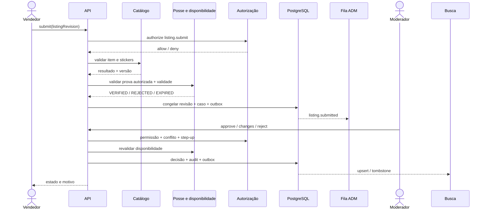
```mermaid
sequenceDiagram
    actor Seller as Vendedor
    participant API
    participant Catalog as Catálogo
    participant Proof as Posse e disponibilidade
    participant PDP as Autorização
    participant DB as PostgreSQL
    participant Queue as Fila ADM
    actor Admin as Moderador
    participant Search as Busca

    Seller->>API: submit(listingRevision)
    API->>PDP: authorize listing.submit
    PDP-->>API: allow / deny
    API->>Catalog: validar item e stickers
    Catalog-->>API: resultado + versão
    API->>Proof: validar prova autorizada + validade
    Proof-->>API: VERIFIED / REJECTED / EXPIRED
    API->>DB: congelar revisão + caso + outbox
    DB-->>Queue: listing.submitted
    Admin->>API: approve / changes / reject
    API->>PDP: permissão + conflito + step-up
    API->>Proof: revalidar disponibilidade
    API->>DB: decisão + audit + outbox
    DB-->>Search: upsert / tombstone
    API-->>Seller: estado e motivo
```

## 9. Sequência — compra e pagamento

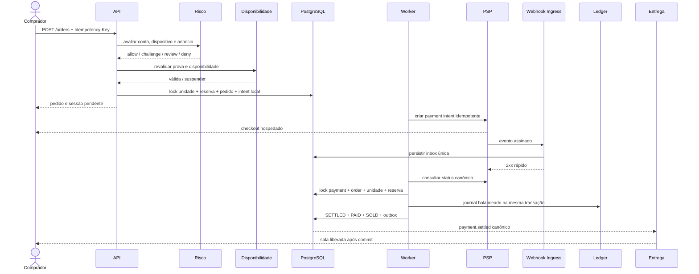
```mermaid
sequenceDiagram
    actor Buyer as Comprador
    participant API
    participant Risk as Risco
    participant Proof as Disponibilidade
    participant DB as PostgreSQL
    participant Worker
    participant PSP
    participant Hook as Webhook Ingress
    participant Ledger
    participant Delivery as Entrega

    Buyer->>API: POST /orders + Idempotency-Key
    API->>Risk: avaliar conta, dispositivo e anúncio
    Risk-->>API: allow / challenge / review / deny
    API->>Proof: revalidar prova e disponibilidade
    Proof-->>API: válida / suspender
    API->>DB: lock unidade + reserva + pedido + intent local
    API-->>Buyer: pedido e sessão pendente
    Worker->>PSP: criar payment intent idempotente
    PSP-->>Buyer: checkout hospedado
    PSP->>Hook: evento assinado
    Hook->>DB: persistir inbox única
    Hook-->>PSP: 2xx rápido
    Worker->>PSP: consultar status canônico
    Worker->>DB: lock payment + order + unidade + reserva
    Worker->>Ledger: journal balanceado na mesma transação
    Worker->>DB: SETTLED + PAID + SOLD + outbox
    DB-->>Delivery: payment.settled canônico
    Delivery-->>Buyer: sala liberada após commit
```

Redirect do browser nunca confirma pagamento.

### Corrida crítica — reserva expirada versus settlement tardio

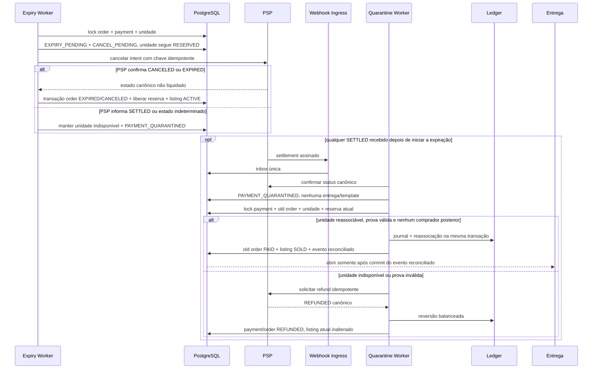
```mermaid
sequenceDiagram
    participant Expiry as Expiry Worker
    participant DB as PostgreSQL
    participant PSP
    participant Hook as Webhook Ingress
    participant Quarantine as Quarantine Worker
    participant Ledger
    participant Delivery as Entrega

    Expiry->>DB: lock order + payment + unidade
    Expiry->>DB: EXPIRY_PENDING + CANCEL_PENDING, unidade segue RESERVED
    Expiry->>PSP: cancelar intent com chave idempotente
    alt PSP confirma CANCELED ou EXPIRED
        PSP-->>Expiry: estado canônico não liquidado
        Expiry->>DB: transação order EXPIRED/CANCELED + liberar reserva + listing ACTIVE
    else PSP informa SETTLED ou estado indeterminado
        Expiry->>DB: manter unidade indisponível + PAYMENT_QUARANTINED
    end
    opt qualquer SETTLED recebido depois de iniciar a expiração
        PSP->>Hook: settlement assinado
        Hook->>DB: inbox única
        Quarantine->>PSP: confirmar status canônico
        Quarantine->>DB: PAYMENT_QUARANTINED, nenhuma entrega/template
        Quarantine->>DB: lock payment + old order + unidade + reserva atual
        alt unidade reassociável, prova válida e nenhum comprador posterior
            Quarantine->>Ledger: journal + reassociação na mesma transação
            Quarantine->>DB: old order PAID + listing SOLD + evento reconciliado
            DB-->>Delivery: abrir somente após commit do evento reconciliado
        else unidade indisponível ou prova inválida
            Quarantine->>PSP: solicitar refund idempotente
            PSP-->>Quarantine: REFUNDED canônico
            Quarantine->>Ledger: reversão balanceada
            Quarantine->>DB: payment/order REFUNDED, listing atual inalterado
        end
    end
```

`PAYMENT_QUARANTINED` nunca é gatilho de entrega. Apenas o evento pós-commit `payment.quarantine_reassociated` pode liberar a sala; se reassociação não for comprovadamente segura, o único caminho é reembolso ou revisão financeira com fundos congelados.

## 10. Sequência — solicitação e execução de reembolso

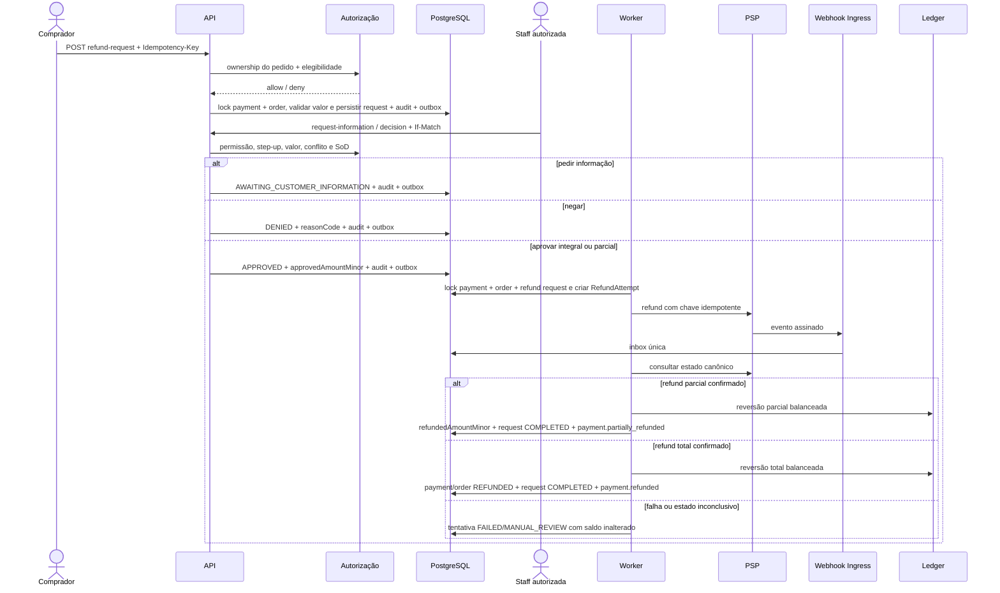
```mermaid
sequenceDiagram
    actor Buyer as Comprador
    participant API
    participant PDP as Autorização
    participant DB as PostgreSQL
    actor Staff as Staff autorizada
    participant Worker
    participant PSP
    participant Hook as Webhook Ingress
    participant Ledger

    Buyer->>API: POST refund-request + Idempotency-Key
    API->>PDP: ownership do pedido + elegibilidade
    PDP-->>API: allow / deny
    API->>DB: lock payment + order, validar valor e persistir request + audit + outbox
    Staff->>API: request-information / decision + If-Match
    API->>PDP: permissão, step-up, valor, conflito e SoD
    alt pedir informação
        API->>DB: AWAITING_CUSTOMER_INFORMATION + audit + outbox
    else negar
        API->>DB: DENIED + reasonCode + audit + outbox
    else aprovar integral ou parcial
        API->>DB: APPROVED + approvedAmountMinor + audit + outbox
        Worker->>DB: lock payment + order + refund request e criar RefundAttempt
        Worker->>PSP: refund com chave idempotente
        PSP->>Hook: evento assinado
        Hook->>DB: inbox única
        Worker->>PSP: consultar estado canônico
        alt refund parcial confirmado
            Worker->>Ledger: reversão parcial balanceada
            Worker->>DB: refundedAmountMinor + request COMPLETED + payment.partially_refunded
        else refund total confirmado
            Worker->>Ledger: reversão total balanceada
            Worker->>DB: payment/order REFUNDED + request COMPLETED + payment.refunded
        else falha ou estado inconclusivo
            Worker->>DB: tentativa FAILED/MANUAL_REVIEW com saldo inalterado
        end
    end
```

Somente `payment.partially_refunded` ou `payment.refunded`, emitido após confirmação canônica e commit do ledger, comunica conclusão financeira. Eventos do workflow de `RefundRequest` não autorizam crédito, entrega, saldo ou edição de estado financeiro.

## 11. Sequência — entrega, hold e saque

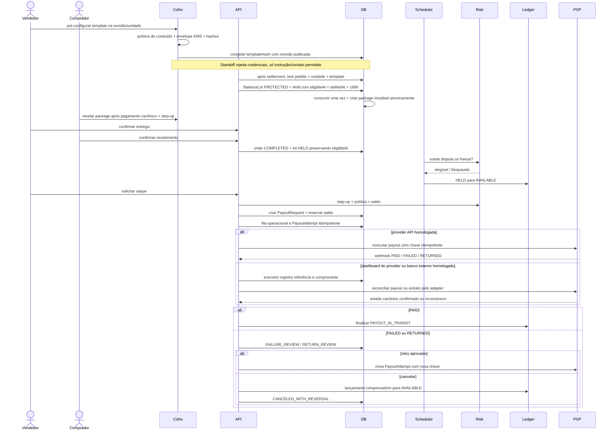
```mermaid
sequenceDiagram
    actor Seller as Vendedor
    actor Buyer as Comprador
    participant Vault as Cofre
    participant API
    participant DB
    participant Scheduler
    participant Risk
    participant Ledger
    participant PSP

    Seller->>Vault: pré-configurar template na revisão/unidade
    Vault->>Vault: política de conteúdo + envelope KMS + hashes
    Vault->>DB: congelar templateHash com revisão publicada
    Note over Vault,DB: Standoff rejeita credenciais, só instrução/contato permitido
    API->>DB: após settlement, lock pedido + unidade + template
    API->>DB: BalanceLot PROTECTED + Hold com eligibleAt = settledAt + 168h
    DB->>DB: consumir uma vez + criar package imutável atomicamente
    Buyer->>Vault: revelar package após pagamento canônico + step-up
    Seller->>API: confirmar entrega
    Buyer->>API: confirmar recebimento
    API->>DB: order COMPLETED + lot HELD preservando eligibleAt
    Scheduler->>Risk: existe disputa ou freeze?
    Risk-->>Scheduler: elegível / bloqueado
    Scheduler->>Ledger: HELD para AVAILABLE
    Seller->>API: solicitar saque
    API->>Risk: step-up + política + saldo
    API->>DB: criar PayoutRequest + reservar saldo
    API->>DB: fila operacional e PayoutAttempt idempotente
    alt provider API homologada
        API->>PSP: executar payout com chave idempotente
        PSP-->>API: webhook PAID / FAILED / RETURNED
    else dashboard do provider ou banco externo homologado
        API->>DB: executor registra referência e comprovante
        API->>PSP: reconciliar payout ou extrato pelo adapter
        PSP-->>API: estado canônico confirmado ou inconclusivo
    end
    alt PAID
        API->>Ledger: finalizar PAYOUT_IN_TRANSIT
    else FAILED ou RETURNED
        API->>DB: FAILURE_REVIEW / RETURN_REVIEW
        alt retry aprovado
            API->>PSP: nova PayoutAttempt com nova chave
        else cancelar
            API->>Ledger: lançamento compensatório para AVAILABLE
            API->>DB: CANCELED_WITH_REVERSAL
        end
    end
```

`FAILED` e `RETURNED` não são baixados como sucesso. Cada tentativa preserva provider ID, razão, timestamps e eventos; retry cria nova tentativa, e cancelamento só termina depois da reversão contábil idempotente.

## 12. Sequência — chat e PII

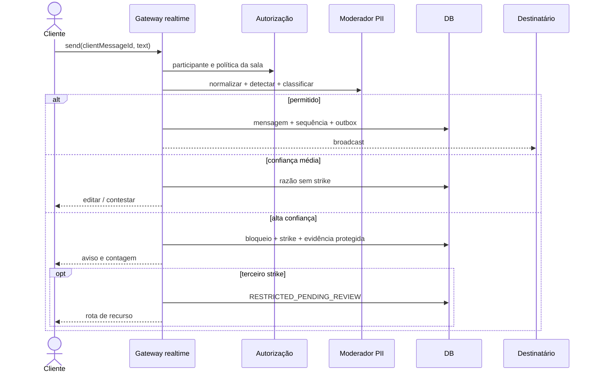
```mermaid
sequenceDiagram
    actor Client as Cliente
    participant RT as Gateway realtime
    participant PDP as Autorização
    participant Mod as Moderador PII
    participant DB
    participant Other as Destinatário

    Client->>RT: send(clientMessageId, text)
    RT->>PDP: participante e política da sala
    RT->>Mod: normalizar + detectar + classificar
    alt permitido
        RT->>DB: mensagem + sequência + outbox
        RT-->>Other: broadcast
    else confiança média
        RT->>DB: razão sem strike
        RT-->>Client: editar / contestar
    else alta confiança
        RT->>DB: bloqueio + strike + evidência protegida
        RT-->>Client: aviso e contagem
        opt terceiro strike
            RT->>DB: RESTRICTED_PENDING_REVIEW
            RT-->>Client: rota de recurso
        end
    end
```

Pipeline: NFKC, remoção de zero-width, confusables, e-mail, telefone, URL, Pix, social, nick e leetspeak. Conteúdo bloqueado não entra em analytics/log operacional.

## 13. Sequência — dispositivo confiável

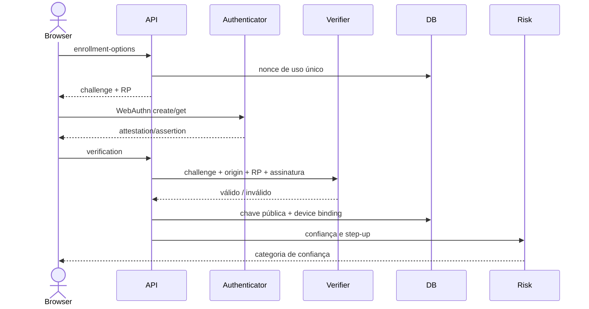
```mermaid
sequenceDiagram
    actor Browser
    participant API
    participant Authenticator
    participant Verifier
    participant DB
    participant Risk

    Browser->>API: enrollment-options
    API->>DB: nonce de uso único
    API-->>Browser: challenge + RP
    Browser->>Authenticator: WebAuthn create/get
    Authenticator-->>Browser: attestation/assertion
    Browser->>API: verification
    API->>Verifier: challenge + origin + RP + assinatura
    Verifier-->>API: válido / inválido
    API->>DB: chave pública + device binding
    API->>Risk: confiança e step-up
    Risk-->>Browser: categoria de confiança
```

## 14. Sequência — ingestão de preço

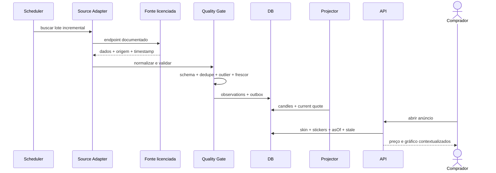
```mermaid
sequenceDiagram
    participant Scheduler
    participant Adapter as Source Adapter
    participant Provider as Fonte licenciada
    participant Quality as Quality Gate
    participant DB
    participant Projector
    participant API
    actor Buyer as Comprador

    Scheduler->>Adapter: buscar lote incremental
    Adapter->>Provider: endpoint documentado
    Provider-->>Adapter: dados + origem + timestamp
    Adapter->>Quality: normalizar e validar
    Quality->>Quality: schema + dedupe + outlier + frescor
    Quality->>DB: observations + outbox
    Projector->>DB: candles + current quote
    Buyer->>API: abrir anúncio
    API->>DB: skin + stickers + asOf + stale
    API-->>Buyer: preço e gráfico contextualizados
```

## 15. Máquinas de estado

### Anúncio

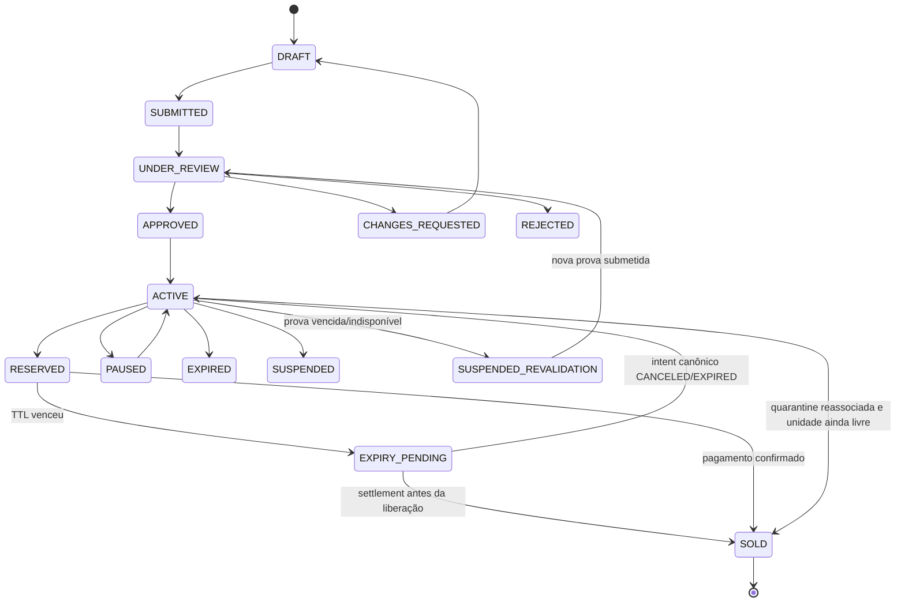
```mermaid
stateDiagram-v2
    [*] --> DRAFT
    DRAFT --> SUBMITTED
    SUBMITTED --> UNDER_REVIEW
    UNDER_REVIEW --> APPROVED
    UNDER_REVIEW --> CHANGES_REQUESTED
    CHANGES_REQUESTED --> DRAFT
    UNDER_REVIEW --> REJECTED
    APPROVED --> ACTIVE
    ACTIVE --> RESERVED
    RESERVED --> EXPIRY_PENDING: TTL venceu
    EXPIRY_PENDING --> ACTIVE: intent canônico CANCELED/EXPIRED
    EXPIRY_PENDING --> SOLD: settlement antes da liberação
    RESERVED --> SOLD: pagamento confirmado
    ACTIVE --> SOLD: quarantine reassociada e unidade ainda livre
    ACTIVE --> PAUSED
    PAUSED --> ACTIVE
    ACTIVE --> EXPIRED
    ACTIVE --> SUSPENDED
    ACTIVE --> SUSPENDED_REVALIDATION: prova vencida/indisponível
    SUSPENDED_REVALIDATION --> UNDER_REVIEW: nova prova submetida
    SOLD --> [*]
```

### Prova de posse e disponibilidade

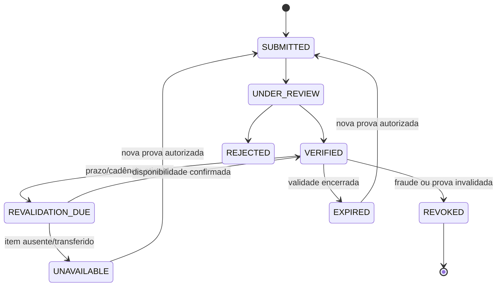
```mermaid
stateDiagram-v2
    [*] --> SUBMITTED
    SUBMITTED --> UNDER_REVIEW
    UNDER_REVIEW --> VERIFIED
    UNDER_REVIEW --> REJECTED
    VERIFIED --> REVALIDATION_DUE: prazo/cadência atingido
    REVALIDATION_DUE --> VERIFIED: disponibilidade confirmada
    REVALIDATION_DUE --> UNAVAILABLE: item ausente/transferido
    VERIFIED --> REVOKED: fraude ou prova invalidada
    VERIFIED --> EXPIRED: validade encerrada
    UNAVAILABLE --> SUBMITTED: nova prova autorizada
    EXPIRED --> SUBMITTED: nova prova autorizada
    REVOKED --> [*]
```

Somente `VERIFIED` permite publicar ou reservar. `OwnershipProof` contém evidência mínima e autorizada; confirmação automatizada só usa integração oficial/documentada.

### Pedido e entrega

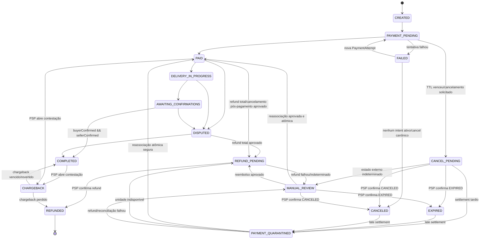
```mermaid
stateDiagram-v2
    [*] --> CREATED
    CREATED --> PAYMENT_PENDING
    PAYMENT_PENDING --> PAID
    PAYMENT_PENDING --> FAILED: tentativa falhou
    FAILED --> PAYMENT_PENDING: nova PaymentAttempt
    FAILED --> CANCELED: nenhum intent ativo/cancel canônico
    PAYMENT_PENDING --> CANCEL_PENDING: TTL venceu/cancelamento solicitado
    CANCEL_PENDING --> EXPIRED: PSP confirma EXPIRED
    CANCEL_PENDING --> CANCELED: PSP confirma CANCELED
    CANCEL_PENDING --> PAYMENT_QUARANTINED: settlement tardio
    CANCEL_PENDING --> MANUAL_REVIEW: estado externo indeterminado
    EXPIRED --> PAYMENT_QUARANTINED: late settlement
    CANCELED --> PAYMENT_QUARANTINED: late settlement
    PAYMENT_QUARANTINED --> PAID: reassociação atômica segura
    PAYMENT_QUARANTINED --> REFUND_PENDING: unidade indisponível
    PAYMENT_QUARANTINED --> MANUAL_REVIEW: refund/reconciliação falhou
    MANUAL_REVIEW --> PAID: reassociação aprovada e atômica
    MANUAL_REVIEW --> REFUND_PENDING: reembolso aprovado
    MANUAL_REVIEW --> EXPIRED: PSP confirma EXPIRED
    MANUAL_REVIEW --> CANCELED: PSP confirma CANCELED
    REFUND_PENDING --> REFUNDED: PSP confirma refund
    REFUND_PENDING --> MANUAL_REVIEW: refund falhou/indeterminado
    PAID --> DELIVERY_IN_PROGRESS
    DELIVERY_IN_PROGRESS --> AWAITING_CONFIRMATIONS
    AWAITING_CONFIRMATIONS --> COMPLETED: buyerConfirmed && sellerConfirmed
    PAID --> DISPUTED
    DELIVERY_IN_PROGRESS --> DISPUTED
    AWAITING_CONFIRMATIONS --> DISPUTED
    DISPUTED --> COMPLETED
    DISPUTED --> REFUND_PENDING: refund total aprovado
    PAID --> REFUND_PENDING: refund total/cancelamento pós-pagamento aprovado
    COMPLETED --> CHARGEBACK: PSP abre contestação
    PAID --> CHARGEBACK: PSP abre contestação
    CHARGEBACK --> COMPLETED: chargeback vencido/revertido
    CHARGEBACK --> REFUNDED: chargeback perdido
    REFUNDED --> [*]
```

### Pagamento / `Payment`

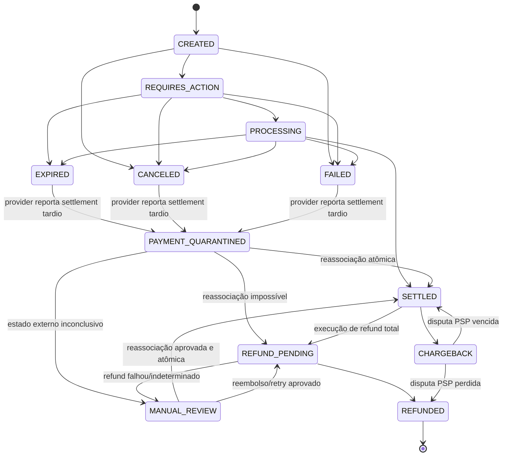
```mermaid
stateDiagram-v2
    [*] --> CREATED
    CREATED --> REQUIRES_ACTION
    REQUIRES_ACTION --> PROCESSING
    PROCESSING --> SETTLED
    CREATED --> FAILED
    REQUIRES_ACTION --> FAILED
    PROCESSING --> FAILED
    REQUIRES_ACTION --> EXPIRED
    PROCESSING --> EXPIRED
    CREATED --> CANCELED
    REQUIRES_ACTION --> CANCELED
    PROCESSING --> CANCELED
    EXPIRED --> PAYMENT_QUARANTINED: provider reporta settlement tardio
    CANCELED --> PAYMENT_QUARANTINED: provider reporta settlement tardio
    FAILED --> PAYMENT_QUARANTINED: provider reporta settlement tardio
    PAYMENT_QUARANTINED --> SETTLED: reassociação atômica
    PAYMENT_QUARANTINED --> REFUND_PENDING: reassociação impossível
    PAYMENT_QUARANTINED --> MANUAL_REVIEW: estado externo inconclusivo
    SETTLED --> REFUND_PENDING: execução de refund total
    REFUND_PENDING --> REFUNDED
    REFUND_PENDING --> MANUAL_REVIEW: refund falhou/indeterminado
    MANUAL_REVIEW --> SETTLED: reassociação aprovada e atômica
    MANUAL_REVIEW --> REFUND_PENDING: reembolso/retry aprovado
    SETTLED --> CHARGEBACK
    CHARGEBACK --> SETTLED: disputa PSP vencida
    CHARGEBACK --> REFUNDED: disputa PSP perdida
    REFUNDED --> [*]
```

Estados terminais locais não impedem evento financeiro tardio: a inbox ainda aceita e deduplica webhooks, mas qualquer transição de `FAILED|EXPIRED|CANCELED` por settlement passa obrigatoriamente por `PAYMENT_QUARANTINED`.

Cada `Payment` mantém zero ou mais `PaymentAttempt`; retry cria tentativa nova sem apagar a anterior. Estado canônico vem do PSP, enquanto tentativas preservam request, provider ID, erro e idempotency key.

Refund parcial não move `Order` nem `Payment` para `REFUNDED`: ele é registrado em `RefundRequest`, `RefundAttempt`, `refundedAmountMinor`, ledger e lotes proporcionais. O estado terminal `REFUNDED` exige que o total canônico reembolsado seja igual ao valor liquidado.

### Solicitação de reembolso

```text
REQUESTED -> UNDER_REVIEW
UNDER_REVIEW -> AWAITING_CUSTOMER_INFORMATION -> UNDER_REVIEW
UNDER_REVIEW -> APPROVED | PARTIALLY_APPROVED | DENIED
APPROVED | PARTIALLY_APPROVED -> PROCESSING
PROCESSING -> COMPLETED: PSP canônico + ledger balanceado
PROCESSING -> MANUAL_REVIEW: falha ou estado externo inconclusivo
MANUAL_REVIEW -> PROCESSING: retry autorizado cria nova RefundAttempt
MANUAL_REVIEW -> CANCELED: nenhuma devolução confirmada + reserva revertida
```

`FAILED` pertence à tentativa, não autoriza crédito e não apaga histórico. `AWAITING_CUSTOMER_INFORMATION` possui prazo, lembrete e saída auditável; nenhum estado operacional pode ficar sem owner e próxima ação.

### Fundos

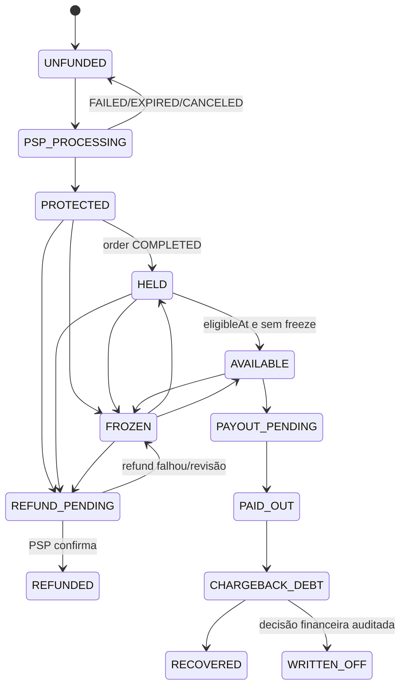
```mermaid
stateDiagram-v2
    [*] --> UNFUNDED
    UNFUNDED --> PSP_PROCESSING
    PSP_PROCESSING --> PROTECTED
    PSP_PROCESSING --> UNFUNDED: FAILED/EXPIRED/CANCELED
    PROTECTED --> HELD: order COMPLETED
    HELD --> AVAILABLE: eligibleAt e sem freeze
    AVAILABLE --> PAYOUT_PENDING
    PAYOUT_PENDING --> PAID_OUT
    PROTECTED --> FROZEN
    HELD --> FROZEN
    AVAILABLE --> FROZEN
    FROZEN --> HELD
    FROZEN --> AVAILABLE
    PROTECTED --> REFUND_PENDING
    HELD --> REFUND_PENDING
    FROZEN --> REFUND_PENDING
    REFUND_PENDING --> REFUNDED: PSP confirma
    REFUND_PENDING --> FROZEN: refund falhou/revisão
    PAID_OUT --> CHARGEBACK_DEBT
    CHARGEBACK_DEBT --> RECOVERED
    CHARGEBACK_DEBT --> WRITTEN_OFF: decisão financeira auditada
```

### Disputa

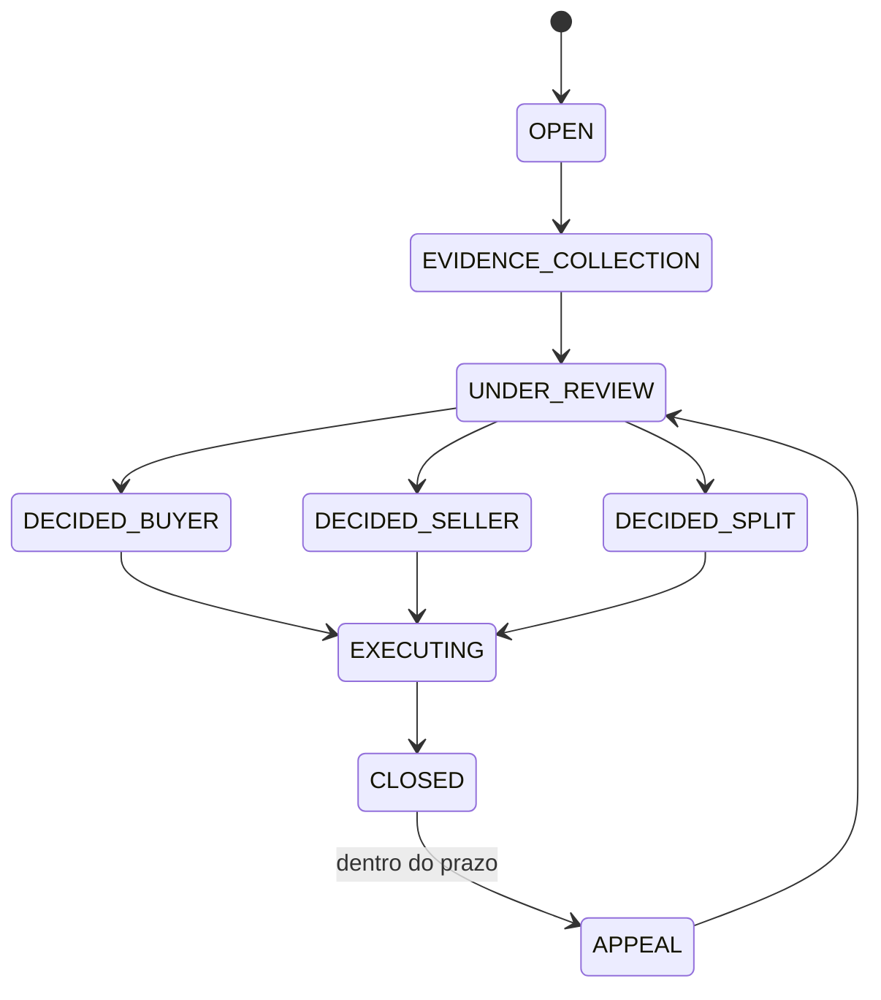
```mermaid
stateDiagram-v2
    [*] --> OPEN
    OPEN --> EVIDENCE_COLLECTION
    EVIDENCE_COLLECTION --> UNDER_REVIEW
    UNDER_REVIEW --> DECIDED_BUYER
    UNDER_REVIEW --> DECIDED_SELLER
    UNDER_REVIEW --> DECIDED_SPLIT
    DECIDED_BUYER --> EXECUTING
    DECIDED_SELLER --> EXECUTING
    DECIDED_SPLIT --> EXECUTING
    EXECUTING --> CLOSED
    CLOSED --> APPEAL: dentro do prazo
    APPEAL --> UNDER_REVIEW
```

### Restrição de conta

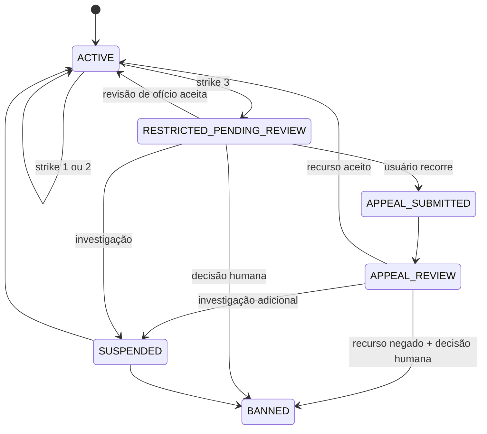
```mermaid
stateDiagram-v2
    [*] --> ACTIVE
    ACTIVE --> ACTIVE: strike 1 ou 2
    ACTIVE --> RESTRICTED_PENDING_REVIEW: strike 3
    RESTRICTED_PENDING_REVIEW --> APPEAL_SUBMITTED: usuário recorre
    APPEAL_SUBMITTED --> APPEAL_REVIEW
    APPEAL_REVIEW --> ACTIVE: recurso aceito
    APPEAL_REVIEW --> SUSPENDED: investigação adicional
    APPEAL_REVIEW --> BANNED: recurso negado + decisão humana
    RESTRICTED_PENDING_REVIEW --> ACTIVE: revisão de ofício aceita
    RESTRICTED_PENDING_REVIEW --> SUSPENDED: investigação
    RESTRICTED_PENDING_REVIEW --> BANNED: decisão humana
    SUSPENDED --> ACTIVE
    SUSPENDED --> BANNED
```

### Ticket

```mermaid
stateDiagram-v2
    [*] --> OPEN
    OPEN --> TRIAGED
    TRIAGED --> IN_PROGRESS
    IN_PROGRESS --> WAITING_CUSTOMER
    IN_PROGRESS --> WAITING_INTERNAL
    WAITING_CUSTOMER --> IN_PROGRESS
    WAITING_INTERNAL --> IN_PROGRESS
    IN_PROGRESS --> RESOLVED
    RESOLVED --> CLOSED
    RESOLVED --> REOPENED
    CLOSED --> REOPENED
    REOPENED --> IN_PROGRESS
```

### Saque

```mermaid
stateDiagram-v2
    [*] --> REQUESTED
    REQUESTED --> RISK_REVIEW
    RISK_REVIEW --> APPROVED
    RISK_REVIEW --> REJECTED_WITH_REVERSAL
    REJECTED_WITH_REVERSAL --> REJECTED: posting compensatório confirmado
    APPROVED --> SUBMITTED
    SUBMITTED --> PROCESSING
    PROCESSING --> PAID
    PAID --> RETURNED: banco/PSP devolve depois
    SUBMITTED --> FAILED
    PROCESSING --> FAILED
    PROCESSING --> RETURNED
    FAILED --> FAILURE_REVIEW
    RETURNED --> RETURN_REVIEW
    FAILURE_REVIEW --> RETRY_SCHEDULED: causa corrigida
    RETURN_REVIEW --> RETRY_SCHEDULED: dados corrigidos
    RETRY_SCHEDULED --> SUBMITTED: nova PayoutAttempt
    FAILURE_REVIEW --> CANCELED_WITH_REVERSAL
    RETURN_REVIEW --> CANCELED_WITH_REVERSAL
    CANCELED_WITH_REVERSAL --> CANCELED: posting compensatório confirmado
    REQUESTED --> CANCELED_WITH_REVERSAL
    REJECTED --> [*]
    CANCELED --> [*]
```

`FAILED` e `RETURNED` são estados de tentativa, não autorização para criar saldo. Durante revisão, o valor continua reservado; retry cria nova `PayoutAttempt`. Cancelamento só termina depois da reversão idempotente para `SELLER_AVAILABLE`.

## 16. API REST proposta

### Convenções

- `/v1`, JSON e OpenAPI 3.1.
- Erro `application/problem+json` com código estável e recuperação.
- Cursor pagination.
- `ETag/If-Match` em revisões, configuração e decisões concorrentes.
- `Idempotency-Key` em pedido, pagamento, confirmação, reembolso e saque.
- `202 Accepted` para trabalho assíncrono.
- autorização por objeto e campo em toda rota.

### Rotas essenciais

```text
POST /v1/auth/register
POST /v1/auth/login
POST /v1/auth/webauthn/registration-options
POST /v1/auth/webauthn/registration-verification
POST /v1/auth/webauthn/authentication-options
POST /v1/auth/webauthn/authentication-verification
POST /v1/auth/mfa/totp
GET  /v1/me/sessions
DELETE /v1/me/sessions/{id}
GET  /v1/me/overview
GET  /v1/me/purchases?cursor=&status=&from=&to=
GET  /v1/me/purchases/{orderId}/timeline
GET  /v1/me/purchases/{orderId}/related-cases
POST /v1/seller-accounts
GET  /v1/me/seller-accounts
POST /v1/seller-accounts/{sellerAccountId}/onboarding
GET  /v1/seller-accounts/{sellerAccountId}/onboarding
POST /v1/seller-accounts/{sellerAccountId}/onboarding/provider-session
POST /v1/seller-accounts/{sellerAccountId}/payout-destinations
GET  /v1/seller-accounts/{sellerAccountId}/members
POST /v1/seller-accounts/{sellerAccountId}/members
DELETE /v1/seller-accounts/{sellerAccountId}/members/{membershipId}
GET  /v1/seller-accounts/{sellerAccountId}/sales?cursor=&status=&from=&to=
GET  /v1/seller-accounts/{sellerAccountId}/sales-metrics?from=&to=
GET  /v1/admin/seller-onboarding
POST /v1/admin/seller-onboarding/{id}/approve
POST /v1/admin/seller-onboarding/{id}/reject

GET  /v1/catalog/items
POST /v1/admin/catalog/items
POST /v1/admin/catalog/imports
POST /v1/admin/catalog/items/{id}/publish
POST /v1/admin/catalog/items/{id}/model-3d-jobs
GET  /v1/admin/model-3d-jobs/{jobId}
POST /v1/admin/model-3d-jobs/{jobId}/cancel
POST /v1/admin/model-3d-jobs/{jobId}/retry
POST /v1/admin/model-3d-artifacts/{artifactId}/decision
POST /v1/admin/catalog/items/{id}/active-model-3d
GET  /v1/catalog/items/{id}/model-3d-manifest

POST /v1/listings
PATCH /v1/listings/{id}/draft
POST /v1/listings/{id}/submit
POST /v1/listings/{id}/ownership-proofs
PUT  /v1/listing-revisions/{revisionId}/secure-delivery-template
DELETE /v1/listing-revisions/{revisionId}/secure-delivery-template
POST /v1/admin/listings/{id}/claim-review
POST /v1/admin/listings/{id}/ownership-proofs/{proofId}/verify
POST /v1/admin/listings/{id}/revalidate
POST /v1/admin/listings/{id}/approve
POST /v1/admin/listings/{id}/request-changes
POST /v1/admin/listings/{id}/reject

GET  /v1/search
GET  /v1/listings/{id}
GET  /v1/prices/items/{catalogItemId}
GET  /v1/prices/items/{catalogItemId}/candles
GET  /v1/listings/{id}/component-quotes
GET  /v1/channels/midas/listings

POST /v1/conversations
POST /v1/conversations/{id}/messages
POST /v1/listings/{id}/offers
POST /v1/offers/{id}/counter
POST /v1/offers/{id}/accept

POST /v1/orders
GET  /v1/orders/{id}
POST /v1/orders/{id}/payment-session
POST /v1/orders/{id}/delivery-confirmations
POST /v1/orders/{id}/disputes
POST /v1/disputes/{id}/evidence
POST /v1/admin/disputes/{id}/decisions
POST /v1/disputes/{id}/appeals
POST /v1/orders/{id}/secure-package
POST /v1/orders/{id}/secure-package/reveal
POST /v1/orders/{id}/refund-requests
GET  /v1/me/refund-requests?cursor=&status=
GET  /v1/refund-requests/{id}
GET  /v1/admin/refund-requests?cursor=&status=
GET  /v1/admin/refund-requests/{id}
POST /v1/admin/refund-requests/{id}/request-information
POST /v1/admin/refund-requests/{id}/decision
POST /v1/admin/refund-requests/{id}/execute
POST /v1/admin/refund-requests/{id}/retry
POST /v1/admin/refund-requests/{id}/escalate-dispute

GET  /v1/admin/payments/quarantined
POST /v1/admin/payments/{paymentId}/quarantine/reconcile
POST /v1/admin/payments/{paymentId}/quarantine/refund

GET  /v1/sales-balance?sellerAccountId=
GET  /v1/sales-balance/ledger?cursor=&sellerAccountId=
GET  /v1/sales-balance/holds?cursor=&sellerAccountId=
GET  /v1/wallet                 # alias técnico legado; nunca comunica custódia Midas
GET  /v1/wallet/ledger          # alias técnico legado
POST /v1/payouts
GET  /v1/payouts?cursor=&status=&sellerAccountId=
GET  /v1/payouts/{id}
POST /v1/payouts/{id}/retry
POST /v1/payouts/{id}/cancel
POST /v1/admin/payouts/{id}/review

POST /v1/tickets
GET  /v1/tickets
GET  /v1/tickets/{id}
POST /v1/tickets/{id}/messages
GET  /v1/admin/tickets/{id}/context
POST /v1/admin/tickets/{id}/assign
POST /v1/admin/tickets/{id}/resolve

GET  /v1/me/account-restrictions
POST /v1/account-restrictions/{id}/appeals
POST /v1/me/data-rights-requests
GET  /v1/me/data-rights-requests/{id}
GET  /v1/admin/data-rights-requests
POST /v1/admin/data-rights-requests/{id}/resolve

GET  /v1/admin/roles
POST /v1/admin/roles
PUT  /v1/admin/users/{id}/grants
GET  /v1/admin/audit

GET  /v1/admin/growth/views/{viewKey}
GET  /v1/admin/growth/dimensions/{dimensionKey}?cursor=&limit=&sort=
GET  /v1/admin/growth/tenants/{sellerAccountId}
GET  /v1/admin/growth/objects/{objectType}/{objectId}/timeline?cursor=&limit=
GET  /v1/admin/growth/quality/incidents?cursor=&limit=&status=
GET  /v1/seller-accounts/{sellerAccountId}/growth/views/{viewKey}
GET  /v1/seller-accounts/{sellerAccountId}/growth/dimensions/{dimensionKey}?cursor=&limit=&sort=
GET  /v1/seller-accounts/{sellerAccountId}/growth/objects/{objectType}/{objectId}/timeline?cursor=&limit=

POST /v1/admin/payment-resolution-cases
GET  /v1/admin/payment-resolution-cases?cursor=&status=
POST /v1/admin/payment-resolution-cases/{id}/retrieve-provider
POST /v1/admin/payment-resolution-cases/{id}/decision
POST /v1/admin/payouts/{id}/claim
POST /v1/admin/payouts/{id}/approve
POST /v1/admin/payouts/{id}/executions
POST /v1/admin/payouts/{id}/confirm-paid

GET  /v1/me/reviews?cursor=&role=&status=
POST /v1/orders/{id}/reviews
POST /v1/reviews/{id}/reply
POST /v1/reviews/{id}/reports
GET  /v1/seller-accounts/{sellerAccountId}/reputation
POST /v1/admin/reviews/{id}/decision
GET  /v1/me/progression
GET  /v1/leaderboards/current
POST /v1/master/leaderboard-seasons/{id}/finalize
POST /v1/master/reward-definitions
POST /v1/master/badge-definitions
POST /v1/master/listing-plans/{versionId}/publish

GET  /v1/cart
POST /v1/cart/lines
POST /v1/cart/revalidate
POST /v1/cart/checkout-groups
GET  /v1/seller-accounts/{sellerAccountId}/customers?cursor=&lifecycle=

GET  /v1/me/communication-consents
POST /v1/me/communication-consents
POST /v1/me/communication-consents/{id}/revoke
POST /v1/seller-accounts/{sellerAccountId}/campaigns
POST /v1/seller-accounts/{sellerAccountId}/campaigns/{id}/publish
POST /v1/seller-accounts/{sellerAccountId}/campaigns/{id}/pause
POST /v1/webhooks/channels/{provider}
POST /v1/admin/coupons
POST /v1/admin/affiliates

GET  /v1/studio/catalog?cursor=&query=&format=&lifecycle=
POST /v1/studio/catalog/{itemId}/listing-drafts
POST /v1/studio/catalog-submissions
POST /v1/admin/studio/submissions/{id}/decision
POST /v1/admin/catalog/items/{id}/relationships
```

- `seller-accounts/{id}/onboarding` valida o sujeito vendedor e, quando o PSP suportar, devolve sessão hospedada; documentos financeiros não trafegam pela API Midas sem necessidade comprovada.
- evidência de disputa é append-only, classificada, submetida por URL assinada e vinculada ao prazo; decisão ADM exige motivo, escopo financeiro e policy version.
- recurso de disputa e de restrição possui idempotency key e no máximo uma instância ativa por decisão/restrição.
- `data-rights-requests` aceita tipos versionados como `ACCESS`, `CORRECTION`, `PORTABILITY`, `DELETION` e `OBJECTION`; execução respeita legal hold, minimização e auditoria.
- resolução de pagamento em quarantine nunca aceita “marcar como pago” isoladamente: a rota dispara o mesmo comando transacional de reassociação ou reembolso usado pelo worker.
- rotas de venda, saldo e payout avaliam `User`, `SellerMembership` e `sellerAccountId`; elegibilidade global do usuário não substitui o sujeito vendedor.
- criação de reembolso deriva comprador, vendedor, moeda e pagamento do pedido; `decision` exige `If-Match`, e `execute`/`retry` retornam `202` e disparam comandos financeiros idempotentes.
- APIs e UX públicas usam “saldo de vendas administrado pelo PSP” e “saque/payout”; `/wallet` permanece somente como alias técnico legado, sem criar carteira ou fonte financeira paralela.
- `payment-resolution-cases/{id}/decision` cria decisão; settlement continua no worker/comando canônico e concorre com webhook por locks/uniques.
- `admin/payouts/{id}/confirm-paid` só existe para modo homologado e exige attempt, referência, evidência, confirmação/reconciliação e version precondition.
- `Cart` aceita linhas multi-seller, mas `checkout-groups` responde grupos/pedidos separados e capabilities reais do provider.
- endpoints de campanha recebem definição de segmento, não lista de telefone/e-mail; worker resolve `ContactPoint` após consent/suppression.
- Studio retorna referências versionadas a `CatalogItem`/assets; draft e submission não expõem binário privado nem publicam sem moderação.
- review, progressão, ranking e métricas são leitura/commands próprios e nunca aceitam valor agregado enviado pelo cliente como autoridade.

### Read models — Minha conta e visão 360°

`/v1/me/overview`, compras, vendas e métricas são projeções de leitura: Identity é fonte de conta; `SellerAccount`/`SellerMembership`/onboarding definem venda; Order/Delivery definem compra e entrega; PSP/Payments definem estado financeiro externo; Ledger define a obrigação e o saldo Midas reconciliado; Support, RefundRequest e Disputes mantêm seus próprios casos.

Os read models:

- são derivados por eventos/outbox, reconstruíveis e nunca recebem mutação de saldo, pedido ou caso;
- informam `asOf`, origem e `stale` por bloco quando houver consistência eventual;
- usam cursor e chaves estáveis; operação sensível sempre relê a fonte canônica dentro do comando;
- mantêm `sellerAccountId` explícito e não transformam membership em role global;
- falham fechados para ação sensível quando a fonte estiver indisponível ou divergente.

A visão 360° é uma composição BFF por caso, não uma nova fonte de verdade. O PDP autoriza bloco e campo; PII e dados financeiros são mascarados; segredo de entrega e conteúdo integral de chat nunca entram; leitura sensível, exportação e toda ação ficam auditadas. O endpoint somente emite comandos aos módulos proprietários e não escreve diretamente em tabelas de Payments, Ledger, Support ou Disputes.

### Device trust

```text
POST   /v1/devices/enrollment-options
POST   /v1/devices/enrollments
GET    /v1/me/devices
PATCH  /v1/me/devices/{deviceId}
DELETE /v1/me/devices/{deviceId}
POST   /v1/devices/{deviceId}/challenge
POST   /v1/devices/{deviceId}/challenge-verification
POST   /internal/v1/risk/evaluations
```

## 17. Idempotência e eventos

Registro de idempotência:

```text
scope = actorId + method + canonicalRoute + idempotencyKey
requestHash
state = PROCESSING | COMPLETED | FAILED_RETRYABLE
responseStatus / responseBody / resourceId
expiresAt
```

- mesma chave e payload: mesmo resultado;
- mesma chave e payload diferente: `409 IDEMPOTENCY_KEY_REUSED`;
- IDs externos determinísticos por operação;
- constraints únicas em provider event, posting, client message e reserva;
- cancelamento de intent usa chave estável `payment:{paymentId}:cancel:v1`; relógio local apenas inicia `EXPIRY_PENDING`, nunca reativa anúncio;
- resolução de settlement tardio usa comando único por `providerEventId`, com locks ordenados `payment -> order -> listingUnit -> reservation -> template`;
- consumo de pronta-entrega possui unicidade permanente em `templateId` e `orderId`;
- retry de payout cria `PayoutAttempt` nova, mas o `PayoutRequest` e a reserva do saldo permanecem os mesmos até pagamento ou reversão;
- criação de `RefundRequest` usa o registro transversal de idempotência; a equivalência ativa por pedido, motivo, modalidade e valor possui fingerprint/constraint ou lock transacional, sem bloquear nova solicitação após encerramento legítimo;
- decisão de reembolso usa `If-Match`/`version`; sob locks ordenados `payment -> order -> refundRequest`, o sistema reserva o montante aprovado e impede aprovações concorrentes acima do reembolsável;
- execução usa chave estável `refund:{refundRequestId}:execute:v1` enquanto o estado externo for desconhecido; retry após falha canônica cria nova `RefundAttempt` e chave versionada;
- `providerEventId` e `postingKey` de refund são únicos; webhook repetido, fora de ordem ou replay produz um único efeito financeiro;
- resolução manual e webhook usam a mesma `settlementKey`; decisão concorrente termina como no-op/superseded após o primeiro settlement;
- `PayoutAttempt.externalReference` é única no escopo do modo/provider e a baixa possui chave estável por tentativa;
- uma `OrderReview` usa unicidade `(orderId, reviewerRole)`; contribuição de level/leaderboard usa `(sourceEventId, policyVersion, contributionType)`;
- cart merge, checkout group, coupon redemption, attribution touch, dispatch e provider status possuem fingerprints/constraints independentes;
- dispatch relê consent/suppression antes de cada tentativa e usa chave por `dispatchId + attemptNo + channel`;
- submission/asset/job/draft usam hash de fonte, escopo e versão para dedupe sem cruzar tenants;
- retry exponencial com jitter, DLQ e replay auditado.

Envelope:

```json
{
  "eventId": "uuid",
  "eventName": "order.payment_settled",
  "schemaVersion": 1,
  "aggregateType": "order",
  "aggregateId": "uuid",
  "aggregateVersion": 7,
  "occurredAt": "UTC",
  "correlationId": "uuid",
  "causationId": "uuid",
  "actor": {"type": "system|user|admin", "id": "uuid"},
  "dataClassification": "INTERNAL",
  "payload": {}
}
```

Eventos principais:

`user.registered`, `seller.onboarding_started`, `seller.onboarding_approved`, `device.trust_changed`, `catalog.item_published`, `listing.ownership_proof_verified`, `listing.availability_revalidation_failed`, `listing.submitted`, `listing.approved`, `listing.reserved`, `listing.expiry_pending`, `listing.reactivated_after_payment_cancel`, `listing.sold`, `delivery.template_frozen`, `delivery.template_consumed`, `offer.accepted`, `chat.message_blocked`, `account.restricted`, `account.restriction_appealed`, `price.observation_ingested`, `price.feed_stale`, `order.created`, `order.expired`, `payment.failed`, `payment.expired`, `payment.settled`, `payment.quarantined`, `payment.quarantine_reassociated`, `payment.partially_refunded`, `payment.refunded`, `payment.chargeback_opened`, `delivery.opened`, `delivery.party_confirmed`, `order.completed`, `dispute.opened`, `dispute.evidence_submitted`, `dispute.decided`, `dispute.appealed`, `ledger.entry_posted`, `funds.hold_started`, `funds.available`, `payout.requested`, `payout.failed`, `payout.returned`, `payout.retry_scheduled`, `payout.reversed`, `payout.paid`, `data_rights.requested`, `data_rights.resolved`, `ticket.created`, `risk.decisioned`.

Workflow humano adicional: `refund.requested`, `refund.information_requested`, `refund.decided`, `refund.execution_requested`, `refund.execution_failed`, `refund.escalated_to_dispute`. Esses eventos nunca duplicam a conclusão financeira: somente `payment.partially_refunded` ou `payment.refunded`, acompanhado de `ledger.entry_posted`, representa refund canônico confirmado; o payload informa valor desta operação, total acumulado e moeda.

Extensões versionadas:

`payment.resolution_case_opened`, `payment.resolution_decided`, `payment.resolution_superseded`, `funds.hold_frozen`, `payout.claimed`, `payout.attempt_recorded`, `order_review.eligible`, `order_review.submitted`, `order_review.moderated`, `reputation.projection_rebuilt`, `progression.contribution_recorded`, `account_level.assignment_changed`, `reward.awarded`, `badge.awarded`, `leaderboard.contribution_recorded`, `leaderboard.season_finalized`, `listing.plan_selected`, `listing_plan.policy_published`, `cart.line_added`, `cart.abandonment_eligible`, `cart.recovery_suppressed`, `lifecycle.renewal_eligible`, `consent.recorded`, `suppression.created`, `campaign.published`, `dispatch.requested`, `dispatch.delivered`, `coupon.redeemed`, `attribution.touch_recorded`, `affiliate.commission_accrued`, `catalog.submission_created`, `catalog.submission_decided`, `catalog_item_relation.published`, `seo.public_page_changed`.

Payload nunca carrega senha, token, segredo ou conteúdo integral de chat.

## 18. Busca e recomendação

Documento derivado de busca:

```text
listingId, status, channel, catalogItemId, category,
weapon, rarity, stickerIds[4], priceMinor, currency,
referenceGold, sellerReputationScore, sellerRiskTier,
publishedAt, titleNormalized, availability
```

- somente `ACTIVE` aparece;
- banco revalida disponibilidade/autorização;
- venda/suspensão emite tombstone;
- `search_after` evita paginação profunda;
- nenhum chat, e-mail, contato ou PII é indexado.

Recomendação v1:

1. coletar `SEARCH`, `VIEW`, `CLICK`, `FAVORITE`, `OFFER`, `PURCHASE`, `HIDE`;
2. calcular afinidade por item, arma, raridade, sticker e faixa;
3. gerar candidatos por conteúdo, popularidade real e semelhança;
4. ranquear por afinidade, disponibilidade, confiança e diversidade;
5. filtrar vendido, bloqueado, próprio e repetitivo;
6. registrar impressão/posição para avaliação.

ML colaborativo só depois de volume suficiente e teste contra diversidade, disputa, concentração e fraude.

## 19. Deploy e evolução

```mermaid
flowchart TB
    Internet --> Edge[CDN WAF]
    Edge --> Public[Public Web]
    Edge --> API[Core API replicas]
    AdminNet[Admin origin] --> Admin[Admin Web]
    Admin --> API
    API --> Private[Private network]
    Private --> PG[(PostgreSQL primary + replica)]
    Private --> Redis[(Key value cache Redis ou Valkey)]
    Private --> Broker[(Broker + DLQ)]
    Private --> Search[(OpenSearch)]
    Private --> Workers[Worker pool]
    Workers --> Object[(Object storage)]
    Workers --> KMS[KMS]
    Workers --> External[Allowlisted providers]
    Observability[Telemetry backend] --- API
    Observability --- Workers
```

Primeiras candidatas a extração futura: chat, busca, pricing e recomendação. Payments/ledger só se separam quando contratos, reconciliação e operação estiverem maduros.

## 20. SLOs iniciais

| Capacidade | Disponibilidade | Latência/frescor |
|---|---:|---|
| Navegação/busca | 99,9% mensal | p95 ≤ 400 ms |
| Auth e pedido | 99,95% | p95 ≤ 800 ms sem tempo externo |
| Webhook financeiro durável | 99,95% | ack p95 ≤ 1 s; processar p95 ≤ 60 s |
| Chat | 99,9% | aceite→broadcast p95 ≤ 500 ms |
| Admin/suporte | 99,5% | p95 ≤ 1 s |
| Ledger | 100% dos journals balanceados | divergência crítica imediata |
| Pricing | depende do fornecedor | stale após 2× cadência; UI mostra `asOf` |
| Growth | 99,5% | fatos operacionais p95 ≤ 5 min; interação p95 ≤ 15 min; `asOf` e freshness obrigatórios |
| Pipeline 3D | 99,0% para consulta/fila | sem ETA fixo antes de benchmark; progresso só por fase observada |
| Consentimento/supressão | 99,95% no caminho de dispatch | opt-out efetivo antes de retry dentro do SLA aprovado |
| Mensageria de marketing | depende do canal | aceite/status medidos por provider; backpressure e quota por tenant |
| Carrinho/checkout group | 99,9% | p95 a definir; revalidação e efeito parcial sempre explicados |
| SEO público | 99,9% | HTML/canonical/sitemap no edge; Core Web Vitals por template e dispositivo |
| Studio | 99,5% para catálogo/draft | processamento assíncrono; nenhum ETA inventado |

SLOs são ponto de partida a validar por custo e piloto, não promessa comercial.

## 21. Backup e DR

- PostgreSQL com PITR, WAL contínuo e backup diário.
- Backups criptografados/imutáveis em conta ou região separada.
- Restore mensal e exercício trimestral.
- Object storage versionado.
- Redis/OpenSearch reconstruíveis.
- Broker com retenção e DLQ suficientes para replay.
- Consentimentos, suppressions, campaigns publicadas, reviews/decisões, policies e grants entram no PITR; caches e filas não são sua única cópia.
- Assets, comprovantes e mídia usam object storage versionado por classe, com restore e controle de acesso testados separadamente.
- RPO financeiro/pedido ≤ 5 min; RTO ≤ 60 min.
- RPO chat/suporte ≤ 15 min; RTO ≤ 4 h.
- Busca/recomendação podem ser reconstruídas.

## 22. Testes P0 de consistência e concorrência

| Caso | Preparação/interleaving | Resultado obrigatório |
|---|---|---|
| Expiração × settlement antes do cancel ack | TTL vence; cancel é enviado; PSP liquida antes de confirmar cancelamento | anúncio nunca fica `ACTIVE`; um settlement, um journal, uma venda |
| Cancel ack × settlement tardio | cancel canônico libera anúncio; webhook `SETTLED` chega depois | `PAYMENT_QUARANTINED`; zero sala, zero template consumido, zero aviso de compra concluída |
| Reassociação segura | pagamento em quarantine; unidade continua livre, prova válida e sem reserva posterior | locks dos quatro agregados, um journal, anúncio `SOLD`, pedido `PAID`; entrega abre somente pelo evento pós-commit |
| Novo comprador × settlement antigo | após liberação canônica, outro comprador reserva/compra; settlement do intent antigo chega | reserva/pedido novo permanecem intactos; pagamento antigo segue para refund, nunca reassocia |
| Refund de quarantine falha | PSP retorna timeout/erro/estado indeterminado | permanece congelado em `MANUAL_REVIEW`; nenhum saldo disponível e nenhuma entrega |
| Duplo clique em RefundRequest | duas criações concorrentes com a mesma chave/payload e uma terceira com mesma chave/payload diferente | uma solicitação; replay devolve o mesmo resultado; payload divergente recebe `409` |
| Duas aprovações e refund parcial | duas staffs aprovam simultaneamente; refunds anteriores e lotes deixam apenas parte do valor reembolsável | `If-Match` e locks deixam uma decisão válida; soma reservada/reembolsada nunca excede o settlement |
| Timeout e webhook de refund duplicado | PSP aceita refund, resposta expira e eventos chegam repetidos/fora de ordem | uma `RefundAttempt` enquanto inconclusivo, um evento canônico parcial/total, postings únicos e request concluída uma vez |
| SoD e visão 360° | suporte sem permissão financeira tenta decidir/executar ou abrir bloco restrito | deny no backend, nenhum dado sensível retornado e tentativa auditada |
| Webhooks duplicados e fora de ordem | repetir `SETTLED`, `CANCELED`, `REFUNDED` e `CHARGEBACK` em todas as ordens | uma inbox por evento, transições monotônicas, journals únicos e saldo correto |
| Falha no meio da transação | abortar após locks, após journal e antes de outbox | rollback integral ou recovery por outbox; jamais estado pago sem journal/evento correspondente |
| Template concorrente | dois workers tentam consumir o mesmo `SecureDeliveryTemplate` | exatamente um `SecureDeliveryPackage`; hash confere; perdedor é no-op idempotente |
| Política Standoff | tentar salvar login, senha, token, cookie ou recovery code | rejeição server-side; nada persiste em ciphertext, log ou evento |
| Prova e craft | prova expirada, item indisponível ou `craftEligible=false` | anúncio suspenso/rejeitado; reserva e craft impossíveis |
| Payout `FAILED` | PSP falha antes/depois de `PROCESSING`; webhook repetido | não vira `PAID`; revisão/retry ou reversão única para `AVAILABLE` |
| Payout `RETURNED` pós-pagamento | PSP/banco devolve depois de informar sucesso | `RETURN_REVIEW`; nova tentativa ou lançamento compensatório, sem crédito duplicado |
| Growth cross-tenant | membership do tenant A tenta consultar dimensão, objeto ou timeline do tenant B | `403/404` conforme política, nenhum bucket/ID/campo do tenant B e tentativa observável |
| Evento Growth duplicado/reprocessado | mesmo `eventId` chega repetido e buckets são reconstruídos | numeradores, denominadores e contribuições permanecem idênticos; revisão e freshness são explicáveis |
| Job 3D duplicado | duas requisições iguais usam a mesma idempotency key/source hash/config | um job lógico; replay devolve o mesmo recurso; configuração divergente recebe conflito |
| GLB/SVG hostil e falha WebGL | entrada malformada/ativa ou perda de contexto no navegador | input rejeitado/quarentenado; nenhum egress indevido; poster/galeria 2D preserva a jornada |
| Seleção e troca de item 3D | partir de item/anúncio A, abrir `/itens/a/3d`, navegar para B e usar Voltar | cada slug resolve somente seu `CatalogItem`/`Model3DArtifact`; origem e estado de navegação são restaurados; nunca coexistem dois canvases |
| Intro 3D, interrupção e descarte | medir entrada normal, interagir durante a entrada, repetir com reduced motion e desmontar/trocar rota | entrada termina em 650–900 ms; primeiro input assume controle; reduced motion salta à pose final; geometria, materiais, texturas, RAF e listeners anteriores são liberados |
| Webhook × resolução manual | PaymentResolutionCase decidido enquanto settlement automático chega | um settlement command vence; um journal/lot/hold; caso fica resolved ou superseded, sem update de status |
| Limite do hold e entrega atrasada | testar 167:59:59, 168:00:00, pedido incompleto, disputa e conclusão tardia | nunca libera antes; pedido incompleto bloqueia; conclusão posterior libera sem novo relógio se demais gates passarem |
| Baixa manual de payout | operador tenta sem referência/prova, repete referência e concorre com outro operador | falha fechado ou uma execução; SoD, external ref única, postings e estado confirmado |
| Review e ranking adversarial | nota zero, estranho avaliando, self-dealing, replay, refund e R$100 Premium | zero≠null; acesso negado; contribuições únicas/compensadas; Premium totaliza 60 pontos sob policy atual |
| Opt-out × dispatch retry | mensagem promocional em backoff e consentimento revogado antes do retry | suppression vence atomicamente; nenhuma nova chamada ao canal; evento e auditoria preservados |
| Carrinho multivendedor | linhas de sellers/moedas/providers compatíveis e incompatíveis, com falha parcial | CheckoutGroup separa Orders/effects e não promete atomicidade/split ausente |
| Studio cross-tenant e arquivo hostil | asset privado do tenant A, busca do B, SVG/GLB malformado e preview | nenhum ID/binário vaza; scan/quarantine; preview não publica; fallback 2D permanece |
| Crawl e schema | crawlers, URLs com UTM/cupom, locale alternativo, item removido e HTML sem JS | auth/noindex nas privadas, canonical limpa, hreflang recíproco, sitemap correto, schema igual ao HTML e status 301/404/410 por policy |

Executar esses casos com barreiras concorrentes reais no banco, fault injection e property tests das máquinas de estado. Mock sequencial sem disputa de lock não satisfaz o gate.

## 23. Critérios técnicos inegociáveis

1. Webhook repetido não duplica dinheiro.
2. Duas compras não vendem a mesma unidade.
3. Reserva expirada não reativa anúncio antes do cancelamento canônico do intent.
4. Settlement tardio passa por quarantine e nunca abre entrega diretamente.
5. Template de pronta-entrega é vinculado, congelado e consumido exatamente uma vez; Standoff não aceita credenciais armazenadas.
6. Papel nenhum lê objeto fora de ownership/escopo.
7. Segredo não aparece em log, e-mail, busca ou analytics.
8. Todo journal balanceia por moeda.
9. Toda ação financeira manual cria comando e lançamento, nunca edição direta.
10. `FAILED`/`RETURNED` de payout terminam em retry rastreável ou reversão contábil, nunca em baixa silenciosa.
11. Todo estado operacional possui saída, recurso ou explicação; evento financeiro tardio continua reconciliável.
12. Todo preço mostra origem, `asOf` e frescor.
13. Todo privilégio é explícito, limitado e auditável.
14. Toda restauração crítica é testada antes do lançamento.
15. Refund humano não substitui refund financeiro: conclusão exige PSP canônico e ledger balanceado.
16. Refund parcial nunca ultrapassa o valor liquidado nem marca pagamento como totalmente `REFUNDED`.
17. Minha conta e visão 360° são read models reconstruíveis; ação sensível relê a fonte canônica.
18. Growth nunca cria `User`, `SellerAccount`, `SellerMembership`, saldo, pedido ou oportunidade editável; toda contribuição aponta para o fato e informa `asOf`/freshness.
19. Toda consulta Growth de tenant revalida membership/escopo no servidor; cache, bucket, exportação e drill-down carregam `sellerAccountId` quando aplicável.
20. Imagem única produz somente `DRAFT_SINGLE_VIEW`; um GLB só publica após validação técnica, revisão de fidelidade e decisão auditada.
21. Viewer 3D é progressive enhancement: poster/galeria 2D e compra continuam funcionais sem WebGL.
22. `SCR-PUB-013` resolve o slug para um único item e seu `Model3DArtifact` ativo; detalhe, anúncio e cards apenas navegam para essa rota e não mantêm canvases ocultos.
23. A abertura 3D é finita, dura 650–900 ms, para na pose neutra e cede imediatamente ao primeiro input; `prefers-reduced-motion` mostra a pose final sem percurso espacial.
24. Troca de slug, Voltar ou unmount libera cena, recursos GPU, listeners e RAF antes de montar outro artefato; o histórico preserva a origem da navegação.
25. `PaymentResolutionCase` executa o settlement canônico e nunca expõe `SET status=PAID`.
26. Hold usa `Payment.settledAt + 168h` e conclusão do pedido como gate, com prova nas bordas do relógio.
27. Payout pago possui allocation, attempt, modo, referência, evidência, confirmação e journal; Master continua sujeito a grants e SoD.
28. `OrderReview`, reputação, nível, badge e leaderboard apontam para fatos elegíveis/versionados e não autorizam mutação financeira.
29. Boost/priority pago é rotulado e nunca altera outcome de risco/refund, tempo de hold ou KYC.
30. Seller não recebe telefone/e-mail bruto por painel, export ou evento de campanha; dispatch resolve contato em serviço autorizado.
31. Opt-out/suppression é aplicado antes de cada tentativa de marketing, inclusive retry e fallback.
32. Cart/CheckoutGroup não mistura sellers em um único Order nem usa split inexistente.
33. Studio reutiliza CatalogItem/CatalogAsset/Model3DJob/Model3DArtifact/Listing e aplica visibility de tenant no servidor.
34. HTML público, canonical, sitemap, hreflang e JSON-LD são coerentes e funcionam sem WebGL.

### NO-GO de release

- anúncio volta a `ACTIVE` por cron local sem confirmação canônica do PSP;
- `PAYMENT_QUARANTINED` dispara entrega, saldo, template ou mensagem de sucesso;
- refund/quarantine pode ser resolvido por update manual de status;
- `RefundRequest` chega a `COMPLETED` sem confirmação canônica do PSP e postings compensatórios únicos;
- refund parcial duplica crédito, excede o valor liquidado ou move prematuramente o pagamento para `REFUNDED`;
- decisão e execução de refund ignoram `If-Match`, idempotência, step-up, SoD ou auditoria;
- visão 360° vira fonte de verdade, expõe bloco sem permissão ou permite edição direta de saldo/caso;
- payout `FAILED`/`RETURNED` não possui tentativa, revisão e posting compensatório rastreáveis;
- pronta-entrega pode ser consumida duas vezes, mudar depois da aprovação ou conter credenciais de Standoff;
- anúncio publica/reserva sem prova válida de posse/disponibilidade ou com craft em item não elegível;
- ausência de rotas auditáveis para evidência, decisão, recurso, direitos do titular ou seller onboarding;
- relação usuário-vendedor depende de role global sem `SellerMembership` e escopo explícito.
- Growth lê outro tenant, oculta freshness ou permite comando a partir de projeção desatualizada;
- job 3D publica automaticamente, chama single-view de exato, aceita ativo hostil ou bloqueia a compra quando WebGL falha;
- detalhe/anúncio monta viewer embutido concorrente com `SCR-PUB-013`, a abertura gira sem fim, ignora input/reduced motion ou a troca de item deixa canvas/recurso anterior vivo.
- UI ou rota administrativa confirma `PAID`, libera hold ou dá baixa de payout sem comando, locks, referência, evidência e postings únicos;
- provider/país/conta sem capability homologada aparece como pagamento, split, hold ou payout disponível;
- payout `PAID` depende apenas de checkbox/comprovante não reconciliado ou é executado pelo mesmo ator que criou/aprovou quando SoD se aplica;
- review aceita estranho/self-review, nota zero vira ausência ou ranking/level contam venda não madura sem compensação;
- Premium, VIP ou Básico mudam decisão de refund/risco, escondem publicidade ou burlam hold/KYC;
- seller exporta contato bruto, campanha ignora opt-out/frequency cap ou Instagram envia cold DM;
- carrinho cria um Order multi-seller ou apresenta pagamento conjunto sem suporte real de provider;
- Studio duplica catálogo por tenant, publica submission/preview direto ou serve asset privado cross-tenant;
- rota privada entra em sitemap, robots é usado como segurança, JSON-LD diverge do HTML ou 3D bloqueia conteúdo indexável.

## 24. Growth multi-tenant e projeções analíticas

O tenant comercial é `SellerAccount`. `User` é identidade global; `SellerMembership` autoriza a atuação do usuário naquele tenant. Não existem agregados paralelos chamados `Tenant`, `Member`, `GrowthUser` ou `GrowthBalance`.

```mermaid
flowchart LR
    Domain[Eventos canônicos\nIdentity · Listings · Orders · Payments · Ledger] --> Outbox[Outbox]
    UX[Eventos de interação allowlisted\nsem PII] --> Intake[Analytics intake]
    Outbox --> Projector[Growth projector idempotente]
    Intake --> Projector
    Projector --> Catalog[Metric catalog versionado]
    Projector --> Read[(GrowthPlatformBucket\nGrowthTenantBucket\nFunnel · Cohort · Contribution · Timeline · Quality)]
    Canonical[Fontes canônicas] --> Reconcile[Reconciliação por ID/moeda]
    Reconcile --> Read
    Admin[Staff growth] --> PDP[PDP + ABAC + field policy]
    Seller[Membro do vendedor] --> PDP
    PDP --> Query[Growth Query Service]
    Query --> Read
    Query --> UI[9 telas Growth]
    UI -. link autorizado .-> Canonical
```

Regras do read side:

- cada métrica registra `metricId`, versão, fórmula, grain, dimensões, owner, fonte, moeda, timezone e SLO;
- `GrowthTenantBucket`, contribution, timeline, cache e exportação incluem `sellerAccountId`; RLS pode atuar como defesa em profundidade;
- o envelope informa `asOf`, `projectedAt`, lag, revisão, cobertura e `FRESH|DELAYED|STALE|PARTIAL|RECOMPUTING|NOT_INSTRUMENTED`;
- ausência nunca vira zero; refund/receita só mudam após PSP/ledger canônicos;
- oportunidades são recomendações derivadas com motivo e link. A ação acontece no domínio proprietário após nova autorização.

```mermaid
sequenceDiagram
    participant D as Domínio canônico
    participant O as Outbox/Broker
    participant P as Growth Projector
    participant R as Read Models
    participant Q as Growth Query
    participant U as UI autorizada
    D->>O: evento versionado + stable eventId
    O->>P: entrega at-least-once
    P->>P: dedupe + valida schema/metric version
    P->>R: upsert bucket/contribution + revision
    U->>Q: view + período + dimensões
    Q->>Q: autoriza plataforma/tenant/campo
    Q->>R: consulta com escopo e freshness
    R-->>Q: métricas + numeradores + fontes + asOf
    Q-->>U: cards/funil/timeline ou problem tipado
    U->>D: navega ao objeto canônico
    Note over U,D: qualquer comando relê versão, estado e permissão no domínio
```

O contrato detalhado de métricas, nove telas, APIs, filtros e testes está em `09-PAINEL-GROWTH-MULTITENANT.md`; as decisões ficam na ADR-008.

## 25. Pipeline 2D → 3D e viewer Three.js

Three.js renderiza o ativo no navegador; a reconstrução acontece em worker de inferência separado. PNG/SVG de uma vista não revela a geometria oculta e, portanto, produz apenas `DRAFT_SINGLE_VIEW`. Multi-view coerente ou GLB autoritativo fornece evidência maior, mas ainda exige validação e revisão. A experiência pública vive em `SCR-PUB-013` (`/itens/:slug/3d`), com uma tela, um item e um canvas ativos.

```mermaid
flowchart LR
    Staff[Staff catálogo] --> Upload[Upload direto e fontes CatalogAsset]
    Upload --> Gate[Sanitização · hash · MIME · SVG rasterizado · quarentena]
    Gate --> Job[Model3DJob idempotente]
    Job --> Queue[GPU queue isolada]
    Queue --> Adapter[Model3DGeneratorPort]
    Adapter --> Engine[TRELLIS.2 / Hunyuan3D / provider aprovado]
    Engine --> Post[GLB/PBR pós-processado]
    Post --> Validate[Khronos Validator + budgets + renders fixos]
    Validate --> Artifact[Model3DArtifact imutável]
    Artifact --> Review[Revisão humana comparativa]
    Review -->|aprova| Active[Ponteiro ativo do CatalogItem]
    Review -->|rejeita| Quarantine[Quarentena preservada]
    Active --> CDN[CDN versionada]
    Select[Card, item ou anúncio seleciona slug] --> Route[SCR-PUB-013 /itens/:slug/3d]
    CDN --> Route
    Poster[Poster/galeria 2D] --> Route
    Route --> Viewer[Um canvas R3F + Drei + Three.js]
```

```mermaid
sequenceDiagram
    actor S as Staff catálogo
    participant API as 3D Asset Workflow
    participant W as Worker isolado
    participant V as Validator
    participant R as Revisor
    participant C as Catálogo/CDN
    participant B as Browser
    S->>API: POST job + sources + Idempotency-Key
    API-->>S: 202 + jobId + estado real
    API->>W: model3d.job.requested via outbox
    W->>W: inferência + pós-processamento reproduzível
    W->>V: GLB + manifesto + renders
    V-->>API: relatório estrutural/performance
    API-->>R: READY_FOR_REVIEW
    R->>API: decisão + motivo + If-Match + step-up
    API->>C: promove versão imutável aprovada
    B->>B: seleciona item e navega para /itens/:slug/3d
    B->>C: item por slug + manifesto ativo e GLB lazy
    C-->>B: CatalogItem + Model3DArtifact + poster/fallback
    alt WebGL/contexto disponível
        B->>B: monta um canvas e executa intro finita de 650–900 ms
        opt primeiro input durante a intro
            B->>B: interrompe a intro e entrega controle imediatamente
        end
        B->>B: rotação, zoom, vistas, reset e tela cheia acessíveis
        B->>B: Voltar preserva origem e unmount descarta cena e listeners
    else indisponível ou falha
        B->>B: mantém poster/galeria e todas as ações comerciais
    end
```

O ciclo completo, contratos de payload, segurança de input, benchmarks candidatos, orçamento, acessibilidade e testes está em `11-PIPELINE-3D-ARMAS.md`; a decisão arquitetural fica na ADR-013. A rota individual e sua transição cobrem `RF-221–224` e `RNF-036–038`, sem alegar runtime existente.

## 26. Pagamento reconciliado, caso manual e payout operacional

O núcleo financeiro acrescenta componentes, não um segundo motor:

| Componente | Escreve | Não pode fazer |
|---|---|---|
| `ProviderCapabilityRegistry` | snapshot de capability por provider/país/moeda/conta/contrato | presumir função por nome do PSP |
| `FinancialWebhookIngress` | inbox autenticada/deduplicada | liquidar no request HTTP |
| `PaymentReconciler` | resultado da consulta e comando de settlement | confiar no redirect ou payload sem retrieve |
| `PaymentResolutionService` | caso, evidência, proposta e decisão | update direto de `Payment.status` |
| `HoldReleaseScheduler` | tentativa de promoção sob locks/gates | usar TTL como verdade ou ignorar pedido incompleto |
| `PayoutOperationsService` | request, allocation, attempt, evidence e execution | marcar pago sem referência/journal |

`Payment.settledAt` cria `BalanceLot` em `PROTECTED` e `Hold.eligibleAt=settledAt+168h`. `Order.completedAt` muda o lote para `HELD`, preservando o relógio. O scheduler só publica `funds.available` quando tempo e todos os gates passam.

```mermaid
sequenceDiagram
    actor Buyer as Comprador
    participant PSP as Provider
    participant Hook as Webhook ingress
    participant Pay as Payment workflow
    participant DB as PostgreSQL
    participant Ledger
    participant Case as Resolution service
    participant Hold as Hold scheduler
    actor Ops as Financeiro
    actor Seller as Vendedor

    Buyer->>PSP: paga no fluxo tokenizado
    PSP->>Hook: evento assinado
    Hook->>DB: inbox única e ack rápido
    Pay->>PSP: consultar recurso canônico
    alt valor conta moeda e pedido reconciliam
        Pay->>DB: lock Payment Order e Listing
        Pay->>Ledger: journal e BalanceLot PROTECTED
        Pay->>DB: Payment SETTLED e Hold settledAt mais 168h
    else divergência ou evento ausente
        Pay->>Case: abrir PaymentResolutionCase
        Ops->>Case: consultar associar evidência e decidir com step up
        Case->>Pay: executar o mesmo settlement command
    end
    Hold->>DB: reler eligibleAt conclusão disputa risco e KYC
    Hold->>Ledger: promover HELD para AVAILABLE quando elegível
    Seller->>DB: criar PayoutRequest e reservar lotes
    Ops->>DB: claim revisão tentativa referência e comprovante
    Pay->>PSP: reconciliar execução homologada
    Pay->>Ledger: finalizar payout ou compensar falha retorno
```

Constraints mínimas:

- unicidade `(providerAccountId, providerPaymentId)` e `(provider, providerEventId)`;
- um settlement journal e um hold por `Payment`/policy;
- soma de `PayoutAllocation` igual ao valor solicitado e nunca acima do `AVAILABLE`;
- referência externa única por modo/provider;
- decisão usa `If-Match`, actor distinto quando SoD se aplicar e `Idempotency-Key`;
- evidência fica em object storage privado com hash, scan, retenção e secure reveal.

O desenho detalhado, a limitação atual de payout manual no Brasil e os testes de sandbox estão em `13-PAGAMENTOS-REPUTACAO-PROGRESSAO.md`.

## 27. Reputação, progressão, ranking e plano comercial

Reviews escrevem fatos próprios; confiança, nível e ranking são projeções reconstruíveis. Plano comercial escreve apenas policy/snapshot e influencia fee, boost rotulado e prioridade de fila permitida.

```mermaid
flowchart LR
    Order[Order concluído] --> Review[OrderReview bilateral 0 a 5]
    Order --> Sale[SaleEligibilityContribution]
    Refund[Refund Chargeback Dispute] --> Comp[Contribuição compensatória]
    Review --> Trust[ReputationProjection por papel]
    Sale --> Trust
    Comp --> Trust
    Sale --> Level[AccountLevelAssignment L1 a L10]
    Comp --> Level
    Level --> Grant[RewardAward e BadgeAward]
    Event[Evento autorizado] --> Grant
    Plan[ListingPlanPolicy] --> Snap[ListingCommercialSnapshot]
    Snap --> Fee[Fee no Order e Ledger]
    Snap --> Boost[Boost patrocinado limitado]
    Snap --> Rank[LeaderboardContribution mensal]
    Sale --> Rank
    Comp --> Rank
    Rank --> Season[LeaderboardSeason provisional e final]
    Season --> Award[Top3 LeaderboardAward]
```

Invariantes:

- uma `OrderReview` por papel/pedido, nota zero diferente de ausência;
- `ReputationProjection` separa comprador e vendedor, versão, amostra e `asOf`;
- nível usa contribuições maduras em centavos BRL e reversões explícitas;
- temporada final não recebe update de pontos;
- Premium soma 0,5 ponto por real à base de 0,1 até nova policy publicada;
- prioridade nunca muda decisão de refund, risco, hold, KYC ou direito;
- badge de plano/evento não se parece com verificação de identidade.

## 28. Carrinho, lifecycle e pós-venda

`Cart` organiza intenção. `CheckoutGroup` coordena a UX, mas cada anúncio/vendedor continua em `Order` próprio. Lifecycle e retorno são policies independentes; oportunidade de pós-venda é uma projeção, não um cadastro de cliente paralelo.

```mermaid
sequenceDiagram
    actor User as Comprador
    participant Cart
    participant Catalog
    participant Checkout as Checkout orchestrator
    participant Orders
    participant Engage as Engagement projector
    participant Consent
    participant Lifecycle
    participant Seller as Seller customer read side

    User->>Cart: adicionar linhas
    Cart->>Catalog: revalidar versão preço disponibilidade
    User->>Checkout: iniciar checkout do carrinho
    Checkout->>Checkout: agrupar por seller moeda provider e policy
    Checkout->>Orders: criar um Order por anúncio vendedor
    Orders-->>Engage: fatos de checkout pagamento conclusão refund
    Engage->>Cart: reler estado e invalidar abandono convertido
    Engage->>Lifecycle: avaliar recompra renovação e relação
    Engage->>Consent: canal finalidade supressão e frequência
    alt oportunidade elegível
        Engage->>Seller: atualizar insight pseudonimizado do tenant
        Engage->>Engage: criar candidato de jornada versionado
    else dado insuficiente ou bloqueio
        Engage->>Seller: registrar INSUFFICIENT_DATA ou reasonCode
    end
```

Seller consulta somente relações resultantes de pedidos do próprio `SellerAccount`; o cofre de contato resolve o destinatário no worker. Telefone, e-mail, Instagram scoped ID e compras de outro tenant não entram no read model do seller.

## 29. Consentimento e marketing omnichannel

O domínio decide **quem pode receber, por qual finalidade e em qual momento**. O channel adapter decide apenas como falar com a API externa.

```mermaid
flowchart LR
    Facts[Outbox de Cart Order Lifecycle Catalog] --> Eligibility[Eligibility engine]
    Policies[Campaign Journey Template Frequency] --> Eligibility
    Consent[(ConsentRecord Suppression Contact vault)] --> PDP[Consent PDP]
    Eligibility --> PDP
    PDP -->|permitido| Dispatch[Dispatch queue]
    PDP -->|negado| Suppressed[Suppressed com reasonCode]
    Dispatch --> WA[WhatsApp Cloud adapter]
    Dispatch --> IG[Instagram reply adapter]
    Dispatch --> Email[Email adapter]
    Dispatch --> Inbox[Inbox própria]
    WA --> Status[Webhook status inbox]
    IG --> Status
    Email --> Status
    Status --> Journey[Journey state]
    Journey --> Metrics[Campaign read models]
    Outcomes[Payment Order Refund canônicos] --> Attribution[Attribution projector]
    Touch[UTM Click Coupon Affiliate] --> Attribution
    Attribution --> Metrics
    Attribution --> Commission[AffiliateCommission elegível]
    Commission --> Ledger[Ledger após maturidade]
```

Regras de canal:

- opt-out/suppression vence mensagem ainda não entregue e retry;
- WhatsApp usa template/janela/quality limits oficiais;
- Instagram só responde/continua conversa suportada e iniciada pelo usuário, não faz cold DM;
- seller opera audiência aprovada e métricas agregadas, nunca exporta contato bruto;
- conversão financeira entra somente por `Payment`/`Order`/ledger canônicos;
- `Campaign`, `Journey`, `Coupon`, `AttributionTouch` e `AffiliateCommission` não se substituem.

Detalhes de taxonomy, jornadas, Redis/cache, filas, interfaces e fontes oficiais estão em `14-MARKETING-POS-VENDA-OMNICANAL.md` e `16-SEO-CONTEUDO-ATRIBUICAO.md`.

## 30. Midas Studio e catálogo compartilhado

O Studio é um application shell sobre Catalog, Asset, Listings, Moderation e 3D Asset Workflow. Não existe um catálogo por tela ou uma skin duplicada por tenant.

```mermaid
flowchart TB
    Admin[Curador staff] --> Catalog[CatalogItem e taxonomia versionados]
    Admin --> Asset[CatalogAsset 2D com provenance]
    Asset --> Job[Model3DJob]
    Job --> Artifact[Model3DArtifact revisado]
    Catalog --> Library[StudioLibraryQuery]
    Asset --> Library
    Artifact --> Library
    Scope[PLATFORM_SHARED TENANT_SCOPED PRIVATE_REVIEW] --> Library
    Seller[SellerMembership autorizada] --> Library
    Library --> Draft[ListingRevision DRAFT por referências]
    Draft --> Overlay[Preço plano entrega instruções prova]
    Overlay --> Moderation[Moderação canônica]
    Moderation --> Listing[Listing publicado]
    Seller --> Submission[CatalogSubmission kind ASSET]
    Submission --> Quarantine[Scan direitos dedupe revisão]
    Quarantine -->|aprovado| Catalog
    Catalog --> Relation[CatalogItemRelation versionada]
    Relation --> Related[Cross sell renewal compatible]
```

O acesso ao asset segue `visibilityScope`, território, licença, canal, versão e status no servidor. Preview usa dados persistidos de draft, mas não publica. Remoção de asset bloqueia novas ofertas e abre análise de dependentes sem apagar pedidos/snapshots passados.

## 31. SEO, localização e política de mercado

SSR/HTML público é a camada indexável; viewer e motion são progressive enhancement. URL pública representa entidade estável, não cada combinação de filtro ou campanha.

```mermaid
flowchart LR
    Domain[Catalog Listing Seller Review Content events] --> Projector[Public page projector]
    Projector --> Public[(Public read models)]
    Public --> SSR[SSR HTML metadata JSON LD]
    Policy[CrawlPolicy Locale MarketPolicy] --> SSR
    Public --> Sitemap[Sitemap generator]
    Policy --> Robots[Robots generator]
    SSR --> Edge[CDN WAF]
    Sitemap --> Edge
    Robots --> Edge
    Edge --> User[Usuário]
    Edge --> Search[Crawlers de busca permitidos]
    Edge --> AIBot[Crawlers de treinamento conforme policy]
    Search --> Console[Search Console e logs]
    Console --> SEO[SEO health read model]
    SEO -. deep link .-> Domain
```

`robots.txt` não autoriza nem protege dado. Conta, checkout, preview, Studio seller, admin e Master dependem de auth e ficam fora de sitemap. Canonical, redirect, hreflang, sitemap e links internos precisam concordar. JSON-LD espelha HTML, não usa seller reputation como product review e não classifica skin digital como arma física.

`MarketPolicy` resolve região, moeda, método, PSP, payer/payee onboarding, produto e documento. Ausência de capability retorna indisponível com motivo; não troca moeda/provider silenciosamente.

## 32. Dados, cache, filas e escala por domínio

A implementação inicial continua monólito modular com workers. Escala é obtida por isolamento de carga e projeções antes de quebrar transações financeiras em serviços.

```mermaid
flowchart TB
    Edge[Edge CDN WAF] --> Web[Public Account Admin Web]
    Web --> API[Modular Core API]
    API --> PG[(PostgreSQL primary)]
    API --> Cache[(KeyValueCache Redis ou Valkey)]
    API --> Outbox[(Transactional outbox)]
    Outbox --> Broker[Broker DLQ replay]
    Broker --> CoreW[Core workers]
    Broker --> MktW[Engagement workers por tenant quota]
    Broker --> AssetW[Asset CPU GPU workers isolados]
    CoreW --> PG
    MktW --> PG
    AssetW --> Objects[(Object storage versionado)]
    CoreW --> PSP[PSP e bancos allowlisted]
    MktW --> Channels[Meta Email Push allowlisted]
    PG --> Replica[(Read replica)]
    Replica --> Growth[Growth SEO Campaign read models]
    Broker --> Search[(Search index reconstruível)]
    API --> OTel[OpenTelemetry]
    CoreW --> OTel
    MktW --> OTel
    AssetW --> OTel
```

Ownership:

| Dado | Fonte | Cache/índice |
|---|---|---|
| pedido, payment, ledger, hold, payout | PostgreSQL transacional | cache proibido para comando; read model com freshness |
| consentimento e suppression | PostgreSQL transacional | cache curto com invalidação; decisão relê versão crítica |
| carrinho e timers | PostgreSQL | cache opcional; TTL não expira fato sozinho |
| campanha/jornada/outbound | PostgreSQL + outbox/inbox | fila carrega trabalho, não estado final |
| catálogo e submissions | PostgreSQL + object storage | search/CDN reconstruíveis e escopados |
| 3D | job/manifesto no PostgreSQL + binário versionado | CDN e cache por hash |
| Growth/SEO/marketing metrics | projeções reconstruíveis | replica/warehouse futuro, sempre com `asOf` |

Particionamento, read replica, search externo, warehouse ou workflow engine só entram após cardinalidade, lag, fila, custo e restore medidos. `SellerAccount` aparece na chave/índice de todo dado de tenant; RLS é defesa adicional, não substituto de autorização de objeto. Redis/Valkey não hospeda fato financeiro, consentimento final ou timer irrecuperável.
