# UML e arquitetura — Midas Marketplace

## 1. Decisão arquitetural

### Estilo

Começar como **monólito modular orientado a domínios**, com três processos implantáveis:

1. API HTTP/BFF.
2. Gateway de chat em tempo real.
3. Workers assíncronos.

Essa decisão mantém transações e evolução simples no MVP. Limites de domínio, schemas, eventos e permissões já preparam extrações futuras. Microserviços prematuros aumentariam falhas distribuídas justamente nos fluxos de dinheiro e estado.

### Fundamentos

- PostgreSQL é a fonte canônica.
- Redis atende sessão, cache, presença e rate limit; não é fonte de verdade.
- Broker recebe eventos com entrega pelo menos uma vez.
- Outbox/inbox transacional e consumidores idempotentes evitam perda/duplicação.
- OpenSearch é projeção de busca, reconstruível.
- Object storage guarda mídia; KMS/Secrets Manager guarda chaves e segredos.
- Ledger é append-only, partidas dobradas e isolado por schema/credencial.
- PSP movimenta dinheiro real; Midas orquestra e registra obrigações.
- Preço entra somente por adaptador público/documentado/licenciado.
- Expiração de reserva, cancelamento do pagamento e reativação do anúncio formam uma única invariável entre agregados: o anúncio só volta a `ACTIVE` depois que o PSP confirmar canonicamente o intent como cancelado/expirado.
- Settlement tardio nunca libera entrega diretamente: entra em `PAYMENT_QUARANTINED` e só sai por reassociação atômica segura ou reembolso confirmado.

## 2. Contexto do sistema

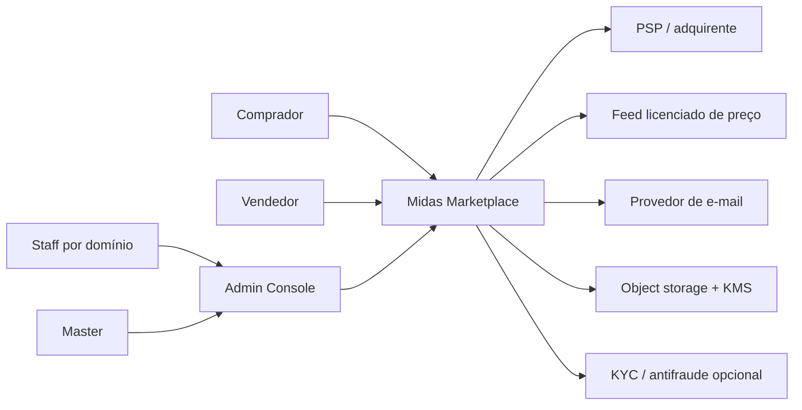
```mermaid
flowchart LR
    Buyer[Comprador] --> Midas[Midas Marketplace]
    Seller[Vendedor] --> Midas
    Staff[Staff por domínio] --> Admin[Admin Console]
    Master[Master] --> Admin
    Admin --> Midas
    Midas --> PSP[PSP / adquirente]
    Midas --> Price[Feed licenciado de preço]
    Midas --> Mail[Provedor de e-mail]
    Midas --> Storage[Object storage + KMS]
    Midas --> KYC[KYC / antifraude opcional]
```

### Responsabilidades externas

| Sistema | Responsabilidade |
|---|---|
| PSP | checkout, tokenização, Pix/cartão, captura, reembolso, chargeback, KYC/subconta e payout conforme contrato |
| Feed de preço | IDs, observações/candles em gold, proveniência, limites e licença |
| E-mail | envio, inbound parse, bounce, complaint e autenticação de domínio |
| Storage/KMS | objeto versionado, URLs assinadas, envelope encryption e rotação |
| KYC/risco | validação adicional quando política/PSP exigir |

## 3. Containers

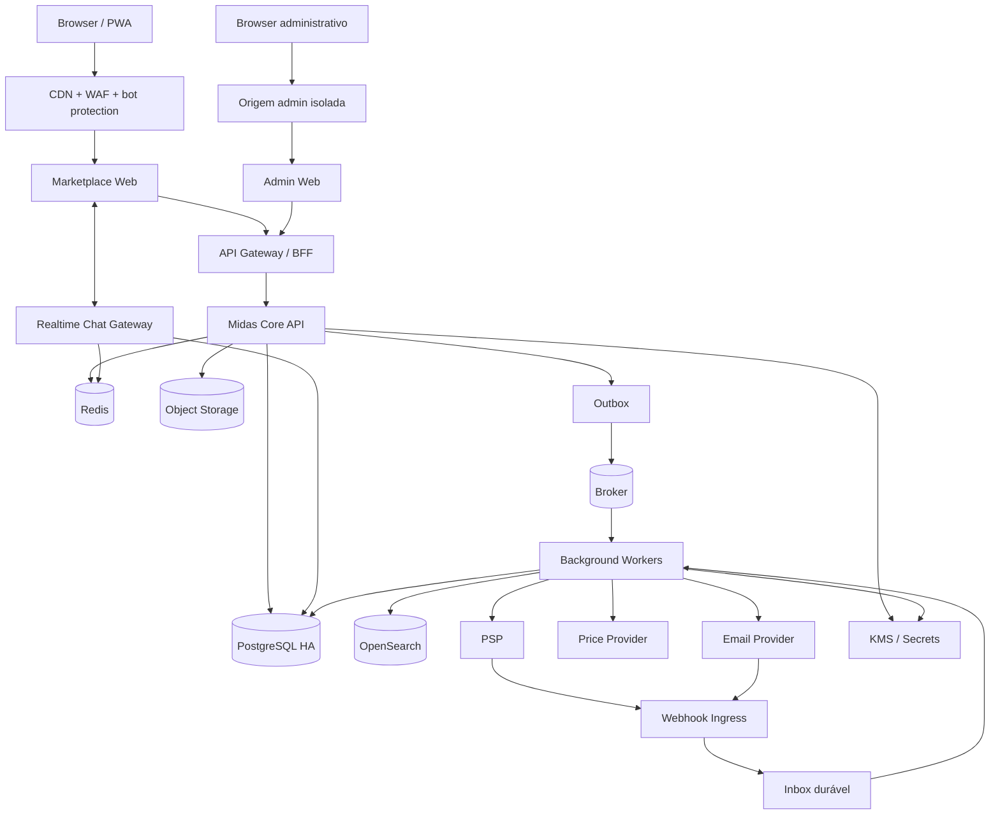
```mermaid
flowchart TB
    User[Browser / PWA] --> Edge[CDN + WAF + bot protection]
    Staff[Browser administrativo] --> AdminEdge[Origem admin isolada]
    Edge --> Web[Marketplace Web]
    AdminEdge --> AdminWeb[Admin Web]
    Web --> Gateway[API Gateway / BFF]
    AdminWeb --> Gateway
    Gateway --> Core[Midas Core API]
    Web <--> Realtime[Realtime Chat Gateway]
    Core --> PG[(PostgreSQL HA)]
    Core --> Redis[(Redis)]
    Core --> Object[(Object Storage)]
    Core --> Outbox[Outbox]
    Realtime --> PG
    Realtime --> Redis
    Outbox --> Broker[(Broker)]
    Broker --> Workers[Background Workers]
    Workers --> PG
    Workers --> Search[(OpenSearch)]
    Workers --> PSP[PSP]
    Workers --> Price[Price Provider]
    Workers --> Mail[Email Provider]
    PSP --> Hooks[Webhook Ingress]
    Mail --> Hooks
    Hooks --> Inbox[Inbox durável]
    Inbox --> Workers
    Core --> KMS[KMS / Secrets]
    Workers --> KMS
```

Admin usa CSP, origem, cookie, step-up e duração de sessão mais restritivos do que o marketplace público.

## 4. Bounded contexts

| Contexto | Dados próprios e responsabilidade |
|---|---|
| Identity | usuário, credencial, passkey, MFA, recuperação e sessão |
| IAM | roles, permissions, grants, política ABAC e delegação |
| Device Trust & Risk | vínculos, desafios, sinais, confiança e decisão |
| Catalog | itens, versões, stickers, taxonomia, imagens e proveniência |
| Listings & Moderation | rascunho, revisão, craft, prova de posse/disponibilidade, decisão, publicação e reserva |
| Offers & Conversation | sala pré-compra, mensagens, propostas e moderação |
| Market Data & Pricing | instrumentos, observações, candles, cotação e qualidade |
| Search & Discovery | índice, filtros, ranking e tombstones |
| Recommendation | eventos, afinidade, candidatos, ranking e impressão |
| Orders & Delivery | pedido, unidade, template de pronta-entrega, pacote consumido, sala, confirmações e cofre |
| Payments | intent, tentativa, evento PSP, refund e chargeback |
| Ledger & Payouts | journal, posting, lote, hold, saldo e saque |
| Disputes & Reputation | disputa, evidência, decisão, recurso, reputação e sanção |
| Support & Mailbox | ticket, thread, e-mail, SLA e anexo |
| Notifications | e-mail transacional, inbox e push futuro |
| Administration | configuração tipada, flags, console, seller onboarding e emergência |
| Audit & Compliance | evento auditável, retenção, exportação, restrição/recurso e direitos do titular |

Regra: cada contexto escreve somente suas tabelas. Outros contextos recebem IDs e eventos versionados; não alteram cópias internas.

## 5. Componentes do backend

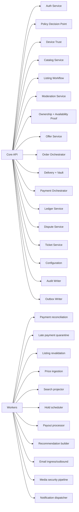
```mermaid
flowchart LR
    API[Core API] --> Auth[Auth Service]
    API --> PDP[Policy Decision Point]
    API --> Device[Device Trust]
    API --> Catalog[Catalog Service]
    API --> Listing[Listing Workflow]
    API --> Moderation[Moderation Service]
    API --> Proof[Ownership + Availability Proof]
    API --> Offer[Offer Service]
    API --> Order[Order Orchestrator]
    API --> Delivery[Delivery + Vault]
    API --> Payment[Payment Orchestrator]
    API --> Ledger[Ledger Service]
    API --> Dispute[Dispute Service]
    API --> Ticket[Ticket Service]
    API --> Config[Configuration]
    API --> Audit[Audit Writer]
    API --> Outbox[Outbox Writer]

    Worker[Workers] --> Reconcile[Payment reconciliation]
    Worker --> Quarantine[Late payment quarantine]
    Worker --> Revalidate[Listing revalidation]
    Worker --> Price[Price ingestion]
    Worker --> Project[Search projector]
    Worker --> Hold[Hold scheduler]
    Worker --> Payout[Payout processor]
    Worker --> Recommend[Recommendation builder]
    Worker --> Email[Email ingress/outbound]
    Worker --> Media[Media security pipeline]
    Worker --> Notify[Notification dispatcher]
```

## 6. Modelo de classes


```mermaid
classDiagram
    class User
    class SellerAccount
    class SellerMembership
    class SellerOnboardingCase
    class Credential
    class WebAuthnCredential
    class Session
    class DeviceBinding
    class Role
    class Permission
    class CatalogItem
    class CatalogItemVersion
    class CatalogAsset
    class Listing
    class ListingRevision
    class ListingUnit
    class Reservation
    class OwnershipProof
    class Craft
    class CraftSlot
    class Conversation
    class Message
    class Offer
    class PriceInstrument
    class PriceObservation
    class PriceCandle
    class Order
    class DeliveryRoom
    class DeliveryConfirmation
    class SecureDeliveryTemplate
    class SecureDeliveryPackage
    class PaymentIntent
    class PaymentAttempt
    class ProviderEvent
    class JournalEntry
    class Posting
    class LedgerAccount
    class BalanceLot
    class Hold
    class PayoutRequest
    class PayoutAttempt
    class Dispute
    class DisputeEvidence
    class DisputeDecision
    class DisputeAppeal
    class RestrictionAppeal
    class AccountRestriction
    class DataRightsRequest
    class Ticket
    class TicketMessage

    User "1" --> "0..*" Credential
    User "1" --> "0..*" WebAuthnCredential
    User "1" --> "0..*" Session
    User "1" --> "0..*" DeviceBinding
    User "0..*" --> "0..*" Role
    Role "0..*" --> "0..*" Permission
    User "1" --> "0..*" SellerMembership
    SellerAccount "1" --> "1..*" SellerMembership
    SellerAccount "1" --> "0..*" SellerOnboardingCase
    SellerAccount "1" --> "0..*" Listing
    CatalogItem "1" --> "1..*" CatalogItemVersion
    CatalogItem "1" --> "0..*" CatalogAsset
    Listing "1" --> "1..*" ListingRevision
    Listing "1" --> "1" ListingUnit
    ListingUnit "1" --> "0..*" OwnershipProof
    ListingUnit "1" --> "0..*" Reservation
    ListingRevision "1" --> "0..1" Craft
    ListingRevision "1" --> "0..1" SecureDeliveryTemplate
    ListingUnit "1" --> "0..1" SecureDeliveryTemplate
    Craft "1" --> "4" CraftSlot
    CraftSlot "0..*" --> "0..1" CatalogItem : sticker
    Listing "1" --> "0..*" Conversation
    Conversation "1" --> "0..*" Message
    Conversation "1" --> "0..*" Offer
    CatalogItem "1" --> "0..*" PriceInstrument
    PriceInstrument "1" --> "0..*" PriceObservation
    PriceInstrument "1" --> "0..*" PriceCandle
    Listing "1" --> "0..1" Order
    Order "1" --> "1" Reservation
    Order "1" --> "1" DeliveryRoom
    DeliveryRoom "1" --> "0..2" DeliveryConfirmation
    DeliveryRoom "1" --> "0..1" SecureDeliveryPackage
    SecureDeliveryTemplate "1" --> "0..1" SecureDeliveryPackage : consumed_as
    Order "1" --> "1..*" PaymentIntent
    PaymentIntent "1" --> "0..*" PaymentAttempt
    PaymentAttempt "1" --> "0..*" ProviderEvent
    Order "1" --> "0..*" Dispute
    Order "1" --> "0..*" BalanceLot
    BalanceLot "1" --> "0..*" Hold
    SellerAccount "1" --> "0..*" PayoutRequest
    PayoutRequest "1" --> "0..*" PayoutAttempt
    JournalEntry "1" --> "2..*" Posting
    LedgerAccount "1" --> "0..*" Posting
    Dispute "1" --> "0..*" DisputeEvidence
    Dispute "1" --> "0..*" DisputeDecision
    Dispute "1" --> "0..1" DisputeAppeal
    User "1" --> "0..*" AccountRestriction
    AccountRestriction "1" --> "0..1" RestrictionAppeal
    User "1" --> "0..*" DataRightsRequest
    Ticket "1" --> "0..*" TicketMessage
```

`SellerAccount` é o sujeito vendedor, não um usuário implícito. `SellerMembership` resolve a associação: conta `INDIVIDUAL` possui exatamente um membro `OWNER`; conta `ORGANIZATION` ou `PLATFORM` possui um ou mais membros com funções próprias. Um `User` pode comprar pessoalmente e participar de zero ou mais seller accounts, mas toda ação de venda informa e autoriza um `sellerAccountId` explícito.

## 7. Modelo relacional essencial


```mermaid
erDiagram
    USERS ||--o{ SESSIONS : owns
    USERS ||--o{ DEVICE_BINDINGS : trusts
    USERS }o--o{ ROLES : granted
    ROLES }o--o{ PERMISSIONS : contains
    USERS ||--o{ SELLER_MEMBERSHIPS : joins
    SELLER_ACCOUNTS ||--|{ SELLER_MEMBERSHIPS : authorizes
    SELLER_ACCOUNTS ||--o{ SELLER_ONBOARDING_CASES : validates
    SELLER_ACCOUNTS ||--o{ LISTINGS : publishes
    CATALOG_ITEMS ||--o{ CATALOG_ITEM_VERSIONS : versions
    CATALOG_ITEMS ||--o{ CATALOG_ASSETS : displays
    LISTINGS ||--o{ LISTING_REVISIONS : snapshots
    LISTINGS ||--|| LISTING_UNITS : represents
    LISTING_UNITS ||--o{ OWNERSHIP_PROOFS : proves
    LISTING_UNITS ||--o{ RESERVATIONS : reserves
    LISTING_REVISIONS ||--o| CRAFTS : includes
    LISTING_REVISIONS ||--o| SECURE_DELIVERY_TEMPLATES : preconfigures
    LISTING_UNITS ||--o| SECURE_DELIVERY_TEMPLATES : binds
    CRAFTS ||--|{ CRAFT_SLOTS : orders
    LISTINGS ||--o| ORDERS : sold_as
    ORDERS ||--|| RESERVATIONS : owns
    ORDERS ||--|| DELIVERY_ROOMS : opens
    SECURE_DELIVERY_TEMPLATES ||--o| SECURE_DELIVERY_PACKAGES : consumes
    DELIVERY_ROOMS ||--o| SECURE_DELIVERY_PACKAGES : reveals
    ORDERS ||--|{ PAYMENT_INTENTS : pays
    PAYMENT_INTENTS ||--o{ PAYMENT_ATTEMPTS : attempts
    ORDERS ||--o{ DISPUTES : disputes
    ORDERS ||--o{ BALANCE_LOTS : funds
    BALANCE_LOTS ||--o{ HOLDS : freezes
    SELLER_ACCOUNTS ||--o{ PAYOUT_REQUESTS : requests
    PAYOUT_REQUESTS ||--o{ PAYOUT_ATTEMPTS : retries
    JOURNAL_ENTRIES ||--|{ POSTINGS : balances
    LEDGER_ACCOUNTS ||--o{ POSTINGS : receives
    DISPUTES ||--o{ DISPUTE_EVIDENCE : collects
    DISPUTES ||--o{ DISPUTE_DECISIONS : decides
    DISPUTES ||--o| DISPUTE_APPEALS : appeals
    USERS ||--o{ ACCOUNT_RESTRICTIONS : receives
    ACCOUNT_RESTRICTIONS ||--o| RESTRICTION_APPEALS : appeals
    USERS ||--o{ DATA_RIGHTS_REQUESTS : requests
    TICKETS ||--o{ TICKET_MESSAGES : threads
```

### Regras transversais de dados

- UUIDv7 ou equivalente ordenável.
- `timestamptz` UTC.
- Dinheiro: `amount_minor bigint + currency char(3)`.
- Gold: `numeric(20,4)`, jamais no ledger fiduciário.
- Proibido `float` para valor.
- `version bigint` para concorrência otimista.
- JSONB somente com schema validado.
- Mudança de configuração não altera snapshot do pedido.
- Sem soft delete universal; usar estado, tombstone e anonimização seletiva.

### Invariantes

**SellerAccount e onboarding**

- `INDIVIDUAL` possui exatamente um membership `OWNER`; `ORGANIZATION` e `PLATFORM` possuem um ou mais membros;
- permissões de venda são avaliadas sobre usuário, membership e seller account;
- somente seller account com onboarding `APPROVED` e sem restrição pode submeter ou publicar;
- quando possível, documentos financeiros/KYC ficam no onboarding hospedado do PSP; Midas guarda apenas IDs, estado e evidência mínima.

**Listing**

- um anúncio ativo representa uma unidade vendável;
- um índice único parcial garante uma reserva ativa por anúncio;
- cada `Reservation` referencia o `PaymentIntent` que precisa ser encerrado antes de liberar a unidade;
- vendido não volta a ativo; revenda cria outro anúncio;
- alteração material cria nova revisão;
- `channel=MIDAS` usa seller account da plataforma e rotulagem pública.
- submissão exige `OwnershipProof` obtida por meio autorizado, com checksum, proveniência, validade e decisão auditada; nunca senha do jogo nem endpoint privado;
- disponibilidade é revalidada antes da aprovação, na publicação, periodicamente enquanto ativo e imediatamente antes da reserva; prova expirada move o anúncio para `SUSPENDED_REVALIDATION`;
- reserva vencida entra em `EXPIRY_PENDING`; o anúncio permanece indisponível até o PSP confirmar canonicamente o intent como `CANCELED` ou `EXPIRED`;
- somente a transação que registra esse cancelamento canônico pode finalizar o pedido como expirado/cancelado e devolver o anúncio a `ACTIVE`.

**Craft**

- `NONE` possui zero `CraftSlot`;
- `CRAFT` possui exatamente quatro posições únicas `1..4`;
- `CRAFT` só é válido quando o item base é `SKIN`, está ativo e possui `craftEligible=true` na versão congelada do catálogo;
- cada item selecionado é `STICKER` ativo;
- ao menos uma posição preenchida;
- pedido congela nome, imagem, ID e preço gold observados.

**Pronta-entrega**

- `SecureDeliveryTemplate` pertence simultaneamente à `ListingRevision` publicada e à unidade vendável; revisão ou unidade diferente não pode reutilizá-lo;
- aprovação congela `contentHash`, `ciphertextHash`, versão da política e envelope KMS do template;
- após settlement regular, uma única transação bloqueia unidade/template/pedido, verifica vínculo e hash, marca o template como consumido e cria um `SecureDeliveryPackage` imutável para aquele pedido;
- índice único em `templateId` consumido e em `orderId` impede dupla entrega; falha transacional não consome o template;
- settlement tardio em `PAYMENT_QUARANTINED` não consome template nem abre sala; consumo só ocorre depois de reassociação atômica bem-sucedida e novo evento canônico;
- produtos Standoff 2 mantêm `credentialDeliveryAllowed=false`: login, senha, token, cookie ou recovery code são rejeitados no servidor. O template pode conter apenas instrução permitida e contato pós-pagamento.

**Order**

- um anúncio por pedido no MVP;
- comprador e vendedor são derivados da sessão/anúncio;
- snapshot inclui oferta, craft, fees, política de hold e contato liberável;
- confirmações são registros independentes únicos por papel.
- pedido só se torna `PAID` a partir de settlement persistido e journal balanceado; `FAILED`, `EXPIRED`, `REFUNDED` e `CHARGEBACK` possuem saídas explícitas nas máquinas abaixo;
- evento tardio para pedido cancelado/expirado entra em `PAYMENT_QUARANTINED`, sem entrega, notificação de sucesso ou consumo de pronta-entrega;
- resolução de quarantine bloqueia atomicamente payment, order, listing unit e reserva atual: se a unidade continua livre e sem comprador posterior, reassocia e conclui settlement; se não, solicita reembolso idempotente.

**Ledger**

- journal não é atualizado; correção usa reversão;
- dois ou mais postings somam zero por moeda;
- `postingKey` único evita duplicação;
- saldo é projeção do razão, nunca campo editável.
- payout `FAILED` ou `RETURNED` nunca desaparece nem vira `PAID`: segue para revisão e retry com nova `PayoutAttempt`, ou cancelamento com lançamento compensatório de `PAYOUT_IN_TRANSIT`/`PAYOUT_RESERVED` para `AVAILABLE`.

## 8. Sequência — anúncio e aprovação

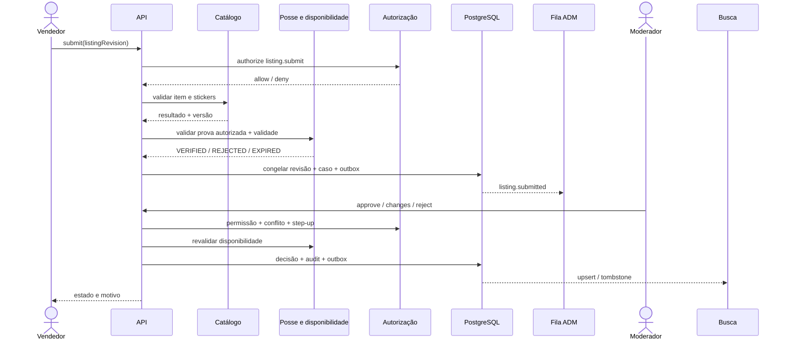
```mermaid
sequenceDiagram
    actor Seller as Vendedor
    participant API
    participant Catalog as Catálogo
    participant Proof as Posse e disponibilidade
    participant PDP as Autorização
    participant DB as PostgreSQL
    participant Queue as Fila ADM
    actor Admin as Moderador
    participant Search as Busca

    Seller->>API: submit(listingRevision)
    API->>PDP: authorize listing.submit
    PDP-->>API: allow / deny
    API->>Catalog: validar item e stickers
    Catalog-->>API: resultado + versão
    API->>Proof: validar prova autorizada + validade
    Proof-->>API: VERIFIED / REJECTED / EXPIRED
    API->>DB: congelar revisão + caso + outbox
    DB-->>Queue: listing.submitted
    Admin->>API: approve / changes / reject
    API->>PDP: permissão + conflito + step-up
    API->>Proof: revalidar disponibilidade
    API->>DB: decisão + audit + outbox
    DB-->>Search: upsert / tombstone
    API-->>Seller: estado e motivo
```

## 9. Sequência — compra e pagamento

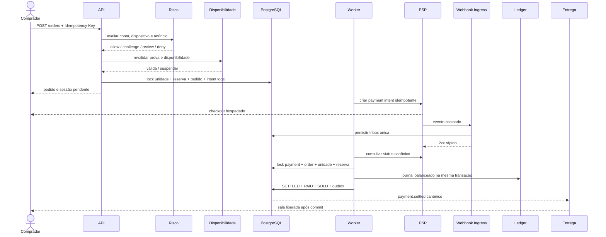
```mermaid
sequenceDiagram
    actor Buyer as Comprador
    participant API
    participant Risk as Risco
    participant Proof as Disponibilidade
    participant DB as PostgreSQL
    participant Worker
    participant PSP
    participant Hook as Webhook Ingress
    participant Ledger
    participant Delivery as Entrega

    Buyer->>API: POST /orders + Idempotency-Key
    API->>Risk: avaliar conta, dispositivo e anúncio
    Risk-->>API: allow / challenge / review / deny
    API->>Proof: revalidar prova e disponibilidade
    Proof-->>API: válida / suspender
    API->>DB: lock unidade + reserva + pedido + intent local
    API-->>Buyer: pedido e sessão pendente
    Worker->>PSP: criar payment intent idempotente
    PSP-->>Buyer: checkout hospedado
    PSP->>Hook: evento assinado
    Hook->>DB: persistir inbox única
    Hook-->>PSP: 2xx rápido
    Worker->>PSP: consultar status canônico
    Worker->>DB: lock payment + order + unidade + reserva
    Worker->>Ledger: journal balanceado na mesma transação
    Worker->>DB: SETTLED + PAID + SOLD + outbox
    DB-->>Delivery: payment.settled canônico
    Delivery-->>Buyer: sala liberada após commit
```

Redirect do browser nunca confirma pagamento.

### Corrida crítica — reserva expirada versus settlement tardio

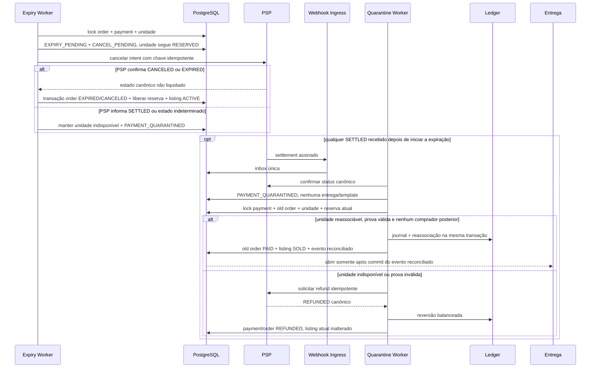
```mermaid
sequenceDiagram
    participant Expiry as Expiry Worker
    participant DB as PostgreSQL
    participant PSP
    participant Hook as Webhook Ingress
    participant Quarantine as Quarantine Worker
    participant Ledger
    participant Delivery as Entrega

    Expiry->>DB: lock order + payment + unidade
    Expiry->>DB: EXPIRY_PENDING + CANCEL_PENDING, unidade segue RESERVED
    Expiry->>PSP: cancelar intent com chave idempotente
    alt PSP confirma CANCELED ou EXPIRED
        PSP-->>Expiry: estado canônico não liquidado
        Expiry->>DB: transação order EXPIRED/CANCELED + liberar reserva + listing ACTIVE
    else PSP informa SETTLED ou estado indeterminado
        Expiry->>DB: manter unidade indisponível + PAYMENT_QUARANTINED
    end
    opt qualquer SETTLED recebido depois de iniciar a expiração
        PSP->>Hook: settlement assinado
        Hook->>DB: inbox única
        Quarantine->>PSP: confirmar status canônico
        Quarantine->>DB: PAYMENT_QUARANTINED, nenhuma entrega/template
        Quarantine->>DB: lock payment + old order + unidade + reserva atual
        alt unidade reassociável, prova válida e nenhum comprador posterior
            Quarantine->>Ledger: journal + reassociação na mesma transação
            Quarantine->>DB: old order PAID + listing SOLD + evento reconciliado
            DB-->>Delivery: abrir somente após commit do evento reconciliado
        else unidade indisponível ou prova inválida
            Quarantine->>PSP: solicitar refund idempotente
            PSP-->>Quarantine: REFUNDED canônico
            Quarantine->>Ledger: reversão balanceada
            Quarantine->>DB: payment/order REFUNDED, listing atual inalterado
        end
    end
```

`PAYMENT_QUARANTINED` nunca é gatilho de entrega. Apenas o evento pós-commit `payment.quarantine_reassociated` pode liberar a sala; se reassociação não for comprovadamente segura, o único caminho é reembolso ou revisão financeira com fundos congelados.

## 10. Sequência — entrega, hold e saque

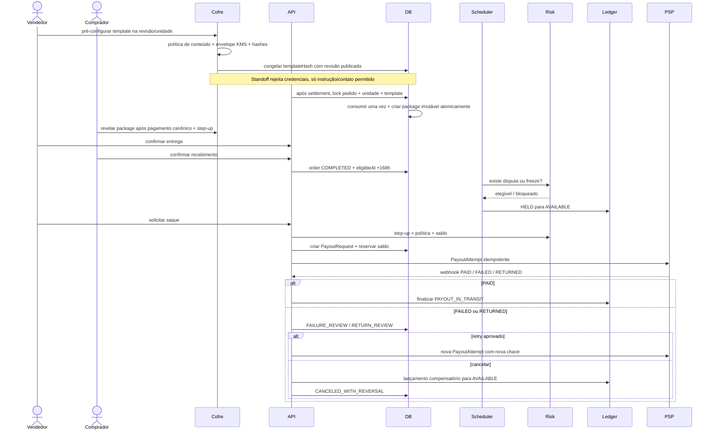
```mermaid
sequenceDiagram
    actor Seller as Vendedor
    actor Buyer as Comprador
    participant Vault as Cofre
    participant API
    participant DB
    participant Scheduler
    participant Risk
    participant Ledger
    participant PSP

    Seller->>Vault: pré-configurar template na revisão/unidade
    Vault->>Vault: política de conteúdo + envelope KMS + hashes
    Vault->>DB: congelar templateHash com revisão publicada
    Note over Vault,DB: Standoff rejeita credenciais, só instrução/contato permitido
    API->>DB: após settlement, lock pedido + unidade + template
    DB->>DB: consumir uma vez + criar package imutável atomicamente
    Buyer->>Vault: revelar package após pagamento canônico + step-up
    Seller->>API: confirmar entrega
    Buyer->>API: confirmar recebimento
    API->>DB: order COMPLETED + eligibleAt +168h
    Scheduler->>Risk: existe disputa ou freeze?
    Risk-->>Scheduler: elegível / bloqueado
    Scheduler->>Ledger: HELD para AVAILABLE
    Seller->>API: solicitar saque
    API->>Risk: step-up + política + saldo
    API->>DB: criar PayoutRequest + reservar saldo
    API->>PSP: PayoutAttempt idempotente
    PSP-->>API: webhook PAID / FAILED / RETURNED
    alt PAID
        API->>Ledger: finalizar PAYOUT_IN_TRANSIT
    else FAILED ou RETURNED
        API->>DB: FAILURE_REVIEW / RETURN_REVIEW
        alt retry aprovado
            API->>PSP: nova PayoutAttempt com nova chave
        else cancelar
            API->>Ledger: lançamento compensatório para AVAILABLE
            API->>DB: CANCELED_WITH_REVERSAL
        end
    end
```

`FAILED` e `RETURNED` não são baixados como sucesso. Cada tentativa preserva provider ID, razão, timestamps e eventos; retry cria nova tentativa, e cancelamento só termina depois da reversão contábil idempotente.

## 11. Sequência — chat e PII

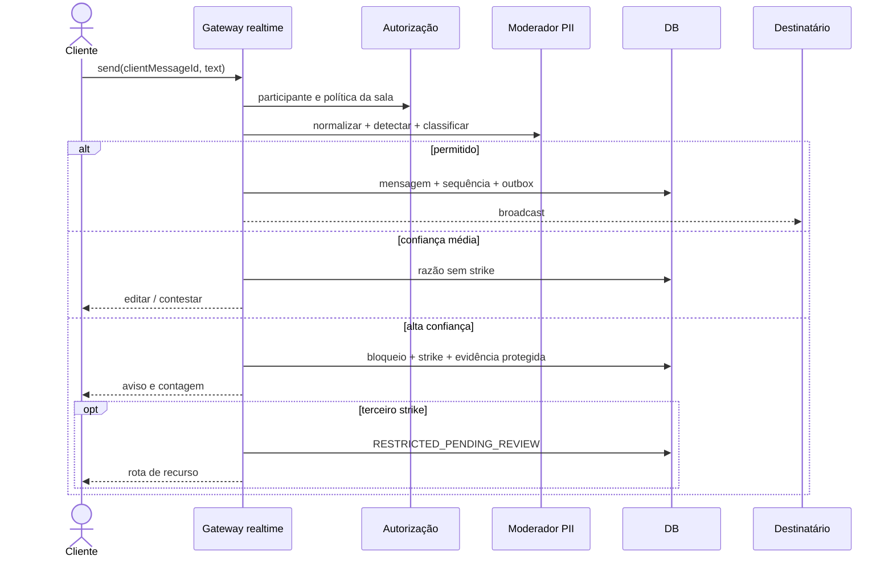
```mermaid
sequenceDiagram
    actor Client as Cliente
    participant RT as Gateway realtime
    participant PDP as Autorização
    participant Mod as Moderador PII
    participant DB
    participant Other as Destinatário

    Client->>RT: send(clientMessageId, text)
    RT->>PDP: participante e política da sala
    RT->>Mod: normalizar + detectar + classificar
    alt permitido
        RT->>DB: mensagem + sequência + outbox
        RT-->>Other: broadcast
    else confiança média
        RT->>DB: razão sem strike
        RT-->>Client: editar / contestar
    else alta confiança
        RT->>DB: bloqueio + strike + evidência protegida
        RT-->>Client: aviso e contagem
        opt terceiro strike
            RT->>DB: RESTRICTED_PENDING_REVIEW
            RT-->>Client: rota de recurso
        end
    end
```

Pipeline: NFKC, remoção de zero-width, confusables, e-mail, telefone, URL, Pix, social, nick e leetspeak. Conteúdo bloqueado não entra em analytics/log operacional.

## 12. Sequência — dispositivo confiável

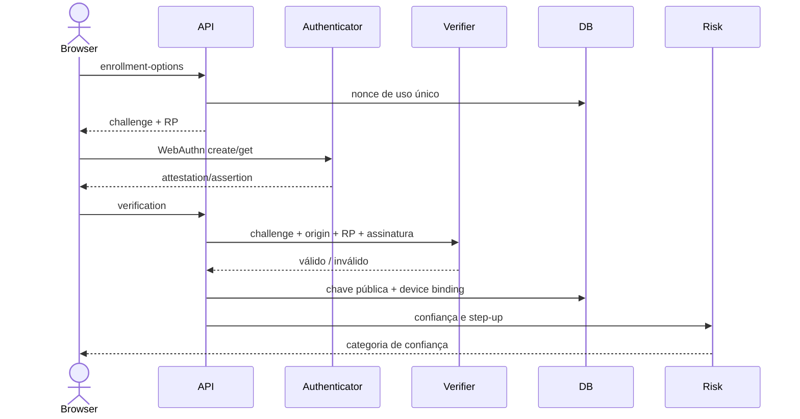
```mermaid
sequenceDiagram
    actor Browser
    participant API
    participant Authenticator
    participant Verifier
    participant DB
    participant Risk

    Browser->>API: enrollment-options
    API->>DB: nonce de uso único
    API-->>Browser: challenge + RP
    Browser->>Authenticator: WebAuthn create/get
    Authenticator-->>Browser: attestation/assertion
    Browser->>API: verification
    API->>Verifier: challenge + origin + RP + assinatura
    Verifier-->>API: válido / inválido
    API->>DB: chave pública + device binding
    API->>Risk: confiança e step-up
    Risk-->>Browser: categoria de confiança
```

## 13. Sequência — ingestão de preço

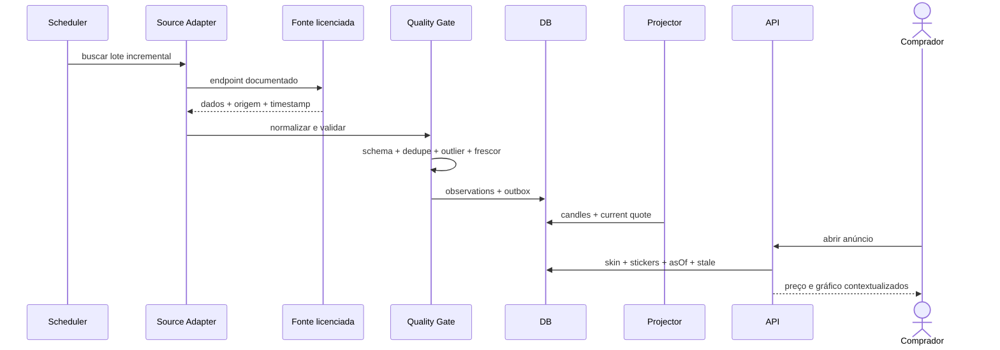
```mermaid
sequenceDiagram
    participant Scheduler
    participant Adapter as Source Adapter
    participant Provider as Fonte licenciada
    participant Quality as Quality Gate
    participant DB
    participant Projector
    participant API
    actor Buyer as Comprador

    Scheduler->>Adapter: buscar lote incremental
    Adapter->>Provider: endpoint documentado
    Provider-->>Adapter: dados + origem + timestamp
    Adapter->>Quality: normalizar e validar
    Quality->>Quality: schema + dedupe + outlier + frescor
    Quality->>DB: observations + outbox
    Projector->>DB: candles + current quote
    Buyer->>API: abrir anúncio
    API->>DB: skin + stickers + asOf + stale
    API-->>Buyer: preço e gráfico contextualizados
```

## 14. Máquinas de estado

### Anúncio

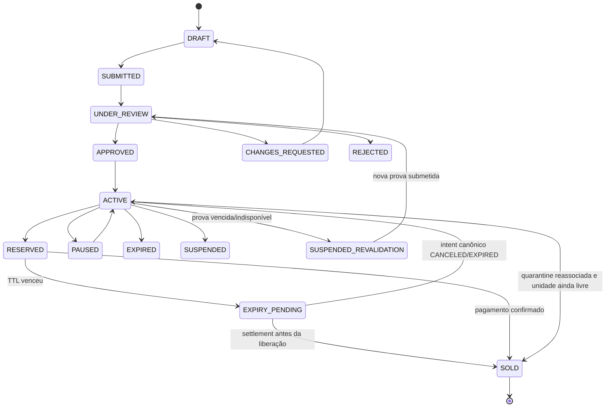
```mermaid
stateDiagram-v2
    [*] --> DRAFT
    DRAFT --> SUBMITTED
    SUBMITTED --> UNDER_REVIEW
    UNDER_REVIEW --> APPROVED
    UNDER_REVIEW --> CHANGES_REQUESTED
    CHANGES_REQUESTED --> DRAFT
    UNDER_REVIEW --> REJECTED
    APPROVED --> ACTIVE
    ACTIVE --> RESERVED
    RESERVED --> EXPIRY_PENDING: TTL venceu
    EXPIRY_PENDING --> ACTIVE: intent canônico CANCELED/EXPIRED
    EXPIRY_PENDING --> SOLD: settlement antes da liberação
    RESERVED --> SOLD: pagamento confirmado
    ACTIVE --> SOLD: quarantine reassociada e unidade ainda livre
    ACTIVE --> PAUSED
    PAUSED --> ACTIVE
    ACTIVE --> EXPIRED
    ACTIVE --> SUSPENDED
    ACTIVE --> SUSPENDED_REVALIDATION: prova vencida/indisponível
    SUSPENDED_REVALIDATION --> UNDER_REVIEW: nova prova submetida
    SOLD --> [*]
```

### Prova de posse e disponibilidade

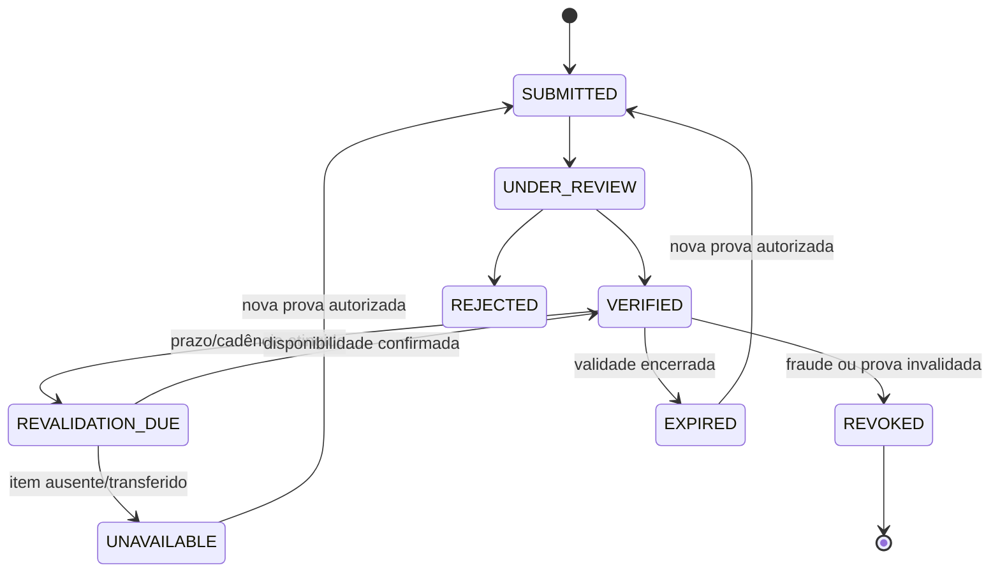
```mermaid
stateDiagram-v2
    [*] --> SUBMITTED
    SUBMITTED --> UNDER_REVIEW
    UNDER_REVIEW --> VERIFIED
    UNDER_REVIEW --> REJECTED
    VERIFIED --> REVALIDATION_DUE: prazo/cadência atingido
    REVALIDATION_DUE --> VERIFIED: disponibilidade confirmada
    REVALIDATION_DUE --> UNAVAILABLE: item ausente/transferido
    VERIFIED --> REVOKED: fraude ou prova invalidada
    VERIFIED --> EXPIRED: validade encerrada
    UNAVAILABLE --> SUBMITTED: nova prova autorizada
    EXPIRED --> SUBMITTED: nova prova autorizada
    REVOKED --> [*]
```

Somente `VERIFIED` permite publicar ou reservar. `OwnershipProof` contém evidência mínima e autorizada; confirmação automatizada só usa integração oficial/documentada.

### Pedido e entrega

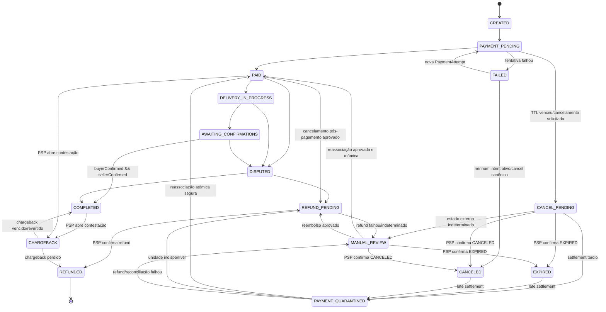
```mermaid
stateDiagram-v2
    [*] --> CREATED
    CREATED --> PAYMENT_PENDING
    PAYMENT_PENDING --> PAID
    PAYMENT_PENDING --> FAILED: tentativa falhou
    FAILED --> PAYMENT_PENDING: nova PaymentAttempt
    FAILED --> CANCELED: nenhum intent ativo/cancel canônico
    PAYMENT_PENDING --> CANCEL_PENDING: TTL venceu/cancelamento solicitado
    CANCEL_PENDING --> EXPIRED: PSP confirma EXPIRED
    CANCEL_PENDING --> CANCELED: PSP confirma CANCELED
    CANCEL_PENDING --> PAYMENT_QUARANTINED: settlement tardio
    CANCEL_PENDING --> MANUAL_REVIEW: estado externo indeterminado
    EXPIRED --> PAYMENT_QUARANTINED: late settlement
    CANCELED --> PAYMENT_QUARANTINED: late settlement
    PAYMENT_QUARANTINED --> PAID: reassociação atômica segura
    PAYMENT_QUARANTINED --> REFUND_PENDING: unidade indisponível
    PAYMENT_QUARANTINED --> MANUAL_REVIEW: refund/reconciliação falhou
    MANUAL_REVIEW --> PAID: reassociação aprovada e atômica
    MANUAL_REVIEW --> REFUND_PENDING: reembolso aprovado
    MANUAL_REVIEW --> EXPIRED: PSP confirma EXPIRED
    MANUAL_REVIEW --> CANCELED: PSP confirma CANCELED
    REFUND_PENDING --> REFUNDED: PSP confirma refund
    REFUND_PENDING --> MANUAL_REVIEW: refund falhou/indeterminado
    PAID --> DELIVERY_IN_PROGRESS
    DELIVERY_IN_PROGRESS --> AWAITING_CONFIRMATIONS
    AWAITING_CONFIRMATIONS --> COMPLETED: buyerConfirmed && sellerConfirmed
    PAID --> DISPUTED
    DELIVERY_IN_PROGRESS --> DISPUTED
    AWAITING_CONFIRMATIONS --> DISPUTED
    DISPUTED --> COMPLETED
    DISPUTED --> REFUND_PENDING
    PAID --> REFUND_PENDING: cancelamento pós-pagamento aprovado
    COMPLETED --> CHARGEBACK: PSP abre contestação
    PAID --> CHARGEBACK: PSP abre contestação
    CHARGEBACK --> COMPLETED: chargeback vencido/revertido
    CHARGEBACK --> REFUNDED: chargeback perdido
    REFUNDED --> [*]
```

### Pagamento / PaymentIntent

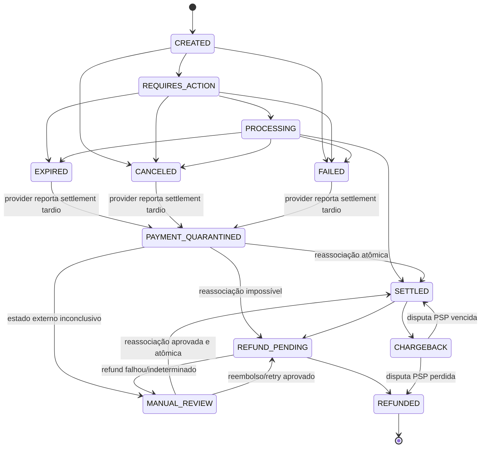
```mermaid
stateDiagram-v2
    [*] --> CREATED
    CREATED --> REQUIRES_ACTION
    REQUIRES_ACTION --> PROCESSING
    PROCESSING --> SETTLED
    CREATED --> FAILED
    REQUIRES_ACTION --> FAILED
    PROCESSING --> FAILED
    REQUIRES_ACTION --> EXPIRED
    PROCESSING --> EXPIRED
    CREATED --> CANCELED
    REQUIRES_ACTION --> CANCELED
    PROCESSING --> CANCELED
    EXPIRED --> PAYMENT_QUARANTINED: provider reporta settlement tardio
    CANCELED --> PAYMENT_QUARANTINED: provider reporta settlement tardio
    FAILED --> PAYMENT_QUARANTINED: provider reporta settlement tardio
    PAYMENT_QUARANTINED --> SETTLED: reassociação atômica
    PAYMENT_QUARANTINED --> REFUND_PENDING: reassociação impossível
    PAYMENT_QUARANTINED --> MANUAL_REVIEW: estado externo inconclusivo
    SETTLED --> REFUND_PENDING
    REFUND_PENDING --> REFUNDED
    REFUND_PENDING --> MANUAL_REVIEW: refund falhou/indeterminado
    MANUAL_REVIEW --> SETTLED: reassociação aprovada e atômica
    MANUAL_REVIEW --> REFUND_PENDING: reembolso/retry aprovado
    SETTLED --> CHARGEBACK
    CHARGEBACK --> SETTLED: disputa PSP vencida
    CHARGEBACK --> REFUNDED: disputa PSP perdida
    REFUNDED --> [*]
```

Estados terminais locais não impedem evento financeiro tardio: a inbox ainda aceita e deduplica webhooks, mas qualquer transição de `FAILED|EXPIRED|CANCELED` por settlement passa obrigatoriamente por `PAYMENT_QUARANTINED`.

Cada `PaymentIntent` mantém zero ou mais `PaymentAttempt`; retry cria tentativa nova sem apagar a anterior. Estado canônico vem do PSP, enquanto tentativas preservam request, provider ID, erro e idempotency key.

### Fundos

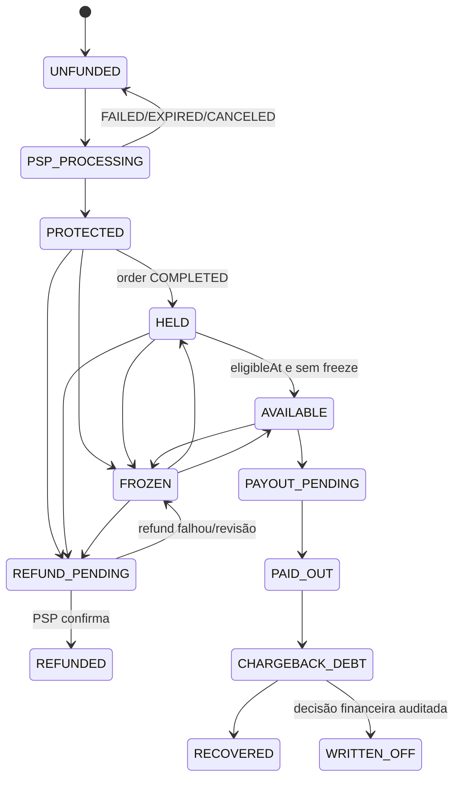
```mermaid
stateDiagram-v2
    [*] --> UNFUNDED
    UNFUNDED --> PSP_PROCESSING
    PSP_PROCESSING --> PROTECTED
    PSP_PROCESSING --> UNFUNDED: FAILED/EXPIRED/CANCELED
    PROTECTED --> HELD: order COMPLETED
    HELD --> AVAILABLE: eligibleAt e sem freeze
    AVAILABLE --> PAYOUT_PENDING
    PAYOUT_PENDING --> PAID_OUT
    PROTECTED --> FROZEN
    HELD --> FROZEN
    AVAILABLE --> FROZEN
    FROZEN --> HELD
    FROZEN --> AVAILABLE
    PROTECTED --> REFUND_PENDING
    HELD --> REFUND_PENDING
    FROZEN --> REFUND_PENDING
    REFUND_PENDING --> REFUNDED: PSP confirma
    REFUND_PENDING --> FROZEN: refund falhou/revisão
    PAID_OUT --> CHARGEBACK_DEBT
    CHARGEBACK_DEBT --> RECOVERED
    CHARGEBACK_DEBT --> WRITTEN_OFF: decisão financeira auditada
```

### Disputa

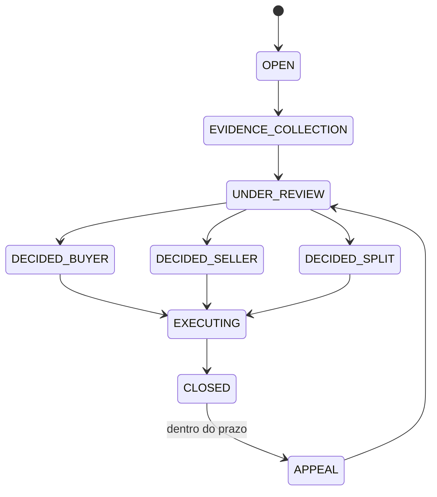
```mermaid
stateDiagram-v2
    [*] --> OPEN
    OPEN --> EVIDENCE_COLLECTION
    EVIDENCE_COLLECTION --> UNDER_REVIEW
    UNDER_REVIEW --> DECIDED_BUYER
    UNDER_REVIEW --> DECIDED_SELLER
    UNDER_REVIEW --> DECIDED_SPLIT
    DECIDED_BUYER --> EXECUTING
    DECIDED_SELLER --> EXECUTING
    DECIDED_SPLIT --> EXECUTING
    EXECUTING --> CLOSED
    CLOSED --> APPEAL: dentro do prazo
    APPEAL --> UNDER_REVIEW
```

### Restrição de conta

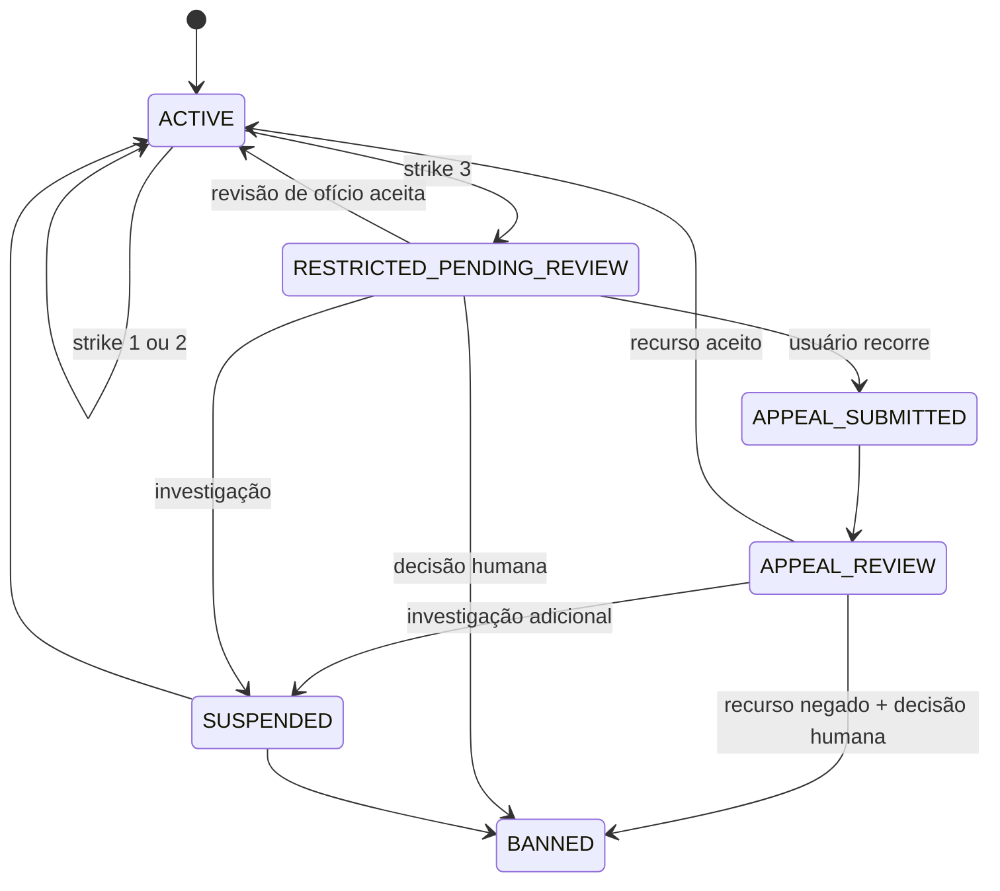
```mermaid
stateDiagram-v2
    [*] --> ACTIVE
    ACTIVE --> ACTIVE: strike 1 ou 2
    ACTIVE --> RESTRICTED_PENDING_REVIEW: strike 3
    RESTRICTED_PENDING_REVIEW --> APPEAL_SUBMITTED: usuário recorre
    APPEAL_SUBMITTED --> APPEAL_REVIEW
    APPEAL_REVIEW --> ACTIVE: recurso aceito
    APPEAL_REVIEW --> SUSPENDED: investigação adicional
    APPEAL_REVIEW --> BANNED: recurso negado + decisão humana
    RESTRICTED_PENDING_REVIEW --> ACTIVE: revisão de ofício aceita
    RESTRICTED_PENDING_REVIEW --> SUSPENDED: investigação
    RESTRICTED_PENDING_REVIEW --> BANNED: decisão humana
    SUSPENDED --> ACTIVE
    SUSPENDED --> BANNED
```

### Ticket

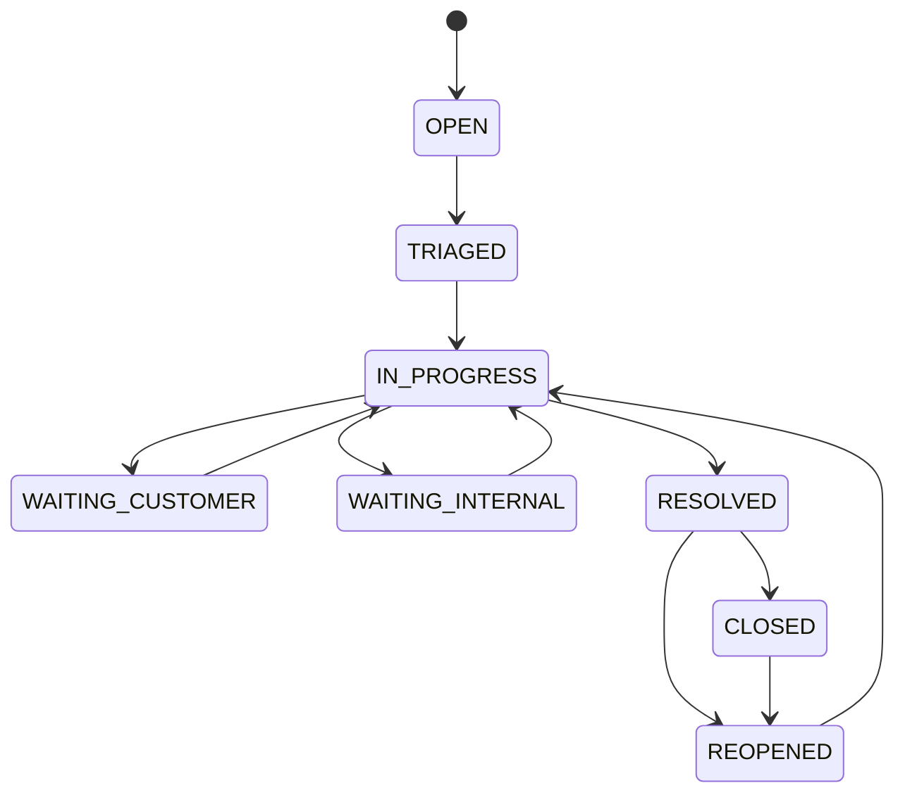
```mermaid
stateDiagram-v2
    [*] --> OPEN
    OPEN --> TRIAGED
    TRIAGED --> IN_PROGRESS
    IN_PROGRESS --> WAITING_CUSTOMER
    IN_PROGRESS --> WAITING_INTERNAL
    WAITING_CUSTOMER --> IN_PROGRESS
    WAITING_INTERNAL --> IN_PROGRESS
    IN_PROGRESS --> RESOLVED
    RESOLVED --> CLOSED
    RESOLVED --> REOPENED
    CLOSED --> REOPENED
    REOPENED --> IN_PROGRESS
```

### Saque

```mermaid
stateDiagram-v2
    [*] --> REQUESTED
    REQUESTED --> RISK_REVIEW
    RISK_REVIEW --> APPROVED
    RISK_REVIEW --> REJECTED_WITH_REVERSAL
    REJECTED_WITH_REVERSAL --> REJECTED: posting compensatório confirmado
    APPROVED --> SUBMITTED
    SUBMITTED --> PROCESSING
    PROCESSING --> PAID
    PAID --> RETURNED: banco/PSP devolve depois
    SUBMITTED --> FAILED
    PROCESSING --> FAILED
    PROCESSING --> RETURNED
    FAILED --> FAILURE_REVIEW
    RETURNED --> RETURN_REVIEW
    FAILURE_REVIEW --> RETRY_SCHEDULED: causa corrigida
    RETURN_REVIEW --> RETRY_SCHEDULED: dados corrigidos
    RETRY_SCHEDULED --> SUBMITTED: nova PayoutAttempt
    FAILURE_REVIEW --> CANCELED_WITH_REVERSAL
    RETURN_REVIEW --> CANCELED_WITH_REVERSAL
    CANCELED_WITH_REVERSAL --> CANCELED: posting compensatório confirmado
    REQUESTED --> CANCELED_WITH_REVERSAL
    REJECTED --> [*]
    CANCELED --> [*]
```

`FAILED` e `RETURNED` são estados de tentativa, não autorização para criar saldo. Durante revisão, o valor continua reservado; retry cria nova `PayoutAttempt`. Cancelamento só termina depois da reversão idempotente para `SELLER_AVAILABLE`.

## 15. API REST proposta

### Convenções

- `/v1`, JSON e OpenAPI 3.1.
- Erro `application/problem+json` com código estável e recuperação.
- Cursor pagination.
- `ETag/If-Match` em revisões/configuração.
- `Idempotency-Key` em pedido, pagamento, confirmação, reembolso e saque.
- `202 Accepted` para trabalho assíncrono.
- autorização por objeto e campo em toda rota.

### Rotas essenciais

```text
POST /v1/auth/register
POST /v1/auth/login
POST /v1/auth/webauthn/registration-options
POST /v1/auth/webauthn/registration-verification
POST /v1/auth/webauthn/authentication-options
POST /v1/auth/webauthn/authentication-verification
POST /v1/auth/mfa/totp
GET  /v1/me/sessions
DELETE /v1/me/sessions/{id}
POST /v1/seller-accounts
GET  /v1/me/seller-accounts
POST /v1/seller-accounts/{sellerAccountId}/onboarding
GET  /v1/seller-accounts/{sellerAccountId}/onboarding
POST /v1/seller-accounts/{sellerAccountId}/onboarding/provider-session
POST /v1/seller-accounts/{sellerAccountId}/payout-destinations
GET  /v1/seller-accounts/{sellerAccountId}/members
POST /v1/seller-accounts/{sellerAccountId}/members
DELETE /v1/seller-accounts/{sellerAccountId}/members/{membershipId}
GET  /v1/admin/seller-onboarding
POST /v1/admin/seller-onboarding/{id}/approve
POST /v1/admin/seller-onboarding/{id}/reject

GET  /v1/catalog/items
POST /v1/admin/catalog/items
POST /v1/admin/catalog/imports
POST /v1/admin/catalog/items/{id}/publish

POST /v1/listings
PATCH /v1/listings/{id}/draft
POST /v1/listings/{id}/submit
POST /v1/listings/{id}/ownership-proofs
PUT  /v1/listing-revisions/{revisionId}/secure-delivery-template
DELETE /v1/listing-revisions/{revisionId}/secure-delivery-template
POST /v1/admin/listings/{id}/claim-review
POST /v1/admin/listings/{id}/ownership-proofs/{proofId}/verify
POST /v1/admin/listings/{id}/revalidate
POST /v1/admin/listings/{id}/approve
POST /v1/admin/listings/{id}/request-changes
POST /v1/admin/listings/{id}/reject

GET  /v1/search
GET  /v1/listings/{id}
GET  /v1/prices/items/{catalogItemId}
GET  /v1/prices/items/{catalogItemId}/candles
GET  /v1/listings/{id}/component-quotes
GET  /v1/channels/midas/listings

POST /v1/conversations
POST /v1/conversations/{id}/messages
POST /v1/listings/{id}/offers
POST /v1/offers/{id}/counter
POST /v1/offers/{id}/accept

POST /v1/orders
GET  /v1/orders/{id}
POST /v1/orders/{id}/payment-session
POST /v1/orders/{id}/delivery-confirmations
POST /v1/orders/{id}/disputes
POST /v1/disputes/{id}/evidence
POST /v1/admin/disputes/{id}/decisions
POST /v1/disputes/{id}/appeals
POST /v1/orders/{id}/secure-package
POST /v1/orders/{id}/secure-package/reveal

GET  /v1/admin/payments/quarantined
POST /v1/admin/payments/{paymentId}/quarantine/reconcile
POST /v1/admin/payments/{paymentId}/quarantine/refund

GET  /v1/sales-balance
GET  /v1/sales-balance/ledger
GET  /v1/wallet                 # alias técnico legado; nunca comunica custódia Midas
GET  /v1/wallet/ledger          # alias técnico legado
POST /v1/payouts
GET  /v1/payouts/{id}
POST /v1/payouts/{id}/retry
POST /v1/payouts/{id}/cancel
POST /v1/admin/payouts/{id}/review

POST /v1/tickets
GET  /v1/tickets
POST /v1/tickets/{id}/messages
POST /v1/admin/tickets/{id}/assign
POST /v1/admin/tickets/{id}/resolve

GET  /v1/me/account-restrictions
POST /v1/account-restrictions/{id}/appeals
POST /v1/me/data-rights-requests
GET  /v1/me/data-rights-requests/{id}
GET  /v1/admin/data-rights-requests
POST /v1/admin/data-rights-requests/{id}/resolve

GET  /v1/admin/roles
POST /v1/admin/roles
PUT  /v1/admin/users/{id}/grants
GET  /v1/admin/audit
```

- `seller-accounts/{id}/onboarding` valida o sujeito vendedor e, quando o PSP suportar, devolve sessão hospedada; documentos financeiros não trafegam pela API Midas sem necessidade comprovada.
- evidência de disputa é append-only, classificada, submetida por URL assinada e vinculada ao prazo; decisão ADM exige motivo, escopo financeiro e policy version.
- recurso de disputa e de restrição possui idempotency key e no máximo uma instância ativa por decisão/restrição.
- `data-rights-requests` aceita tipos versionados como `ACCESS`, `CORRECTION`, `PORTABILITY`, `DELETION` e `OBJECTION`; execução respeita legal hold, minimização e auditoria.
- resolução de pagamento em quarantine nunca aceita “marcar como pago” isoladamente: a rota dispara o mesmo comando transacional de reassociação ou reembolso usado pelo worker.

### Device trust

```text
POST   /v1/devices/enrollment-options
POST   /v1/devices/enrollments
GET    /v1/me/devices
PATCH  /v1/me/devices/{deviceId}
DELETE /v1/me/devices/{deviceId}
POST   /v1/devices/{deviceId}/challenge
POST   /v1/devices/{deviceId}/challenge-verification
POST   /internal/v1/risk/evaluations
```

## 16. Idempotência e eventos

Registro de idempotência:

```text
scope = actorId + method + canonicalRoute + idempotencyKey
requestHash
state = PROCESSING | COMPLETED | FAILED_RETRYABLE
responseStatus / responseBody / resourceId
expiresAt
```

- mesma chave e payload: mesmo resultado;
- mesma chave e payload diferente: `409 IDEMPOTENCY_KEY_REUSED`;
- IDs externos determinísticos por operação;
- constraints únicas em provider event, posting, client message e reserva;
- cancelamento de intent usa chave estável `payment:{paymentId}:cancel:v1`; relógio local apenas inicia `EXPIRY_PENDING`, nunca reativa anúncio;
- resolução de settlement tardio usa comando único por `providerEventId`, com locks ordenados `payment -> order -> listingUnit -> reservation -> template`;
- consumo de pronta-entrega possui unicidade permanente em `templateId` e `orderId`;
- retry de payout cria `PayoutAttempt` nova, mas o `PayoutRequest` e a reserva do saldo permanecem os mesmos até pagamento ou reversão;
- retry exponencial com jitter, DLQ e replay auditado.

Envelope:

```json
{
  "eventId": "uuid",
  "eventName": "order.payment_settled",
  "schemaVersion": 1,
  "aggregateType": "order",
  "aggregateId": "uuid",
  "aggregateVersion": 7,
  "occurredAt": "UTC",
  "correlationId": "uuid",
  "causationId": "uuid",
  "actor": {"type": "system|user|admin", "id": "uuid"},
  "dataClassification": "INTERNAL",
  "payload": {}
}
```

Eventos principais:

`user.registered`, `seller.onboarding_started`, `seller.onboarding_approved`, `device.trust_changed`, `catalog.item_published`, `listing.ownership_proof_verified`, `listing.availability_revalidation_failed`, `listing.submitted`, `listing.approved`, `listing.reserved`, `listing.expiry_pending`, `listing.reactivated_after_payment_cancel`, `listing.sold`, `delivery.template_frozen`, `delivery.template_consumed`, `offer.accepted`, `chat.message_blocked`, `account.restricted`, `account.restriction_appealed`, `price.observation_ingested`, `price.feed_stale`, `order.created`, `order.expired`, `payment.failed`, `payment.expired`, `payment.settled`, `payment.quarantined`, `payment.quarantine_reassociated`, `payment.refunded`, `payment.chargeback_opened`, `delivery.opened`, `delivery.party_confirmed`, `order.completed`, `dispute.opened`, `dispute.evidence_submitted`, `dispute.decided`, `dispute.appealed`, `ledger.entry_posted`, `funds.hold_started`, `funds.available`, `payout.requested`, `payout.failed`, `payout.returned`, `payout.retry_scheduled`, `payout.reversed`, `payout.paid`, `data_rights.requested`, `data_rights.resolved`, `ticket.created`, `risk.decisioned`.

Payload nunca carrega senha, token, segredo ou conteúdo integral de chat.

## 17. Busca e recomendação

Documento derivado de busca:

```text
listingId, status, channel, catalogItemId, category,
weapon, rarity, stickerIds[4], priceMinor, currency,
referenceGold, sellerRating, sellerRiskTier,
publishedAt, titleNormalized, availability
```

- somente `ACTIVE` aparece;
- banco revalida disponibilidade/autorização;
- venda/suspensão emite tombstone;
- `search_after` evita paginação profunda;
- nenhum chat, e-mail, contato ou PII é indexado.

Recomendação v1:

1. coletar `SEARCH`, `VIEW`, `CLICK`, `FAVORITE`, `OFFER`, `PURCHASE`, `HIDE`;
2. calcular afinidade por item, arma, raridade, sticker e faixa;
3. gerar candidatos por conteúdo, popularidade real e semelhança;
4. ranquear por afinidade, disponibilidade, confiança e diversidade;
5. filtrar vendido, bloqueado, próprio e repetitivo;
6. registrar impressão/posição para avaliação.

ML colaborativo só depois de volume suficiente e teste contra diversidade, disputa, concentração e fraude.

## 18. Deploy e evolução

```mermaid
flowchart TB
    Internet --> Edge[CDN WAF]
    Edge --> Public[Public Web]
    Edge --> API[Core API replicas]
    AdminNet[Admin origin] --> Admin[Admin Web]
    Admin --> API
    API --> Private[Private network]
    Private --> PG[(PostgreSQL primary + replica)]
    Private --> Redis[(Redis)]
    Private --> Broker[(Broker + DLQ)]
    Private --> Search[(OpenSearch)]
    Private --> Workers[Worker pool]
    Workers --> Object[(Object storage)]
    Workers --> KMS[KMS]
    Workers --> External[Allowlisted providers]
    Observability[Telemetry backend] --- API
    Observability --- Workers
```

Primeiras candidatas a extração futura: chat, busca, pricing e recomendação. Payments/ledger só se separam quando contratos, reconciliação e operação estiverem maduros.

## 19. SLOs iniciais

| Capacidade | Disponibilidade | Latência/frescor |
|---|---:|---|
| Navegação/busca | 99,9% mensal | p95 ≤ 400 ms |
| Auth e pedido | 99,95% | p95 ≤ 800 ms sem tempo externo |
| Webhook financeiro durável | 99,95% | ack p95 ≤ 1 s; processar p95 ≤ 60 s |
| Chat | 99,9% | aceite→broadcast p95 ≤ 500 ms |
| Admin/suporte | 99,5% | p95 ≤ 1 s |
| Ledger | 100% dos journals balanceados | divergência crítica imediata |
| Pricing | depende do fornecedor | stale após 2× cadência; UI mostra `asOf` |

SLOs são ponto de partida a validar por custo e piloto, não promessa comercial.

## 20. Backup e DR

- PostgreSQL com PITR, WAL contínuo e backup diário.
- Backups criptografados/imutáveis em conta ou região separada.
- Restore mensal e exercício trimestral.
- Object storage versionado.
- Redis/OpenSearch reconstruíveis.
- Broker com retenção e DLQ suficientes para replay.
- RPO financeiro/pedido ≤ 5 min; RTO ≤ 60 min.
- RPO chat/suporte ≤ 15 min; RTO ≤ 4 h.
- Busca/recomendação podem ser reconstruídas.

## 21. Testes P0 de consistência e concorrência

| Caso | Preparação/interleaving | Resultado obrigatório |
|---|---|---|
| Expiração × settlement antes do cancel ack | TTL vence; cancel é enviado; PSP liquida antes de confirmar cancelamento | anúncio nunca fica `ACTIVE`; um settlement, um journal, uma venda |
| Cancel ack × settlement tardio | cancel canônico libera anúncio; webhook `SETTLED` chega depois | `PAYMENT_QUARANTINED`; zero sala, zero template consumido, zero aviso de compra concluída |
| Reassociação segura | pagamento em quarantine; unidade continua livre, prova válida e sem reserva posterior | locks dos quatro agregados, um journal, anúncio `SOLD`, pedido `PAID`; entrega abre somente pelo evento pós-commit |
| Novo comprador × settlement antigo | após liberação canônica, outro comprador reserva/compra; settlement do intent antigo chega | reserva/pedido novo permanecem intactos; pagamento antigo segue para refund, nunca reassocia |
| Refund de quarantine falha | PSP retorna timeout/erro/estado indeterminado | permanece congelado em `MANUAL_REVIEW`; nenhum saldo disponível e nenhuma entrega |
| Webhooks duplicados e fora de ordem | repetir `SETTLED`, `CANCELED`, `REFUNDED` e `CHARGEBACK` em todas as ordens | uma inbox por evento, transições monotônicas, journals únicos e saldo correto |
| Falha no meio da transação | abortar após locks, após journal e antes de outbox | rollback integral ou recovery por outbox; jamais estado pago sem journal/evento correspondente |
| Template concorrente | dois workers tentam consumir o mesmo `SecureDeliveryTemplate` | exatamente um `SecureDeliveryPackage`; hash confere; perdedor é no-op idempotente |
| Política Standoff | tentar salvar login, senha, token, cookie ou recovery code | rejeição server-side; nada persiste em ciphertext, log ou evento |
| Prova e craft | prova expirada, item indisponível ou `craftEligible=false` | anúncio suspenso/rejeitado; reserva e craft impossíveis |
| Payout `FAILED` | PSP falha antes/depois de `PROCESSING`; webhook repetido | não vira `PAID`; revisão/retry ou reversão única para `AVAILABLE` |
| Payout `RETURNED` pós-pagamento | PSP/banco devolve depois de informar sucesso | `RETURN_REVIEW`; nova tentativa ou lançamento compensatório, sem crédito duplicado |

Executar esses casos com barreiras concorrentes reais no banco, fault injection e property tests das máquinas de estado. Mock sequencial sem disputa de lock não satisfaz o gate.

## 22. Critérios técnicos inegociáveis

1. Webhook repetido não duplica dinheiro.
2. Duas compras não vendem a mesma unidade.
3. Reserva expirada não reativa anúncio antes do cancelamento canônico do intent.
4. Settlement tardio passa por quarantine e nunca abre entrega diretamente.
5. Template de pronta-entrega é vinculado, congelado e consumido exatamente uma vez; Standoff não aceita credenciais armazenadas.
6. Papel nenhum lê objeto fora de ownership/escopo.
7. Segredo não aparece em log, e-mail, busca ou analytics.
8. Todo journal balanceia por moeda.
9. Toda ação financeira manual cria comando e lançamento, nunca edição direta.
10. `FAILED`/`RETURNED` de payout terminam em retry rastreável ou reversão contábil, nunca em baixa silenciosa.
11. Todo estado operacional possui saída, recurso ou explicação; evento financeiro tardio continua reconciliável.
12. Todo preço mostra origem, `asOf` e frescor.
13. Todo privilégio é explícito, limitado e auditável.
14. Toda restauração crítica é testada antes do lançamento.

### NO-GO de release

- anúncio volta a `ACTIVE` por cron local sem confirmação canônica do PSP;
- `PAYMENT_QUARANTINED` dispara entrega, saldo, template ou mensagem de sucesso;
- refund/quarantine pode ser resolvido por update manual de status;
- payout `FAILED`/`RETURNED` não possui tentativa, revisão e posting compensatório rastreáveis;
- pronta-entrega pode ser consumida duas vezes, mudar depois da aprovação ou conter credenciais de Standoff;
- anúncio publica/reserva sem prova válida de posse/disponibilidade ou com craft em item não elegível;
- ausência de rotas auditáveis para evidência, decisão, recurso, direitos do titular ou seller onboarding;
- relação usuário-vendedor depende de role global sem `SellerMembership` e escopo explícito.
