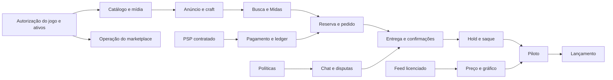

# Backlog e roadmap — Midas Marketplace

Versão: 3.1 · Data-base: 23 de agosto de 2026 · **Status: implementação ativa por gates**

## 1. Regra do roadmap

Este roadmap é orientado por **gates de evidência**, não por datas inventadas. Prazo só pode ser estimado depois de equipe, PSP, fonte de dados, direitos e decisões jurídicas estarem fechados.

Escala: `S` pequeno, `M` médio, `L` grande, `XL` programa/risco elevado. Tamanho não é duração.

## 2. Gates

| Gate | Pergunta | Evidência de saída | Estado inicial |
|---|---|---|---|
| G0 — Direito de operar | O marketplace e os ativos têm autorização? | autorização escrita da Axlebolt, escopo territorial/comercial, transferência, API e licença | **BLOQUEADO / NO-GO** |
| G1 — Dados de mercado | Existe feed permitido? | documentação, contrato, IDs, rate limits e licença de exibição | **BLOQUEADO** |
| G2 — Pagamentos | Existe PSP compatível? | desenho de split/subconta, hold/payout, KYC, solicitação e execução de refund, retry e chargeback | pendente |
| G3 — Políticas | Regras de disputa, reembolso, strike, taxa e seller estão fechadas? | políticas aprovadas e versionadas | pendente |
| G4 — Domínio | Estados, invariantes, APIs, RBAC e composição de UI estão coerentes? | SDD + matriz rastreável `RF-001–300`, `RNF-001–050`, 95 telas, 9 shells, 41 templates, 19 ADRs e revisão sem transição órfã | **PARCIAL: baseline automatizada; 84 telas ainda `CONTRACT_REQUIRED`** |
| G5 — Segurança | Ameaças P0 têm controle e teste? | threat model, ASVS, pentest e DR | pendente |
| G6 — Operação | Staff consegue operar exceções? | runbooks, filas, SLAs, treinamento e piloto | pendente |
| G7 — Piloto | Fluxo real fecha sem divergência? | piloto limitado, reconciliação e métricas | pendente |
| G8 — Lançamento | Produto, jurídico, finanças e segurança aprovam? | sign-off e plano de rollback | pendente |

As fundações, contratos, testes e integrações de homologação podem avançar em paralelo. Publicação de dados/ativos e operação financeira real exigem que a dependência correspondente tenha evidência formal.

### 2.1 Snapshot de execução em 23/08/2026

- **Concluído no corte:** monorepo modular, Podman local saudável, migrations `0001–0006`, identidade/SellerAccount, outbox/audit/IAM base, OpenAPI com 26 operações, finance hold/payout fail-closed, políticas de progressão/planos e landing/viewer 3D.
- **Gates executados:** lint, fronteiras, traceability, typecheck, unitários, integração PostgreSQL, build e 7 E2E desktop/mobile/WebGL.
- **Não concluído:** PSP/banco homologado, destino de saque, order/delivery completo, bilateral reviews, refunds, Growth read models, Studio/pipeline 3D, pós-venda e canais externos.
- **Fonte canônica de estado:** `docs/12-MATRIZ-DE-IMPLEMENTACAO.md`; rota montada sem vertical slice permanece contrato, não função.

Base do bloqueio: [Regras oficiais do jogo](https://help.standoff2.com/pt-BR/articles/8446575-regras-do-jogo), [EULA](https://standoff2.com/en/eula.html) e [Code of Conduct](https://help.standoff2.com/en/articles/15253027-code-of-conduct). A autorização precisa ser expressa; silêncio, endpoint acessível ou site de terceiro não satisfazem G0.

## 3. Dependência principal

## 4. Épicos

### E0 — Autorizações, contratos e políticas · XL

**Resultado:** o produto sabe o que pode vender, exibir e integrar.

- obter autorização escrita da Axlebolt para comércio por dinheiro real, intermediação, dados, API, transferência e assets;
- retirar contas do escopo Standoff 2; para outro jogo, exigir matriz de transferibilidade por publisher;
- contratar/licenciar catálogo e preço;
- escolher modelo do PSP;
- definir moeda, fee, limite, chargeback, saldo negativo e KYC;
- definir idade, seller onboarding, disputa, evidência e SLA;
- definir elegibilidade, janela, valor integral/parcial, autoridade, maker-checker, retry e escalonamento da solicitação de reembolso;
- definir strike, retenção, direitos LGPD e atendimento;
- produzir termos, privacidade e contratos operacionais próprios.

**Aceite:** G0–G3 aprovados, com owner e versão.

### E1 — Fundação de plataforma · XL

**Resultado:** base transacional, auditável e observável.

- repositório, ambientes e CI/CD;
- PostgreSQL, migrações e schemas por contexto;
- outbox/inbox, broker e DLQ;
- IDs, timestamps, dinheiro e convenções de erro;
- configuração tipada/versionada e feature flags;
- audit writer append-only;
- OpenTelemetry, logs redigidos e alertas básicos;
- projeções/read models reconstruíveis para áreas autenticadas, sem criar fonte financeira paralela;
- backup, PITR e primeiro teste de restore.

**Aceite:** evento duplicado é idempotente; audit event nasce junto da ação; restore demonstrado.

### E2 — Identidade, IAM e sessões · L

- cadastro, login e verificação de e-mail;
- senha Argon2id, passkey/WebAuthn, TOTP e recovery codes;
- sessões opacas em cookie seguro e CSRF;
- roles, grants, escopo, expiração e deny;
- step-up, revogação remota e break-glass;
- origem admin isolada e sessão curta.
- área “Minha conta”, visão geral e navegação condicionada às capacidades do usuário (`RF-181–183`).

**Aceite:** matriz BOLA/BFLA passa; staff não entra sem fator forte; privilege change é auditado; usuário vê somente os próprios módulos e a troca manual de URL não amplia acesso.

### E3 — Device Trust e risco v1 · L

- enrollment options e challenge;
- vínculo por chave pública;
- lista/revogação de dispositivo;
- sinais minimizados e score interno;
- decisões `ALLOW`, `CHALLENGE`, `REVIEW`, `DENY`;
- cooling-off após recuperação, MFA ou destino de saque.

**Aceite:** fingerprint isolado nunca autentica; revogação invalida sessões; ação crítica exige assertion.

### E4 — Catálogo, taxonomia e mídia · XL

- itens, versões, tipos, coleções, raridades e atributos;
- stickers e compatibilidade;
- assets com proveniência/licença/hash;
- upload direto, quarentena, MIME, antivírus, re-encode e EXIF;
- importação dry-run/diff;
- desativação sem quebrar histórico;
- fila de aprovação de asset.
- conjuntos de fontes `CatalogAsset` PNG/SVG/multi-view/GLB com lineage, hash, sanitização e política de fidelidade;
- `Model3DJob` e `Model3DArtifact` versionados, sem duplicar `CatalogAsset`.

**Aceite:** nenhum asset sem estado `APPROVED` aparece; importação pode ser revertida logicamente; uma imagem única fica rotulada como draft e nenhum artefato 3D publica automaticamente.

### E5 — Anúncio, craft e moderação · XL

- wizard/rascunho/prévia;
- seleção exclusiva do catálogo;
- `NONE` versus `CRAFT`;
- quatro posições ordenadas;
- preço, descrição, entrega e WhatsApp pós-pago;
- revisions imutáveis;
- fila, claim, checklist, aprovação, ajuste e rejeição;
- segregação de criador/aprovador.

**Aceite:** alterações materiais não sobrescrevem versão; craft inválido nunca é submetido; P2P não publica sozinho.

### E6 — Market, Midas, busca e descoberta · XL

- catálogo público e detalhes;
- canal P2P e canal Midas;
- filtros, sort, favoritos e recentemente vistos;
- perfil/reputação pública;
- índice derivado e tombstone;
- validação canônica de disponibilidade;
- estados vazio/stale/indisponível.
- poster/galeria 2D e ação **Ver em 3D** nos detalhes; a ação navega para a rota individual do item e não monta canvas embutido.

**Aceite:** item vendido some dentro do SLO de projeção; Midas nunca se disfarça de P2P; falha do viewer não bloqueia conteúdo, suporte ou compra.

### E7 — Pricing e gráfico · XL / dependente de G1

- adapter contract;
- mapeamento de instrumento;
- observação, cotação e candle;
- schema, dedupe, outlier e freshness;
- períodos e agregações;
- skin + quatro stickers;
- `asOf`, fonte, stale e fallback manual;
- alertas de feed.

**Aceite:** ausência não vira zero; origem está visível; endpoint não autorizado não existe na configuração.

### E8 — Chat, proposta e anti-PII · XL

- WebSocket/reconexão/sequência;
- salas pré-compra, entrega e suporte;
- proposta/contraproposta com expiração;
- NFKC, zero-width, confusables, padrões e classificador;
- alta/média/baixa confiança;
- strikes, restrição e recurso;
- rate limit, spam e denúncia;
- evidência criptografada e redigida.

**Aceite:** bloqueada não chega; duplicada não duplica; corpus adversarial passa; falso positivo é recorrível.

### E9 — Reserva, pedido e checkout · XL / dependente de G2

- reserva única com TTL;
- pedido com snapshot;
- Idempotency-Key;
- hosted checkout/tokenização;
- webhook raw body, assinatura, inbox e status canônico;
- retries e eventos fora de ordem;
- cancelamento/expiração/retorno à venda.
- consultas paginadas de compras e vendas, detalhe, timeline derivada e casos relacionados (`RF-184–188`, com perspectiva de venda em `RF-190`).

**Aceite:** 100 compradores simultâneos geram um vencedor; redirect não confirma pagamento; 100 webhooks geram um efeito; listagens retornam somente pedidos do ator e a timeline não cria estado paralelo.

### E10 — Ledger, conciliação e PSP · XL

- plano de contas;
- journal/posting balanceado;
- clearing, protegido, held, available e payout in transit;
- refund, dispute reserve e chargeback debt;
- solicitação de reembolso integral/parcial, decisão autorizada, execução e retry idempotentes (`RF-199–200`);
- conciliação realtime/intradiária/diária;
- divergência e caso operacional;
- dashboard financeiro e consultas derivadas para compra, venda e visão geral.

**Aceite:** nenhum lançamento desbalanceia; correção é reversão; settlement report reconcilia; `RefundRequest` não substitui refund financeiro, ticket ou disputa, e nenhuma aprovação edita saldo fora do ledger.

### E11 — Entrega segura, disputa e reputação · XL

- sala pós-pagamento;
- Secure Delivery Vault com envelope encryption;
- reveal auditado/no-store/expiração;
- WhatsApp/Instagram pós-pago por deep link permitido;
- confirmações independentes;
- disputa, evidência, decisão e recurso;
- vínculo ou escalonamento de solicitação de reembolso para a disputa formal, sem duplicar caso ou evidência (`RF-187–188`, `RF-201`);
- avaliação somente pós-conclusão.

**Aceite:** segredo não aparece em log/e-mail/busca/suporte genérico; disputa congela o lote; escalonamento preserva histórico, evidências e identificadores próprios.

### E12 — Hold, saldo de vendas e saque · XL

- balance lots e `eligibleAt`;
- scheduler idempotente;
- freeze e unfreeze;
- saldo administrado pelo PSP, extrato espelho e previsão;
- solicitação, risco, maker-checker e payout;
- falha, retorno e chargeback posterior.
- dashboard do vendedor, lista de vendas, composição do hold e histórico de saques (`RF-189–194`).

**Aceite:** 168h só libera quando todos os gates passam; saldo e hold exibidos coincidem com ledger/PSP; saque nunca usa saldo em hold; duplo clique ou retry não duplica payout.

### E13 — Tickets, caixa de e-mail e notificações · L

- ticket, categoria, SLA, fila e ownership;
- inbound/outbound e threading;
- sanitização, imagem remota bloqueada e anexo em quarentena;
- SPF, DKIM, DMARC, bounce e complaint;
- macros, nota interna e escalonamento;
- notificações internas/transacionais.
- Central de suporte autenticada, categorias mapeadas e vínculo contextual com pedido, venda, saque, reembolso e disputa (`RF-195–198`).

**Aceite:** e-mail vira a thread correta; segredo não é enviado; bounce é recuperável; ticket contextual entra na fila existente, pertence ao usuário e não substitui disputa ou reembolso.

### E14 — Master e operação · XL

- home de filas/alertas;
- IAM e grants;
- catálogo, moderação, confiança, pedido, disputa, suporte e financeiro;
- configuração com preview/diff/rollback lógico;
- kill switches por módulo;
- audit explorer e exportação governada;
- maker-checker e conflitos.
- visão 360° permissionada do caso e ações formais de reembolso, ticket e disputa (`RF-202`).
- entrada do Growth global e suas filas de qualidade, sempre por grants/escopo.

**Aceite:** Master não altera ledger/audit; cada ação sensível mostra impacto e exige step-up; visão 360° mascara dados por permissão e staff sem grant financeiro não decide nem executa reembolso.

### E15 — Recomendação explicável · L

- taxonomia de eventos mínima;
- afinidades por conteúdo/preço;
- candidatos e regras de ranking;
- diversidade, dedupe e seller fairness;
- impressão/posição;
- “por que estou vendo”; opt-out e limpeza.

**Aceite:** perfil desligado para de receber eventos individualizados; itens indisponíveis não entram; CTR não é métrica única.

### E16 — Qualidade, segurança e lançamento · XL

- testes unitários, contrato, integração, E2E e concorrência;
- SAST, SCA, secret scan, DAST, SBOM e imagem assinada;
- revisão ASVS, BOLA/BFLA e pentest;
- carga/soak/chaos controlado;
- DR, rotação de segredo e incidente simulado;
- acessibilidade, responsividade e conteúdo;
- matriz automatizada de `RF-001–300`, `RNF-001–050`, 95 `SCR-ID`, APIs, eventos, estados, testes e owners;
- testes de autorização, concorrência e idempotência para áreas autenticadas, saques e solicitações de reembolso;
- testes de isolamento/replay/paridade Growth e segurança/performance/acessibilidade 3D;
- runbooks, treinamento, piloto e rollback.

**Aceite:** G4–G8 aprovados; nenhum RF, tela, API, evento, estado ou teste órfão.

### E17 — Growth marketplace multi-tenant · XL

- catálogo semântico versionado com grain, fórmula, fonte, moeda, timezone, owner e freshness;
- hierarquia Plataforma → `SellerAccount` → `SellerMembership`/`User` → objeto canônico;
- nove telas: visão geral, funil, tenants, tenant, membros, membro, coortes, interações e oportunidades derivadas;
- `GrowthPlatformBucket`, `GrowthTenantBucket`, funil, coorte, contribuição, timeline e qualidade reconstruíveis;
- intake allowlisted sem PII, dedupe por `eventId`, correção tardia, replay e reconciliação com domínio/ledger;
- RBAC/ABAC por plataforma/tenant/campo, RLS como defesa em profundidade e cache escopado;
- `asOf`, cobertura, revisão e `FRESH|DELAYED|STALE|PARTIAL|RECOMPUTING|NOT_INSTRUMENTED` em toda consulta;
- visão do vendedor limitada ao `SellerAccount` ativo; oportunidades apenas apontam para a ação do domínio proprietário.

**Aceite:** consulta cross-tenant não vaza linha, contagem, ID ou cache; replay não duplica métrica; ausência não vira zero; dashboard não executa comando; agregado financeiro reconcilia com PSP/ledger.

### E18 — Pipeline 2D→3D e experiência Three.js · XL

- upload direto e conjunto de fontes `CatalogAsset` para PNG/JPEG/WebP, SVG rasterizado em sandbox, multi-view e GLB/GLTF;
- fila GPU isolada, cotas por tenant, idempotência, cancelamento, retry e adapter de provider benchmarkado;
- TRELLIS.2/Hunyuan3D ou fornecedor aprovado escolhido por benchmark de fidelidade, custo, tempo e licença;
- pós-processamento reproduzível, PBR, glTF Transform, Khronos Validator, hashes, manifesto e budgets mobile/desktop;
- revisão lado a lado, segregação quando exigida, decisão auditada, publicação imutável e rollback por ponteiro;
- `SCR-PUB-013` em `/itens/:slug/3d`, com um item/arma e um `Model3DArtifact` ativo por tela, um canvas WebGL e deep link compartilhável;
- seleção em card/item/anúncio navega para o slug; **Voltar** restaura a origem e trocar/sair descarta cena, geometria, materiais, texturas, RAF, observers e listeners;
- abertura premium Three.js/R3F finita de 650–900 ms, interrompida pelo primeiro input e pulada por `prefers-reduced-motion`; depois ficam rotação, zoom, vistas, reset e tela cheia;
- React Bits restrito ao shell DOM; viewer lazy, poster 2D, fallback WebGL, context-loss e liberação de recursos;
- runbooks de provider, job preso, input hostil, regressão de fidelidade, purge e WebGL.

**Cobertura:** `RF-212–224` e `RNF-036–038`.

**Aceite:** um ativo real percorre upload → job → geração → validação → revisão → publicação → rota individual → viewer → rollback; cada slug exibe apenas seu artefato ativo; nunca coexistem dois canvases; intro finita, interrupção, reduced motion, descarte e fallback 2D passam em E2E; single-view nunca é chamado de exato; job repetido não duplica; arquivo hostil não sai do sandbox; compra permanece funcional sem 3D.

### E19 — Operação financeira, reputação, progressão e planos · XL

- `PaymentResolutionCase` com evidência, provider lookup, maker-checker e convergência no settlement canônico;
- `BalanceLot`/`Hold` ancorado em `Payment.settledAt + 168h`, com conclusão e risco como gates;
- fila admin de `PayoutRequest`, `PayoutAttempt`, `PayoutEvidence`, falha/retorno/retry e baixa manual comprovável;
- `OrderReview` bilateral 0–5, resposta, denúncia, moderação, recurso e `ReputationProjection` reconstruível;
- `ProgressionContribution`, `AccountLevelDefinition/Assignment`, níveis 1–10 e compensação de refund/chargeback;
- `BadgeDefinition/Award`, `RewardDefinition/Award` e editor Master de slots/arte/licença/fulfillment;
- `LeaderboardSeason/Contribution/Projection/Award`, fórmula mensal congelada, top 3 e desempate;
- `ListingPlanPolicyVersion` e `ListingCommercialSnapshot` para Básico 7,5%, VIP 10% e Premium 12%, prioridade/SLA e badge de dez vendas.

**Cobertura:** `RF-225–255`, ADR-014/015/018 e `SCR-PUB-014/015`, `SCR-ACC-015/016`, `SCR-ADM-016`, `SCR-MST-006/007`.

**Aceite:** sandbox/reconciliação real; 100 retries não duplicam efeito; bordas de 168h e níveis passam; nota zero não vira ausência; refund compensa sem apagar fato; ranking fechado é imutável; prioridade paga não altera mérito de refund/risco; capability PSP não homologada permanece bloqueada.

### E20 — Carrinho, lifecycle e pós-venda omnicanal · XL

- `Cart`, `CartLine` e `CheckoutGroup` com revalidação e pedidos independentes por seller/moeda/capability;
- `ProductLifecyclePolicy` e `ReturnPolicySnapshot` separados; expiração, renovação, recompra e supressão por compra/disputa;
- `CatalogItemRelation` para complemento/upsell/renewal, sem auto-add ou preselection;
- `SellerCustomerInsight` e painel do seller com coortes/recompra sem telefone/WhatsApp bruto;
- `ContactPoint`, `ConsentRecord`, `SuppressionEntry`, preferências, quiet hours, frequency cap e kill switch;
- `Campaign/Version`, `Journey/Version`, `MessageTemplate`, `CreativeAsset`, `Dispatch`, `DeliveryAttempt` e `ChannelEvent`;
- adapters oficiais WhatsApp/Instagram por capability real; Instagram somente conversa iniciada pelo usuário;
- `Coupon/Redemption`, afiliado, links opacos, `AttributionTouch/Snapshot` e comissão reversível sobre conversão reconciliada;
- PostgreSQL/outbox como fonte de schedules; Redis/Valkey somente cache, rate limit, lock curto e dedupe acelerador.

**Cobertura:** `RF-256–282`, ADR-016 e `SCR-BUY-012`, `SCR-SEL-015/016`, `SCR-ADM-017`, `SCR-MST-008`.

**Aceite:** partição multivendedor; opt-out em corrida suprime; cross-tenant/PII negativos; conta Meta dev real; replay não duplica; cupom concorrente respeita limite; refund reverte attribution/commission; nenhum canal usa função mockada.

### E21 — Studio e catálogo 2D/3D compartilhado · XL

- `CatalogLibrary` projetada sobre `CatalogItem`, `CatalogAsset` e `Model3DArtifact` publicados;
- seleção do seller inicia o mesmo `Listing`/`ListingRevision` com campos governados pré-preenchidos;
- `CatalogSubmission` para propor item/asset/relação, com claim, evidência, licença, comentário e decisão;
- taxonomia `verticalCode/categoryNodeId/productClassCode`, lifecycle e return policy separados;
- ingestão 2D como primeira classe e pipeline 3D da E18 apenas quando solicitado/elegível;
- painel admin Studio para merge/vínculo, revisão, job, publicação/tombstone e auditoria;
- provenance, MIME/malware/SVG, storage/CDN, quotas, retenção e direitos de asset.

**Cobertura:** `RF-283–292`, ADR-017 e `SCR-SEL-017`, `SCR-ADM-018`, integrados à E4/E5/E18.

**Aceite:** Studio e wizard criam o mesmo anúncio; submissão pendente não vaza; 2D vende sem 3D; GLB publicado é real/revisado; merge não duplica identidade; relação nunca adiciona item sozinha.

### E22 — SEO, mercados globais, conteúdo e atribuição técnica · L

- `MarketPolicy` por locale/território/moeda de exibição/PSP/termos/disponibilidade/indexação;
- SSR/prerender de HTML útil, poster/fallback 2D e progressive enhancement para WebGL;
- canonical, hreflang, redirects/status, `robots.txt`, sitemaps e `CrawlPolicy` derivados da publicação;
- JSON-LD factual de Organization/Breadcrumb/Product/Offer/Review quando elegível;
- exclusão de conta, carrinho, checkout, admin/master, busca interna, preview e crawl traps;
- conteúdo people-first, taxonomia/slug governance, Search Console/crawl logs/Core Web Vitals;
- política separada para search bots e training bots, editável/auditável pelo Master;
- locale/currency/fallback, links opacos, UTM e attribution sem PII na URL.

**Cobertura:** `RF-293–300`, ADR-019 e todas as superfícies públicas indexáveis.

**Aceite:** HTML sem JS é útil; matriz index/noindex e sitemap não vazam privado/draft; canonical/hreflang/status passam; schema corresponde ao DOM; 3D falho não elimina conteúdo; política de crawler possui diff/approval/rollback.

## 5. Releases recomendadas

### Release 0 — Provas, protótipos e contratos

Sem transação real. Entregas:

- design system e protótipos de jornada;
- modelo de domínio validado;
- sandbox PSP;
- prova de feed licenciado;
- catálogo somente com ativos autorizados;
- threat model e políticas.
- benchmark offline de 3D e contrato Growth com eventos reais de homologação, sem endpoint simulado.
- matriz de capabilities PSP/Meta por território, policy versions de níveis/planos/lifecycle e POCs open source com licença/isolamento.

### Release 1 — Piloto fechado

- poucos vendedores aprovados;
- um método de pagamento;
- limites de valor/volume;
- moderação 100% manual;
- recomendação por regra;
- saque com revisão manual e dupla aprovação;
- área autenticada, compras/vendas, saldo de vendas e suporte contextual alimentados por integrações reais de homologação e dados rastreáveis;
- Growth com eventos de homologação, reconciliação e isolamento verificados;
- import GLB aprovado + viewer 3D com fallback 2D;
- payment resolution e payout manual em processo real homologado, com evidência e reconciliação;
- avaliações, níveis e planos em tenant allowlist, sem prêmio financeiro automático;
- observação intensiva e suporte humano.

### Release 2 — MVP público controlado

- P2P + Midas;
- catálogo, craft, preço e gráfico autorizados;
- chat/proposta/anti-PII;
- pagamento, entrega, disputa, hold e saque;
- “Minha conta”, histórico de compras/vendas, dashboard do vendedor, saldo de vendas, solicitação de reembolso e suporte contextual;
- Master/ADM, visão 360°, tickets, e-mail e auditoria;
- device trust v1.
- nove telas Growth no escopo autorizado;
- pipeline multi-view 3D revisado, se o benchmark e a capacidade de GPU/provider passarem.
- carrinho multivendedor, lifecycle, Studio 2D/3D, reputação, ranking e painéis Master versionados;
- SEO técnico/SSR/crawl policy para superfícies públicas do território piloto.

### Release 3 — Eficiência operacional

- importação robusta;
- risco/reconciliação avançados;
- automação assistida de moderação;
- recommendation experiments;
- seller health e capacity planning.
- coortes, qualidade/replay Growth e otimização de budgets 3D.
- pós-venda inbox/e-mail, depois WhatsApp em conta homologada; campanhas, cupons, afiliados e atribuição reconciliada;
- curadoria/catalog submissions e automação assistida do Studio, mantendo revisão humana.

### Release 4 — Expansão condicionada

- contas somente em jogos cujos termos e autorização escrita permitam transferência;
- mais PSPs/moedas/regiões;
- alertas/portfólio/PWA;
- Instagram para reply/inbox dentro das capabilities oficiais;
- promoções rotuladas, programa de fidelidade e expansão de locale/market após gates fiscal/jurídico.

## 6. Priorização do MVP

### Must

- direitos e PSP aprovados;
- identidade/fator forte/IAM/audit;
- catálogo/asset provenance;
- anúncio/craft/revisão;
- P2P/Midas/busca;
- preço com frescor ou fallback explicitamente manual;
- chat/proposta/anti-PII/recurso;
- reserva/pedido/webhook/ledger;
- entrega/cofre/confirmações/disputa;
- hold/saldo de vendas/saque;
- “Minha conta”, compras/vendas detalhadas e dashboard do vendedor;
- tickets/inbox, suporte contextual e solicitação de reembolso;
- visão 360° permissionada da staff;
- Growth multi-tenant com visão plataforma/vendedor, funil, freshness e drill-down;
- pipeline de ativo 3D revisado e `SCR-PUB-013` individual com um canvas, entrada finita e fallback 2D;
- payment resolution, hold exato, baixa de saque comprovada e reconciliação;
- avaliações bilaterais, níveis/insígnias/rewards, leaderboard e planos versionados;
- carrinho multivendedor, lifecycle, Studio compartilhado 2D/3D e taxonomia/relações;
- consentimento/supressão, pós-venda inbox e contratos de canais sem função simulada;
- SEO/SSR, canonical, sitemap, robots e market policy do território piloto;
- operação/observabilidade/backup.

### Should

- favoritos, vistos recentemente e alertas;
- recomendação explicável;
- seller reputation rica;
- importação em lote avançada;
- anexos moderados na entrega;
- WhatsApp Cloud API, campanhas/cupons/afiliados após verificação e piloto;
- insights de recompra/renovação e attribution reconciliada.
- benchmark/coortes avançados Growth e automação assistida da revisão 3D, sempre com decisão humana final.

### Could

- múltiplos PSPs;
- push/PWA avançada;
- alertas de preço;
- ML colaborativo;
- automação de moderação com decisão humana final;
- Instagram reply/inbox e múltiplos mercados/locales após capability e compliance.

### Won’t now

- conta sem autorização;
- crypto, crédito ou custódia própria;
- endpoint privado de mercado;
- asset sem licença;
- cold DM no Instagram, lista/exportação de WhatsApp do comprador e campanha sem consentimento;
- marketplace internacional **antes** de política, PSP, fiscal, consumidor e conteúdo aprovados por território.

## 7. Definition of Ready

Uma história entra em desenvolvimento quando:

- tem ator, problema e resultado;
- requisito/estado afetado está identificado;
- critérios de aceite e erros existem;
- dependências e classificação de dados estão definidas;
- autorização e feature flag estão claras;
- UX desktop/mobile e acessibilidade estão especificadas;
- evento, auditoria e métricas foram decididos;
- tela `SCR-ID`, contrato real de dados/comando e fallback estão ligados na matriz;
- threat case foi avaliado;
- nenhuma questão G0–G3 está sendo assumida como resolvida.

## 8. Definition of Done

- aceite funcional automatizado ou demonstrado;
- autorização por objeto/campo testada;
- idempotência e concorrência testadas quando aplicável;
- logs redigidos, telemetria e alertas;
- migração reversível ou forward-fix ensaiado;
- acessibilidade e viewports obrigatórios revisados;
- documentação/API/eventos atualizados;
- rastreabilidade automatizada atualizada até `RF-300`, `RNF-050` e os 95 `SCR-ID`;
- dashboards e read models reconciliáveis, reconstruíveis e nunca usados como fonte de autorização financeira;
- componente React Bits registrado, encapsulado e testado quando utilizado; fluxo crítico funciona sem motion;
- `Model3DArtifact` guarda lineage/hash/relatório e a rota individual cumpre canvas único, intro interrompível, descarte, budget, acessibilidade e fallback;
- runbook e rollback;
- revisão independente para auth, financeiro e segredo;
- nenhum P0/P1 aberto sem aceite formal.

## 9. Estratégia de testes

| Camada | Cobertura principal |
|---|---|
| Unitário | invariantes, regras, reputação, níveis/leaderboard, fees, lifecycle, cupom, atribuição, cálculo de hold e transições de `RefundRequest` |
| Property-based | ledger balanceado, transições válidas, money/gold |
| Contrato | PSP, Meta, feed, e-mail, storage/CDN, eventos, OpenAPI e policy schemas |
| Integração | Postgres/outbox/inbox, Redis/Valkey descartável, KMS, storage, busca, ledger→dashboard, journeys e casos relacionados |
| Concorrência | reserva, webhook×staff, confirmação, release, saque, refund, cupom, award, dispatch e fechamento de season |
| E2E | Studio→anúncio→aprovar→carrinho→pagar→entregar→avaliar→hold→sacar e abandono→consentimento→campanha→conversão/reversão |
| Segurança | BOLA/BFLA, CSRF, XSS, SSRF, replay, upload, segredo, visão 360° e ações financeiras de staff |
| Adversarial | PII ofuscada, spam, seller gaming e preço anômalo |
| Acessibilidade | teclado, leitor, foco, contraste, zoom e reduced motion |
| Resiliência | timeout, provedor fora, evento fora de ordem, DLQ e restore |
| Operação | runbook de disputa, divergência, banimento e incidente |

## 10. Casos de teste P0

1. Cem webhooks iguais geram um lançamento.
2. Cem compras simultâneas geram uma reserva/pedido vencedor.
3. Mesmo saque com timeout não paga duas vezes.
4. Estranho não lê compra, venda, sala, ticket, saque, reembolso, disputa ou contexto 360° alheio.
5. Staff não concede permissão que não possui.
6. Proponente não aprova a própria ação financeira.
7. Segredo não aparece em logs, e-mail, busca, analytics ou backup de suporte.
8. Mensagem PII ofuscada é normalizada antes da decisão.
9. Pico anômalo não vira cotação atual sem quality gate.
10. Feed e e-mail fora não corrompem pedido.
11. Restore reproduz pedidos/ledger dentro do RPO.
12. Kill switch pausa apenas o módulo afetado.
13. Webhook liquidado após TTL/cancelamento entra em quarentena e nunca abre entrega para unidade já liberada.
14. Liquidação tardia só reassume a unidade com compare-and-set válido; caso contrário, produz reembolso idempotente.
15. Saque `FAILED` ou `RETURNED` reconcilia, reverte o trânsito e oferece revisão/retry sem duplicar pagamento.
16. Duplo clique ou retry não cria duas solicitações de reembolso equivalentes.
17. Decisões concorrentes não aprovam valor superior ao reembolsável nem executam dois comandos financeiros.
18. Aprovação parcial, execução e retry preservam pedido, ticket, disputa, auditoria e lançamentos formais do ledger.
19. Dashboard ou read model desatualizado nunca autoriza saque ou reembolso; a confirmação consulta a fonte financeira canônica.
20. Ticket contextual mantém identificador próprio e não substitui `RefundRequest` nem disputa formal.
21. Selecionar itens A e B resolve `/itens/a/3d` e `/itens/b/3d` para os respectivos `Model3DArtifact`; trocar ou voltar nunca mantém dois canvases nem recursos do artefato anterior.
22. A abertura 3D termina entre 650 e 900 ms; pointer, toque, roda, tecla ou vista canônica a interrompe imediatamente; reduced motion apresenta a pose final sem deslocamento.
23. WebGL indisponível, context loss ou falha do GLB mantém poster/galeria 2D, identidade do item, navegação de volta e ações comerciais.
24. Caso manual e webhook concorrentes resultam em um `Payment.SETTLED`, um journal, um lote e um hold.
25. `Payment.settledAt + 168h` libera somente quando conclusão e gates estiverem válidos; nenhum relógio reinicia.
26. Baixa sem referência/evidência é rejeitada; referência repetida não duplica `PayoutAttempt` pago.
27. Nota zero é persistida, estranho/self-review falham e rebuild de reputação é determinístico.
28. Refund/chargeback compensa nível/leaderboard e temporada encerrada/top 3 não muda.
29. Fees 7,5%/10%/12% usam inteiro/basis points; plano novo não reprecifica pedido antigo.
30. Carrinho com dois sellers cria grupos/pedidos separados; falha em um não liquida o outro.
31. Opt-out concorrente suprime dispatch; seller não lê/exporta contato bruto nem audiência alheia.
32. WhatsApp/Instagram sem capability/opt-in/template/conversa permitida falha fechado, sem adapter fake.
33. Cupom sob concorrência respeita limites; attribution/commission só nasce de settlement e é revertida no refund.
34. `CatalogSubmission` pendente não entra em biblioteca/busca; Studio e wizard iniciam o mesmo `Listing`.
35. `robots.txt`, sitemap, canonical, hreflang e JSON-LD não expõem draft/privado nem divergem do estado publicado.

## 11. RACI mínimo

| Decisão | Accountable | Responsible | Consulted |
|---|---|---|---|
| Direito de operar/ativos | Direção Midas | Jurídico/licenciamento | Produto, publicador |
| PSP/modelo financeiro | Direção/Financeiro | Financeiro + Engenharia | Jurídico, contador, PSP |
| Política de disputa | Operações | Trust & Safety | Jurídico, suporte, financeiro |
| Catálogo/preço | Produto | Catálogo/Pricing | Licenciante, engenharia |
| IAM e segurança | Segurança | Engenharia | Master, privacidade |
| Privacidade e direitos | DPO/Encarregado | Privacidade + Produto | Segurança, Jurídico, Suporte |
| Fiscal, comissão e documentos | Direção/Financeiro | Fiscal/Contábil | Jurídico, PSP, Produto |
| Fraude e modelos de risco | Operações | Risk/Fraud + Trust & Safety | DPO, Segurança, Suporte |
| Design e conteúdo | Produto | Design | Suporte, acessibilidade |
| Pós-venda e canais Meta | Marketing/Produto | CRM/Lifecycle + Engenharia | DPO, Segurança, Suporte, Meta |
| Níveis, rewards, ranking e planos | Produto/Financeiro | Produto + Dados + Engenharia | Jurídico, Trust & Safety, Design |
| Studio e assets 2D/3D | Produto/Catálogo | Curadoria + 3D + Engenharia | Jurídico/licenças, Segurança, vendedores |
| SEO, mercados e crawlers | Produto/Growth | SEO/Conteúdo + Engenharia | Legal, Fiscal, DPO, Internacionalização |
| Go-live | Direção | Release manager | todos os owners de gate |

## 12. Próxima ação autorizada

Com a fundação e os primeiros cortes verticais executados, a próxima sequência técnica é: fechar `Order/Delivery` canônicos; persistir reviews/reputação e progressão; implementar refund separado de disputa; construir os read models Growth; depois conectar Studio e pós-venda consentido. PSP, payout externo, Meta/WhatsApp e qualquer publicação comercial continuam fail-closed até contrato, credencial e homologação. Enquanto G0/G1 e fornecedores não forem aprovados, assets sem direito, endpoint não oficial, disparo real e lançamento comercial permanecem fora de escopo.
