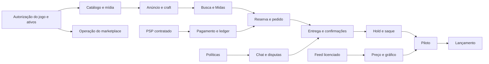

# Backlog e roadmap — Midas Marketplace

## 1. Regra do roadmap

Este roadmap é orientado por **gates de evidência**, não por datas inventadas. Prazo só pode ser estimado depois de equipe, PSP, fonte de dados, direitos e decisões jurídicas estarem fechados.

Escala: `S` pequeno, `M` médio, `L` grande, `XL` programa/risco elevado. Tamanho não é duração.

## 2. Gates

| Gate | Pergunta | Evidência de saída | Estado inicial |
|---|---|---|---|
| G0 — Direito de operar | O marketplace e os ativos têm autorização? | autorização escrita da Axlebolt, escopo territorial/comercial, transferência, API e licença | **BLOQUEADO / NO-GO** |
| G1 — Dados de mercado | Existe feed permitido? | documentação, contrato, IDs, rate limits e licença de exibição | **BLOQUEADO** |
| G2 — Pagamentos | Existe PSP compatível? | desenho de split/subconta, hold/payout, KYC, refund e chargeback | pendente |
| G3 — Políticas | Regras de disputa, strike, taxa e seller estão fechadas? | políticas aprovadas e versionadas | pendente |
| G4 — Domínio | Estados, invariantes, APIs e RBAC estão coerentes? | matriz rastreável + revisão sem transição órfã, incluindo liquidação tardia | **em correção/revisão** |
| G5 — Segurança | Ameaças P0 têm controle e teste? | threat model, ASVS, pentest e DR | pendente |
| G6 — Operação | Staff consegue operar exceções? | runbooks, filas, SLAs, treinamento e piloto | pendente |
| G7 — Piloto | Fluxo real fecha sem divergência? | piloto limitado, reconciliação e métricas | pendente |
| G8 — Lançamento | Produto, jurídico, finanças e segurança aprovam? | sign-off e plano de rollback | pendente |

Nenhum desenvolvimento comercial de integração ou ingestão de assets deve ultrapassar G0/G1 sem decisão formal.

Base do bloqueio: [Regras oficiais do jogo](https://help.standoff2.com/pt-BR/articles/8446575-regras-do-jogo), [EULA](https://standoff2.com/en/eula.html) e [Code of Conduct](https://help.standoff2.com/en/articles/15253027-code-of-conduct). A autorização precisa ser expressa; silêncio, endpoint acessível ou site de terceiro não satisfazem G0.

## 3. Dependência principal

## 4. Épicos

### E0 — Autorizações, contratos e políticas · XL

**Resultado:** o produto sabe o que pode vender, exibir e integrar.

- obter autorização escrita da Axlebolt para comércio por dinheiro real, intermediação, dados, API, transferência e assets;
- retirar contas do escopo Standoff 2; para outro jogo, exigir matriz de transferibilidade por publisher;
- contratar/licenciar catálogo e preço;
- escolher modelo do PSP;
- definir moeda, fee, limite, chargeback, saldo negativo e KYC;
- definir idade, seller onboarding, disputa, evidência e SLA;
- definir strike, retenção, direitos LGPD e atendimento;
- produzir termos, privacidade e contratos operacionais próprios.

**Aceite:** G0–G3 aprovados, com owner e versão.

### E1 — Fundação de plataforma · XL

**Resultado:** base transacional, auditável e observável.

- repositório, ambientes e CI/CD;
- PostgreSQL, migrações e schemas por contexto;
- outbox/inbox, broker e DLQ;
- IDs, timestamps, dinheiro e convenções de erro;
- configuração tipada/versionada e feature flags;
- audit writer append-only;
- OpenTelemetry, logs redigidos e alertas básicos;
- backup, PITR e primeiro teste de restore.

**Aceite:** evento duplicado é idempotente; audit event nasce junto da ação; restore demonstrado.

### E2 — Identidade, IAM e sessões · L

- cadastro, login e verificação de e-mail;
- senha Argon2id, passkey/WebAuthn, TOTP e recovery codes;
- sessões opacas em cookie seguro e CSRF;
- roles, grants, escopo, expiração e deny;
- step-up, revogação remota e break-glass;
- origem admin isolada e sessão curta.

**Aceite:** matriz BOLA/BFLA passa; staff não entra sem fator forte; privilege change é auditado.

### E3 — Device Trust e risco v1 · L

- enrollment options e challenge;
- vínculo por chave pública;
- lista/revogação de dispositivo;
- sinais minimizados e score interno;
- decisões `ALLOW`, `CHALLENGE`, `REVIEW`, `DENY`;
- cooling-off após recuperação, MFA ou destino de saque.

**Aceite:** fingerprint isolado nunca autentica; revogação invalida sessões; ação crítica exige assertion.

### E4 — Catálogo, taxonomia e mídia · XL

- itens, versões, tipos, coleções, raridades e atributos;
- stickers e compatibilidade;
- assets com proveniência/licença/hash;
- upload direto, quarentena, MIME, antivírus, re-encode e EXIF;
- importação dry-run/diff;
- desativação sem quebrar histórico;
- fila de aprovação de asset.

**Aceite:** nenhum asset sem estado `APPROVED` aparece; importação pode ser revertida logicamente.

### E5 — Anúncio, craft e moderação · XL

- wizard/rascunho/prévia;
- seleção exclusiva do catálogo;
- `NONE` versus `CRAFT`;
- quatro posições ordenadas;
- preço, descrição, entrega e WhatsApp pós-pago;
- revisions imutáveis;
- fila, claim, checklist, aprovação, ajuste e rejeição;
- segregação de criador/aprovador.

**Aceite:** alterações materiais não sobrescrevem versão; craft inválido nunca é submetido; P2P não publica sozinho.

### E6 — Market, Midas, busca e descoberta · XL

- catálogo público e detalhes;
- canal P2P e canal Midas;
- filtros, sort, favoritos e recentemente vistos;
- perfil/reputação pública;
- índice derivado e tombstone;
- validação canônica de disponibilidade;
- estados vazio/stale/indisponível.

**Aceite:** item vendido some dentro do SLO de projeção; Midas nunca se disfarça de P2P.

### E7 — Pricing e gráfico · XL / dependente de G1

- adapter contract;
- mapeamento de instrumento;
- observação, cotação e candle;
- schema, dedupe, outlier e freshness;
- períodos e agregações;
- skin + quatro stickers;
- `asOf`, fonte, stale e fallback manual;
- alertas de feed.

**Aceite:** ausência não vira zero; origem está visível; endpoint não autorizado não existe na configuração.

### E8 — Chat, proposta e anti-PII · XL

- WebSocket/reconexão/sequência;
- salas pré-compra, entrega e suporte;
- proposta/contraproposta com expiração;
- NFKC, zero-width, confusables, padrões e classificador;
- alta/média/baixa confiança;
- strikes, restrição e recurso;
- rate limit, spam e denúncia;
- evidência criptografada e redigida.

**Aceite:** bloqueada não chega; duplicada não duplica; corpus adversarial passa; falso positivo é recorrível.

### E9 — Reserva, pedido e checkout · XL / dependente de G2

- reserva única com TTL;
- pedido com snapshot;
- Idempotency-Key;
- hosted checkout/tokenização;
- webhook raw body, assinatura, inbox e status canônico;
- retries e eventos fora de ordem;
- cancelamento/expiração/retorno à venda.

**Aceite:** 100 compradores simultâneos geram um vencedor; redirect não confirma pagamento; 100 webhooks geram um efeito.

### E10 — Ledger, conciliação e PSP · XL

- plano de contas;
- journal/posting balanceado;
- clearing, protegido, held, available e payout in transit;
- refund, dispute reserve e chargeback debt;
- conciliação realtime/intradiária/diária;
- divergência e caso operacional;
- dashboard financeiro.

**Aceite:** nenhum lançamento desbalanceia; correção é reversão; settlement report reconcilia.

### E11 — Entrega segura, disputa e reputação · XL

- sala pós-pagamento;
- Secure Delivery Vault com envelope encryption;
- reveal auditado/no-store/expiração;
- WhatsApp/Instagram pós-pago por deep link permitido;
- confirmações independentes;
- disputa, evidência, decisão e recurso;
- avaliação somente pós-conclusão.

**Aceite:** segredo não aparece em log/e-mail/busca/suporte genérico; disputa congela o lote.

### E12 — Hold, saldo de vendas e saque · XL

- balance lots e `eligibleAt`;
- scheduler idempotente;
- freeze e unfreeze;
- saldo administrado pelo PSP, extrato espelho e previsão;
- solicitação, risco, maker-checker e payout;
- falha, retorno e chargeback posterior.

**Aceite:** 168h só libera quando todos os gates passam; saque nunca usa saldo em hold; retry não duplica payout.

### E13 — Tickets, caixa de e-mail e notificações · L

- ticket, categoria, SLA, fila e ownership;
- inbound/outbound e threading;
- sanitização, imagem remota bloqueada e anexo em quarentena;
- SPF, DKIM, DMARC, bounce e complaint;
- macros, nota interna e escalonamento;
- notificações internas/transacionais.

**Aceite:** e-mail vira a thread correta; segredo não é enviado; bounce é recuperável.

### E14 — Master e operação · XL

- home de filas/alertas;
- IAM e grants;
- catálogo, moderação, confiança, pedido, disputa, suporte e financeiro;
- configuração com preview/diff/rollback lógico;
- kill switches por módulo;
- audit explorer e exportação governada;
- maker-checker e conflitos.

**Aceite:** Master não altera ledger/audit; cada ação sensível mostra impacto e exige step-up.

### E15 — Recomendação explicável · L

- taxonomia de eventos mínima;
- afinidades por conteúdo/preço;
- candidatos e regras de ranking;
- diversidade, dedupe e seller fairness;
- impressão/posição;
- “por que estou vendo”; opt-out e limpeza.

**Aceite:** perfil desligado para de receber eventos individualizados; itens indisponíveis não entram; CTR não é métrica única.

### E16 — Qualidade, segurança e lançamento · XL

- testes unitários, contrato, integração, E2E e concorrência;
- SAST, SCA, secret scan, DAST, SBOM e imagem assinada;
- revisão ASVS, BOLA/BFLA e pentest;
- carga/soak/chaos controlado;
- DR, rotação de segredo e incidente simulado;
- acessibilidade, responsividade e conteúdo;
- runbooks, treinamento, piloto e rollback.

**Aceite:** G5–G8 aprovados.

## 5. Releases recomendadas

### Release 0 — Provas, protótipos e contratos

Sem transação real. Entregas:

- design system e protótipos de jornada;
- modelo de domínio validado;
- sandbox PSP;
- prova de feed licenciado;
- catálogo somente com ativos autorizados;
- threat model e políticas.

### Release 1 — Piloto fechado

- poucos vendedores aprovados;
- um método de pagamento;
- limites de valor/volume;
- moderação 100% manual;
- recomendação por regra;
- saque com revisão manual e dupla aprovação;
- observação intensiva e suporte humano.

### Release 2 — MVP público controlado

- P2P + Midas;
- catálogo, craft, preço e gráfico autorizados;
- chat/proposta/anti-PII;
- pagamento, entrega, disputa, hold e saque;
- Master/ADM, tickets, e-mail e auditoria;
- device trust v1.

### Release 3 — Eficiência operacional

- importação robusta;
- risco/reconciliação avançados;
- automação assistida de moderação;
- recommendation experiments;
- seller health e capacity planning.

### Release 4 — Expansão condicionada

- contas somente em jogos cujos termos e autorização escrita permitam transferência;
- mais PSPs/moedas/regiões;
- alertas/portfólio/PWA;
- promoções rotuladas e programa de fidelidade.

## 6. Priorização do MVP

### Must

- direitos e PSP aprovados;
- identidade/fator forte/IAM/audit;
- catálogo/asset provenance;
- anúncio/craft/revisão;
- P2P/Midas/busca;
- preço com frescor ou fallback explicitamente manual;
- chat/proposta/anti-PII/recurso;
- reserva/pedido/webhook/ledger;
- entrega/cofre/confirmações/disputa;
- hold/saldo de vendas/saque;
- tickets/inbox;
- operação/observabilidade/backup.

### Should

- favoritos, vistos recentemente e alertas;
- recomendação explicável;
- seller reputation rica;
- importação em lote avançada;
- anexos moderados na entrega.

### Could

- múltiplos PSPs;
- push/PWA avançada;
- alertas de preço;
- ML colaborativo;
- automação de moderação com decisão humana final.

### Won’t now

- conta sem autorização;
- carrinho multivendedor;
- crypto, crédito ou custódia própria;
- endpoint privado de mercado;
- asset sem licença;
- marketplace internacional antes de política por território.

## 7. Definition of Ready

Uma história entra em desenvolvimento quando:

- tem ator, problema e resultado;
- requisito/estado afetado está identificado;
- critérios de aceite e erros existem;
- dependências e classificação de dados estão definidas;
- autorização e feature flag estão claras;
- UX desktop/mobile e acessibilidade estão especificadas;
- evento, auditoria e métricas foram decididos;
- threat case foi avaliado;
- nenhuma questão G0–G3 está sendo assumida como resolvida.

## 8. Definition of Done

- aceite funcional automatizado ou demonstrado;
- autorização por objeto/campo testada;
- idempotência e concorrência testadas quando aplicável;
- logs redigidos, telemetria e alertas;
- migração reversível ou forward-fix ensaiado;
- acessibilidade e viewports obrigatórios revisados;
- documentação/API/eventos atualizados;
- runbook e rollback;
- revisão independente para auth, financeiro e segredo;
- nenhum P0/P1 aberto sem aceite formal.

## 9. Estratégia de testes

| Camada | Cobertura principal |
|---|---|
| Unitário | invariantes, regras, detector, ranking, cálculo de hold |
| Property-based | ledger balanceado, transições válidas, money/gold |
| Contrato | PSP, feed, e-mail, eventos e OpenAPI |
| Integração | Postgres/outbox/inbox, KMS, storage e busca |
| Concorrência | reserva, webhook, confirmação, release e saque |
| E2E | anunciar→aprovar→negociar→pagar→entregar→liberar→sacar |
| Segurança | BOLA/BFLA, CSRF, XSS, SSRF, replay, upload e segredo |
| Adversarial | PII ofuscada, spam, seller gaming e preço anômalo |
| Acessibilidade | teclado, leitor, foco, contraste, zoom e reduced motion |
| Resiliência | timeout, provedor fora, evento fora de ordem, DLQ e restore |
| Operação | runbook de disputa, divergência, banimento e incidente |

## 10. Casos de teste P0

1. Cem webhooks iguais geram um lançamento.
2. Cem compras simultâneas geram uma reserva/pedido vencedor.
3. Mesmo saque com timeout não paga duas vezes.
4. Estranho não lê pedido, sala ou ticket alheio.
5. Staff não concede permissão que não possui.
6. Proponente não aprova a própria ação financeira.
7. Segredo não aparece em logs, e-mail, busca, analytics ou backup de suporte.
8. Mensagem PII ofuscada é normalizada antes da decisão.
9. Pico anômalo não vira cotação atual sem quality gate.
10. Feed e e-mail fora não corrompem pedido.
11. Restore reproduz pedidos/ledger dentro do RPO.
12. Kill switch pausa apenas o módulo afetado.
13. Webhook liquidado após TTL/cancelamento entra em quarentena e nunca abre entrega para unidade já liberada.
14. Liquidação tardia só reassume a unidade com compare-and-set válido; caso contrário, produz reembolso idempotente.
15. Saque `FAILED` ou `RETURNED` reconcilia, reverte o trânsito e oferece revisão/retry sem duplicar pagamento.

## 11. RACI mínimo

| Decisão | Accountable | Responsible | Consulted |
|---|---|---|---|
| Direito de operar/ativos | Direção Midas | Jurídico/licenciamento | Produto, publicador |
| PSP/modelo financeiro | Direção/Financeiro | Financeiro + Engenharia | Jurídico, contador, PSP |
| Política de disputa | Operações | Trust & Safety | Jurídico, suporte, financeiro |
| Catálogo/preço | Produto | Catálogo/Pricing | Licenciante, engenharia |
| IAM e segurança | Segurança | Engenharia | Master, privacidade |
| Privacidade e direitos | DPO/Encarregado | Privacidade + Produto | Segurança, Jurídico, Suporte |
| Fiscal, comissão e documentos | Direção/Financeiro | Fiscal/Contábil | Jurídico, PSP, Produto |
| Fraude e modelos de risco | Operações | Risk/Fraud + Trust & Safety | DPO, Segurança, Suporte |
| Design e conteúdo | Produto | Design | Suporte, acessibilidade |
| Go-live | Direção | Release manager | todos os owners de gate |

## 12. Próxima ação autorizada

Enquanto G0/G1 estão bloqueados, a equipe pode avançar apenas em trabalho reversível e não comercial: protótipos clean-room, modelagem, documentação, provas em sandbox com dados sintéticos e negociação de fornecedores. Ingestão de PNGs, integração de endpoints não oficiais e lançamento real permanecem fora de escopo.
