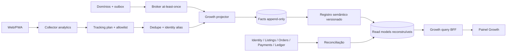

# Painel Growth Multitenant — Midas Marketplace

Versão 0.1 · Documento funcional e técnico · 22 de agosto de 2026

> **STATUS: PROPOSTO — NÃO IMPLEMENTADO.** Todo contrato, rota, métrica, grant, limiar, SLO e wireframe novo deste documento é uma recomendação sujeita à aprovação. A especificação não autoriza dados sintéticos, fallback com valores inventados, integração simulada em produção nem criação de fonte paralela de identidade, pedido, saldo, payout, refund ou disputa.

## 1. Objetivo e limites

O Painel Growth transforma fatos já produzidos pelo Midas em decisões verificáveis para plataforma e vendedores. Ele responde, sem alterar os domínios de origem:

- onde compradores e vendedores abandonam sua jornada;
- se oferta e demanda conseguem se encontrar;
- quais `SellerAccount`s crescem, retêm ou precisam de ação;
- se conversão melhora sem degradar conclusão, reembolso, disputa ou disponibilidade financeira;
- qual objeto canônico explica uma variação;
- se o dado está completo, fresco, autorizado e reconciliado.

O painel é um **read model analítico reconstruível**. Eventos de domínio continuam sendo fatos canônicos; eventos de analytics descrevem interação. Uma consulta Growth não cria ou modifica `User`, `SellerAccount`, `SellerMembership`, `Listing`, `Order`, `Payment`, `RefundRequest`, `Dispute`, `BalanceLot`, lançamento de ledger ou `PayoutRequest`.

### 1.1 Não objetivos

- substituir o painel operacional de vendas, saldo de vendas ou saques;
- editar métricas, saldo, estado de pedido ou decisão financeira pela interface;
- criar uma entidade genérica `Tenant`; no Midas, tenant comercial é `SellerAccount`;
- promover `SellerMembership` a role global ou duplicar o `User` por tenant;
- usar clique ou redirect do navegador como confirmação de pagamento, refund ou payout;
- expor ranking individual de compradores ao vendedor;
- fazer atribuição de campanha, benchmark ou previsão sem fonte real e metodologia publicada;
- somar moeda fiduciária com gold ou somar moedas distintas sem conversão explícita e versionada.

## 2. Princípios de produto

1. **Tarefa antes de gráfico.** Bloqueios e quedas acionáveis precedem exploração visual.
2. **Resumo leva ao detalhe.** Todo card abre relatório, dimensão ou objeto que explica o número.
3. **Um número, uma definição.** Fórmula, grain, fonte, janela, moeda e versão pertencem ao registro semântico.
4. **Resultado de negócio vem do domínio.** Analytics de cliente nunca confirma venda, saldo disponível, refund ou payout.
5. **Tenant é escopo, não filtro cosmético.** O servidor e a camada de dados aplicam autorização antes da agregação.
6. **Zero é diferente de ausência.** Fonte não instrumentada, parcial ou stale nunca aparece como zero.
7. **Moeda é parte do valor.** Toda métrica monetária preserva `currency`; conversão informa taxa, fonte e `asOf`.
8. **Ação sensível volta à fonte.** Drill-down navega ao objeto canônico e relê sua autorização.
9. **Sem score opaco.** Situação é explicada por métrica, limiar, período, bloqueio e próxima ação.
10. **Produção sem mock.** A tela só é liberada quando a fonte real passa reconciliação e testes.

## 3. Benchmark oficial aplicado

Os padrões abaixo orientam a proposta, sem copiar identidade visual ou contrato de fornecedor:

| Referência oficial | Padrão aproveitado |
|---|---|
| [Amplitude — escolha do tipo de análise](https://amplitude.com/docs/analytics/charts/find-the-right-chart) | segmentação, funil, jornada, retenção, lifecycle, experimento e LTV como perguntas distintas |
| [Amplitude — account-level reporting](https://amplitude.com/docs/data/data-get-started) | contagem no nível de grupo/conta além do nível de usuário |
| [Amplitude — eventos e propriedades oficiais](https://amplitude.com/docs/data/official-events-and-properties) | tracking plan governado e fonte semântica aprovada |
| [Amplitude — deduplicação HTTP V2](https://amplitude.com/docs/apis/analytics/http-v2) | identificador idempotente de ingestão e retry sem evento duplicado |
| [Google Analytics — checkout journey](https://support.google.com/analytics/answer/14000977?hl=en) | etapas explícitas, conversão e abandono por etapa |
| [Google Analytics — purchase event](https://developers.google.com/analytics/devguides/collection/ga4/set-up-ecommerce) | `transaction_id` único, moeda e itens tipados em compra |
| [Shopify — Analytics overview](https://help.shopify.com/en/manual/reports-and-analytics/shopify-reports/overview-dashboard/using-the-overview-dashboard) | cards que abrem relatório, período, comparação, moeda e frescor |
| [Shopify — customer reports](https://help.shopify.com/en/manual/reports-and-analytics/shopify-reports/report-types/default-reports/customers-reports) | coortes por primeira compra, recorrência e valor ao longo do tempo |
| [Shopify — analytics fields](https://help.shopify.com/en/manual/reports-and-analytics/shopify-reports/report-types/analytics-fields) | definição publicada de campos, unidade e fórmula |
| [Shopify — benchmarks](https://help.shopify.com/en/manual/reports-and-analytics/shopify-reports/report-types/using-reports?icat=admin-search) | comparação somente quando houver população elegível e métrica compatível |
| [Stripe Connect — visão da plataforma](https://docs.stripe.com/connect/dashboard/understand-your-connect-business) | volume, performance, crescimento de contas e tarefas em uma plataforma multi-account |
| [Stripe Connect — margin reports](https://docs.stripe.com/connect/margin-reports) | drill-down plataforma → connected account → transação e separação de volume, receita e custos |
| [eBay — Seller Hub](https://www.ebay.com/help/selling/selling-tools/seller-hub?id=4095) | tarefas operacionais antes de vendas, custos, tráfego, payouts e relatórios |
| [Microsoft — segurança no Power BI Embedded](https://learn.microsoft.com/en-us/power-bi/developer/embedded/embedded-row-level-security) | RLS para linhas, OLS para objetos/colunas e isolamento multi-tenant |

## 4. Hierarquia de escopo

```text
Platform
└── SellerAccount                         tenant comercial canônico
    ├── SellerMembership ───── User       vínculo autorizado; User continua global
    └── objeto canônico
        ├── CatalogItem / Listing / ListingUnit
        ├── Reservation / Payment / Order / DeliveryRoom
        ├── Payment / RefundRequest / Dispute
        └── BalanceLot / JournalEntry / Posting / PayoutRequest / Ticket
```

Essa é uma hierarquia de **consulta, navegação e autorização**, não um novo modelo entidade-relacionamento:

- `Platform` agrega todos os tenants autorizados e o estoque Midas identificado;
- `SellerAccount` é o único tenant comercial;
- `User` possui identidade global e pode se relacionar com zero ou mais tenants por `SellerMembership`;
- `SellerMembership` define papel, grants, escopo, validade e estado no contexto selecionado;
- objeto mantém o ID e o owner do domínio canônico;
- comprador não é copiado para o tenant do vendedor;
- contagem de usuários da plataforma usa a identidade analítica global; contagem por tenant usa o par `(sellerAccountId, analyticsSubjectKey)`;
- somar usuários únicos de tenants não produz usuários únicos da plataforma, pois a mesma pessoa pode participar de mais de um tenant.

### 4.1 Navegação por escopo

| Ator | Entrada | Escopo inicial | Drill-down máximo proposto |
|---|---|---|---|
| Staff Growth | `/admin/growth` | plataforma | tenant → sujeito pseudonimizado autorizado → objeto |
| Staff operacional autorizado | atalho contextual | objeto/caso | tenant e métricas relacionadas ao objeto |
| Membro vendedor | `/conta/vendas/growth` | `SellerAccount` selecionado | agregados do tenant → anúncio/pedido próprio |
| Usuário sem membership de leitura | nenhum | nenhum | acesso negado sem revelar existência do tenant |

O tenant não recebe jornada individual de comprador. Ele pode abrir somente anúncio, pedido ou caso que já esteja autorizado a consultar pelo domínio canônico.

## 5. Arquitetura de informação — exatamente nove telas

As telas 1–7 reutilizam o mesmo contrato visual em visão plataforma e tenant. As telas 8–9 são administrativas. Cada tela mantém de três a cinco KPIs prioritários, um gráfico principal, no máximo um gráfico secundário e uma lista/tabela acionável.

| # | Tela e rota de plataforma proposta | Tenant | Pergunta | Conteúdo principal |
|---:|---|---|---|---|
| 1 | **Visão geral** — `/admin/growth` | `/conta/vendas/growth` | Crescimento está saudável e confiável? | North Star, compradores transacionais, tenants ativos, GMV, conversão; série temporal; bloqueios e variações |
| 2 | **Aquisição** — `/admin/growth/aquisicao` | visão restrita às interações com oferta própria | De onde chega demanda qualificada? | visitantes elegíveis, cadastros, fontes/campanhas reais, novo/recorrente, conversão até intenção/pagamento |
| 3 | **Ativação** — `/admin/growth/ativacao` | ativação do tenant | Comprador e vendedor chegam ao primeiro valor? | funis de primeira compra e primeira venda, tempo até ativação, onboarding e publicação |
| 4 | **Funil marketplace** — `/admin/growth/funil` | funil das ofertas do tenant | Onde a jornada transacional abandona? | impressão → detalhe → intenção → checkout → pago → concluído → saldo disponível |
| 5 | **Oferta e liquidez** — `/admin/growth/liquidez` | oferta própria | Oferta encontra demanda em tempo útil? | oferta disponível, busca sem resultado, sell-through, tempo até intenção/venda, categorias sem liquidez |
| 6 | **Retenção e coortes** — `/admin/growth/retencao` | retenção agregada do tenant | Compradores e vendedores voltam? | coortes por primeira compra/venda, recompra, recorrência, LTV observada e lifecycle |
| 7 | **Receita e confiança** — `/admin/growth/receita-confianca` | financeiro próprio permitido | Crescimento preserva margem e qualidade? | GMV, receita líquida da plataforma quando autorizada, take rate, AOV, cancelamento, refund, disputa, chargeback e latência de liberação |
| 8 | **Tenants e benchmarks** — `/admin/growth/tenants` | não | Quais tenants mudaram e por quê? | ranking paginado, distribuição, percentis elegíveis, variação, situação e entrada no tenant |
| 9 | **Qualidade do dado** — `/admin/growth/qualidade-dados` | não | É seguro tomar decisão com esses números? | ingestão, schema, duplicidade, eventos sem correlação, atraso, recomputação e divergência com fontes |

`/conta/vendas/growth` e suas abas não criam outro conjunto de métricas. São a mesma camada semântica consultada com escopo obrigatório de `SellerAccount`.

## 6. Composição e interação

### 6.1 Shell comum

- sidebar fixa com as nove áreas autorizadas;
- topbar com breadcrumb de escopo, seletor de `SellerAccount` quando aplicável, período, comparação, moeda, frescor, busca por ID autorizado e perfil;
- primeira faixa com três a cinco KPI cards;
- uma visualização principal temporal ou de funil;
- uma visualização secundária de composição, coorte ou distribuição;
- rodapé da tela com bloqueios, anomalias e atividade recente;
- URL preserva filtros por chaves estáveis, nunca por PII ou texto de busca livre.

### 6.2 Regras de interação

1. Clicar em KPI abre o relatório que possui a definição completa da métrica.
2. Clicar em ponto, barra ou célula aplica cross-filter e atualiza tabela e resumo de denominador.
3. “Ver objetos” abre drawer paginado com IDs, estado, timestamp e contribuição para a métrica.
4. Clicar no objeto navega à rota canônica já autorizada; Growth não oferece mutação própria.
5. Breadcrumb permite voltar de objeto para sujeito, tenant e plataforma sem perder período e comparação.
6. Toda comparação mostra valores absoluto e relativo, base anterior e indicação de base pequena.
7. Alterar moeda não converte gold. Conversão fiduciária, quando habilitada, mostra fonte, taxa e `asOf`.
8. Exportação, quando liberada em fase posterior, é assíncrona, paginada, autorizada e auditada.
9. Query cancelada por novo filtro não pode sobrescrever resposta mais recente.
10. Um bloco parcial mantém outros blocos úteis e explica exatamente qual fonte falhou.

## 7. Convenções de medição

Todas as métricas abaixo estão **PROPOSTAS**.

### 7.1 Notação

- `D(event)`: evento canônico de domínio confirmado por outbox;
- `A(event)`: evento de interação analytics validado pelo tracking plan;
- `L(posting)`: lançamento balanceado do ledger;
- `S(entity)`: snapshot temporal reconstruível de entidade canônica;
- `distinct(x)`: contagem distinta no grain declarado;
- `safe_divide(a,b)`: `null` quando `b = 0`, nunca zero inventado;
- `eligible(window)`: coorte que já teve tempo completo para cumprir a janela;
- `P50(t2-t1)`: mediana da duração entre timestamps canônicos.

Regras universais:

- tempo usa `occurredAt` UTC; fuso selecionado afeta apenas buckets e apresentação;
- evento tardio corrige o bucket de ocorrência e incrementa sua revisão;
- métrica monetária é particionada por `currency` e usa `amountMinor` inteiro;
- valor convertido é uma métrica diferente da original e registra taxa, fonte e instante;
- estorno/refund financeiro só conta após evento canônico do PSP acompanhado do efeito reconciliado no ledger;
- denominador, janela de conversão e filtros aparecem junto ao resultado;
- testes, bots confirmados, staff e ambientes não produtivos ficam fora dos funis de usuário;
- cohort incompleta aparece como incompleta e não participa da comparação consolidada.

### 7.2 North Star e saúde da plataforma

| ID | Métrica e fórmula | Grain | Fonte canônica | Decisão suportada |
|---|---|---|---|---|
| `NS_AVAILABLE_VALUE` | soma dos valores líquidos que entram em disponível no período, menos postings compensatórios atribuídos ao mesmo fluxo | `ledgerPostingId × orderId × currency` | `D(funds.available)` + `L(posting)` | validar crescimento que chegou à disponibilidade real, não apenas checkout |
| `NS_AVAILABLE_ORDERS` | `distinct(orderId)` cuja primeira disponibilidade ocorreu no período | `orderId` | `D(funds.available)` + `BalanceLot` | separar crescimento em quantidade de concentração por valor |
| `TRANSACTING_BUYERS` | `distinct(analyticsSubjectKey)` com `D(payment.settled)` | usuário/plataforma ou par tenant-usuário | Payments + Order | dimensionar demanda efetivamente paga |
| `ACTIVE_SELLER_ACCOUNTS` | `distinct(sellerAccountId)` com oferta disponível ou pedido pago no período | `sellerAccountId` | Listing snapshots + Orders | acompanhar base produtiva, sem contar mero cadastro |
| `SETTLED_GMV` | soma do valor liquidado de `D(payment.settled)` por moeda, antes de refund posterior | `orderId × currency` | Payments | medir volume transacionado e dimensionar capacidade |

### 7.3 Aquisição e ativação

| ID | Métrica e fórmula | Grain | Fonte | Decisão suportada |
|---|---|---|---|---|
| `ELIGIBLE_VISITORS` | `distinct(anonymousSubjectKey ou analyticsSubjectKey)` com `A(session_started)` válido | sujeito analítico × período | collector analytics | avaliar alcance observável; não extrapolar usuários sem instrumentação |
| `REGISTERED_USERS` | `distinct(analyticsSubjectKey)` com `D(user.registered)` | `User` pseudonimizado | Identity/outbox | medir aquisição de identidade confirmada |
| `VISIT_TO_SIGNUP` | `safe_divide(REGISTERED_USERS vinculados à jornada, ELIGIBLE_VISITORS)` | `journeyId`, janela de 7 dias | analytics + Identity | diagnosticar entrada e cadastro |
| `BUYER_ACTIVATION_30D` | compradores com primeira `payment.settled` até 30 dias do cadastro / cadastros `eligible(30d)` | coorte de `User` | Identity + Payments | priorizar onboarding, descoberta ou checkout do comprador |
| `BUYER_TIME_TO_VALUE` | `P50(first payment.settled - user.registered)` | `User` ativado | Identity + Payments | reduzir tempo até primeira compra real |
| `SELLER_ONBOARDING_APPROVAL` | onboarding aprovado / onboarding iniciado na coorte elegível | `SellerAccount` | seller onboarding | localizar abandono/rejeição no cadastro vendedor |
| `SELLER_ACTIVATION_14D` | tenants com primeira `listing.approved` até 14 dias da aprovação do onboarding / tenants `eligible(14d)` | `SellerAccount` | Onboarding + Listings | melhorar criação e revisão do primeiro anúncio |
| `SELLER_TIME_TO_FIRST_SALE` | `P50(first payment.settled - seller.onboarding_approved)` | `SellerAccount` vendido | Onboarding + Order/Payments | distinguir problema de publicação de problema de liquidez |

Fonte/campanha só entra quando eventos reais possuem parâmetros allowlisted e validados. O modelo de atribuição inicial proposto é **último toque não direto antes da criação do checkout**, com janela de sete dias; o painel mostra “não instrumentado” até a correlação estar disponível.

### 7.4 Funil e liquidez

O funil comprador usa `journeyId` analítico aleatório, com janela de sete dias, propagado até o `paymentId` canônico e relacionado ao `orderId` no servidor. `journeyId` correlaciona observação; não é entidade de pedido.

| ID | Métrica e fórmula | Grain | Fonte | Decisão suportada |
|---|---|---|---|---|
| `IMPRESSION_TO_DETAIL` | jornadas com `A(listing_detail_viewed)` / jornadas com `A(listing_impression)` | `journeyId × listingId` | analytics | ajustar ranking, card, preço ou conteúdo do anúncio |
| `DETAIL_TO_INTENT` | jornadas com `A(checkout_started)` ou `D(offer.accepted)` / jornadas com detalhe | `journeyId × listingId` | analytics + Offers | distinguir curiosidade de intenção qualificada |
| `INTENT_TO_PAID` | jornadas relacionadas a `D(payment.settled)` / jornadas com intenção | `journeyId × paymentId` | analytics + Payments | diagnosticar reserva, checkout e pagamento |
| `PAID_TO_COMPLETED` | `distinct(orderId)` com `D(order.completed)` / pedidos com `D(payment.settled)` | `orderId` | Orders/Delivery/Payments | impedir que aumento de pagamento esconda falha de entrega |
| `COMPLETED_TO_AVAILABLE` | pedidos com `D(funds.available)` / pedidos concluídos elegíveis ao prazo | `orderId × balanceLotId` | Orders + Ledger | verificar retenção, bloqueios e capacidade de payout |
| `FULFILLMENT_TIME_P50` | `P50(order.completed - payment.settled)` | `orderId` | Payments + Orders | atuar em entrega lenta |
| `AVAILABLE_SUPPLY` | listings publicadas, aprovadas, não reservadas e disponíveis no fim do bucket | `listingUnitId × bucket` | Listing snapshot | dimensionar oferta realmente comprável |
| `ZERO_RESULT_SEARCH_RATE` | buscas com `resultCount = 0` / buscas válidas | `analyticsEventId` de busca | analytics/search; sem termo bruto | orientar catálogo e recuperação de busca |
| `SELL_THROUGH_30D` | listings publicadas vendidas em até 30 dias / listings publicadas `eligible(30d)` | coorte de `listingUnitId` | Listings + Payments | medir liquidez de oferta comparável |
| `TIME_TO_FIRST_INTENT_P50` | `P50(first qualified intent - Listing.publishedAt)` | `listingUnitId` | analytics/Offers + Listing snapshot | detectar oferta sem demanda antes da venda |
| `TIME_TO_PAID_SALE_P50` | `P50(payment.settled - Listing.publishedAt)` | `listingUnitId` vendido | Listing snapshot + Payments | orientar preço, distribuição e supply |

### 7.5 Retenção, receita e confiança

| ID | Métrica e fórmula | Grain | Fonte | Decisão suportada |
|---|---|---|---|---|
| `BUYER_REPEAT_30D` | compradores com nova compra liquidada entre D1–D30 / primeiras compras `eligible(30d)` | coorte de `User` pseudonimizado | Payments | avaliar valor recorrente sem confundir visitas com recompra |
| `SELLER_REPEAT_30D` | tenants com nova venda liquidada entre D1–D30 / primeiras vendas `eligible(30d)` | coorte de `SellerAccount` | Payments/Orders | detectar ativação que não vira recorrência |
| `BUYER_LTV_90D_OBSERVED` | GMV liquidado em 90 dias desde primeira compra / compradores `eligible(90d)` | coorte de `User × currency` | Payments | comparar coortes maduras; não é previsão |
| `AOV_SETTLED` | `safe_divide(SETTLED_GMV, distinct(orderId liquidado))` | `orderId × currency` | Payments | entender composição de crescimento por ticket |
| `PLATFORM_NET_REVENUE` | créditos de tarifa da plataforma menos reversões/ajustes correspondentes | `ledgerPostingId × currency` | Ledger reconciliado | medir receita própria sem misturar obrigação do vendedor |
| `TAKE_RATE` | `safe_divide(PLATFORM_NET_REVENUE, SETTLED_GMV)` na mesma moeda/período | `currency × bucket` | Ledger + Payments | avaliar monetização e efeito de pricing |
| `REFUND_VALUE_RATE` | valor canonicamente reembolsado / GMV liquidado | `orderId × currency` | `payment.partially_refunded/refunded` + Ledger | detectar crescimento de baixa qualidade |
| `DISPUTE_INCIDENCE` | pedidos com primeira `dispute.opened` / pedidos liquidados | `orderId` | Disputes + Payments | priorizar confiança e qualidade de entrega |
| `CHARGEBACK_INCIDENCE` | pedidos com `payment.chargeback_opened` / pedidos liquidados | `orderId` | Payments | acionar risco e revisão de aquisição/oferta |
| `ORDER_EXPIRY_RATE` | pedidos expirados antes de settlement / pedidos criados | `orderId` | Orders + Payments | diagnosticar reserva, pagamento e timeout |
| `FUNDS_AVAILABILITY_TIME_P50` | `P50(funds.available - order.completed)` | `balanceLotId × orderId` | Orders + Ledger | acompanhar retenção operacional sem prometer prazo imutável |

### 7.6 Pós-venda, marketing, reputação e progressão

Essas métricas ampliam o painel gerencial sem transformar o Growth em CRM, canal de mensagem, motor de reputação ou livro financeiro paralelo. A interface sempre abre o objeto canônico responsável pela ação.

| ID | Métrica e fórmula | Grain | Fonte | Decisão suportada |
|---|---|---|---|---|
| `CART_RECOVERY_72H` | carrinhos abandonados que originaram pagamento liquidado em até 72 h / carrinhos abandonados elegíveis | `cartId` | Cart + Payments + atribuição versionada | avaliar recuperação sem atribuir venda ao último clique por conveniência |
| `REPURCHASE_DUE_CONVERSION` | clientes com nova compra na janela de reposição / clientes elegíveis pela `ProductLifecyclePolicy` | `buyerSubjectKey × catalogItemId` | Orders + lifecycle | planejar pós-venda de item recorrente sem inventar vencimento |
| `CONSENTED_REACHABLE_RATE` | contatos com consentimento válido e canal disponível / compradores elegíveis | sujeito pseudonimizado × canal | ConsentRecord + SuppressionEntry + capability do provedor | dimensionar audiência realmente acionável |
| `CAMPAIGN_INCREMENTAL_PURCHASE` | compras atribuídas segundo `AttributionSnapshot` aprovado, exibidas com baseline e metodologia | campanha × versão × moeda | Campaign + Attribution + Payments | comparar campanha sem confundir correlação com causalidade |
| `MESSAGE_DELIVERY_RATE` | dispatches entregues / dispatches aceitos pelo provedor | `dispatchId × channel` | Dispatch + DeliveryAttempt + ChannelEvent | detectar falha de canal, template ou reputação de envio |
| `SELLER_RATING_BAYESIAN` | média bayesiana publicada com contagem, janela e prior versionado | `sellerAccountId` | OrderReview + ReputationProjection | mostrar confiança com proteção contra amostra pequena |
| `REVIEW_COMPLETION_RATE` | pedidos elegíveis avaliados por ao menos uma parte / pedidos concluídos elegíveis | `orderId` | OrderReview + Orders | melhorar cobertura da reputação sem induzir nota |
| `SELLER_LEVEL_PROGRESS` | contribuição elegível acumulada até o próximo nível / limiar da versão vigente | `sellerAccountId × policyVersion` | ProgressionContribution + AccountLevelAssignment | explicar nível, progresso e próximo marco |
| `LEADERBOARD_POINTS` | soma das contribuições canônicas da temporada segundo regra versionada | `sellerAccountId × leaderboardSeasonId` | LeaderboardContribution + Projection | auditar posição mensal sem recalcular no cliente |
| `PAYOUT_QUEUE_AGE_P95` | P95 do tempo das solicitações pendentes desde criação, segmentado por prioridade e moeda | `payoutRequestId` | PayoutRequest | dimensionar fila manual sem tratar prioridade comercial como aprovação automática |
| `PAYMENT_RESOLUTION_RATE` | casos de confirmação excepcional encerrados / casos abertos, por reason code | `paymentResolutionCaseId` | PaymentResolutionCase + Payment | identificar falhas de confirmação automática e recorrência por provedor |

Guardrails obrigatórios:

- contato individual, telefone e conteúdo de mensagem pertencem ao CRM/caso autorizado; o painel trabalha com agregados e chaves pseudonimizadas;
- nota, nível, badge, ranking ou fila de saque nunca são derivados no navegador;
- campanha sem consentimento/capability válida aparece como inelegível, não como oportunidade acionável;
- “vendedor com atenção” significa sinal operacional explicável, jamais rótulo moral como “problemático”;
- comparação de planos de anúncio separa exposição, conversão, margem, refund e suporte; não atribui causalidade sem desenho aprovado.

### 7.7 Qualidade analítica

| ID | Métrica e fórmula | Grain | Fonte | Decisão suportada |
|---|---|---|---|---|
| `VALID_EVENT_RATE` | eventos aceitos pelo schema / eventos recebidos | `source × eventName × schemaVersion` | collector/registry | bloquear rollout de métrica corrompida |
| `DUPLICATE_EVENT_RATE` | eventos descartados por mesma chave / eventos recebidos | chave de dedupe | collector/inbox | corrigir retry, SDK ou integração duplicada |
| `UNJOINED_OUTCOME_RATE` | outcomes de domínio sem chaves analíticas esperadas / outcomes elegíveis | `domainEventId` | projector | impedir atribuição ou funil falso |
| `LATE_EVENT_RATE` | eventos recebidos após SLA / eventos aceitos | evento × fonte | collector/broker | interpretar revisão de buckets e atraso |
| `FRESHNESS_LAG_P95` | P95(`projectedAt - occurredAt`) | read model × bucket | observabilidade | decidir se tela pode apoiar ação atual |
| `SOURCE_DIVERGENCE` | diferença absoluta entre agregado e fonte reconciliada | métrica × moeda × bucket | reconciler | retirar métrica de produção quando ultrapassar tolerância |

## 8. Estágios Growth

### 8.1 Comprador

```text
Descoberta            Ativação                 Transação e confiança         Retenção
visitou/pesquisou  →  abriu anúncio         →  iniciou intenção          →  repetiu compra
viu impressão      →  cadastrou-se           →  iniciou checkout
                                            →  pagamento liquidado
                                            →  pedido concluído
```

| Estágio | Entrada | Saída | Grain | Bloqueios diagnosticáveis |
|---|---|---|---|---|
| Descoberta | sessão válida | detalhe visualizado | `journeyId × listingId` | busca sem resultado, impressão sem clique |
| Cadastro | visitante elegível | `user.registered` | `User` pseudonimizado | erro técnico, abandono, origem sem correlação |
| Intenção | detalhe | checkout iniciado ou oferta aceita | `journeyId` | preço, confiança, disponibilidade |
| Pagamento | checkout | `payment.settled` | `paymentId/orderId` | falha, expiração, quarantine |
| Conclusão | pagamento | `order.completed` | `orderId` | entrega, confirmação, disputa |
| Retenção | primeira compra | nova compra D1–D30/D90 | `User` pseudonimizado | experiência anterior, oferta, confiança |

### 8.2 Vendedor

```text
Cadastro                 Oferta                    Primeira receita                 Recorrência
SellerAccount criado  →  onboarding aprovado   →  primeira venda liquidada     →  nova venda
                      →  anúncio aprovado       →  pedido concluído             →  saldo disponível
                                                →  saldo disponível             →  payout quando elegível
```

| Estágio | Entrada | Saída | Grain | Bloqueios diagnosticáveis |
|---|---|---|---|---|
| Onboarding | caso iniciado | seller aprovado | `SellerAccount` | informação pendente, rejeição, abandono |
| Primeira oferta | seller aprovado | listing aprovada | `SellerAccount/listingId` | formulário, prova, moderação |
| Liquidez inicial | listing publicada | primeira intenção | `listingUnitId` | descoberta, preço, demanda insuficiente |
| Primeira venda | intenção | pagamento liquidado | `SellerAccount/orderId` | reserva, checkout, pagamento |
| Realização | venda paga | conclusão e `funds.available` | `orderId/balanceLotId` | entrega, disputa, hold |
| Recorrência | primeira venda | nova venda D1–D30 | `SellerAccount` | supply, operação, confiança |

Payout é resultado operacional posterior e não define conversão de compra. Ele aparece como contexto da realização financeira, sem substituir o painel canônico de saques.

## 9. Filtros e comparações

| Grupo | Filtros propostos | Regras |
|---|---|---|
| Escopo | plataforma, canal P2P/Midas, `sellerAccountId` | tenant fica fixo e validado no servidor na visão vendedor |
| Tempo | intervalo, hora/dia/semana/mês, fuso | máximo e granularidade compatíveis; buckets vazios são zero somente com fonte completa |
| Comparação | período anterior, mesmo período anterior, ano anterior, coorte, benchmark elegível | mostra bases e não compara janelas incompletas |
| Pessoa | comprador/vendedor, novo/recorrente, coorte | tenant não filtra comprador individual |
| Oferta | categoria, item, raridade, craft, canal, faixa de preço | IDs vêm de dimensões autorizadas, não de texto livre |
| Aquisição | origem, medium, campanha, dispositivo, superfície, variante | apenas valores allowlisted; “desconhecido” permanece explícito |
| Operação | estados canônicos de listing, order, payment, delivery, refund, dispute e payout | rótulos visuais mapeiam enums existentes; não criam nova máquina |
| Financeiro | moeda original, moeda normalizada opcional | normalização exige fonte/taxa/`asOf`; gold permanece separado |
| Qualidade | fresh/stale/partial/recomputing, schemaVersion, source | permite retirar dados incompletos da decisão |

Filtros dependentes carregam dimensões por cursor. Valores fora do escopo não aparecem e não são inferíveis por contagem, erro ou tempo de resposta.

## 10. Drill-down e timeline

### 10.1 Caminho de análise

```text
KPI → série/bucket → dimensão → SellerAccount → SellerMembership/User autorizado → objeto
```

- plataforma pode segmentar tenant e abrir seus objetos sob grants;
- `SellerMembership` aparece como contexto da ação do vendedor, nunca como identidade alternativa;
- sujeito permanece pseudonimizado na camada analítica;
- tenant vê agregados e objetos próprios, não perfil comportamental individual do comprador;
- cada linha do drill-down informa `contribution`, `occurredAt`, estado, fonte e `asOf`;
- tabelas usam cursor opaco, `limit` limitado e ordenação estável com desempate por ID;
- seleção de objeto chama a API canônica de detalhe após nova autorização.

### 10.2 Timeline explicável

A timeline analítica é uma composição somente leitura e distingue visualmente:

- **DOMÍNIO:** fato canônico, como `listing.approved`, `payment.settled`, `order.completed` ou `funds.available`;
- **INTERAÇÃO:** observação de analytics, como impressão, detalhe, filtro ou checkout visualizado;
- **PROJEÇÃO:** atualização, correção ou recomputação do read model.

Cada item apresenta tipo, timestamp de ocorrência, timestamp de ingestão, fonte, versão de schema, correlation ID permitido e link ao objeto. Conteúdo de chat, evidência integral, segredo de entrega, e-mail, telefone, nome, endereço, token e destino financeiro não entram.

## 11. Situação, bloqueio e próxima ação

Situação analítica não é estado de domínio e não pode ser persistida em `Order`, `SellerAccount` ou outro agregado.

```json
{
  "situation": "ON_TRACK | ATTENTION | BLOCKED | NO_BASELINE | NO_DATA",
  "reasonCode": "FUNNEL_DROP | SOURCE_STALE | SAMPLE_TOO_SMALL | ...",
  "metricId": "INTENT_TO_PAID",
  "metricVersion": 1,
  "observed": 0.31,
  "baseline": 0.44,
  "thresholdVersion": 2,
  "blockedBy": ["payment_provider_degraded"],
  "nextAction": {
    "label": "Ver pagamentos falhos",
    "route": "/admin/financeiro",
    "requiredGrant": "order.read"
  }
}
```

Regras:

- limiar é versionado, datado e tem owner; ausência de limiar produz `NO_BASELINE`;
- `BLOCKED` exige causa observável, não inferência silenciosa;
- próxima ação navega para tela ou objeto existente e não executa comando;
- causa externa indisponível usa “causa ainda não determinada”, não explicação inventada;
- cor nunca é o único sinal: texto, ícone e descrição acompanham a situação;
- seller restrito pode consultar histórico permitido, mas uma próxima ação proibida informa motivo e recuperação;
- alertas com base pequena ou coorte incompleta não recebem situação comparativa.

### 11.1 Visão gerencial de risco e qualidade do vendedor

O super dashboard pode priorizar tenants que exigem análise, mas não mantém um “score secreto de vendedor”. Cada linha exibe sinais independentes, período, base, fonte e próxima ação autorizada:

| Sinal | Exibição mínima | Drill-down canônico |
|---|---|---|
| entrega atrasada | quantidade, taxa, janela e denominador | pedidos e `DeliveryRoom`s autorizados |
| refund, disputa ou chargeback | incidência e valor por moeda, sem somar eventos distintos | `RefundRequest`, `Dispute` ou caso financeiro |
| avaliação deteriorando | média, distribuição, quantidade e comparação elegível | `OrderReview` moderada e pedido relacionado |
| confirmação manual recorrente | casos por provedor/reason code e taxa sobre pagamentos | `PaymentResolutionCase` |
| saque envelhecido | idade, prioridade, status e bloqueio objetivo | `PayoutRequest` e tentativas/evidências autorizadas |
| campanha com reclamação/supressão | entregas, opt-outs e reclamações por canal | `Dispatch`, `ChannelEvent`, consentimento/supressão |

Regras de governança:

- nenhum sinal sozinho suspende conta, retém dinheiro, muda ranking ou bloqueia saque;
- ação material exige política canônica, grant, motivo, evidência, auditoria e, quando aplicável, revisão humana;
- atributos sensíveis, proxies discriminatórios e texto livre não entram em ordenação;
- staff vê “por que apareceu aqui”, versão do limiar e como contestar/corrigir o dado;
- falso positivo confirmado corrige a fonte/projeção e preserva o histórico de auditoria.

## 12. Eventos de domínio versus eventos de analytics

| Aspecto | Evento de domínio | Evento de analytics |
|---|---|---|
| Finalidade | registrar fato de negócio | observar interação e navegação |
| Autoridade | fonte para outcome, estado e dinheiro | fonte para comportamento, exposição e funil anterior ao outcome |
| Origem | aplicação/worker após regra e commit/outbox | cliente ou servidor após validação do tracking plan |
| Exemplos | `order.created`, `payment.settled`, `order.completed`, `funds.available`, `payment.refunded` | `analytics.session_started`, `analytics.listing_impression`, `analytics.listing_detail_viewed`, `analytics.checkout_started` |
| Pode liberar saldo? | somente o motor canônico correspondente | nunca |
| Pode confirmar compra/refund? | sim, quando for o evento canônico definido | nunca |
| Dedupe | `eventId`, versão do agregado, inbox/outbox | `analyticsEventId`, source key e janela de dedupe |
| Retenção/payload | contrato do domínio e classificação própria | payload mínimo allowlisted e sem PII |

### 12.1 Tracking plan proposto

| Evento analytics | Quando emitir | Grain/dedupe | Propriedades permitidas |
|---|---|---|---|
| `analytics.session_started` | primeira interação elegível da sessão | `sessionId` | device class, surface, source allowlisted |
| `analytics.search_submitted` | resposta da busca exibida | `analyticsEventId` | filtros categóricos, `resultCount`, latência; nunca termo bruto |
| `analytics.listing_impression` | card teve exposição mínima definida | `sessionId × listingId × exposureWindow` | posição, superfície, categoria, experiment key |
| `analytics.listing_detail_viewed` | detalhe renderizou conteúdo principal | `sessionId × listingId × viewWindow` | origem, categoria, disponibilidade observada |
| `analytics.checkout_started` | servidor criou/validou `Payment` e a etapa abriu | `paymentId` | canal, moeda, categoria; sem dados do meio de pagamento |
| `analytics.filter_applied` | filtro alterou resultado | `analyticsEventId` | filter key e valor categórico allowlisted |
| `analytics.dashboard_viewed` | view Growth terminou o primeiro carregamento | `sessionId × viewKey × filterHash` | viewKey, scopeKind, freshness; sem IDs de terceiros |
| `analytics.drilldown_opened` | usuário abriu detalhe analítico | `analyticsEventId` | metricId, dimensionType, scopeKind |
| `analytics.experiment_exposed` | servidor atribuiu variante e entregou experiência | `subjectKey × experimentKey × version` | experiment/variant/version |

Eventos `payment_settled`, `purchase_completed`, `refund_completed` ou semelhantes não são reemitidos pelo SDK. O projector consome os eventos canônicos já existentes.

## 13. Identidade, deduplicação e ausência de PII

### 13.1 Identidade analítica

- `analyticsSubjectKey` é um surrogate opaco, estável por ambiente e sem significado externo, relacionado ao `User` somente em serviço restrito;
- sessão anônima usa `anonymousSubjectKey` aleatório e expirável;
- login cria uma relação de alias auditada; não reescreve `User` nem `SellerMembership`;
- `sellerAccountId` permanece explícito no evento quando a interação estiver no contexto de tenant;
- `membershipContextKey` pode registrar qual membership autorizou uma ação de vendedor, mas não substitui o ator;
- `actorType = anonymous | buyer | seller_member | staff | system` impede misturar staff/bot com crescimento de usuário;
- exclusão de teste é determinada por `environment` e contas de teste governadas, não por filtro manual de dashboard.

### 13.2 Chaves mínimas do envelope analytics

```json
{
  "analyticsEventId": "uuid",
  "eventName": "analytics.listing_detail_viewed",
  "schemaVersion": 1,
  "occurredAt": "UTC",
  "receivedAt": "UTC",
  "environment": "production",
  "platformId": "midas",
  "sellerAccountId": "uuid|null",
  "analyticsSubjectKey": "opaque|null",
  "anonymousSubjectKey": "opaque|null",
  "sessionId": "opaque",
  "journeyId": "opaque|null",
  "objectType": "listing",
  "objectKey": "opaque",
  "surface": "market_search",
  "properties": {}
}
```

### 13.3 Dedupe

- unicidade primária por `(environment, analyticsEventId)`;
- eventos derivados de domínio preservam `domainEventId` único;
- compra conta por `orderId`/provider transaction ID canônico, nunca por quantidade de callbacks;
- impressão conta uma vez no grain publicado, mesmo com rerender;
- retry de collector reutiliza a mesma chave;
- evento duplicado é descartado e contabilizado em `DUPLICATE_EVENT_RATE`;
- merge anônimo→autenticado é determinístico e não duplica jornadas já relacionadas;
- eventos fora de ordem são ordenados por `occurredAt`, com `receivedAt` preservado para qualidade;
- replay/rebuild produz a mesma métrica e revisão de bucket.

### 13.4 Campos proibidos

Analytics, cache, URL compartilhável, exportação e screenshot nunca carregam:

- nome, e-mail, telefone, documento, endereço ou identificador financeiro em claro;
- senha, token, cookie de autenticação, MFA, passkey, recovery code ou segredo;
- PAN, CVV, conta bancária ou destino completo de payout;
- mensagem, evidência integral, termo de busca bruto ou conteúdo do cofre de entrega;
- IP completo, user-agent bruto ou parâmetro de URL não allowlisted;
- motivo livre de ticket, disputa, refund ou restrição.

Categoria derivada, região grosseira, device class e reason code estruturado só entram quando previstos no schema e necessários à métrica.

## 14. Pipeline, read models e fonte semântica



### 14.1 Projeções propostas

| Read model | Grain | Conteúdo | Não pode fazer |
|---|---|---|---|
| `GrowthPlatformBucket` | plataforma × tempo × moeda/dimensão | KPIs e séries agregadas | decidir tenant, pagamento ou saldo |
| `GrowthTenantBucket` | `sellerAccountId` × tempo × moeda/dimensão | métricas do tenant | copiar cadastro ou ledger integral |
| `GrowthFunnelBucket` | funnelVersion × etapa × coorte/dimensão | entradas, conversões, abandono e duração | confirmar outcome por evento de cliente |
| `GrowthCohortCell` | cohortType × cohortStart × ageBucket | população elegível, retidos, valor | prever LTV sem modelo aprovado |
| `GrowthObjectContribution` | metricId × bucket × objectType/objectKey | contribuição explicável e link | tornar-se cópia editável do objeto |
| `GrowthTimelineProjection` | scope/object × occurredAt × stableId | eventos autorizados e sua fonte | armazenar payload integral/PII |
| `GrowthLifecycleBucket` | policyVersion × coorte × janela | elegíveis, recompra e atraso de reposição | criar validade não definida pelo catálogo |
| `GrowthCampaignBucket` | campaignVersion × channel × attributionVersion × tempo | audiência elegível, dispatch, entrega, conversão e opt-out | enviar mensagem ou guardar criativo/payload integral |
| `GrowthTrustBucket` | sellerAccountId × janela × signalType | reviews, disputas, refunds e fulfillment com denominadores | decidir sanção ou editar reputação |
| `GrowthProgressionBucket` | policyVersion/seasonId × sellerAccountId | nível e ranking projetados com explicação | conceder badge/prêmio ou recalcular contribuição no painel |
| `GrowthDataQualityBucket` | source × event × schemaVersion × tempo | aceitos, rejeitados, duplicados, atraso | ocultar violação para manter card verde |

O registro semântico mantém `metricId`, versão, descrição, fórmula declarativa, grain, dimensões permitidas, owner, fonte, política de moeda, janela, freshness SLO e testes. Dashboard referencia `metricId`; não incorpora SQL próprio.

### 14.2 Reconciliação

- `SETTLED_GMV` reconcilia com Payments por `orderId`, provider ID e moeda;
- `PLATFORM_NET_REVENUE` e North Star reconciliam com postings do Ledger;
- refund só reduz métricas quando PSP e lançamentos canônicos confirmam o efeito;
- divergência acima da tolerância versionada marca o bloco `PARTIAL` ou `STALE` e impede situação comparativa;
- read models podem ser apagados e reconstruídos dos fatos; nenhuma reconstrução toca tabelas canônicas.

## 15. APIs propostas

Todas as rotas são **PROPOSTAS**, somente leitura, sob `/v1`, e retornam `application/problem+json` em erro.

```text
GET /v1/admin/growth/views/{viewKey}
GET /v1/admin/growth/dimensions/{dimensionKey}?cursor=&limit=&sort=
GET /v1/admin/growth/tenants/{sellerAccountId}
GET /v1/admin/growth/objects/{objectType}/{objectId}/timeline?cursor=&limit=
GET /v1/admin/growth/quality/incidents?cursor=&limit=&status=

GET /v1/seller-accounts/{sellerAccountId}/growth/views/{viewKey}
GET /v1/seller-accounts/{sellerAccountId}/growth/dimensions/{dimensionKey}?cursor=&limit=&sort=
GET /v1/seller-accounts/{sellerAccountId}/growth/objects/{objectType}/{objectId}/timeline?cursor=&limit=
```

`viewKey` aceita somente `overview`, `acquisition`, `activation`, `marketplace-funnel`, `liquidity`, `retention`, `revenue-trust`, `tenants` e `data-quality`. O endpoint de tenant aceita apenas as sete primeiras views.

### 15.1 Query comum

```text
from=<ISO-8601>&to=<ISO-8601>
granularity=hour|day|week|month
timeZone=America/Sao_Paulo
compare=none|previous_period|previous_year
currency=BRL
channel=P2P|MIDAS
categoryId=<id>
cohort=<registered|first_purchase|onboarding_approved|first_sale>
actorType=<buyer|seller_member>
freshness=<fresh|delayed|stale|partial|recomputing>
```

- intervalo e granularidade possuem limites server-side para restringir buckets e custo;
- dimensões e objetos usam cursor opaco, máximo de 100 itens e ordenação estável;
- `sellerAccountId` da rota é revalidado contra `SellerMembership`; query param não troca o tenant;
- filtros desconhecidos retornam problema tipado, não são ignorados silenciosamente;
- cache key inclui policy version, actor, scope, filtros, metric version e revisão do bucket;
- `ETag`/`If-None-Match` pode reduzir tráfego, sem substituir autorização.

### 15.2 Envelope de resposta

```json
{
  "scope": {
    "kind": "platform|seller_account",
    "sellerAccountId": "uuid|null"
  },
  "viewKey": "overview",
  "metricVersion": 1,
  "filtersApplied": {},
  "asOf": "UTC",
  "freshness": {
    "state": "FRESH|DELAYED|STALE|PARTIAL|RECOMPUTING|NOT_INSTRUMENTED",
    "lagSeconds": 120,
    "completeThrough": "UTC",
    "sources": []
  },
  "metrics": [],
  "charts": [],
  "alerts": [],
  "nextCursor": null
}
```

Valor monetário usa `{ "amountMinor": 12345, "currency": "BRL" }`. Percentual usa decimal entre `0` e `1`, acompanhado de numerador e denominador.

## 16. Freshness, correção e disponibilidade

SLOs iniciais **PROPOSTOS**:

| Classe | Alvo P95 | Tratamento visual |
|---|---:|---|
| fatos operacionais de domínio | até 5 minutos | `FRESH`; depois `DELAYED` |
| interação web/PWA | até 15 minutos | informa atraso por source |
| saldo/receita intraday | até 15 minutos, sempre provisório até reconciliação | separa “provisório” de “reconciliado” |
| coortes, lifecycle e benchmark | D+1 | `completeThrough` explícito |
| recomputação histórica | sem promessa fixa | mantém último valor rotulado e progresso |

Estados de qualidade:

- `FRESH`: todas as fontes dentro do SLO;
- `DELAYED`: uma fonte atrasou, mas ainda abaixo do limite de stale;
- `STALE`: dado conhecido, porém antigo; nunca é apresentado como atual;
- `PARTIAL`: uma ou mais fontes/buckets ausentes; totais afetados ficam indisponíveis;
- `RECOMPUTING`: correção em curso; última revisão continua rotulada;
- `NOT_INSTRUMENTED`: evento/fonte ainda não existe em produção;
- `UNAVAILABLE`: consulta falhou e não há resposta segura em cache.

Correção tardia incrementa `bucketRevision`, invalida cache e registra diff agregado. Alertas já emitidos mantêm referência à revisão usada. Relatório financeiro final não é reclassificado silenciosamente.

## 17. RBAC, ABAC, RLS e OLS

Grants mínimos **PROPOSTOS**:

```text
growth.platform.read
growth.tenant.read
growth.object.read
growth.quality.read
growth.export
growth.metric_definition.manage
```

Regras:

- `growth.platform.read` não concede PII, ledger integral, segredo ou ação financeira;
- `growth.tenant.read` exige `SellerMembership` válida no `SellerAccount` alvo e escopo de histórico compatível;
- `growth.object.read` complementa, nunca substitui, a autorização canônica do objeto;
- `growth.quality.read` expõe payload apenas redigido e metadados técnicos permitidos;
- exportação exige grant próprio, step-up conforme risco, finalidade, limite, expiração e auditoria;
- gestão de definição não permite alterar fatos históricos sem nova `metricVersion` e recomputação;
- deny explícito vence e toda leitura administrativa sensível registra actor, finalidade, scope e correlation ID.

RLS/OLS:

- fatos e projeções carregam `platformId` e `sellerAccountId` quando aplicável;
- query tenant aplica RLS antes de agrupar;
- staff plataforma usa policy própria e não reutiliza bypass de manutenção;
- OLS esconde colunas de identity bridge, chaves externas, custo financeiro restrito e metadados internos;
- cache, export e job assíncrono preservam a mesma policy;
- IDs fora do escopo retornam resposta indistinguível de inexistente;
- teste automatizado prova isolamento com o mesmo `User` em múltiplas memberships.

## 18. Wireframes de referência

### 18.1 Desktop 1440 — overview

```text
┌──────────────┬──────────────────────────────────────────────────────────────────────────┐
│ MIDAS GROWTH │ Plataforma > Todos       Período ▾ Comparar ▾ BRL ▾  Fresh 2 min        │
│ Visão geral  ├──────────────────────────────────────────────────────────────────────────┤
│ Aquisição    │ [North Star] [Compradores] [Tenants ativos] [GMV] [Conversão]           │
│ Ativação     │                                                                          │
│ Funil        │ ┌───────────────────────────────┐ ┌────────────────────────────────────┐ │
│ Liquidez     │ │ North Star por dia            │ │ Funil resumido                    │ │
│ Retenção     │ │ série + comparação + revisão  │ │ impressão → ... → disponível     │ │
│ Receita      │ └───────────────────────────────┘ └────────────────────────────────────┘ │
│ Tenants      │                                                                          │
│ Qualidade    │ Bloqueios e oportunidades                                                │
│              │ [!] Checkout caiu 12%  [STALE] Busca atrasada  [→] 3 tenants mudaram    │
│ Usuário      │                                                                          │
└──────────────┴──────────────────────────────────────────────────────────────────────────┘
```

### 18.2 Desktop — funil com drill-down

```text
┌──────────────────────────────────────────────────────────────────────────────────────────┐
│ Plataforma > Funil   01–21 ago · P2P · BRL · novos usuários · comparação anterior       │
├──────────────────────────────────────────────────────────────────────────────────────────┤
│ Impressão      Detalhe       Intenção       Pago          Concluído      Disponível      │
│ 100.000   →    31.000   →    8.200     →    5.900    →    5.420     →    5.010          │
│               -69,0%        -73,5%          -28,0%        -8,1%          -7,6%           │
├──────────────────────────────────────────┬───────────────────────────────────────────────┤
│ Conversão por dia                       │ Dimensão selecionada: categoria                │
│ linha atual × comparação                │ tabela paginada, base e contribuição           │
├──────────────────────────────────────────┴───────────────────────────────────────────────┤
│ Drawer: metricId · fórmula · grain · fontes · asOf · objetos explicativos · timeline    │
└──────────────────────────────────────────────────────────────────────────────────────────┘
```

### 18.3 Tenant responsivo

```text
┌───────────────────────────────┐
│ Growth · Loja selecionada ▾   │
│ 30 dias · BRL · Fresh 4 min   │
├───────────────────────────────┤
│ [Vendas disponíveis]          │
│ [Conversão para pago]         │
│ [Tempo até venda]             │
├───────────────────────────────┤
│ Pedidos que exigem atenção    │
│ ! pago→concluído caiu         │
│ Próxima ação: Ver 4 pedidos → │
├───────────────────────────────┤
│ Série principal               │
├───────────────────────────────┤
│ Funil / coorte                │
├───────────────────────────────┤
│ Dados: parcial até 14:20      │
└───────────────────────────────┘
```

## 19. Estados UX e acessibilidade

| Estado | Representação | Ação |
|---|---|---|
| carregando | skeleton preserva layout e rótulos | aguardar/cancelar query anterior |
| pronto | valor, unidade, período, comparação e frescor | explorar |
| vazio inicial | explica que ainda não há fatos elegíveis | abrir fluxo canônico pertinente |
| vazio por filtro | mantém filtros visíveis | limpar filtros |
| não instrumentado | informa fonte/evento pendente | ver requisito de instrumentação; nunca gerar amostra |
| parcial | mantém blocos independentes e marca afetados | ver fontes incidentes |
| stale | mostra último `asOf` e não calcula situação atual | atualizar/ver incidente |
| recomputando | mostra revisão anterior e progresso | aguardar; não comparar revisões distintas |
| sem baseline | valor real sem seta ou cor comparativa | escolher período elegível |
| proibido | motivo genérico sem revelar objeto | trocar tenant ou solicitar acesso por fluxo existente |
| erro recuperável | problem code e correlation ID permitido | tentar novamente |
| erro definitivo | explicação e rota segura | voltar ao overview |

Acessibilidade:

- gráficos têm título, resumo textual, tabela equivalente e descrição da tendência;
- cor é acompanhada de ícone/texto e contraste AA;
- teclado percorre filtro, card, gráfico, tabela, drawer e fechamento em ordem lógica;
- mudança assíncrona relevante é anunciada por região viva sem roubar foco;
- tooltip também abre por foco e toque;
- tabela mantém cabeçalhos associados e paginação operável;
- redução de movimento remove transições não essenciais;
- moeda, percentual, data e duração usam formatação pt-BR sem perder o valor programático.

## 20. Testes executáveis e critérios de aceite

### 20.1 Contrato e métricas

- teste de schema aceita somente eventos/propriedades do tracking plan e rejeita PII/free text;
- golden datasets derivados de eventos canônicos conhecidos provam numerador, denominador, grain, janela e revisão de cada `metricId`;
- `safe_divide` retorna `null` com denominador zero;
- soma monetária nunca cruza moedas e conversão reproduz taxa/fonte/`asOf`;
- refund parcial, total, retry e webhook duplicado produzem um único efeito analítico canônico;
- evento tardio/out-of-order corrige o bucket de ocorrência sem duplicar total;
- rebuild integral produz os mesmos resultados e revisões esperadas;
- North Star e receita reconciliam com Ledger/Payments dentro da tolerância aprovada.

### 20.2 Identidade e isolamento

- sessão anônima vinculada após login não duplica a jornada;
- um `User` em dois `SellerAccount`s conta uma vez na plataforma e uma vez em cada tenant aplicável;
- troca manipulada de `sellerAccountId` não altera o escopo;
- tenant A nunca vê dimensão, contagem inferível, objeto, cache ou export do tenant B;
- membership expirada/restrita segue a política de leitura histórica e bloqueia novas capacidades quando aplicável;
- staff sem grant de plataforma recebe deny; grant Growth não concede PII ou financeiro detalhado;
- varredura automatizada confirma ausência dos campos proibidos em evento, log, cache, URL e export.

### 20.3 API, UI e operação

- as nove views devolvem contrato válido ou `NOT_INSTRUMENTED`, nunca placeholder numérico;
- dimensão/timeline usa cursor estável, sem item repetido ou omitido entre páginas;
- filtros reaplicados na URL reproduzem a visão sem PII;
- resposta antiga de query cancelada não sobrescreve filtros atuais;
- partial/stale/recomputing mantêm rotulagem e impedem conclusão enganosa;
- clique de KPI preserva escopo e abre relatório/objeto autorizado;
- testes de teclado, leitor de tela, contraste, zoom 200% e mobile passam;
- orçamento de performance proposto: overview P95 até 2 s com cache autorizado; drill-down P95 até 3 s; nenhuma query ilimitada;
- falha do painel não afeta checkout, pedido, pagamento, entrega, saldo ou payout.

### 20.4 Aceite para sair de piloto

1. Todas as métricas exibidas têm definição versionada, owner, fonte e teste.
2. Nenhum card usa fixture, mock, seed demonstrativo ou fallback sintético em produção.
3. Plataforma e tenants reconciliam fatos de negócio com fontes canônicas.
4. Isolamento multi-tenant e OLS/RLS passam em teste automatizado e revisão de segurança.
5. Frescor e completude aparecem em todas as respostas e telas.
6. Todo drill-down termina num objeto canônico ou numa explicação de indisponibilidade.
7. Evento analytics não consegue confirmar outcome financeiro ou alterar domínio.
8. Métricas com fonte ausente permanecem `NOT_INSTRUMENTED` até evidência real.

Os testes podem usar replays determinísticos de envelopes válidos em ambiente isolado. Isso não autoriza funções mockadas, serviços fake ou dados demonstrativos no runtime de produção.

## 21. Rollout proposto

| Fase | Entrega | Gate de saída | Exposição |
|---|---|---|---|
| 0 — Registro | catálogo semântico, tracking plan, owner, fontes, classificação e testes | revisão conjunta Produto/Dados/Engenharia/Segurança | nenhuma UI |
| 1 — Instrumentação | collector, validação, dedupe, identidade analítica e observabilidade | `VALID_EVENT_RATE` e PII scan dentro da meta aprovada | shadow, produção sem usuário |
| 2 — Projeções | read models, rebuild, reconciliação e APIs internas | dois períodos fechados reconciliados; nenhum tenant leak | staff técnica |
| 3 — Staff | nove telas, alertas explicáveis e qualidade do dado | decisões conferidas contra fontes; UX/a11y aprovadas | feature flag por grant |
| 4 — Piloto tenant | telas 1–7 para pequeno conjunto de `SellerAccount`s reais | métricas conciliadas, suporte treinado, rollback testado | allowlist de tenant |
| 5 — Geral | expansão gradual e SLO operacional | erros, freshness e consultas dentro do orçamento | memberships autorizadas |
| 6 — Avançado | benchmark elegível, experimento e export governado | metodologia, população mínima e segurança aprovadas | flags independentes |

Rollback desliga rotas/UI Growth por flag sem interromper ingestão canônica ou domínios transacionais. Projeções podem ser reconstruídas. Flag nunca ignora RBAC/RLS e não transforma dado parcial em zero.

## 22. Decisões ainda necessárias

Antes da implementação, responsáveis devem aprovar:

1. owner e valor-alvo de cada métrica;
2. janelas de ativação, retenção e conversão;
3. definição de exposição mínima de impressão;
4. fontes e allowlist de aquisição/campanha;
5. política e fonte de câmbio para visão normalizada;
6. tolerância de reconciliação e limites de freshness;
7. população mínima para benchmark e comparação;
8. grants finais e política de histórico de membership restrita/encerrada;
9. retenção dos fatos analíticos e da identity bridge;
10. limites de intervalo, cardinalidade, exportação e performance.

Até essas decisões existirem, os campos afetados permanecem `NOT_INSTRUMENTED` ou `NO_BASELINE`. Implementação não deve preencher lacunas com constantes arbitrárias.

## 23. Encerramento

O Painel Growth proposto projeta a operação real do Midas na hierarquia `Platform > SellerAccount > SellerMembership/User > objeto`, com nove telas e um registro semântico único. Outcomes vêm de eventos canônicos e ledger/PSP reconciliados; analytics acrescenta somente observação de interação. Identidade permanece global, tenant permanece `SellerAccount`, memberships continuam vínculos autorizadores e objetos continuam nos domínios proprietários. Essa separação permite medir aquisição, ativação, liquidez, conversão, retenção, receita e confiança sem criar um segundo marketplace nem um saldo paralelo.
