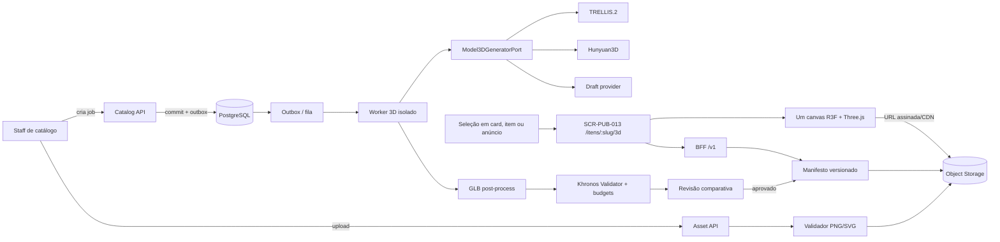
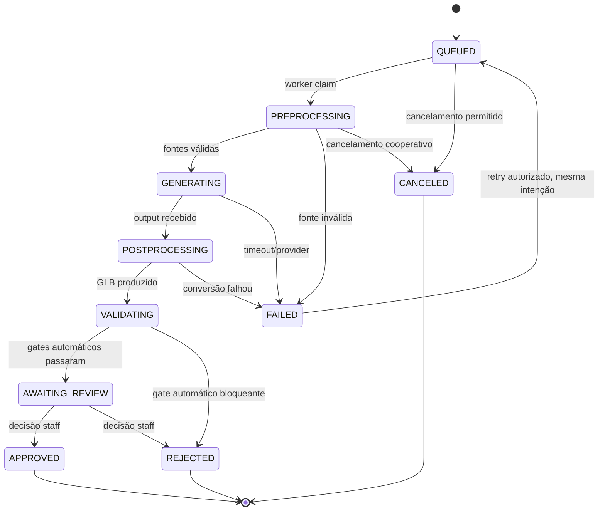
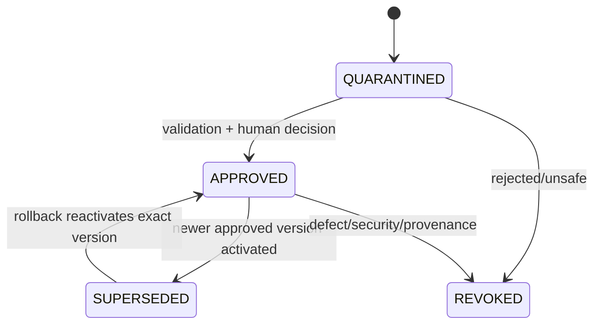

# Pipeline 2D → 3D e visualizador de itens — Midas

Versão 1.1 · Blueprint pré-código · 22 de agosto de 2026

## 1. Resultado e limite técnico

O Midas terá um fluxo real para receber imagens de um item digital, gerar ou importar um ativo 3D, revisar a fidelidade, publicar um GLB versionado e permitir interação no navegador com Three.js. Cada item/arma possui sua própria tela de inspeção, `SCR-PUB-013` em `/itens/:slug/3d`, resolvida pelo `CatalogItem` e pelo `Model3DArtifact` ativo — não por estado 3D duplicado na página.

Há três promessas diferentes:

| Entrada | Resultado que pode ser prometido | Rótulo |
|---|---|---|
| GLB/GLTF autorado e validado | reprodução do modelo fornecido, limitada pelo renderer/material | `IMPORTED_AUTHORITATIVE` |
| 2–4+ vistas coerentes | candidato reconstruído com maior cobertura visual, ainda sujeito a inferência e revisão | `MULTI_VIEW_CANDIDATE` |
| um PNG ou SVG de uma vista | rascunho que inventa superfícies ocultas | `SINGLE_VIEW_DRAFT` |

**Uma imagem única não contém profundidade nem faces ocultas.** Nenhuma biblioteca pode reconstruí-las de modo “exato” sem outra fonte. O produto deve mostrar esse limite, manter comparação com a origem e exigir aprovação humana.

Status deste repositório:

- **DOCUMENTADO:** PRD, contratos, estados, APIs candidatas, viewer e testes;
- **PROPOSTO:** bibliotecas e pipeline abaixo;
- **NÃO IMPLEMENTADO:** upload, worker GPU, geração, GLB, viewer e rotas;
- **BLOQUEADO:** seleção final do modelo depende de benchmark com imagens autorizadas e hardware/custo reais.

Cobertura vinculada, sem duplicar o contrato canônico do PRD/matriz: `SCR-PUB-013`, `RF-212–224` e `RNF-036–038`.

## 2. Escolha de tecnologia

### 2.1. Geração no backend

Não existe solução séria puramente Three.js para PNG/SVG → geometria. Three.js renderiza; a inferência roda em modelo 3D, normalmente Python/CUDA ou API externa.

| Candidato | Entrada/saída | Ponto forte | Custo/limite | Papel recomendado |
|---|---|---|---|---|
| [TRELLIS.2](https://github.com/microsoft/TRELLIS.2) | imagem → GLB com materiais PBR | alta resolução, topologia detalhada e export GLB | modelo de 4B; números oficiais usam H100; benchmark local obrigatório | candidato principal de alta fidelidade |
| [Hunyuan3D 2.1](https://github.com/Tencent-Hunyuan/Hunyuan3D-2.1) + [2mv](https://github.com/Tencent-Hunyuan/Hunyuan3D-2) | 1–4 vistas → shape/textura PBR | suporte multi-view e material PBR | stack GPU complexa; validar licença de cada peso/submódulo | candidato principal multi-view |
| [Stable Fast 3D](https://stability.ai/news/introducing-stable-fast-3d) | uma imagem → mesh UV/texturizada | rápido para protótipo | single-view; licença comunitária possui limite comercial; não é “exato” | preview/draft após validação |
| [TripoSR](https://stability.ai/research/triposr-fast-3d-object-reconstruction-from-a-single-image) | uma imagem → mesh texturizada | baixo custo de inferência e código aberto | saída de rascunho e menor fidelidade PBR | fallback de prova técnica |

Decisão proposta: criar `Model3DGeneratorPort` e executar um benchmark cego com o mesmo conjunto de itens antes de fixar provider. Não esconder diferenças reais atrás de um “resultado exato”.

### 2.2. Rasterização SVG

SVG entra apenas como fonte 2D. O pipeline:

1. valida XML, tamanho e limites;
2. rejeita `script`, eventos, animação, fontes remotas, `<foreignObject>`, URI e recursos externos;
3. normaliza para o subconjunto estático;
4. rasteriza em PNG RGBA dentro de sandbox sem rede;
5. registra hash do SVG e do PNG derivado.

Candidato: [resvg](https://github.com/linebender/resvg), que renderiza o subconjunto estático e não implementa scripting/animação. Se a stack Node exigir binding, `@resvg/resvg-js` pode ser avaliado, mas o modo de carregar recursos externos deve permanecer desabilitado.

### 2.3. Formato e pós-processamento

Formato público: **GLB glTF 2.0**. A especificação glTF é voltada a entrega eficiente e suporta materiais metallic-roughness PBR; GLB empacota JSON e buffer binário. Fontes: [Khronos glTF 2.0](https://registry.khronos.org/glTF/specs/2.0/glTF-2.0.html) e [PBR em glTF](https://www.khronos.org/gltf/pbr).

Ferramentas propostas:

- [Khronos glTF Validator](https://github.com/KhronosGroup/glTF-Validator) para conformidade e relatório JSON;
- [glTF Transform](https://gltf-transform.dev/) para inspeção, prune/dedup, simplify, Meshopt/Draco e compressão de textura;
- geração de KTX2/Basis ou WebP conforme matriz real de suporte;
- renderizador headless para posters e turntable de revisão.

### 2.4. Viewer no frontend

Stack proposta:

```text
react
three
@react-three/fiber
@react-three/drei
```

React Three Fiber é renderer React para Three.js e deve casar com a major do React; a documentação oficial indica R3F 8 para React 18 e R3F 9 para React 19. `useGLTF` do Drei encapsula `GLTFLoader` e suporta Draco/Meshopt; Three.js `GLTFLoader` também aceita KTX2. Fontes: [R3F](https://github.com/pmndrs/react-three-fiber), [Drei `useGLTF`](https://github.com/pmndrs/drei/blob/master/docs/loaders/gltf-use-gltf.mdx) e [Three.js `GLTFLoader`](https://threejs.org/docs/pages/GLTFLoader.html).

## 3. Arquitetura ponta a ponta



Regras:

- API transacional não carrega modelo GPU em processo;
- job, provider e pós-processamento têm timeouts independentes;
- egress do worker fica fechado salvo downloads de pesos/serviço previamente autorizado;
- resultado do provider sempre entra em quarentena;
- somente o manifesto `APPROVED` é público;
- o slug resolve um único `CatalogItem` e seu `Model3DArtifact` aprovado; a rota nunca cria item, artefato ou manifestação paralela;
- no máximo um canvas e um artefato ficam ativos; navegar para outro slug descarta o anterior antes da montagem;
- falha do 3D não interfere em catálogo, anúncio, checkout ou pedido.

## 4. Domínio sem duplicidade

O catálogo e o sistema de assets continuam canônicos. Os novos objetos representam processamento e derivação, não um segundo catálogo.

```text
Asset                            já especificado; PNG, SVG, GLB, poster ou textura
└── AssetDerivative              vínculo source → output, transformação e hash

Model3DJob                       novo ciclo assíncrono
├── itemId
├── sourceAssetIds[]
├── inputMode
├── provider / model / version
├── configHash / seed
├── status / phase / progress
├── attempts[]
├── candidateAssetId?
├── validationReportAssetId?
├── errorCode?
└── timestamps / idempotencyKey

Model3DArtifact                  manifesto/versionamento do derivado
├── itemId / version
├── candidateAssetId
├── posterAssetId / turntableAssetId
├── sourceAssetIds[] / sourceHashes[]
├── fidelityClass
├── geometryStats / textureStats
├── providerLineage
├── validationSummary
├── moderationDecisionId
├── status: QUARANTINED | APPROVED | SUPERSEDED | REVOKED
└── publishedAt?
```

Se o módulo de Asset já suportar derivados e revisão, `Model3DArtifact` é apenas uma especialização/manifesto; não criar tabela duplicada. `Model3DJob` é necessário porque a inferência possui fila, tentativas e custo próprios.

## 5. Máquinas de estado

### 5.1. Job



`progressPercent` só aparece quando a fase possui progresso mensurável. Em inferência sem progresso real, a UI mostra fase e tempo transcorrido; não inventa 73%.

### 5.2. Artefato



Transição de rollback muda o ponteiro ativo; nunca sobrescreve bytes, stats ou decisão.

## 6. Fluxo real de staff

1. Abre o item no catálogo e a aba **Modelo 3D**.
2. Escolhe importar GLB, enviar múltiplas vistas ou enviar uma vista de rascunho.
3. Faz upload pelo pipeline de Asset já existente.
4. O servidor valida tipo por conteúdo, dimensão, transparência, hash, origem e referências externas.
5. A interface mostra cobertura das vistas: frente, traseira, lados, topo e detalhes; ausência continua visível.
6. Staff seleciona perfil de qualidade e confirma o custo estimado quando o provider oferecer estimativa real.
7. `POST` idempotente cria um job e outbox.
8. Worker pré-processa, gera, exporta GLB e executa gates automáticos.
9. Staff abre `/admin/catalogo/modelos-3d/:jobId` e compara:
   - fontes 2D;
   - vistas renderizadas em câmeras fixas;
   - diferença/similaridade quando houver métrica validada;
   - malha, silhueta, textura, craft e áreas inferidas;
   - estatísticas e orçamento mobile/desktop.
10. Aprova ou rejeita com reason code e comentário técnico.
11. Aprovação cria/ativa uma versão e invalida o manifesto/cache anterior.
12. Item e anúncio exibem poster e ação **Ver em 3D** apenas depois que a projeção pública confirmar a versão; a ação navega para `/itens/:slug/3d` em vez de montar outro canvas.

## 7. Contratos REST candidatos

### 7.1. Criar job

```http
POST /v1/admin/catalog/items/{itemId}/model-3d-jobs
Idempotency-Key: 019...
Content-Type: application/json
```

```json
{
  "inputMode": "MULTI_VIEW_CANDIDATE",
  "sourceAssetIds": ["ast_front", "ast_back", "ast_left", "ast_right"],
  "profile": "WEB_HIGH",
  "providerPreference": "AUTO"
}
```

O cliente não escolhe model weights arbitrários. O servidor resolve `provider/model/version/config` por configuração aprovada e grava o resultado no job.

Resposta `202 Accepted`:

```json
{
  "jobId": "m3j_01...",
  "status": "QUEUED",
  "phase": "WAITING_FOR_WORKER",
  "statusUrl": "/v1/admin/model-3d-jobs/m3j_01...",
  "createdAt": "2026-08-22T12:00:00Z"
}
```

### 7.2. Consultar

```http
GET /v1/admin/model-3d-jobs/{jobId}
```

```json
{
  "jobId": "m3j_01...",
  "itemId": "itm_01...",
  "inputMode": "MULTI_VIEW_CANDIDATE",
  "status": "AWAITING_REVIEW",
  "phase": "HUMAN_REVIEW",
  "progress": null,
  "attempt": 1,
  "provider": { "name": "configured-adapter", "modelVersion": "recorded-version" },
  "candidate": {
    "assetId": "ast_glb_01...",
    "posterAssetId": "ast_poster_01...",
    "validation": { "errors": 0, "warnings": 2, "budgetProfile": "WEB_HIGH" }
  },
  "timestamps": {
    "createdAt": "2026-08-22T12:00:00Z",
    "updatedAt": "2026-08-22T12:01:14Z"
  }
}
```

Valores acima são estrutura de contrato, não dados de produção.

### 7.3. Decisão

```http
POST /v1/admin/model-3d-jobs/{jobId}/decision
Idempotency-Key: 019...
```

```json
{
  "decision": "APPROVE",
  "reasonCode": "FIDELITY_AND_BUDGET_ACCEPTED",
  "activate": true,
  "expectedJobVersion": 7
}
```

Permissões separadas:

```text
catalog.model3d.request
catalog.model3d.read
catalog.model3d.cancel
catalog.model3d.review
catalog.model3d.publish
catalog.model3d.revoke
```

Solicitante não aprova o próprio job quando a segregação estiver habilitada.

### 7.4. Manifesto público

```http
GET /v1/catalog/items/{itemId}/model-3d-manifest
```

```json
{
  "available": true,
  "artifactId": "m3a_01...",
  "itemId": "itm_01...",
  "slug": "item-canonico",
  "version": 3,
  "fidelityClass": "MULTI_VIEW_REVIEWED",
  "glb": {
    "url": "signed-or-cdn-url",
    "bytes": 0,
    "sha256": "...",
    "compression": ["MESHOPT", "KTX2"]
  },
  "poster": { "url": "...", "width": 0, "height": 0 },
  "views": [],
  "hotspots": [],
  "publishedAt": "2026-08-22T12:05:00Z"
}
```

Zeros e listas vazias representam tipos no exemplo; o endpoint real retorna medições do artefato ou omite campos opcionais. Não preencher com métrica inventada. `SCR-PUB-013` resolve primeiro o `CatalogItem` canônico pelo slug e consulta este manifesto pelo `itemId`; `artifactId` identifica exatamente o `Model3DArtifact` ativo. O cliente não cria um segundo registro de item/modelo.

## 8. Envelope e eventos

Eventos de domínio seguem a taxonomia pontuada; analytics fica separado.

```text
catalog.model3d.job_requested.v1
catalog.model3d.job_started.v1
catalog.model3d.generation_completed.v1
catalog.model3d.validation_failed.v1
catalog.model3d.awaiting_review.v1
catalog.model3d.artifact_approved.v1
catalog.model3d.artifact_rejected.v1
catalog.model3d.artifact_activated.v1
catalog.model3d.artifact_revoked.v1
```

Envelope mínimo:

```text
event_id, event_type, schema_version, occurred_at, recorded_at,
aggregate_type=Model3DJob|Model3DArtifact, aggregate_id, aggregate_version,
item_id, actor_user_id, correlation_id, causation_id, source_module, payload
```

Analytics do viewer usa objeto + ação em `snake_case`:

```text
model3d_viewer_requested
model3d_viewer_ready
model3d_viewer_failed
model3d_intro_completed
model3d_intro_interrupted
model3d_view_rotated
model3d_hotspot_opened
model3d_fallback_shown
```

`viewer_ready` não é `order_paid`; `hotspot_opened` não é compra. Eventos frequentes de pointer são agregados na sessão ou amostrados conforme plano; nunca enviar um evento por frame.

## 9. Gates de entrada

### PNG/JPEG/WebP

- sniffing de MIME e decoder real, sem confiar em extensão;
- limite de bytes, dimensões, pixels totais e frames;
- uma imagem estática por asset; animação é rejeitada ou primeiro frame explícito;
- orientação normalizada; metadata/EXIF removida quando não necessária;
- foreground com fundo transparente ou etapa de remoção registrada;
- scan/quarentena e hash antes de processamento.

### SVG

- parser seguro com DTD/entidades externas desabilitadas;
- whitelist do subconjunto estático;
- sem script, handler, animation, `<foreignObject>`, font/image/filter remoto ou data URI fora dos limites;
- número de nós, profundidade, filtros, paths e tamanho de coordenadas limitados;
- rasterização sem rede, fontes do pacote aprovado e timeout;
- SVG original nunca é executado no browser do usuário.

### GLB/GLTF

- preferência por GLB autocontido;
- glTF Validator sem erros bloqueantes;
- nenhuma URI de rede/arquivo; buffers e imagens embutidos ou reempacotados;
- extensão permitida por allowlist;
- sem `NaN`, matriz inválida, dimensão absurda ou conteúdo fora do limite;
- contagem de nós, meshes, primitives, triangles, materials, textures, animations e draw calls;
- decompress bomb, textura gigante e memória estimada bloqueadas;
- renderer de quarentena produz views fixas antes da revisão humana.

## 10. Pós-processamento reproduzível

```text
candidate.glb
  → validate
  → inspect/stats
  → normalize axis, origin and scale
  → prune + dedup
  → normals/tangents quando justificável
  → simplify por perfil
  → meshopt ou draco
  → texture resize + KTX2/WebP por perfil
  → validate novamente
  → render poster + turntable + review views
  → hash + immutable storage
```

Cada passo grava nome, versão, argumentos, input hash e output hash. Otimização não altera silenciosamente o candidato; produz variante relacionada.

Perfis iniciais são nomes, não números fictícios:

```text
WEB_LOW
WEB_BALANCED
WEB_HIGH
REVIEW_SOURCE
```

Bytes/triângulos/texturas de cada perfil serão definidos após benchmark em dispositivos-alvo. Até isso, nenhum artefato recebe “otimizado para mobile”.

## 11. Viewer interativo

### 11.1. Rota, seleção e layout

Card, busca, detalhe de item e anúncio apenas selecionam o slug e navegam para `SCR-PUB-013` (`/itens/:slug/3d`). A tela resolve `CatalogItem` + `Model3DArtifact` ativo, mostra um item por vez e grava a origem no estado do histórico. **Voltar** restaura a rota/filtros/posição de origem quando a navegação veio do produto; um deep link continua abrindo a mesma inspeção sem depender desse estado.

```text
┌────────────────────────────────────────────────────────────┐
│ [← Voltar] Item canônico · inspeção 3D       [2D] [3D] [⛶] │
│ [Poster → Canvas lazy único]                                │
│                                                            │
│                     MODELO APROVADO                        │
│             arrastar gira · roda/pinça aproxima            │
│                                                            │
│ [Frente] [Traseira] [Lado E] [Lado D] [Reset] [Iluminação]│
├────────────────────────────────────────────────────────────┤
│ Fidelidade: multi-view revisada · versão 3                 │
│ Hotspots: craft/partes permitidas · descrição equivalente  │
└────────────────────────────────────────────────────────────┘
```

### 11.2. Controles

- arrastar/pointer: orbit limitado;
- wheel/pinch: zoom mínimo/máximo;
- teclado: setas orbitam em passos; `+/-` zoom; `0` reseta; `Esc` sai de fullscreen;
- botões explícitos de vistas canônicas;
- abertura premium finita: poster→canvas, assentamento curto de câmera/modelo em 650–900 ms, uma vez por montagem do artefato, terminando na pose neutra;
- o primeiro pointer, toque, wheel, tecla ou botão de vista cancela o tween e entrega controle imediatamente; depois disso não há auto-rotação;
- pan desativado quando não acrescenta inspeção;
- hotspots possuem botão DOM equivalente fora do canvas;
- craft/sticker usa metadata canônica e não altera material local como se fosse anúncio real.

### 11.3. Carregamento e performance

- poster e conteúdo DOM chegam primeiro;
- canvas importa pelo chunk de `/itens/:slug/3d` depois da navegação/intenção;
- `frameloop="demand"` quando a cena está parada;
- `IntersectionObserver` pausa/desmonta conforme política;
- `useGLTF.preload` apenas após intenção real; prefetch de um item adjacente é opcional e só entra dentro do budget, nunca em todo card do catálogo;
- um canvas e um `Model3DArtifact` ativos na aplicação; detalhes, cards e rota anterior não deixam canvas oculto;
- DPR, shadows, antialias, environment e textura adaptam ao device tier;
- mudança de slug, **Voltar** e unmount param tween/RAF, removem observers/listeners e fazem dispose de geometria, materiais, texturas, loaders e renderer antes de montar o próximo artefato;
- contexto perdido troca para fallback e permite retry isolado;
- nenhum background React Bits WebGL roda junto do viewer; React Bits atua apenas no shell DOM, enquanto Three.js/R3F é dono exclusivo da abertura e do canvas.

R3F aceita fallback quando Canvas não pode ser criado e expõe `frameloop`; Three.js permite testar perda/restauração de contexto. Fontes: [Canvas R3F](https://github.com/pmndrs/react-three-fiber/blob/master/docs/API/canvas.mdx), [hooks R3F](https://github.com/pmndrs/react-three-fiber/blob/master/docs/API/hooks.mdx) e [WebGLRenderer](https://threejs.org/docs/pages/WebGLRenderer.html).

### 11.4. Acessibilidade

- título, descrição, versão e fidelidade fora do canvas;
- galeria 2D e tabela de atributos equivalentes;
- instruções de teclado associadas ao viewer;
- foco não fica preso no canvas;
- `prefers-reduced-motion` pula o tween de abertura e apresenta a pose final sem atraso; a cena nunca auto-rotaciona depois;
- qualquer input interrompe a abertura sem ser engolido e sem alterar a ordem de foco;
- status de carregamento/erro usa live region sem repetir progresso inventado;
- contraste e alvo de botões seguem o design system;
- compra, preço e informação crítica nunca existem apenas em textura/hotspot.

## 12. Revisão de fidelidade

Checklist humano:

| Dimensão | Pergunta | Bloqueia? |
|---|---|---|
| silhueta | frente, lados e traseira correspondem às fontes? | sim |
| proporção | comprimento/altura/largura e partes principais são coerentes? | sim |
| geometria oculta | áreas inferidas estão aceitáveis e rotuladas? | sim para publicar como reviewed |
| textura | arte, desgaste, cor e detalhes não foram inventados de forma enganosa? | sim |
| material | metal/roughness/normal respondem sem brilho falso? | sim |
| craft | posições e orientação respeitam capabilities do item? | sim quando aplicável |
| topologia | não há buracos/fragmentos/auto-interseção visível crítica? | sim |
| orçamento | variante atende o perfil medido? | sim |
| segurança | validator, URI, extensão e scan passaram? | sim |
| proveniência | fonte e lineage estão completas? | sim |

Score automático pode priorizar revisão, mas não aprova fidelidade sozinho.

## 13. Concorrência e idempotência

- unicidade por `(itemId, inputHashSet, configHash, activeIntent)` evita job equivalente duplicado;
- mesma `Idempotency-Key` + mesmo payload retorna o job original;
- mesma chave + payload diferente retorna conflito;
- worker claim usa lock de fila; efeito externo registra attempt antes/depois;
- timeout do provider mantém `UNKNOWN/RECONCILING` quando a execução pode ter ocorrido;
- retry preserva intenção e lineage; não cria artefato ativo novo sem decisão;
- duas aprovações concorrentes usam `expectedJobVersion` e ativação compare-and-set;
- only one active artifact pointer per item; versões permanecem imutáveis.

## 14. Observabilidade e operação

Métricas:

```text
model3d_queue_wait_seconds{profile}
model3d_generation_seconds{provider,model_version,input_mode}
model3d_job_total{status,error_code}
model3d_validation_total{gate,result}
model3d_review_seconds{decision}
model3d_artifact_bytes{profile}
model3d_artifact_triangles{profile}
model3d_viewer_ready_seconds{device_tier,profile}
model3d_viewer_failure_total{reason}
model3d_webgl_context_lost_total{device_tier}
```

Alertas:

- taxa de falha/rejeição muda por model version;
- fila ultrapassa SLO;
- custo/tempo por job desvia do baseline;
- validator crítico passa indevidamente ou pipeline não gera relatório;
- versão revogada continua servida por cache;
- fallback/context loss cresce numa classe de dispositivo;
- upload/job de um ator excede quota.

Runbooks mínimos:

```text
RUN-3D-01 provider indisponível
RUN-3D-02 job preso ou timeout desconhecido
RUN-3D-03 artefato malformado/hostil
RUN-3D-04 fidelidade ruim após troca de modelo
RUN-3D-05 revogação e purge de CDN
RUN-3D-06 WebGL context loss em massa
```

## 15. Testes executáveis

### Unitários

- validação de `inputMode`, source count e cobertura de vistas;
- chave idempotente/hash de configuração;
- mapeamento provider error → código de domínio;
- transições de job/artefato;
- seleção de variante por device tier;
- política de reduced motion e fallback.

### Integração

- SVG com script/URI/entidade externa é rejeitado antes do rasterizer;
- PNG válido vira Asset e cria job uma vez;
- job + outbox no mesmo commit;
- duplicate delivery produz um efeito;
- provider timeout não cria segundo job/artefato;
- glTF Validator bloqueia erro estrutural;
- glTF externo é reempacotado ou rejeitado;
- aprovação cria versão e atualiza ponteiro atomicamente;
- rollback serve hash exato da versão anterior;
- CDN/object store nunca serve artefato em quarentena.

### E2E staff

1. envia quatro vistas;
2. cria job;
3. acompanha fases reais;
4. compara renders e GLB;
5. rejeita uma versão;
6. repete com fonte corrigida;
7. aprova sob segregação;
8. vê item público carregar a versão aprovada;
9. ativa rollback e confirma hash/versão.

### E2E público

- selecionar um card/item/anúncio abre `/itens/:slug/3d` com o slug e o `Model3DArtifact` corretos;
- poster aparece antes do viewer;
- a intro ocorre uma vez, termina em 650–900 ms e não reinicia enquanto a cena está parada;
- pointer, toque, wheel, tecla e vista canônica interrompem a intro e assumem controle no mesmo input;
- drag, zoom, vistas, reset, fullscreen e hotspot funcionam;
- teclado alcança tudo;
- reduced motion salta à pose final sem auto-rotação;
- erro de GLB afeta apenas o viewer;
- WebGL indisponível/context lost mostra fallback;
- rota continua comprável e legível sem canvas;
- trocar de slug e usar **Voltar** preserva a origem e desmonta o artefato/canvas anterior;
- dois viewers, canvases ou conjuntos de recursos GPU nunca permanecem ativos simultaneamente.

### Segurança e carga

- decompression bomb, textura gigante, milhões de nós e GLB truncado;
- SVG recursivo, path extremo, filtro caro, XML bomb e fonte remota;
- IDOR em job/source/candidate/decision;
- usuário sem grant não consulta URL de candidato;
- excesso de jobs recebe rate limit/quota e não gera noisy-neighbor;
- soak do worker libera GPU/memória entre jobs;
- 100 retries/eventos duplicados geram um artefato/decisão por intenção.

## 16. Rollout

### Fase A — benchmark offline

- conjunto de fontes com múltiplas vistas e GLBs de referência;
- executar candidatos com versão/config fixas;
- revisão cega de fidelidade + stats + custo/tempo;
- escolher provider e perfil; nenhuma publicação.

### Fase B — import GLB + viewer

- provar pipeline de Asset, validator, otimização, review, manifest e viewer;
- ativar apenas para staff e itens aprovados;
- medir mobile/context loss/fallback.

### Fase C — multi-view

- geração sob feature flag para catálogo;
- maker-reviewer, quotas, runbooks e rollback;
- publicar pequena amostra rotulada.

### Fase D — single-view draft

- habilitar somente se o benchmark demonstrar valor;
- manter rótulo draft e revisão obrigatória;
- nunca substituir automaticamente um GLB autoritativo.

## 17. Definition of Done

O recurso está pronto quando um ativo real percorre upload → job idempotente → geração → pós-processamento → validação → revisão → versão publicada → `SCR-PUB-013` → viewer → rollback, com hash e lineage preservados. A prova inclui slug/artefato corretos, um canvas, abertura finita e interrompível, reduced motion, navegação de volta, descarte completo e fallback 2D, sem endpoint falso, sem progresso inventado, sem chamar single-view de exato e sem degradar a jornada quando o 3D falha.
