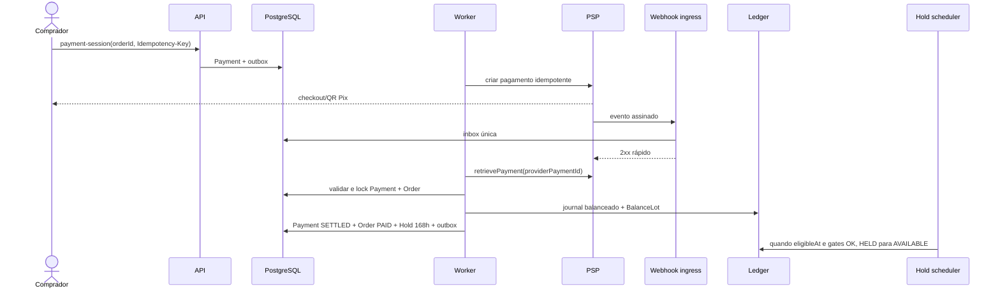
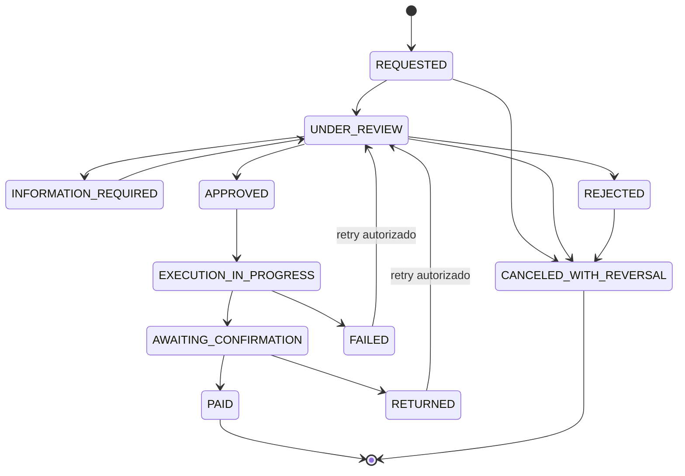
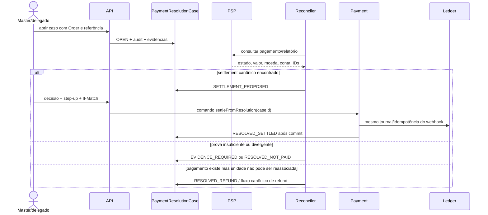

# Pagamentos, retenção, saques, reputação e progressão

> **Status:** especificação funcional e técnica proposta; nenhum runtime foi implementado por este documento  
> **Data de referência:** 22 de agosto de 2026  
> **Escopo:** confirmação de pagamento, hold de sete dias, saldo, saque manual, resolução excepcional, avaliações, confiança, níveis, recompensas, insígnias, ranking e planos de anúncio  
> **Regra de integração:** esta extensão aprofunda os domínios já existentes; não cria outro usuário, seller, pedido, pagamento, razão, saldo, catálogo ou pipeline 3D  
> **IDs:** as capacidades abaixo não recebem IDs definitivos de requisito ou tela; a matriz raiz fará a numeração sem colisões

## 1. Resultado de produto

O fluxo alvo é:

```text
Comprador paga
  → PSP confirma por API/webhook autenticado
  → Midas reconcilia valor, moeda, conta e Order
  → Payment liquidado gera journal balanceado e BalanceLot
  → Hold começa automaticamente no instante da liquidação
  → após 168 horas exatas, e somente sem bloqueio, o lote vira AVAILABLE
  → SellerAccount solicita saque
  → operação autorizada revisa a fila
  → operador realiza o pagamento fora do Midas ou pelo console/API homologado
  → baixa manual exige referência externa, comprovante e auditoria
  → vendedor acompanha solicitado, em análise, em execução, pago ou devolvido
```

Ao redor desse fluxo, a plataforma passa a oferecer:

- avaliação bilateral de 0 a 5 estrelas vinculada a uma compra real;
- indicadores separados de confiança do comprador e do vendedor;
- progressão de vendedor do nível 1 ao 10 por valor vendido elegível em BRL;
- recompensas e insígnias configuráveis pelo Master, inclusive de eventos;
- ranking mensal por pontos, premiação manual do top 3 e trilha de concessão;
- planos por anúncio com taxas de 7,5%, 10% e 12% e benefícios de prioridade expressos como fila e SLA;
- correção de pagamento não reconhecido por `PaymentResolutionCase`, nunca por edição direta de `PAID`.

## 2. Decisões inegociáveis

1. O PSP é a fonte do movimento externo; o `Ledger` é a fonte das obrigações internas.
2. Redirect, print, texto digitado, status do browser ou clique do Master não liquidam `Payment`.
3. Webhook é autenticado, deduplicado, persistido em inbox e reconciliado com consulta ao PSP.
4. O mesmo comando financeiro deve produzir o mesmo resultado sob retry, timeout, replay ou clique duplo.
5. Valor é inteiro em unidade mínima e sempre acompanhado de moeda; nenhum cálculo financeiro usa `float`.
6. `Ledger` é append-only e balanceado por moeda; correção gera lançamento compensatório.
7. Saldo exibido é projeção do `Ledger` e de `BalanceLot`, nunca coluna editável em `SellerAccount`.
8. O hold começa em `Payment.settledAt` e tem `eligibleAt = settledAt + 168h`, ambos em UTC.
9. A chegada de `eligibleAt` não ignora pedido incompleto, disputa, chargeback, refund, risco, KYC/KYB, saldo externo ou freeze.
10. Saque reserva apenas `AVAILABLE`; rejeição/cancelamento devolve por lançamento compensatório.
11. Baixa manual de saque não é um botão genérico “Marcar como pago”: exige tentativa, referência externa, comprovante, valor, moeda, executor e instante.
12. Master possui autoridade funcional por capabilities; nem Master edita fatos financeiros históricos.
13. Avaliação só existe entre os participantes do mesmo `Order` concluído; ausência de avaliação é `null`, nunca nota zero.
14. Prioridade comercial reduz posição de fila ou prazo de primeira resposta; nunca aumenta chance de aprovação de reembolso, ignora risco ou fura obrigação legal.
15. Ranking, nível e badge são derivados e reconstruíveis; não autorizam saque nem alteram `Payment`/`Ledger`.
16. Nenhuma integração entra em produção usando função mockada ou status inventado. Teste financeiro usa sandbox/conta de teste oficial e reconciliação real do provedor escolhido.

## 3. Nomenclatura e ownership

### 3.1 Objetos canônicos preservados

| Nome | Ownership e uso nesta extensão | O que não pode acontecer |
|---|---|---|
| `User` | identidade global; comprador e ator autenticado | criar “CustomerUser”, “BuyerUser” ou usuário por tenant |
| `SellerAccount` | tenant comercial, recebedor lógico, owner de vendas, lotes e payouts | guardar saldo mutável ou usar `User` como tenant implícito |
| `Order` | compra, partes, item, valor e timeline comercial | criar um pedido paralelo no módulo financeiro |
| `Payment` | intenção/tentativas e estado canônico reconciliado do pagamento | confiar em redirect ou duplicar o agregado com outra tabela de pagamento |
| `Ledger` | journals e postings imutáveis de obrigação interna | `UPDATE balance = ...` ou lançamento desbalanceado |
| `BalanceLot` | parcela de saldo por origem, moeda, hold e elegibilidade | saldo agregado sem lineage até o `Order`/`Payment` |
| `PayoutRequest` | workflow da solicitação e reserva do valor sacado | confundir pedido de saque com comprovante ou movimento bancário |
| `CatalogAsset` | mídia autorizada de catálogo | reutilizar como comprovante financeiro |
| `Model3DJob` | job assíncrono do estúdio 3D | acoplar geração 3D a pagamento, level ou ranking |
| `Model3DArtifact` | saída 3D imutável e publicada | usar como item, anúncio ou recompensa financeira |

`Payment` é o único nome do agregado financeiro da intenção à liquidação. `PaymentAttempt` preserva cada tentativa concreta; não existe uma entidade paralela chamada `PaymentIntent`.

### 3.2 Capacidades novas, sem fontes paralelas

| Capacidade | Registro próprio | Fonte que continua canônica |
|---|---|---|
| exceção de pagamento | `PaymentResolutionCase` + evidências + decisões | `Payment`, PSP, `Order` e `Ledger` |
| avaliação bilateral | `OrderReview` | partes e elegibilidade derivadas de `Order` |
| confiança | `ReputationProjection` reconstruível | reviews, pedidos, disputas, refunds e sanções canônicos |
| níveis | política versionada + contribuição + projeção | vendas elegíveis do `Order`/`Payment` |
| insígnias | definição versionada + concessão/revogação | eventos canônicos e regras publicadas |
| ranking | contribuição e snapshot mensal reconstruíveis | vendas elegíveis e reversões canônicas |
| plano do anúncio | política versionada + snapshot em `Listing`/`Order` | anúncio e pedido existentes |
| premiação | definição + concessão/fulfillment | se houver dinheiro, efeito continua no `Ledger`/payout homologado |

## 4. Gate de viabilidade do PSP e do Pix

O desenho é provider-agnostic, mas não provider-imaginário. Antes do desenvolvimento de produção, a equipe deve preencher e assinar uma matriz de capabilities por país, moeda, tipo de conta e contrato.

| Capacidade | Stripe Connect — evidência atual | Mercado Pago — evidência atual | Decisão Midas |
|---|---|---|---|
| pagamentos marketplace | [Connect oferece contas conectadas e modelos de charge/transfer](https://docs.stripe.com/connect/separate-charges-and-transfers) | [Split 1:1 usa OAuth do vendedor e divide pagamento/comissão](https://www.mercadopago.com.br/developers/pt/docs/split-payments/split-1-1/integration-configuration/integrate-marketplace) | homologar um modelo contratual por território |
| webhook | [evento assinado, corpo bruto obrigatório e eventos de connected accounts](https://docs.stripe.com/connect/webhooks) | [`x-signature`/HMAC](https://www.mercadopago.com.br/developers/pt/docs/your-integrations/notifications/webhooks) e consulta posterior do recurso | inbox assinada + GET canônico no adapter |
| idempotência | [`Idempotency-Key` em `POST`; retry devolve primeiro resultado](https://docs.stripe.com/api/idempotent_requests) | [`X-Idempotency-Key` obrigatório em pagamentos/reembolsos](https://www.mercadopago.com.br/developers/pt/news/2023/01/04/Idempotency-key-usage-will-be-mandatory) e Orders recentes | chave local + chave externa determinística |
| saldo | [contas Connect possuem `pending` e `available` separados](https://docs.stripe.com/connect/account-balances) | [relatórios expõem transação, fees, bloqueios e liberações](https://www.mercadopago.com.br/developers/pt/docs/split-payments/split-1-1/additional-content/reports/sales-report/introduction) | reconciliar PSP × `Payment` × `Ledger` × `BalanceLot` |
| hold de sete dias | payout timing depende de país/conta/produto | data de liberação e split dependem do produto/contrato | não lançar sem prova de que o arranjo suporta 168h e o papel legal da plataforma |
| saque manual no Brasil | [Stripe informa somente payouts automáticos diários para usuários no Brasil](https://docs.stripe.com/connect/manual-payouts) | [Split 1:1 automatiza a divisão](https://www.mercadopago.com.br/developers/pt/docs/split-payments/split-1-1/integration-configuration/integrate-marketplace); a documentação pública não comprova a fila manual pedida | capability deve ficar `UNSUPPORTED` até contrato/API homologados; não simular |
| Pix | é oferecido por PSP, não confirmado pelo browser | [Checkout suporta Pix](https://www.mercadopago.com.br/developers/pt/docs/checkout-api-orders/payment-integration/pix) e notificação de mudança de status | integrar Pix pelo adapter do PSP; [a API Pix do BCB descreve serviços do PSP recebedor](https://github.com/bacen/pix-api), não um endpoint de checkout do Midas |

### 4.1 Consequência de lançamento

O fluxo de saque manual solicitado só pode entrar em produção em um destes modos aprovados:

| Modo | Execução | Confirmação aceitável |
|---|---|---|
| `PROVIDER_API` | operador aprova; worker chama API homologada | provider payout ID + webhook/consulta canônica |
| `PROVIDER_DASHBOARD` | operador executa no console do PSP | provider payout ID + consulta/relatório do PSP + comprovante |
| `EXTERNAL_BANK` | operador paga por banco/Pix fora do PSP de checkout | `endToEndId` ou referência bancária única + comprovante + conciliação de extrato |

`EXTERNAL_BANK` exige aceite jurídico, financeiro, fiscal, prevenção à fraude, segregação de contas e conciliação bancária. Ele não deve ser adotado apenas porque o provider escolhido não suporta a operação.

## 5. Adapter de pagamentos e confirmação automática

### 5.1 Contrato por capacidade

O adapter escolhido deve declarar, por ambiente e conta:

```text
createPaymentSession
retrievePayment
cancelPayment
refundPayment
listSettlementEntries
retrieveProviderBalance
verifyWebhook
supportsMarketplaceSplit
supportsDelayedAvailability
supportsManualPayout
supportsPayoutStatusLookup
supportsPix
```

São nomes de capacidades, não uma segunda API de domínio. A API pública continua comandando `Order`, `Payment`, refund e `PayoutRequest`; o adapter traduz para o PSP.

### 5.2 Criação

1. A API recebe `POST /v1/orders/{orderId}/payment-session` com `Idempotency-Key`.
2. O servidor deriva comprador, `SellerAccount`, valor, moeda e fee snapshot do `Order`.
3. O servidor persiste `Payment` local em `CREATED`/`PROCESSING` e outbox na mesma transação.
4. Worker chama o PSP com chave determinística e `externalReference = orderId` opaco.
5. Credencial secreta fica somente no backend/secret manager.
6. O frontend recebe sessão/URL/token publicável do PSP, nunca chave privada.

### 5.3 Recepção de webhook

1. Ler corpo bruto, headers, rota e conta esperada.
2. Validar assinatura e tolerância temporal com biblioteca oficial do provider.
3. Rejeitar assinatura inválida sem revelar se um `Payment` existe.
4. Persistir `providerEventId`, hash do payload, headers allowlisted, horário de chegada e body cifrado/retido conforme política em inbox com unicidade.
5. Responder `2xx` rapidamente depois da persistência durável.
6. Worker obtém o recurso mais recente pela API do PSP; o payload recebido sozinho não é autorização financeira.
7. Conferir provider account, ambiente, payment ID, `Order`, seller, valor, moeda, fee, status e livemode.
8. Sob locks ordenados, aplicar uma única transição e criar journal, `BalanceLot`, `Hold` e outbox na mesma unidade transacional.
9. Replay ou evento fora de ordem é aceito/deduplicado e não repete efeito.

### 5.4 Reconciliação

Webhook reduz latência; reconciler garante completude.

- varrer pagamentos `PROCESSING`, `UNKNOWN`, timeout e eventos em DLQ;
- consultar o recurso no PSP e comparar amount/currency/account/status;
- consumir relatórios de settlement, saldo e payout quando disponíveis;
- comparar PSP × `Payment` × `Ledger` × `BalanceLot` por chave externa;
- abrir `PaymentResolutionCase` quando a divergência não tiver correção determinística;
- congelar somente o objeto/lote afetado;
- nunca “corrigir saldo” silenciosamente.

### 5.5 Sequência automática



## 6. Máquina de estado do pagamento

```text
CREATED
  → REQUIRES_ACTION
  → PROCESSING
  → SETTLED
  → PARTIALLY_REFUNDED
  → REFUNDED

CREATED | REQUIRES_ACTION | PROCESSING
  → FAILED | EXPIRED | CANCELED

SETTLED
  → CHARGEBACK_OPEN | REFUND_PENDING

evento liquidado recebido depois de FAILED | EXPIRED | CANCELED
  → PAYMENT_QUARANTINED
```

Invariantes:

- `SETTLED` exige prova canônica do PSP ou resolução manual reconciliada equivalente;
- `Order.PAID` e `Payment.SETTLED` são gravados pelo mesmo comando pós-reconciliação, não por update de interface;
- settlement tardio entra em `PAYMENT_QUARANTINED` e segue o fluxo de reassociação/refund já definido;
- partial refund não converte o total em `REFUNDED`;
- provider event, settlement command e posting têm chaves únicas independentes.

## 7. Hold exato de sete dias e saldo disponível

### 7.1 Regra temporal

```text
holdStartsAt = Payment.settledAt em UTC
eligibleAt   = holdStartsAt + 168 horas exatas
```

Esta extensão fixa a origem do relógio na confirmação canônica do pagamento, conforme o pedido atual. A consolidação raiz adotou a mesma âncora em `RF-093`, `RF-094` e `RF-228`: só existe uma `HoldPolicyVersion`, baseada em `Payment.settledAt`. A tela mostra o timestamp real e não apenas “7 dias”.

### 7.2 Estados internos e linguagem pública

No settlement:

- criar `BalanceLot` por `Order`, `SellerAccount`, moeda e fee snapshot;
- criar `Hold` ativo com `holdStartsAt` e `eligibleAt`;
- manter a obrigação em `PROTECTED` enquanto a entrega não estiver concluída;
- mover para `HELD` quando o pedido concluir, preservando o mesmo relógio já iniciado;
- agrupar `PROTECTED` e `HELD` na navegação “Em retenção”, mas mostrar o motivo exato de cada parcela.

No instante de elegibilidade:

```text
if now >= eligibleAt
and Order está concluído
and Payment está reconciliado
and não há dispute/refund/chargeback/freeze
and SellerAccount mantém gates obrigatórios
then BalanceLot → AVAILABLE
else BalanceLot permanece/fica FROZEN com reasonCode e nextAction
```

Se o pedido só concluir depois de `eligibleAt`, a liberação pode ocorrer imediatamente após o último gate, sem iniciar outro período de sete dias. “Elegível em” não é promessa de liberação quando existe bloqueio legítimo.

### 7.3 Composição monetária

Cada lote preserva:

```text
grossMerchandiseMinor
platformFeeMinor
providerFeeMinor
refundReservedMinor
chargebackDebtMinor
sellerNetMinor
currency
orderId
paymentId
sellerAccountId
listingPlanPolicyVersion
holdStartsAt
eligibleAt
releaseReasonCode
```

O saldo do seller é a soma por moeda dos postings/lotes em cada bucket. Moedas não são convertidas silenciosamente e saldos de moedas distintas não são somados em um único número.

## 8. Solicitação e fila de saque manual

### 8.1 Jornada do vendedor

1. Vendedor abre “Saldo de vendas”.
2. Visualiza `EM_RETENCAO`, `DISPONIVEL`, `RESERVADO_EM_SAQUE` e `PAGO`, por moeda.
3. Seleciona valor disponível e destino verificado.
4. Faz step-up; API revalida `SellerMembership`, KYC/KYB, cooling-off, risco, limites e saldo.
5. `PayoutRequest` é criada de modo idempotente e os lotes são reservados atomicamente.
6. A solicitação aparece na fila Master/admin autorizada.
7. O vendedor acompanha timeline, SLA, necessidade de informação, execução, pagamento, falha ou devolução.

### 8.2 Estados de `PayoutRequest`



### 8.3 Baixa manual profissional

O comando “Registrar execução” exige:

- modo de execução homologado;
- `PayoutAttempt` nova ou tentativa ainda inconclusiva;
- amount/currency idênticos ao reservado;
- destino tokenizado/verificado e snapshot mascarado;
- referência única: provider payout ID, `endToEndId` Pix ou identificador bancário;
- `executedAt`, executor, conta operacional de origem e motivo;
- comprovante privado com hash, tipo, tamanho, malware scan e retenção;
- step-up e `If-Match` da versão da solicitação.

O comando “Confirmar pagamento” exige tentativa em `AWAITING_CONFIRMATION`, prova completa e permissão distinta quando a política maker-checker se aplicar. Ele cria postings finais de `PAYOUT_IN_TRANSIT` para `PAID_OUT`; não edita os postings anteriores.

`FAILED`, `RETURNED`, referência duplicada, valor divergente ou extrato sem match nunca viram `PAID`. O cancelamento libera a reserva somente após posting compensatório.

### 8.4 Prioridade de saque por plano

Como o plano pertence ao anúncio/venda, uma solicitação não recebe prioridade máxima só por conter R$ 1 de um lote Premium.

- cada `BalanceLot` preserva a classe do plano congelada no `Order`;
- payout com lotes de classes distintas recebe a **menor** prioridade entre os lotes incluídos;
- a UI pode permitir solicitações separadas por classe;
- dentro de cada classe, ordenar por risco/gate, `dueAt` e `requestedAt`;
- prioridade nunca dispensa KYC, saldo, maker-checker, prova ou análise antifraude.

## 9. Interface financeira do Master e delegados

### 9.1 Fila única de saques

Filtros persistíveis:

- pendentes, aguardando informação, aprovados, em execução, aguardando confirmação, pagos, falhos, devolvidos e cancelados;
- plano/prioridade, aging/SLA, valor, moeda, `SellerAccount`, destino, risco e responsável;
- “meus casos”, sem responsável, vencendo hoje, vencidos e com divergência;
- período de solicitação, execução e conclusão.

Colunas mínimas:

```text
prioridade | SLA | payoutId | SellerAccount | valor/moeda | disponível de origem
destino mascarado | status | risco | owner | solicitado em | última ação
```

Painel lateral/detalhe:

- identidade e gates permitidos do seller;
- composição dos `BalanceLot` reservados;
- timeline imutável de decisões e tentativas;
- referência e comprovante, com acesso auditado;
- conciliação PSP/banco e divergências;
- botões gerados por capability e estado, não por papel visual.

### 9.2 Wireframe — fila

```text
┌ Saques ───────────────────────────────────────────────────────────────────────┐
│ [Pendentes 18] [Em execução 4] [Concluídos 126] [Falhos 2]   [Exportar]      │
│ Buscar seller/ID  Plano▾  Prioridade▾  Status▾  SLA▾  Moeda▾  Responsável▾   │
├────┬────────┬───────────────┬──────────┬───────────┬───────────┬──────────────┤
│ P1 │ 00:38  │ Loja Aurora   │ R$ 840,00│ APROVADO  │ Ana       │ [Abrir]      │
│ P2 │ 03:12  │ Seller 218    │ R$ 120,00│ EM ANÁLISE│ —         │ [Assumir]    │
│ P3 │ vencido│ Seller 044    │ R$ 75,00 │ INFO      │ Bruno     │ [Abrir]      │
└────┴────────┴───────────────┴──────────┴───────────┴───────────┴──────────────┘

Detalhe
┌ Origem dos lotes ────────┬ Destino ──────────────┬ Execução ─────────────────┐
│ 8 vendas · VIP           │ Banco *** 8921        │ referência [___________]  │
│ disponível R$ 840,00     │ verificado · 12/08    │ comprovante [Selecionar]  │
│ sem freeze/divergência   │ cooling-off concluído │ [Registrar execução]      │
└──────────────────────────┴────────────────────────┴───────────────────────────┘
```

### 9.3 Wireframe — visão do vendedor

```text
┌ Saldo de vendas ──────────────────────────────────────────────────────────────┐
│ Disponível R$ 840,00   Em retenção R$ 315,00   Em saque R$ 120,00           │
│ [Solicitar saque]   Próxima liberação: R$ 90,00 em 24/08/2026 14:35 BRT      │
├───────────────────────────────────────────────────────────────────────────────┤
│ Solicitações: [Todas] [Pendentes] [Concluídas] [Falhas]                      │
│ #PW-203 · R$ 120,00 · EM ANÁLISE · prazo previsto 23/08 10:00 · [Detalhe]   │
└───────────────────────────────────────────────────────────────────────────────┘
```

## 10. Pagamento não reconhecido e aprovação excepcional

### 10.1 Objeto obrigatório

`PaymentResolutionCase` resolve “o comprador pagou, mas o sistema não reconheceu”. Ele não substitui `Payment`, não credita saldo e não permite `UPDATE Order SET status='PAID'`.

Campos mínimos:

```text
caseId, orderId, paymentId, provider, providerAccountRef,
claimedProviderPaymentId, claimedExternalReference,
claimedAmountMinor, currency, payerEvidenceRefs[],
reasonCode, status, riskFlags[], ownerUserId,
proposedDecision, decisionReason, makerUserId, checkerUserId,
resolvedByProviderEventId, resolvedAt, version,
createdAt, updatedAt
```

### 10.2 Estados

```text
OPEN
  → RECONCILING
  → EVIDENCE_REQUIRED
  → SETTLEMENT_PROPOSED
  → CHECKER_REQUIRED
  → RESOLVED_SETTLED | RESOLVED_NOT_PAID | RESOLVED_REFUND | ESCALATED
```

### 10.3 Fluxo de decisão



### 10.4 O que significa “Master aprovar manualmente”

O Master pode abrir, assumir, propor e, conforme policy, aprovar a resolução. A decisão só segue o fluxo normal quando há uma destas provas:

- PSP retorna o pagamento como liquidado para a conta, valor, moeda e referência corretos;
- relatório oficial do PSP contém settlement reconciliável;
- pagamento por rail externo previamente autorizado possui transação bancária/Pix conciliada e referência única.

Print isolado, recibo sem match, mensagem do comprador ou comprovante editável não bastam. Quando a prova é válida, o sistema executa **o mesmo comando de settlement** usado pelo webhook; `Payment`, `Order`, `Ledger`, `BalanceLot`, `Hold` e outbox permanecem consistentes.

Corrida entre webhook e aprovação manual deve terminar em um settlement: locks, `providerPaymentId`, `providerEventId`, operation key e posting key únicos tornam a segunda operação no-op auditado.

### 10.5 Wireframe — caso

```text
┌ Pagamento não reconhecido #PRC-92 ────────────────────────────────────────────┐
│ Order #O-221 · R$ 250,00 BRL · PIX · Payment PROCESSING                     │
│ PSP consultado 14:32: SETTLED · amount OK · currency OK · account OK         │
│ Evidências: provider event · relatório settlement · E2E ID                    │
├───────────────────────────────────────────────────────────────────────────────┤
│ Decisão proposta: reconhecer settlement e seguir fluxo normal                 │
│ Motivo [WEBHOOK_NOT_DELIVERED________]  Observação interna [_____________]     │
│ [Solicitar informação] [Rejeitar] [Enviar para checker]                       │
└───────────────────────────────────────────────────────────────────────────────┘
```

## 11. Avaliação bilateral e confiança

### 11.1 Regras de `OrderReview`

- um comprador avalia o `SellerAccount` da venda;
- o seller, por `SellerMembership` autorizada, avalia o `User` comprador;
- apenas `Order` concluído, `Payment` liquidado e participante canônico é elegível;
- uma avaliação por direção e pedido: chave única `(orderId, authorSide, subjectId)`;
- nota inteira em `{0,1,2,3,4,5}`; zero é avaliação válida e ausência é `null`;
- comentário opcional passa por política de conteúdo e remoção de PII;
- submissões ficam ocultas até ambas as partes enviarem ou a janela versionada encerrar, reduzindo retaliação;
- edição é permitida somente até a revelação ou conforme janela/política explícita; cada versão fica auditada;
- moderação pode ocultar conteúdo, mas não apaga a existência da review nem altera nota sem ação auditada;
- refund/chargeback confirmado pode marcar review `VOIDED` conforme policy versionada, sem delete físico.

Estados:

```text
ELIGIBLE → SUBMITTED_HIDDEN → REVEALED
SUBMITTED_HIDDEN | REVEALED → FLAGGED → REVEALED | CONTENT_HIDDEN | VOIDED
```

### 11.2 Confiança derivada

A interface não reduz confiabilidade a uma média opaca. Exibe separadamente:

- média e distribuição de estrelas;
- quantidade de avaliações verificadas;
- pedidos concluídos e tempo de conta em faixas;
- taxa de disputa/refund em faixa, somente com denominador mínimo;
- verificação/gates vigentes;
- nível e insígnias como progressão, sem apresentá-los como garantia financeira.

`ReputationProjection` é reconstruível, versionada por fórmula e com `asOf`. Reputação de comprador e de vendedor são distintas. A fórmula pode usar suavização bayesiana para evitar que uma única avaliação de 5 estrelas supere histórico robusto, mas os fatores e a versão precisam aparecer em “Como calculamos”. Sinais privados de fraude não são expostos.

### 11.3 Antiabuso

- impedir review de pedido próprio, cancelado, não pago ou de outro tenant;
- detectar contas relacionadas, wash trading, vendas circulares e explosão de reviews;
- contribuições sob investigação ficam `PENDING_REVIEW`, não somadas silenciosamente;
- não comprar, vender ou transferir nota/badge/level;
- direito de contestação e moderação com reason code e auditoria.

## 12. Níveis de conta do vendedor

### 12.1 Métrica de progressão

O nível pertence a `SellerAccount`, porque a regra depende de valor vendido. `User` exibe o nível somente no contexto de uma membership/autoria daquela conta.

```text
qualifiedLifetimeGmvMinor = soma do valor bruto de mercadoria em BRL
                            de Orders concluídos e Payments liquidados
                            menos refunds e chargebacks canônicos
```

Taxa do plano e taxa do PSP não reduzem o GMV de progressão. Venda pendente, cancelada, em quarantine, autorreferente ou fraudulenta não conta. Só BRL entra nesta política; conversão de moeda futura exige fonte FX e política próprias.

### 12.2 Faixas literais solicitadas

“Acima de” é tratado literalmente: o valor exato do limite ainda pertence ao nível anterior.

| Nível | Intervalo em BRL | Intervalo em centavos |
|---:|---:|---:|
| 1 | R$ 0,00 até R$ 100,00 | `0..10000` |
| 2 | acima de R$ 100,00 até R$ 500,00 | `10001..50000` |
| 3 | acima de R$ 500,00 até R$ 1.000,00 | `50001..100000` |
| 4 | acima de R$ 1.000,00 até R$ 3.000,00 | `100001..300000` |
| 5 | acima de R$ 3.000,00 até R$ 5.000,00 | `300001..500000` |
| 6 | acima de R$ 5.000,00 até R$ 7.500,00 | `500001..750000` |
| 7 | acima de R$ 7.500,00 até R$ 10.000,00 | `750001..1000000` |
| 8 | acima de R$ 10.000,00 até R$ 20.000,00 | `1000001..2000000` |
| 9 | acima de R$ 20.000,00 até R$ 50.000,00 | `2000001..5000000` |
| 10 | acima de R$ 50.000,00 | `>= 5000001` |

### 12.3 Reversões e estabilidade

- contribuição é registrada por `Order`/evento e pode receber contribuição negativa de refund/chargeback;
- projeção recalcula nível; não incrementa um contador sem lineage;
- downgrade, revogação de reward e permanência de badge usam policy versionada e comunicação explícita;
- default seguro: benefício financeiro futuro acompanha o nível atual; prêmio já entregue não é confiscado automaticamente; fraude comprovada pode revogar por workflow próprio;
- mudança de thresholds não reescreve histórico: publica novo conjunto versionado de `AccountLevelDefinition` e registra regra de migração.

## 13. Recompensas, insígnias e eventos

### 13.1 Painel editável do Master

O Master ou delegado com grant específico configura:

```text
nome público
descrição e termos
tipo: LEVEL | EVENT | PREMIUM_MILESTONE | RANKING
regra e versão
vigência e timezone
elegibilidade
limite total/por conta
insígnia PNG/SVG autorizada
ordem e slot no perfil
recompensa: COSMETIC | COUPON | SERVICE_BENEFIT | MANUAL_PRIZE | CASH
fulfillment e prova exigida
política de reversão
status: DRAFT | SCHEDULED | ACTIVE | PAUSED | ENDED | ARCHIVED
```

Publicação exige preview, validação de asset, `If-Match`, step-up e auditoria. SVG é sanitizado/rasterizado para preview; arquivo público não contém script, link externo ou metadata sensível.

### 13.2 Concessão

`BadgeAward`/`RewardAward` preserva definição, versão, beneficiário (`User` ou `SellerAccount` conforme regra), evento de origem, status, `awardedAt`, `fulfilledAt`, executor e prova. Não se cria badge direto no perfil.

Estados de fulfillment:

```text
ELIGIBLE → GRANTED → CLAIMED → FULFILLED
ELIGIBLE | GRANTED → EXPIRED | REVOKED
```

Prêmio em dinheiro não pode ser “saldo promocional” mutável: passa por lançamento contábil e rail homologado ou por fulfillment externo auditado.

### 13.3 Insígnia de dez vendas Premium

- código semântico sugerido: `PREMIUM_10_COMPLETED_SALES`;
- conta dez `Order`s distintos, concluídos, liquidados, não autorreferentes e ainda não revertidos, cujo snapshot de plano é Premium;
- retry/replay não duplica contribuição;
- o grant é único por `SellerAccount` e versão da campanha;
- refund/chargeback antes do grant reduz a contagem; tratamento após o grant segue a policy publicada.

### 13.4 Clientes versus vendedores

Os níveis 1–10 definidos pelo usuário são de venda e, portanto, pertencem a `SellerAccount`. Clientes que nunca venderam podem receber insígnias de evento, compra ou fidelidade, mas uma futura progressão de comprador precisa de thresholds e nome próprios; não deve fingir “valor vendido”.

## 14. Ranking mensal de vendedores

### 14.1 Unidade e janela

- sujeito: `SellerAccount`;
- escopo: calendário mensal e timezone congelados na `LeaderboardSeason`;
- moeda inicial: BRL;
- base elegível: GMV bruto líquido de refunds/chargebacks de pedidos concluídos/liquidados no período;
- snapshot preliminar durante o mês e snapshot final após janela configurável de conciliação;
- top 3 somente do snapshot final.

### 14.2 Fórmula literal

Regra base pedida: 1 ponto a cada R$ 10.

```text
basePoints = floor(eligibleMonthlyGmvMinor / 1000)
premiumBonusPoints = floor(eligiblePremiumMonthlyGmvMinor / 100) × 0,5
totalPoints = basePoints + premiumBonusPoints
```

Implementação sem ponto flutuante:

```text
totalHalfPoints = 2 × floor(eligibleMonthlyGmvMinor / 1000)
                  + floor(eligiblePremiumMonthlyGmvMinor / 100)
displayPoints = totalHalfPoints / 2
```

### 14.3 Ambiguidade obrigatoriamente visível

O pedido Premium diz “meio ponto a mais **por real**”. A base equivale a `0,1 ponto/R$`; o bônus equivale a `0,5 ponto/R$`. Logo, em valores múltiplos de R$ 10, uma venda Premium soma `0,6 ponto/R$`, ou **seis vezes** a pontuação de uma venda comum.

Exemplo literal:

| Venda elegível | Base | Bônus Premium | Total |
|---:|---:|---:|---:|
| R$ 100 Básico/VIP | 10 | 0 | 10 pontos |
| R$ 100 Premium | 10 | 50 | 60 pontos |

Esta especificação **não altera o pedido**. O painel Master deve mostrar simulação e exigir confirmação explícita dessa razão 6× antes de publicar a política.

### 14.4 Desempate e integridade

Ordem de desempate proposta e versionada:

1. maior `totalHalfPoints`;
2. maior GMV elegível;
3. menor valor de refunds/chargebacks no período;
4. instante mais antigo em que atingiu a pontuação final;
5. chave determinística opaca.

Wash trading, compra própria, contas relacionadas, refund posterior e fraude podem congelar contribuição ou prêmio. A UI mostra “provisório” até fechamento. Toda exclusão precisa de reason code, evidência e recurso.

### 14.5 Premiação top 3

O Master configura prêmio de primeiro, segundo e terceiro lugar antes do fechamento, com termos e vigência. Após o snapshot final:

- gerar três `RewardAward`s, ou menos se não houver elegíveis;
- exigir fulfillment manual e prova quando aplicável;
- mostrar ganhadores e regras publicáveis sem expor PII;
- prêmio em dinheiro segue o controle financeiro normal;
- nenhuma edição retroativa do snapshot; correção gera versão e auditoria.

## 15. Planos por anúncio

### 15.1 Interpretação financeira

“Desconto sobre o valor da venda” é tratado como **taxa de serviço deduzida do repasse do vendedor**, calculada sobre o valor bruto de mercadoria do `Order`. A tela deve chamar de “Taxa da venda”, mostrar a conta antes da publicação e congelar a versão no anúncio e no pedido.

```text
platformFeeMinor = roundHalfUp(grossMerchandiseMinor × rateBps / 10000)
sellerNetMinor = grossMerchandiseMinor
                 - platformFeeMinor
                 - providerFeeMinor
                 - refundsMinor
                 - outros ajustes previamente divulgados
```

### 15.2 Política solicitada

| Plano | `rateBps` | Exposição | Operação | Ranking/badge |
|---|---:|---|---|---|
| Básico | `750` = 7,5% | anúncio comum | fila e SLA padrão | pontuação base |
| VIP | `1000` = 10% | prioridade acima do comum | ticket ágil, refund facilitado como menor SLA/UX guiada, saque prioritário | pontuação base |
| Premium | `1200` = 12% | prioridade máxima elegível | maior prioridade de ticket e refund | bônus literal +0,5 ponto/R$ e badge após dez vendas Premium |

### 15.3 Limites da prioridade

- relevância, disponibilidade, qualidade, segurança, diversidade e política legal continuam gates de ranking;
- “máxima” significa maior boost permitido entre anúncios elegíveis, não posição 1 garantida;
- ticket/refund prioritário significa `priorityClass` e `dueAt`, não decisão favorável;
- VIP/Premium não pulam evidência, disputa, chargeback, maker-checker ou saldo disponível;
- o usuário visualiza taxa, provider fee estimada/separada, líquido estimado e benefícios antes de aceitar;
- troca de plano após publicação cria nova revisão e não altera pedidos existentes.

### 15.4 Configuração versionada

`ListingPlanPolicyVersion` contém taxa, boosts limitados, classes de fila, critérios, vigência, mercados, comunicação e experimento. `Listing` preserva seleção; `Order` preserva snapshot. O Master pode agendar versão futura, pausar novas escolhas e comparar impacto, sem reescrever vendas históricas.

## 16. Hierarquia de telas e funções

```text
Minha conta
└── SellerAccount ativo
    ├── Saldo de vendas
    │   ├── resumo por bucket/moeda
    │   ├── lotes e retenções
    │   ├── extrato
    │   └── solicitar saque
    ├── Saques
    │   ├── pendentes
    │   ├── concluídos
    │   └── detalhe/timeline/comprovante permitido
    ├── Reputação
    │   ├── avaliações recebidas
    │   ├── avaliações a fazer
    │   └── confiabilidade explicada
    ├── Progressão
    │   ├── nível atual e próximo limiar
    │   ├── insígnias
    │   └── recompensas
    └── Ranking
        ├── mês atual provisório
        └── históricos/finais

Admin financeiro
├── Pagamentos e reconciliação
│   ├── eventos/falhas
│   ├── PaymentResolutionCase
│   └── detalhe PSP × Payment × Order × Ledger
├── Saques
│   ├── fila pendente
│   ├── em execução
│   ├── concluídos
│   └── falhos/devolvidos
└── Auditoria financeira

Master
├── grants e delegações
├── níveis e recompensas
├── biblioteca de insígnias
├── políticas de ranking/top 3
├── planos/taxas/prioridades/SLA
└── simulador e publicação de versões
```

## 17. RBAC, delegação e segregação de funções

### 17.1 Capabilities candidatas

```text
payment.read
payment.reconcile
payment.resolution.open
payment.resolution.read
payment.resolution.propose
payment.resolution.approve

payout.request
payout.read.own
payout.read.admin
payout.review
payout.request_information
payout.approve
payout.execute
payout.confirm
payout.retry
payout.cancel
payout.proof.read

review.submit
review.read.own
review.moderate
trust.read.internal

progression.policy.read
progression.policy.manage
badge.manage
reward.manage
reward.fulfill
ranking.policy.manage
ranking.finalize
listing_plan.policy.manage
audit.read.financial
```

### 17.2 Matriz funcional

| Ação | Vendedor | Operador financeiro | Checker financeiro | Master | Delegado do Master |
|---|---:|---:|---:|---:|---:|
| solicitar saque próprio | capability + membership | não | não | somente se atuar em seller próprio e sem conflito | conforme membership |
| ler fila global | não | grant | grant | grant nativo configurado | grant explícito, escopo/validade |
| analisar/solicitar informação | não | grant | grant | permitido | grant explícito |
| aprovar | não | conforme limite/SoD | grant | permitido com step-up/SoD | grant + limite |
| executar fora da plataforma | não | grant distinto | opcional por policy | permitido com step-up | grant distinto |
| confirmar baixa | não | apenas se policy permitir mesmo ator | preferencial | permitido, sempre auditado | grant + SoD |
| resolver pagamento não reconhecido | não | propor | aprovar | propor/aprovar conforme policy | grants separados |
| publicar política de nível/plano/ranking | não | não | não | permitido | grant específico |
| editar `Ledger` ou forçar `PAID` | nunca | nunca | nunca | nunca | nunca |

Guardas:

- default deny, object-level authorization e escopo de `SellerAccount` no servidor;
- grants delegados possuem recurso, ação, escopo, limite monetário, validade e revogação;
- ação sensível exige autenticação recente;
- ninguém aprova payout próprio ou caso em que possui interesse;
- acima do limite configurado, maker e checker são `User`s diferentes;
- break-glass é temporário, justificado, alertado e revisado; não libera edição do razão.

## 18. Modelo de dados lógico

### 18.1 Pagamento e resolução

| Registro | Campos/constraints essenciais |
|---|---|
| `Payment` | `orderId`, provider/account/payment IDs, amount/currency, status, settledAt, refundedAmountMinor, version; unicidade por provider account + provider payment ID |
| `ProviderEventInbox` | provider/account/event ID, signature result, payload hash, receivedAt, processedAt, status; evento único |
| `PaymentResolutionCase` | vínculos canônicos, claims, estado, maker/checker, decisão, versão, resolução; nenhum campo de saldo |
| `PaymentResolutionEvidence` | case ID, tipo, hash, storage ref privado, provider/bank ref, autor, scan, retenção |
| `ReconciliationRun` | escopo, cursores, contagens, diferenças, checksum, início/fim, resultado |

### 18.2 Hold, saldo e saque

| Registro | Campos/constraints essenciais |
|---|---|
| `BalanceLot` | seller/order/payment, moeda, bruto/fees/líquido, estado, plan snapshot, timestamps, version |
| `Hold` | lot ID, startsAt, eligibleAt, status, reasonCode, freeze refs; um hold ativo por lote/policy |
| `PayoutRequest` | seller, amount/currency, destination token, priority, state, owner, SLA, version, idempotency fingerprint |
| `PayoutAllocation` | payout ID + lot ID + amount; soma igual ao solicitado e nunca acima do disponível |
| `PayoutAttempt` | modo, attempt number, external ref, status, amount/currency, executor, timestamps; ref externa única |
| `PayoutEvidence` | attempt ID, hash, private object ref, mime/bytes/scan, retention, uploader |

### 18.3 Reputação, progressão e planos

| Registro | Campos/constraints essenciais |
|---|---|
| `OrderReview` | order, author/subject/side, stars 0..5, texto moderado, estado, versão; uma por direção |
| `ReputationProjection` | subject/type, formula version, factors, counts, score/band, asOf; reconstruível |
| `AccountLevelDefinition` | nível, thresholds em centavos, moeda, vigência, status e regra de migração |
| `ProgressionContribution` | seller, order/event, amountMinor positivo/negativo, reason, occurredAt; chave de evento única |
| `AccountLevelAssignment` | seller, definition set/version, qualified GMV, level, asOf; reconstruível |
| `BadgeDefinition` | código, versão, arte, regra, slots, vigência e reversão |
| `BadgeAward` | definição/versão, subject, source event, estado e timestamps; unicidade definida pela regra |
| `RewardDefinition` | tipo, versão, termos, fulfillment, limites, vigência e reversão |
| `RewardAward` | definição/versão, subject, source, status, prova e executor |
| `LeaderboardSeason` | janela, timezone, fórmula, fechamento, desempate e prêmios |
| `LeaderboardContribution` | seller, order/event, base/bonus half-points, status e reversão |
| `LeaderboardProjection` | temporada/seller, GMV, pontos, posição, final/provisório e checksum |
| `ListingPlanPolicyVersion` | rates bps, boosts, SLA classes, vigência, território e status |

Índices incluem `sellerAccountId + status + createdAt`, `status + dueAt + priority`, `orderId`, referências PSP, referências externas, mês de ranking e event IDs. RLS/PEP aplica tenant nas tabelas de seller; tabelas globais administrativas exigem grants de plataforma.

## 19. APIs candidatas

As rotas abaixo complementam contratos já descritos. OpenAPI 3.1 deve fechar schemas, `operationId`, errors, cursor, ETag e idempotência antes do código.

### 19.1 Pagamento e resolução

```text
POST /v1/orders/{orderId}/payment-session
POST /v1/webhooks/payments/{provider}                         # sem sessão de usuário
GET  /v1/admin/payments?status=&provider=&cursor=
GET  /v1/admin/payments/{paymentId}/reconciliation

POST /v1/admin/payment-resolution-cases                     # Idempotency-Key
GET  /v1/admin/payment-resolution-cases?status=&owner=&cursor=
GET  /v1/admin/payment-resolution-cases/{caseId}
POST /v1/admin/payment-resolution-cases/{caseId}/claim       # If-Match
POST /v1/admin/payment-resolution-cases/{caseId}/evidence
POST /v1/admin/payment-resolution-cases/{caseId}/reconcile
POST /v1/admin/payment-resolution-cases/{caseId}/decision    # step-up + If-Match
```

### 19.2 Saldo e payout

```text
GET  /v1/sales-balance?sellerAccountId=
GET  /v1/sales-balance/holds?sellerAccountId=&status=&cursor=
POST /v1/payouts                                             # Idempotency-Key
GET  /v1/payouts?sellerAccountId=&status=&cursor=
GET  /v1/payouts/{payoutId}

GET  /v1/admin/payouts?status=&priority=&sla=&owner=&cursor=
POST /v1/admin/payouts/{payoutId}/claim                      # If-Match
POST /v1/admin/payouts/{payoutId}/request-information
POST /v1/admin/payouts/{payoutId}/decision                   # approve/reject
POST /v1/admin/payouts/{payoutId}/attempts                    # registrar execução
POST /v1/admin/payout-attempts/{attemptId}/evidence
POST /v1/admin/payout-attempts/{attemptId}/confirm            # baixa manual
POST /v1/admin/payouts/{payoutId}/retry
POST /v1/admin/payouts/{payoutId}/cancel
```

### 19.3 Review, confiança, nível, badge, ranking e plano

```text
GET  /v1/orders/{orderId}/review-eligibility
POST /v1/orders/{orderId}/reviews                            # Idempotency-Key
GET  /v1/seller-accounts/{sellerAccountId}/reputation
GET  /v1/users/{userId}/public-trust
GET  /v1/seller-accounts/{sellerAccountId}/progression
GET  /v1/leaderboards/sellers?month=

GET  /v1/listing-plans
POST /v1/listings/{listingId}/plan-selection                 # nova revision/version

GET  /v1/master/progression-policies
POST /v1/master/progression-policies
POST /v1/master/progression-policies/{versionId}/publish
GET  /v1/master/badges
POST /v1/master/badges
POST /v1/master/badges/{versionId}/publish
GET  /v1/master/rewards
POST /v1/master/rewards
POST /v1/master/reward-awards/{awardId}/fulfill
GET  /v1/master/leaderboard-seasons
POST /v1/master/leaderboard-seasons
POST /v1/master/leaderboard-seasons/{seasonId}/finalize
GET  /v1/master/listing-plan-policies
POST /v1/master/listing-plan-policies
POST /v1/master/listing-plan-policies/{versionId}/publish
```

## 20. Eventos

### 20.1 Financeiros

```text
payment.session_created
payment.provider_event_received
payment.reconciliation_started
payment.reconciliation_diverged
payment.settled
payment.resolution_case_opened
payment.resolution_proposed
payment.resolution_decided
payment.resolution_settled

funds.hold_started
funds.hold_frozen
funds.available
payout.requested
payout.information_requested
payout.approved
payout.execution_recorded
payout.confirmation_required
payout.paid
payout.failed
payout.returned
payout.reversed
```

`payment.resolution_settled` descreve a origem humana do workflow; a conclusão financeira continua sendo `payment.settled` + `ledger.entry_posted`. `payout.paid` só sai após baixa válida e postings finais.

### 20.2 Confiança e progressão

```text
review.eligible
review.submitted
review.revealed
review.moderated
trust.snapshot_rebuilt
progression.contribution_recorded
seller.level_changed
badge.granted
badge.revoked
reward.granted
reward.fulfilled
ranking.snapshot_rebuilt
ranking.month_finalized
listing.plan_selected
listing_plan.policy_published
```

Todo evento usa envelope versionado, `eventId`, aggregate/version, correlation/causation, actor e classificação. PII, credencial, comprovante e payload financeiro integral não trafegam em evento de analytics.

## 21. Regras de fila e SLA

Cada caso recebe:

```text
priorityClass = STANDARD | HIGH | MAXIMUM | RISK_OVERRIDE
dueAt
agingSeconds
riskBand
owner
queueReason
```

Ordenação recomendada:

1. bloqueio legal/risco e incidentes críticos;
2. SLA vencido;
3. `priorityClass` comercial aplicável;
4. menor `dueAt`;
5. mais antigo `requestedAt`.

Os tempos reais de Básico, VIP e Premium ficam configuráveis e só são publicados após capacidade operacional medida. A UI deve usar “prioridade” e “prazo de primeira análise”, não prometer reembolso ou saque aprovado.

## 22. Métricas e observabilidade

| Área | Métricas mínimas |
|---|---|
| pagamento | approval rate por provider/método; webhook auth failure; ack p50/p95/p99; settlement latency; replay/out-of-order; pagamentos presos por estado |
| reconciliação | itens comparados; divergências por causa/aging; casos abertos/resolvidos; valor congelado; tempo até resolução |
| hold | valor e lotes por bucket; tempo até available; bloqueios por razão; scheduler lag; release em 168h quando elegível |
| payout | valor/contagem por estado; fila/aging/SLA por prioridade; tempo request→review→execute→paid; falha/return; referência duplicada; saldo reservado |
| reviews | elegibilidade→submissão; distribuição 0..5; bilateralidade; flags/ocultação; concentração/anomalia |
| confiança | fórmula/version; cobertura; freshness; disputas e refunds com denominador seguro |
| níveis | sellers por nível; tempo de progressão; reversões; políticas ativas; grants pendentes |
| ranking | GMV e pontos por classe; bônus Premium; posições provisórias/finais; contribuições excluídas; prêmio pendente |
| planos | adoção, conversão, GMV, fee, refunds, tickets, SLA e qualidade por plano; efeito do boost em diversidade |

Metas candidatas para validação, não promessas comerciais:

- webhook válido persistido e respondido em `p95 < 500 ms`, sem lógica pesada síncrona;
- read model atualizado em `p95 < 60 s` depois do settlement processado;
- atraso do scheduler de hold monitorado em segundos e nunca liberando antes de `eligibleAt`;
- 100% dos journals balanceados e 100% dos payouts `PAID` com tentativa e referência externa;
- alertar imediatamente settlement/posting duplicado, saldo negativo inesperado e payout sem comprovante no modo manual.

Logs/traces propagam `traceId`, `correlationId`, `orderId`, `paymentId`, `caseId`, `payoutId` e provider request ID em campos protegidos. IDs de usuário/seller não viram labels métricas de alta cardinalidade.

## 23. Testes P0 — prova executável sem mocks de negócio

### 23.1 Pagamento

1. Sandbox oficial confirma cartão/Pix; redirect sem webhook/API não marca pago.
2. Assinatura inválida é rejeitada; corpo alterado falha verificação.
3. Mesmo webhook 100 vezes cria um settlement, um journal e um `BalanceLot`.
4. Eventos fora de ordem não regredem estado.
5. amount, currency, provider account, environment ou external reference divergente abre caso e não liquida.
6. Timeout da criação com retry e mesma chave não cria segundo pagamento.
7. Reconciler recupera settlement cujo webhook nunca chegou.
8. Settlement tardio entra em quarantine e não libera item/segredo automaticamente.
9. Webhook e resolução manual concorrentes produzem um efeito financeiro.

### 23.2 Hold e saldo

10. Em `167:59:59` o lote não é `AVAILABLE`; em `168:00:00`, com todos os gates, pode ser liberado.
11. Disputa aberta um segundo antes de `eligibleAt` congela o lote.
12. Pedido não concluído depois de 168h não libera; ao concluir sem bloqueio, libera sem novo relógio.
13. Refund parcial divide/reverte somente a parcela correspondente.
14. Reconstruir saldo do `Ledger` reproduz todos os buckets e lotes.

### 23.3 Saque

15. Dois saques concorrentes não reservam o mesmo `AVAILABLE`.
16. Clique duplo com mesma chave retorna o mesmo `PayoutRequest`; payload diferente recebe conflito.
17. Tentativa manual sem referência, comprovante ou scan aprovado não avança.
18. Referência externa repetida em outro payout falha fechada.
19. Operador sem grant, cross-tenant ou em conflito não lê/executa/confirma.
20. `FAILED`/`RETURNED` nunca aparece como `PAID`.
21. Rejeição/cancelamento só devolve `AVAILABLE` após posting compensatório.
22. Payout misto Básico/Premium recebe a menor prioridade dos lotes.

### 23.4 Review, nível, badge e ranking

23. Nota 0 é persistida como zero; ausência continua `null`.
24. Estranho, seller diferente ou pedido não concluído não avalia.
25. As avaliações ficam ocultas até bilateralidade ou fim da janela.
26. Limites de nível são testados em cada centavo anterior, exato e posterior; R$ 100,00 é L1 e R$ 100,01 é L2.
27. Refund/chargeback emite contribuição negativa e reconstrói nível/ranking.
28. Dez vendas Premium únicas concedem um badge; replay e retry não contam duas vezes.
29. R$ 100 Premium produz literalmente 60 pontos; R$ 100 Básico/VIP produz 10.
30. Mudança de policy não reescreve snapshot final anterior.
31. Seller suspenso/fraude não recebe prêmio até decisão.

### 23.5 Planos e autorização

32. Taxas de 7,5%, 10% e 12% batem nos limites de arredondamento em centavos.
33. `Order` antigo conserva plan/rate snapshot depois de mudança de policy.
34. Prioridade altera ordem/SLA, mas não resultado de risk/refund.
35. Master e delegado obedecem grants, limite, validade, step-up e SoD.
36. Nenhuma rota administrativa permite update/delete de posting confirmado.

Testes de integração usam Stripe sandbox/CLI e contas de teste do Mercado Pago quando esses providers forem escolhidos. Fixtures podem repetir payloads assinados capturados no ambiente de teste; não substituem a prova ponta a ponta do provider.

## 24. Riscos, ambiguidades e decisões que ainda exigem aceite

| Tema | Risco/ambiguidade | Gate antes de produção |
|---|---|---|
| retenção/custódia | hold e payout podem caracterizar responsabilidades regulatórias/contratuais distintas | parecer jurídico-financeiro e contrato do PSP |
| Stripe Brasil | manual payouts não suportados segundo documentação atual | não selecionar esse modo sem confirmação contratual posterior |
| Mercado Pago Split | split 1:1 automatiza repasse e pode não permitir a fila manual desejada | validação técnica/comercial com conta assessorada |
| Pix | BCB especifica o arranjo/API para PSP; Midas não presume ser participante | integrar via PSP/banco homologado |
| âncora de 168h | **resolvido na especificação:** `Payment.settledAt + 168h`, com conclusão do pedido como gate de liberação | manter uma única `HoldPolicyVersion` e provar os limites temporais |
| “desconto” | pode significar desconto ao comprador ou comissão do vendedor | esta spec interpreta como taxa da venda; validar copy/termos |
| Premium 6× | `+0,5/R$` é seis vezes a pontuação total da base | Master confirma simulação antes de publicar |
| níveis de cliente | thresholds fornecidos medem venda, não compra | manter nível em `SellerAccount`; definir fidelidade do comprador separadamente |
| reversão de level/badge | refund tardio pode retirar elegibilidade | publicar policy de downgrade/revogação |
| prêmio top 3 | dinheiro, bem ou benefício podem ter efeito fiscal/promocional | termos, orçamento, fulfillment e tributação aprovados |
| prioridade paga | risco de percepção de decisão comprada | prioridade só de fila/SLA, disclosure e auditoria |
| avaliação 0 | ecossistemas comuns usam 1–5; aqui zero é nota real | copy explícita, analytics distinguindo zero de ausência |
| moeda global | thresholds e ranking estão em BRL | não converter sem fonte FX/policy versionada |
| prova manual | comprovante pode conter PII e ser fraudado | storage privado, hash, scan, acesso auditado, conciliação |

## 25. Ordem de implementação recomendada

1. Homologar PSP/rail, papéis legais, contas, split, hold, payout e Pix.
2. Fechar OpenAPI, webhooks, matriz de provider capabilities e sandbox ponta a ponta.
3. Implementar `Payment` + adapter + inbox/outbox + reconciliação + `Ledger`.
4. Implementar `BalanceLot`/`Hold` de 168h e projeção de saldo.
5. Implementar `PayoutRequest`, reserva, fila Master, tentativa, comprovante e baixa manual.
6. Implementar `PaymentResolutionCase` usando o mesmo settlement command.
7. Implementar avaliações bilaterais e projeção de confiança.
8. Implementar políticas de nível, contribuições e snapshots.
9. Implementar biblioteca de badge, rewards e fulfillment.
10. Implementar ranking mensal, fechamento, top 3 e simulação Premium 6×.
11. Implementar planos de anúncio, fee snapshot, prioridade e medição de impacto.
12. Executar testes P0, segurança, autorização cross-tenant, reconciliação e operação assistida.

Nenhuma etapa posterior deve compensar ausência das bases financeiras. Gamificação só lê fatos já conciliados.

## 26. Fontes oficiais pesquisadas

### Stripe

- [Stripe — Receive events in your webhook endpoint](https://docs.stripe.com/webhooks) — assinatura sobre corpo bruto, resposta rápida e processamento de eventos assíncronos.
- [Stripe — Connect webhooks](https://docs.stripe.com/connect/webhooks) — eventos de contas conectadas, `balance.available` e falhas de payout.
- [Stripe — Idempotent requests](https://docs.stripe.com/api/idempotent_requests) — retries seguros e comportamento de `Idempotency-Key`.
- [Stripe — Understanding Connect account balances](https://docs.stripe.com/connect/account-balances) — saldos `pending`/`available`, contas separadas e impactos de refunds/chargebacks.
- [Stripe — Using manual payouts](https://docs.stripe.com/connect/manual-payouts) — limites de retenção, escopo da Payouts API e indisponibilidade atual de manual payouts para usuários no Brasil.
- [Stripe — Separate charges and transfers](https://docs.stripe.com/connect/separate-charges-and-transfers) — separação entre charge de plataforma e transferência para connected accounts.
- [GitHub oficial — stripe-node](https://github.com/stripe/stripe-node) e [exemplo de webhook signing](https://github.com/stripe/stripe-node/tree/master/examples/webhook-signing) — SDK server-side e validação oficial.
- [GitHub oficial — Stripe CLI](https://github.com/stripe/stripe-cli) — disparo, reenvio e inspeção de eventos em ambiente de teste.

### Mercado Pago

- [Mercado Pago — Split de Pagamentos 1:1](https://www.mercadopago.com.br/developers/pt/docs/split-payments/split-1-1/integration-configuration/integrate-marketplace) — OAuth por vendedor, comissão e divisão automática.
- [Mercado Pago — Pré-requisitos do Split 1:1](https://www.mercadopago.com.br/developers/pt/docs/split-payments/split-1-1/prerequisites) — KYC, OAuth, disponibilidade e dependências comerciais.
- [Mercado Pago — Webhooks](https://www.mercadopago.com.br/developers/pt/docs/your-integrations/notifications/webhooks) — `x-signature`, HMAC e configuração de eventos.
- [Mercado Pago — Pix no Checkout](https://www.mercadopago.com.br/developers/pt/docs/checkout-api-orders/payment-integration/pix) — criação, status e dados do QR/copia e cola.
- [Mercado Pago — Idempotência em pagamentos e reembolsos](https://www.mercadopago.com.br/developers/pt/news/2023/01/04/Idempotency-key-usage-will-be-mandatory) — obrigatoriedade de `X-Idempotency-Key` para integrações novas.
- [Mercado Pago — Relatório de vendas Split](https://www.mercadopago.com.br/developers/pt/docs/split-payments/split-1-1/additional-content/reports/sales-report/introduction) — fees, liquidação, bloqueios e reconciliação.
- [GitHub oficial — SDK Node.js Mercado Pago](https://github.com/mercadopago/sdk-nodejs) — SDK backend e opção de idempotência.
- [GitHub oficial — OpenAPI Mercado Pago](https://github.com/mercadopago/openapi) — contratos e recomendação de validar webhook e consultar o recurso atualizado.

### Banco Central do Brasil

- [Banco Central — Pix](https://www.bcb.gov.br/estabilidadefinanceira/pix) — página institucional do arranjo.
- [Banco Central — Manual de Padrões para Iniciação do Pix](https://www.bcb.gov.br/content/estabilidadefinanceira/pix/Regulamento_Pix/II_ManualdePadroesparaIniciacaodoPix.pdf) — especificação, comunicação com PSP e requisitos de segurança.
- [GitHub oficial Bacen — pix-api](https://github.com/bacen/pix-api) — especificação OpenAPI oficial da API Pix.
- [Bacen — openapi.yaml da API Pix](https://github.com/bacen/pix-api/blob/master/openapi.yaml) — cobranças, acompanhamento de Pix, devoluções e consultas no contexto do PSP recebedor.

## 27. Critério de pronto desta extensão

Esta especificação pode ser integrada à matriz raiz quando:

- a nomenclatura canônica estiver preservada sem entidades financeiras duplicadas;
- a política única `Payment.settledAt + 168h` e seus gates permanecerem alinhados nos contratos e testes;
- provider/território estiverem marcados como `SUPPORTED`, `UNSUPPORTED` ou `CONTRACT_REQUIRED` por capability;
- a baixa manual exigir tentativa, referência, comprovante, autorização e postings;
- `PaymentResolutionCase` não expuser nenhum caminho de update direto de `PAID`;
- níveis, ranking, planos, badge e rewards tiverem versões, lineage e reversão;
- a razão 6× do Premium estiver explicitamente aceita ou mantida como bloqueio de publicação;
- APIs, eventos, permissões e testes P0 forem incorporados sem IDs colidentes.
