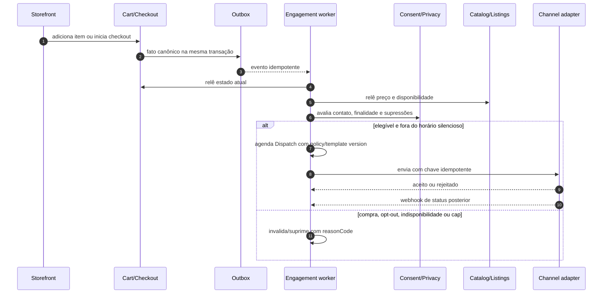
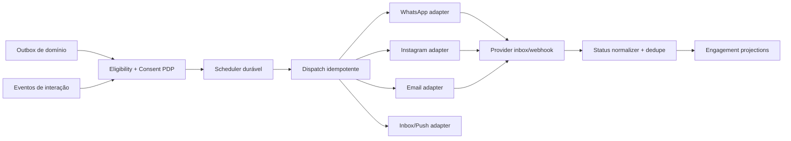
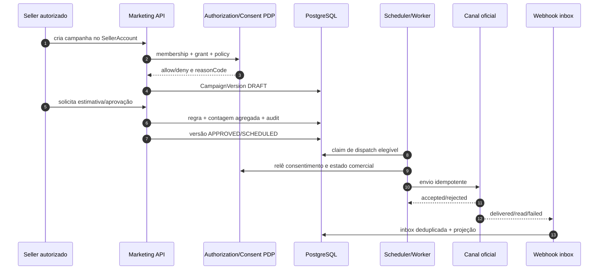

# Marketing, pós-venda e relacionamento omnicanal — Midas Marketplace

Versão 1.0 · Documento pré-código · 22 de agosto de 2026 · **PROPOSTA PARA ACEITE**

> **Estado real:** este repositório contém documentação, não uma aplicação executável. As funções, rotas, integrações e contratos descritos abaixo ainda não estão implementados. Não há mensagens, contatos, campanhas, métricas ou conectores simulados.

## 1. Resultado pretendido

Transformar carrinho, compra e entrega em uma jornada de relacionamento mensurável, sem entregar ao vendedor o telefone do comprador nem criar um CRM paralelo ao marketplace.

O desenho cobre:

- recuperação de carrinho e checkout interrompido;
- comunicação transacional e pós-venda;
- recompra, renovação e expiração orientadas pela classificação canônica do produto;
- recomendação de produtos complementares sem inclusão automática no carrinho;
- campanhas com texto, imagem, vídeo, criativo e link rastreável;
- WhatsApp Cloud API, Instagram Messaging, e-mail, inbox e push por adaptadores oficiais;
- cupom, afiliado, link/código e atribuição auditável;
- painel do vendedor limitado ao `SellerAccount` e comando global para Master/staff autorizado;
- consentimento por finalidade, descadastro, horário silencioso e limite de frequência;
- métricas derivadas de fatos reais, nunca estimadas como se fossem observadas.

Não faz parte deste desenho:

- expor agenda, telefone, e-mail ou identificador social de comprador ao vendedor;
- permitir disparo frio no Instagram ou WhatsApp;
- usar scraping, automação de navegador ou login não oficial em redes sociais;
- tratar entrega aceita pela API como mensagem entregue ou lida;
- permitir que uma ferramenta de marketing edite `Order`, `Payment`, ledger, saldo, hold, payout ou avaliação;
- criar perfil comportamental individual para revenda ou exportação;
- prometer recompra, conversão, receita ou retorno sem base observada.

## 2. Decisões de arquitetura

### 2.1 Fontes de verdade

| Informação | Fonte canônica | O marketing pode fazer |
|---|---|---|
| identidade e autenticação | `User` no módulo Identity | referenciar chave pseudonimizada |
| telefone/e-mail e preferências | cofre de contato + Consent/Privacy | resolver no worker autorizado; nunca devolver ao seller |
| tenant comercial | `SellerAccount` | escopar audiência, campanha, custo e relatório |
| permissão para operar o tenant | `SellerMembership` | validar capacidade em toda consulta e comando |
| catálogo e ciclo de vida | Catalog | consultar classificação, expiração e relações de produto |
| carrinho | Cart/Checkout | projetar candidato a recuperação |
| compra e entrega | Order/Delivery | reagir a fatos canônicos |
| pagamento, reembolso e disputa | Payments/Refunds/Disputes | suprimir ou encerrar jornada conforme o fato |
| preço, desconto e cupom | Pricing/Promotions | solicitar avaliação e aplicar contrato publicado |
| obrigação financeira | Ledger | ler receita conciliada; nunca calcular saldo paralelo |
| reputação | Ratings/Trust | solicitar avaliação e mostrar agregado autorizado |
| interação de campanha | Engagement/Analytics | registrar envio, entrega, clique e atribuição |

### 2.2 Invariantes

1. `SellerAccount` é o único tenant comercial; `Campaign`, `Audience` e `ChannelConnection` carregam `sellerAccountId` explícito quando pertencem a vendedor.
2. `User` não vira `Lead`, `Contact` ou `Customer` duplicado. Ferramentas externas recebem uma chave pseudônima e o mínimo de atributos necessário.
3. O vendedor seleciona uma audiência elegível; a plataforma resolve os destinatários e envia. O vendedor não recebe lista de telefone/e-mail.
4. Opt-in e opt-out são comandos canônicos. Clique, leitura ou compra não criam consentimento de marketing por inferência.
5. Um opt-out global ou do canal prevalece sobre campanha, automação, cupom, prioridade comercial e plano de anúncio.
6. Mensagem transacional não pode carregar promoção disfarçada. Finalidade e template são separados.
7. Um fato de compra, reembolso, disputa, indisponibilidade ou consentimento invalida candidatos e mensagens ainda não enviadas.
8. Cada envio possui chave idempotente, versão de template, versão da política, finalidade, ator e correlação.
9. Webhook de canal é entrada não confiável: assinatura, timestamp, replay, deduplicação e transição de estado são verificados no servidor.
10. Redis acelera agenda, locks, rate limit e cache; PostgreSQL preserva decisões, consentimentos, campanhas, tentativas e auditoria.

## 3. Hierarquia de nomenclatura

### 3.1 Contextos funcionais

```text
Platform
├── IdentityPrivacy
│   ├── User
│   ├── ContactPoint
│   ├── ConsentRecord
│   └── SuppressionEntry
├── SellerAccount
│   ├── SellerMembership
│   ├── ChannelConnection
│   ├── AudienceDefinition
│   ├── Campaign
│   └── SellerEngagementProjection
├── Catalog
│   ├── CatalogItem
│   ├── ProductLifecyclePolicy
│   └── CatalogItemRelation
├── Commerce
│   ├── Cart
│   ├── Checkout
│   ├── Order
│   └── Listing
├── Engagement
│   ├── MessageTemplate
│   ├── CreativeAsset
│   ├── Journey + JourneyVersion
│   ├── Dispatch
│   ├── DeliveryAttempt
│   └── ChannelEvent
└── GrowthProjection
    ├── RecoveryCandidate
    ├── LifecycleCandidate
    ├── CampaignAggregate
    └── AttributionContribution
```

`RecoveryCandidate`, `LifecycleCandidate` e os agregados são read models reconstruíveis. Eles apontam para os objetos canônicos; não copiam o carrinho, o pedido, a pessoa ou o saldo.

### 3.2 Vocabulário obrigatório

| Nome | Significado | Não confundir com |
|---|---|---|
| `ContactPoint` | endereço de canal cifrado/tokenizado, pertencente ao usuário | lista exportável do vendedor |
| `ConsentRecord` | permissão demonstrável por canal, finalidade, remetente e escopo | preferência visual ou aceite genérico |
| `SuppressionEntry` | bloqueio de envio por opt-out, hard bounce, denúncia ou política | ban de conta |
| `ChannelConnection` | credencial e configuração de um remetente oficial | contato do comprador |
| `AudienceDefinition` | regra versionada que seleciona elegíveis | snapshot eterno de pessoas |
| `Campaign` | identidade, objetivo, escopo, orçamento e ciclo de vida; configuração ativa fica em `CampaignVersion` | mensagem já enviada |
| `CampaignVersion` | versão imutável aprovada para execução | edição em produção |
| `Journey` + `JourneyVersion` | identidade e grafo versionado de gatilhos, esperas e saídas | estado de pedido |
| `MessageTemplate` | conteúdo parametrizado e aprovado para canal/finalidade | HTML ou payload livre |
| `CreativeAsset` | imagem/vídeo/documento validado e versionado | URL arbitrária do seller |
| `Dispatch` | decisão de tentar uma mensagem para um sujeito/canal | entrega confirmada |
| `DeliveryAttempt` | tentativa concreta em um provedor | conversão |
| `ChannelEvent` | status autenticado do provedor | fato financeiro |
| `RecoveryCandidate` | carrinho que passou pelas regras de elegibilidade | carrinho abandonado definitivo |
| `CatalogItemRelation` | relação `COMPLEMENTARY`, `UPSELL`, `RENEWAL` ou `REORDER` | recomendação criada por texto livre |
| `AttributionTouch` | interação observada com origem verificável | crédito financeiro |
| `AttributionSnapshot` | regras e contribuições congeladas para uma compra | substituto do ledger |

## 4. Classificação do produto e retorno esperado

A intenção de recompra não deve ser adivinhada pela descrição do anúncio. O admin de catálogo define uma `ProductLifecyclePolicy`; o vendedor escolhe o item e herda a política.

### 4.1 Dimensões canônicas

| Campo | Valores propostos | Uso |
|---|---|---|
| `consumptionMode` | `PERMANENT_ENTITLEMENT`, `CONSUMABLE`, `TIME_BOUND`, `SINGLE_USE_CODE`, `SERVICE` | decidir se repetir o mesmo item faz sentido |
| `repeatability` | `NONE`, `REORDERABLE`, `RENEWABLE` | habilitar ou negar recompra/renovação |
| `expiryMode` | `NONE`, `FIXED_AT_DATE`, `FROM_ACTIVATION`, `PROVIDER_REPORTED` | calcular lembrete somente com data confiável |
| `returnEligibilityMode` | referência a política canônica | mostrar regra vigente; não inferir pelo canal |
| `recommendationMode` | `NONE`, `COMPLEMENT_ONLY`, `REORDER`, `RENEW` | controlar cards e jornadas permitidas |
| `fulfillmentMode` | valor canônico já definido por Catalog/Delivery | impedir campanha incompatível com entrega |
| `channelPolicyClass` | classe aprovada por canal e região | bloquear categoria incompatível antes do envio |

Exemplos de configuração, não cadastros implementados:

| Família | Configuração esperada | Pós-venda permitido |
|---|---|---|
| skin/item cosmético permanente | `PERMANENT_ENTITLEMENT` + `NONE` | complementos e avaliação; não oferecer a mesma unidade como renovação |
| assinatura digital, como Nitro | `TIME_BOUND` + `RENEWABLE` | lembrete antes da expiração se a data vier do pedido/provedor |
| crédito ou código de loja | `SINGLE_USE_CODE` ou `CONSUMABLE` + `REORDERABLE` | recompra, desde que o pedido anterior tenha sido concluído |
| serviço com duração | `SERVICE` + política explícita | renovação ou nova contratação conforme contrato do catálogo |

Regras:

- sem `expiryMode` e data de origem confiável, não existe lembrete de vencimento;
- o vendedor não altera a classificação para liberar campanha proibida;
- mudança de política cria versão nova e não reinterpreta mensagens históricas;
- itens devolvidos, reembolsados, disputados, indisponíveis ou incompatíveis saem da jornada;
- recomendação complementar nunca adiciona, pré-seleciona ou cobra um item sem ação explícita do comprador.

## 5. Carrinho e checkout interrompido

### 5.1 Estados

O carrinho canônico mantém estados comerciais. “Abandono” é uma condição temporal derivada, não uma verdade permanente.

```text
ACTIVE ──> CHECKOUT_STARTED ──> ORDER_CREATED ──> COMPLETED
   │               │                   │
   ├───────────────┴───────────────────┴──> EXPIRED
   └──────────────────────────────────────> MERGED
```

Uma projeção `RecoveryCandidate` pode estar em:

```text
OBSERVING -> ELIGIBLE -> QUEUED -> SENT -> CONVERTED
                 │          │        ├──> SUPPRESSED
                 │          │        └──> EXPIRED
                 └──────────┴────────────> INVALIDATED
```

### 5.2 Captura de intenção sem coerção

Na primeira tentativa relevante, a interface pergunta separadamente:

1. **Salvar este carrinho?** Permite recuperar o carrinho na conta/inbox.
2. **Receber lembrete?** Escolha por canal e finalidade; desmarcado por padrão até decisão de produto/compliance.
3. **Qual canal?** Inbox/e-mail/WhatsApp disponível apenas quando o `ContactPoint` foi verificado e o canal aceito.

Não se exige WhatsApp para comprar. Um telefone já existente permanece mascarado; a tela mostra apenas que há um destino verificado. “Agora não” conclui a etapa sem penalidade.

### 5.3 Elegibilidade

Um candidato só pode ser criado quando:

- carrinho pertence a sujeito autenticado ou a jornada anônima recuperável de forma segura;
- houve inatividade maior que a janela versionada da política;
- nenhum `Order` concluído ou pagamento compatível surgiu depois;
- itens continuam publicados, disponíveis, compatíveis e com preço revalidável;
- o contato e o consentimento cobrem canal, finalidade e remetente;
- não há supressão, disputa, fraude, restrição ou regra de categoria impeditiva;
- horário silencioso e limite de frequência permitem agenda futura;
- não existe `Dispatch` idempotente equivalente.

A janela não fica hardcoded no frontend. Master configura limites operacionais dentro de guardrails; mudança passa a valer em uma nova versão de política.

### 5.4 Sequência



## 6. Pós-venda, fidelização e próxima compra

### 6.1 Jornada base

| Marco real | Mensagem elegível | Saída obrigatória |
|---|---|---|
| `payment.settled` | confirmação e próximos passos de entrega | pagamento revertido, risco ou pedido cancelado |
| entrega disponibilizada | instrução transacional segura | disputa, falha ou expiração |
| `order.completed` | agradecimento e avaliação bilateral | avaliação já enviada ou opt-out |
| hold liberado | somente informação ao vendedor, não promoção ao comprador | lote bloqueado ou disputa |
| expiração conhecida se aproximando | renovação | renovado, reembolsado, data ausente ou consentimento revogado |
| janela de recompra elegível | recompra do mesmo tipo | item incompatível, indisponível ou frequência excedida |
| relação de catálogo válida | complemento contextual | compra do complemento, exclusão da relação ou supressão |

### 6.2 Complemento animado no produto

O catálogo define `CatalogItemRelation` com direção, vigência, prioridade editorial e justificativa curta. O storefront pode apresentar um único bloco animado de complemento depois que a oferta principal está compreendida:

```text
produto principal -> prova/condição -> “combina com” -> card complementar -> escolha explícita
```

- usar dados reais de disponibilidade, preço, seller e política;
- explicar por que o complemento é relevante;
- pausar animação após a entrada e respeitar `prefers-reduced-motion`;
- não ocultar total, taxa, desconto ou impacto no carrinho;
- não usar contador, escassez ou popularidade sem fato verificável;
- registrar impressão, clique e adição como eventos distintos.

### 6.3 Perfil e análise do comprador para o vendedor

O seller recebe inteligência acionável, não um dossiê:

| Permitido no tenant | Proibido |
|---|---|
| compradores únicos pseudonimizados | telefone, e-mail, endereço ou Instagram em claro |
| novo versus recorrente | histórico de compras em outros sellers |
| coortes de primeira compra e repetição | score psicológico ou atributo sensível inferido |
| categorias compradas naquele `SellerAccount` | consulta cross-tenant por `User` |
| elegibilidade de campanha com `reasonCode` | exportação da audiência |
| recência, frequência e valor observados no tenant | “propensão” apresentada como certeza |
| timeline dos próprios pedidos e contatos mediados | conteúdo de conversa sem finalidade/permissão |

Uma previsão futura só pode aparecer como `modelOutput`, com versão, features permitidas, faixa de confiança, data, avaliação de qualidade e possibilidade de desligamento. Até existir esse modelo validado, o painel usa segmentos determinísticos e os chama de **elegíveis**, não de “prováveis compradores”.

## 7. Consentimento, contato e pressão comercial

### 7.1 Escopo do consentimento

`ConsentRecord` registra:

- `subjectKey`, canal, finalidade e categoria de mensagem;
- remetente (`PLATFORM` ou `SELLER_ACCOUNT`) e escopo correspondente;
- origem do opt-in e referência à tela/formulário;
- versão do texto mostrado;
- `grantedAt`, `revokedAt`, timezone e evidência mínima;
- fonte do revogamento, inclusive palavra-chave ou ação de suporte;
- versão da política aplicada.

Finalidades mínimas: `TRANSACTIONAL`, `CART_RECOVERY`, `POST_SALE`, `RENEWAL`, `RECOMMENDATION`, `PROMOTION` e `RESEARCH`. Uma finalidade não concede outra.

### 7.2 Precedência de decisão

```text
conta/canal bloqueado
  > opt-out global
  > opt-out de canal
  > opt-out do remetente/tenant
  > ausência de consentimento da finalidade
  > categoria ou região proibida
  > quiet hours
  > frequency cap
  > estado comercial incompatível
  > template/canal indisponível
  > envio elegível
```

### 7.3 STOP, preferências e horário silencioso

- reconhecer `STOP`, “parar”, “sair”, “não quero” e equivalentes configurados, além dos controles nativos do canal;
- confirmar o descadastro sem incluir promoção e registrar supressão antes de qualquer novo dispatch;
- permitir reativação somente por nova ação inequívoca do titular;
- manter central `/conta/comunicacoes` com finalidades e remetentes;
- aplicar horário silencioso no timezone conhecido do usuário; sem timezone confiável, usar política conservadora por região e não adivinhar geolocalização precisa;
- frequência é avaliada por usuário, canal, finalidade, plataforma e tenant; caps do provedor são limites adicionais, não substitutos;
- transacional urgente não herda permissão para marketing e ainda deve ser estritamente relacionado ao pedido.

## 8. Canais e integrações oficiais

### 8.1 Matriz de capacidade

| Canal | Início pela plataforma | Mídia | Webhook/status | Uso inicial proposto |
|---|---|---|---|---|
| inbox Midas | sim, por preferência interna | imagem e card validados | estado interno | canal base e centro de preferências |
| e-mail | com consentimento/finalidade aplicável | HTML sanitizado e mídia hospedada | delivered/bounce/complaint conforme provedor | transacional e marketing controlado |
| WhatsApp Cloud API | somente conforme opt-in, política e template aprovado | imagem, vídeo, documento e componentes de template suportados | status e mensagens via webhook | transacional, recuperação e pós-venda após piloto |
| Instagram Messaging API | não como disparo frio; conversa começa com ação do usuário | tipos suportados pela Send API | mensagens/conversas via webhook | atendimento e continuidade de conversa iniciada pelo usuário |
| push | após permissão do dispositivo | título, corpo e deep link | aceitação; abertura é evento do app | alertas e recuperação com baixa fricção |

### 8.2 WhatsApp

Adotar apenas a **WhatsApp Cloud API** e recursos oficiais da Meta. A política oficial vigente exige número fornecido pelo destinatário e opt-in, respeito a qualquer pedido de interrupção, template aprovado para conversa iniciada pela empresa e template fora da janela de atendimento de 24 horas. A Meta também aplica feedback de qualidade e limites próprios para marketing; o Midas deve manter limites internos mais conservadores, sem tentar contorná-los.

Dois modos são possíveis:

| Modo | Fase | Remetente | Controle |
|---|---|---|---|
| `PLATFORM_MANAGED` | proposta inicial | número oficial Midas | operação central, linguagem Midas e contexto do seller identificado |
| `SELLER_MANAGED` | estudo posterior | WABA/número do seller conectado oficialmente | `ChannelConnection` por tenant, consentimento por remetente, token selado e revisão de política |

Contrato do adaptador:

- enviar para `/{phone-number-id}/messages` com versão de Graph API fixada e suportada;
- templates são cadastrados, aprovados e versionados; parâmetros vêm de allowlist, sem texto livre no worker;
- mídia sai de `CreativeAsset` validado, com URL assinada de leitura curta ou ID de mídia oficial;
- resposta síncrona com `wamid` significa aceitação da requisição, não entrega;
- estados `ACCEPTED`, `SENT`, `DELIVERED`, `READ` e `FAILED` avançam apenas por resposta/webhook válido;
- validar assinatura sobre raw body, timestamp, replay e ID do evento; tratar duplicação e ordem fora de sequência;
- armazenar conteúdo mínimo necessário e nunca colocar telefone, token ou corpo integral em logs/analytics.

### 8.3 Instagram

A API oficial atende contas profissionais e exige permissões como `instagram_business_manage_messages`. A documentação da Meta informa que a conversa começa quando a pessoa envia mensagem, interage por uma entrada suportada ou concede a interação correspondente. Portanto:

- Instagram não é canal de recuperação fria de carrinho;
- um `InstagramScopedId` pertence à conexão que recebeu o webhook e não vira identidade global pública;
- seller conecta a própria conta profissional por fluxo oficial; tokens ficam em cofre e escopo do `SellerAccount`;
- app review/Advanced Access é gate quando a aplicação atende contas não pertencentes à própria plataforma;
- inbox, mensagens e webhooks são mediados; o seller não recebe exportação de seguidores ou identificadores;
- comentário não equivale automaticamente a consentimento de DM; a ação suportada pela API deve existir;
- limitações e versões da API são revisadas antes de cada release do conector.

### 8.4 Núcleo independente de canal



O adaptador traduz capacidade e status; não decide audiência, consentimento, cupom, pedido ou atribuição.

## 9. Templates, criativos e campanhas

### 9.1 Biblioteca

`MessageTemplate` contém canal, finalidade, locale, categoria do provedor, componentes, parâmetros permitidos, fallback, owner, versão, estado de aprovação e datas. `CreativeAsset` contém arquivo, MIME detectado, dimensões/duração, hash, alt/caption textual quando aplicável, direitos/origem, moderação, owner e versão.

Fluxo:

```text
DRAFT -> IN_REVIEW -> APPROVED -> ACTIVE -> RETIRED
              └----> REJECTED
```

- publicação exige reviewer diferente do autor quando a política considerar a campanha sensível;
- edição cria versão, sem alterar envios já materializados;
- variáveis aceitas: nome público escolhido, item, preço revalidado, validade real, pedido e link opaco; segredo, credencial, telefone e conteúdo livre são proibidos;
- preview usa dados estruturais neutros, explicitamente rotulados, sem se passar por mensagem enviada;
- cada mídia passa por MIME real, antivírus, limites, direitos e política do canal.

### 9.2 Campanha

```text
DRAFT -> ESTIMATED -> WAITING_APPROVAL -> APPROVED -> SCHEDULED -> RUNNING
  │            │              │               │          ├──> PAUSED
  └────────────┴──────────────┴───────────────┴──────────┴──> CANCELLED
                                                          └──> COMPLETED
```

Uma campanha define objetivo, tenant, audiência, finalidade, canais/fallbacks, template/creative versions, timezone, agenda, frequência, orçamento operacional, cupom/afiliado opcional e critérios de saída. A estimativa retorna apenas contagens agregadas com limiar de privacidade; não retorna membros.

### 9.3 Execução



## 10. Cupons, afiliados e links rastreáveis

### 10.1 Separação de conceitos

| Objeto | Responsabilidade |
|---|---|
| `Promotion` | regra de preço, vigência, escopo, funding e compatibilidade |
| `CouponCode` | código resgatável vinculado a uma promotion |
| `AffiliateAccount` | participante aprovado e estado operacional |
| `AffiliateLink` | link opaco para destino allowlisted, campanha e affiliate |
| `AttributionTouch` | clique/entrada observada, sem conceder comissão |
| `AttributionSnapshot` | modelo e contribuições congelados no pedido |
| `CommissionAccrual` | obrigação proposta após fatos financeiros elegíveis; registrada pelo módulo financeiro |

Cupom não é prova única de afiliado. Clique não é compra. Compra paga não é comissão disponível. Reembolso, chargeback, disputa e política de maturação afetam o accrual por lançamentos compensatórios, nunca por exclusão do histórico.

### 10.2 Link e código

- rota curta usa token opaco aleatório ou assinatura autenticada, nunca URL de destino fornecida pelo cliente;
- resolvedor aceita apenas destino interno allowlisted, evita open redirect e registra click ID idempotente;
- parâmetros UTM são normalizados por allowlist; telefone, e-mail e nome não entram na URL;
- checkout carrega `journeyId`, `affiliateClickId`, `campaignId` e `couponId` por referências opacas;
- servidor revalida vigência, seller, produto, moeda, uso, funding e conflito no momento do preço;
- `AttributionSnapshot` guarda `modelVersion` e regras de colisão usadas; troca futura não reescreve pedido histórico;
- janela e prioridade comercial ficam em política versionada e não são inventadas neste documento.

### 10.3 Funding do desconto

Toda promoção declara parcelas financiadas por plataforma e/ou `SellerAccount`. O checkout exibe desconto e total; Order preserva snapshot; Ledger recebe postings próprios para receita, obrigação e financiamento. A ferramenta de campanha não calcula o líquido do vendedor.

## 11. Superfícies e rotas propostas

As rotas abaixo são nomes de trabalho, não IDs definitivos de tela.

### 11.1 Comprador

| Rota | Função | Ações |
|---|---|---|
| `/carrinho` | itens, complementos, cupom e opção de salvar | salvar, remover, aplicar cupom, escolher lembrete |
| `/conta/comunicacoes` | preferências e histórico de consentimento | ativar/revogar por canal/finalidade/remetente |
| `/conta/compras/:orderId` | pós-venda canônico | acompanhar, avaliar, renovar/recomprar quando elegível |
| `/conta/lembretes` | renovações e carrinhos salvos | abrir, adiar permitido, descartar |

### 11.2 Vendedor

| Rota | Função | Limite de tenant |
|---|---|---|
| `/vender/relacionamento` | visão pós-venda e coortes | somente agregados do `SellerAccount` ativo |
| `/vender/relacionamento/segmentos` | regras e tamanho elegível | sem lista de contato/exportação |
| `/vender/campanhas` | rascunhos, agenda, execução e resultados | campanhas próprias |
| `/vender/campanhas/:campaignId` | builder, preview, aprovação e relatório | objeto reautorizado no servidor |
| `/vender/modelos` | templates permitidos e overrides limitados | somente variantes autorizadas |
| `/vender/criativos` | biblioteca de mídia | assets próprios aprovados |
| `/vender/cupons` | promoções financiadas pelo seller | preço e ledger continuam canônicos |
| `/vender/afiliados` | links, parceiros e contribuição observada | sem pagamento direto fora do módulo financeiro |
| `/vender/integracoes` | conexão oficial de canais | token nunca retorna ao navegador após vínculo |
| `/vender/relatorios` | funil, entrega, clique, compra e qualidade | mínimo de amostra e sem PII |

### 11.3 Master e staff autorizado

| Rota | Função |
|---|---|
| `/admin/marketing` | comando global, saúde, volume e alertas por canal/tenant |
| `/admin/marketing/campanhas` | fila global, risco, aprovações, pause e investigação |
| `/admin/marketing/modelos` | biblioteca, versões, locales e aprovação de provedor |
| `/admin/marketing/criativos` | revisão de mídia, origem e direitos |
| `/admin/marketing/consentimentos` | auditoria mascarada, supressões e solicitações do titular |
| `/admin/marketing/canais` | WABA/Instagram/e-mail/push, tokens, quotas e status |
| `/admin/marketing/webhooks` | lag, assinatura inválida, duplicata, DLQ e replay autorizado |
| `/admin/marketing/politicas` | finalidade, quiet hours, caps, categorias e gates |
| `/admin/marketing/atribuicao` | modelos versionados, colisões e qualidade dos joins |

## 12. Permissões e segregação

Grants de trabalho, sujeitos a consolidação no catálogo de autorização:

```text
marketing.platform.read
marketing.seller.read
marketing.audience.estimate
marketing.campaign.create
marketing.campaign.schedule
marketing.campaign.pause
marketing.campaign.review
marketing.campaign.approve
marketing.template.create
marketing.template.review
marketing.template.publish
marketing.creative.manage
marketing.channel.connect
marketing.channel.rotate_secret
marketing.policy.manage
marketing.consent.audit
marketing.suppression.resolve
marketing.webhook.replay
marketing.attribution.read
marketing.attribution.manage_policy
```

- seller só exerce grants dentro de membership ativa e no `SellerAccount` do objeto;
- Master pode delegar grant com escopo, validade e deny, sem delegar poder que não possui;
- aprovação de campanha sensível, template, conexão e replay pode exigir maker-checker;
- quem cria não aprova a própria versão quando a política exigir separação;
- suporte registra pedido de opt-out, mas não cria consentimento em nome do usuário;
- todo preview/export/admin drill-down aplica masking, finalidade e auditoria.

## 13. Painéis e métricas

### 13.1 Vendedor

| Bloco | Métricas observáveis | Pergunta respondida |
|---|---|---|
| carrinhos | candidatos elegíveis, recuperados, invalidados e suprimidos | a recuperação ocorre sem pressionar quem não consentiu? |
| pós-venda | pedidos concluídos, avaliações solicitadas/concluídas, recompra elegível | a experiência gera retorno? |
| entrega de canal | attempted, provider accepted, delivered, read quando disponível, failed | o canal funciona? |
| resposta | cliques válidos, retorno ao carrinho, checkout, pagamento liquidado | a mensagem levou a ação real? |
| qualidade | opt-out, block/report quando exposto, cap e policy suppression | a campanha está causando rejeição? |
| valor | GMV liquidado atribuído, receita líquida reconciliada e refunds | o resultado sobreviveu ao pós-compra? |

Fórmulas sempre exibem numerador, denominador, janela, moeda, `asOf`, freshness e fonte. Métrica sem suporte do provedor aparece como “não disponível”, não zero.

### 13.2 Master

- volume e custo por canal, finalidade, tenant e template;
- taxa de falha, webhook lag, DLQ, assinatura inválida e token expirando;
- opt-out, denúncia/bloqueio e degradação de qualidade;
- tenants que excedem cap, falham política ou aguardam aprovação;
- reconciliação `Dispatch -> providerMessageId -> ChannelEvent`;
- contribuição por campanha/cupom/afiliado e divergência com Order/Payments;
- campanha, template ou conector pausável sem desligar comunicações transacionais não relacionadas.

## 14. Dados, filas, Redis e escalabilidade

### 14.1 PostgreSQL

Persistir de forma durável:

- consentimentos, supressões e versões de política;
- definições/versões de audiência, jornada, campanha e template;
- metadata de creative e conexões, com segredos fora das tabelas comuns;
- dispatches, attempts, provider events e inbox/outbox;
- attribution touches/snapshots e projeções reconstruíveis;
- auditoria de leitura e comando sensível.

Índices começam por `sellerAccountId` quando o objeto é de tenant, depois estado/agenda/tempo. Unicidades cobrem provider event, dispatch idempotency e consumo de cupom. Particionar tabelas de evento por tempo somente após medir volume e plano de retenção.

### 14.2 Redis

Usos permitidos:

- rate limit e frequency cap de baixa latência com verificação durável em operação crítica;
- locks/leasing curtos do scheduler;
- cache de policy/template publicado e dimensões não sensíveis;
- debounce de eventos de carrinho e presença;
- fila/fan-out somente se a mensagem durável existir em outbox/inbox.

Redis não é fonte de consentimento, agenda final, status de entrega, campanha, atribuição ou contato.

### 14.3 Workers

Separar pools por classe: transactional, marketing, webhook e projection. Fairness por `SellerAccount`, quota por canal, backpressure, circuit breaker do provedor e DLQ impedem um tenant ruidoso de atrasar a plataforma. Reprocessamento usa evento original, policy compatível e autorização explícita; não dispara novamente apenas por replay.

## 15. Ferramentas abertas pesquisadas

O estudo não equivale a adoção. Nenhuma dependência abaixo está instalada no Midas.

| Projeto oficial | Capacidade confirmada | Decisão proposta | Motivo/limite |
|---|---|---|---|
| [Medusa](https://github.com/medusajs/medusa) | módulos de cart, product, pricing, promotion, payment e workflows | **REFERÊNCIA DE DOMÍNIO** | estudar contratos; não introduzir um segundo Cart/Order no Midas |
| [Saleor](https://github.com/saleor/saleor) | commerce API, canais, checkout, promotions, vouchers e dashboard separado | **REFERÊNCIA DE DOMÍNIO** | útil para regras e admin; adotar inteiro duplicaria o núcleo transacional |
| [Vendure](https://github.com/vendurehq/vendure) | catálogo, order, promotion, channel, payment e plugin contracts | **REFERÊNCIA DE DOMÍNIO** | estudar extensão e channels; não mapear channel como tenant automaticamente |
| [Chatwoot](https://github.com/chatwoot/chatwoot) | inbox self-hosted para web, e-mail, Instagram, WhatsApp e outros canais | **PILOTO PARA ATENDIMENTO** | pode ser UI operacional, nunca fonte de consentimento, Order ou identidade; validar recursos open-core/RBAC antes |
| [Mautic](https://github.com/mautic/mautic) | segmentos, campanhas e automação multi-channel self-hosted | **ESTUDAR, NÃO FASE 1** | stack e modelo de contato separados ampliam operação e risco de duplicação/tenant |
| [Dittofeed](https://github.com/dittofeed/dittofeed) | jornadas, segmentos, broadcasts, templates e vários canais | **NÃO EMBUTIR NO SELLER** | o repositório informa que multi-tenancy/embedding/white-label dependem de base fechada/licenciada; avaliar apenas como serviço interno |
| [Novu](https://github.com/novuhq/novu) | workflows e inbox/e-mail/SMS/push/chat com preferências | **ESTUDAR PARA NOTIFICAÇÃO TRANSACIONAL** | marketing, consentimento e política de canal continuam no domínio Midas; projeto é open-core |
| [PostHog](https://github.com/PostHog/posthog) | product analytics, funil, retenção, replay, flags e experiments | **PILOTO DE ANALYTICS** | replay desligado nas superfícies sensíveis e PII mascarada; self-host aberto é descrito como hobby, sem garantia de escala |
| [RudderStack](https://github.com/rudderlabs/rudder-server) | coleta/roteamento de eventos para warehouse/destinos | **ALTERNATIVA EM ESTUDO** | licença Elastic 2.0 e operação adicional; não adotar junto de outro collector |
| [Snowplow](https://github.com/snowplow/snowplow) | eventos schema-first, validação, enriquecimento e warehouse | **ALTERNATIVA EM ESTUDO** | forte governança, maior custo operacional; escolher após benchmark, não em paralelo com RudderStack |

### Critérios antes de adotar uma ferramenta

1. licença e recursos enterprise necessários;
2. suporte real a isolamento `SellerAccount` e autorização por campo;
3. API, webhook, idempotência, exportabilidade e deletion;
4. integração por Podman e consumo medido de CPU/RAM/storage;
5. ausência de fonte duplicada para contato, consentimento, pedido e dinheiro;
6. upgrade, backup, restore, observabilidade e resposta a incidente;
7. teste com tráfego e volume representativos, sem dados reais de usuário no laboratório.

## 16. Critérios de aceite executáveis

### Consentimento e tenant

- [ ] Seller A não consulta contagem abaixo do limiar, membro, contato, campanha, criativo ou resultado do Seller B.
- [ ] Remover `sellerAccountId` ou trocar ID/cursor/cache produz deny, não visão global.
- [ ] Revogar consentimento entre agenda e envio impede a chamada ao provedor.
- [ ] `STOP` duplicado produz uma supressão e confirma sem promoção.
- [ ] Opt-in para pedido não autoriza carrinho, recomendação ou promoção.
- [ ] Seller nunca recebe telefone/e-mail no HTML, API, exportação, log ou analytics.

### Carrinho e pós-venda

- [ ] Compra concluída antes do job invalida o recovery dispatch.
- [ ] Preço/estoque alterado exige revalidação e mensagem não promete condição antiga.
- [ ] Item `repeatability=NONE` nunca entra em jornada de renovação/reorder.
- [ ] Data de expiração ausente gera `NO_EXPIRY_SOURCE`, não uma data calculada.
- [ ] Reembolso/disputa cancela mensagens comerciais relacionadas e preserva as transacionais necessárias.
- [ ] Complemento não é incluído nem pré-selecionado sem ação explícita.

### Canais

- [ ] Webhook com assinatura inválida, timestamp fora da janela ou ID repetido não altera projeção.
- [ ] Resposta HTTP aceita não marca `DELIVERED` ou `READ`.
- [ ] Evento entregue antes de enviado converge sem regressão de estado.
- [ ] Token revogado fecha o conector, alerta operação e não vaza segredo.
- [ ] Instagram rejeita envio se não existir conversa/consentimento suportado pela API.
- [ ] Falha de um provedor não paralisa outbox transacional nem outros canais.

### Campanha e atribuição

- [ ] Editar template/campanha publicada cria nova versão.
- [ ] Mesmo event/dispatch/idempotency key repetido cem vezes produz um efeito.
- [ ] Link não aceita destino externo arbitrário e não inclui PII.
- [ ] Coupon/affiliate inválido não altera preço nem attribution snapshot.
- [ ] Refund cria contribuição compensatória; histórico não desaparece.
- [ ] Dashboard concilia amostra com Order, Payments e provider events, exibindo `asOf` e divergência.

## 17. Ordem de implantação proposta

1. `ContactPoint`, consentimento, supressão, preferências e auditoria.
2. inbox Midas e e-mail transacional sobre outbox/inbox.
3. taxonomia de ciclo de vida e relações de catálogo.
4. carrinho salvo e recovery candidate, inicialmente somente inbox.
5. templates, creative library, policy engine, scheduler e painéis operacionais.
6. WhatsApp Cloud API `PLATFORM_MANAGED` em tenant allowlist.
7. pós-venda, avaliação, recompra e renovação com dados canônicos.
8. cupom, link, afiliado e attribution snapshot conciliado.
9. Instagram como inbox/reply para conversas iniciadas pelo usuário.
10. piloto seller-managed channels e ferramenta aberta somente após gates de licença, isolamento e carga.

Cada etapa exige kill switch por canal/finalidade/tenant, replay testado e evidência sem PII antes de ampliar o rollout.

## 18. Referências primárias e oficiais

### Meta e canais

- [WhatsApp Business Messaging Policy — opt-in, opt-out, templates e janela de 24 horas](https://business.whatsapp.com/policy)
- [Meta — controles, feedback e limites de mensagens comerciais no WhatsApp](https://about.fb.com/news/2025/04/ways-to-manage-your-businesses-chats-on-whatsapp/)
- [Meta WhatsApp Cloud API — coleção oficial no Postman](https://www.postman.com/meta/whatsapp-business-platform/documentation/wlk6lh4/whatsapp-cloud-api)
- [Meta — exemplos oficiais de template, mídia, e-commerce e assinatura de webhook](https://github.com/fbsamples/whatsapp-api-examples)
- [Meta Instagram API — coleção oficial no Postman](https://www.postman.com/meta/instagram/collection/6yqw8pt/instagram-api)
- [Meta Instagram Send API — conversa iniciada pelo usuário e permissões](https://www.postman.com/meta/instagram/folder/23987686-f05b6c9f-a4be-4511-9f88-1cd94828fdf3)
- [Meta Instagram Conversations API](https://www.postman.com/meta/instagram/folder/23987686-6a91368f-1fa8-4614-9ed6-7d1e08c21e62)

### Comércio, comunicação e analytics

- [Medusa — Cart Module](https://docs.medusajs.com/resources/commerce-modules/cart)
- [Medusa — conceitos de Cart](https://docs.medusajs.com/resources/commerce-modules/cart/concepts)
- [Saleor Core](https://github.com/saleor/saleor)
- [Vendure Core](https://github.com/vendurehq/vendure)
- [Chatwoot](https://github.com/chatwoot/chatwoot)
- [Mautic](https://github.com/mautic/mautic)
- [Dittofeed](https://github.com/dittofeed/dittofeed)
- [Novu](https://github.com/novuhq/novu)
- [PostHog](https://github.com/PostHog/posthog)
- [RudderStack server](https://github.com/rudderlabs/rudder-server)
- [Snowplow](https://github.com/snowplow/snowplow)

## 19. Fechamento

O pós-venda do Midas deve ser um motor de elegibilidade, consentimento e relacionamento escopado por tenant, não uma planilha de telefones. Carrinho, compra, expiração e disponibilidade vêm dos domínios canônicos; campanhas apenas reagem a esses fatos. O seller opera segmentos e resultados do próprio `SellerAccount`; a plataforma protege o contato, executa o canal e preserva opt-out, frequência e auditoria. WhatsApp e Instagram entram somente por APIs oficiais e capacidades reais. Ferramentas abertas podem reduzir trabalho operacional, mas só depois de provar licença, isolamento e ausência de duplicação das fontes de verdade.
