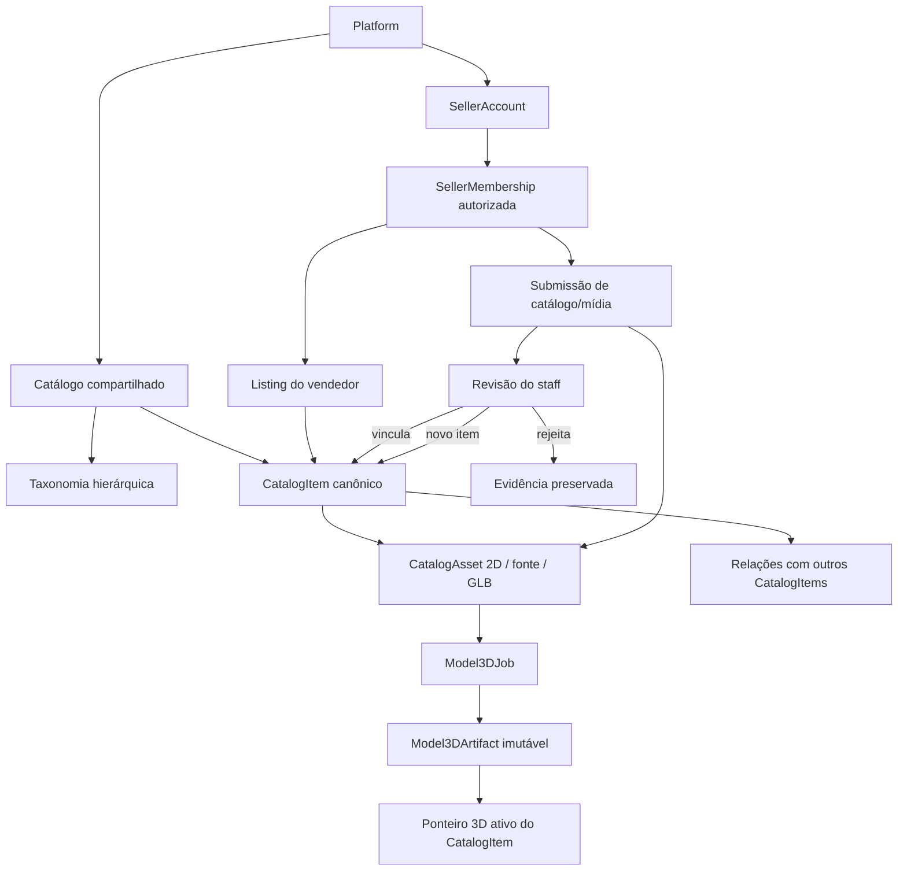
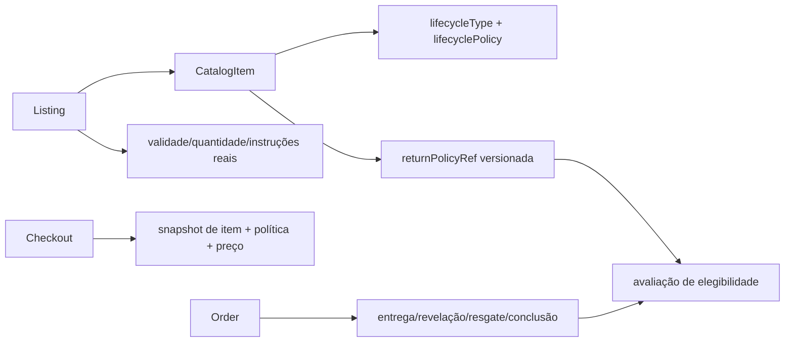
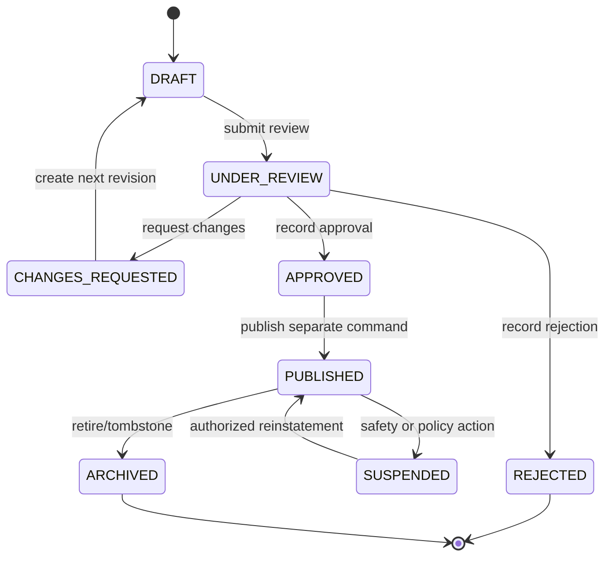
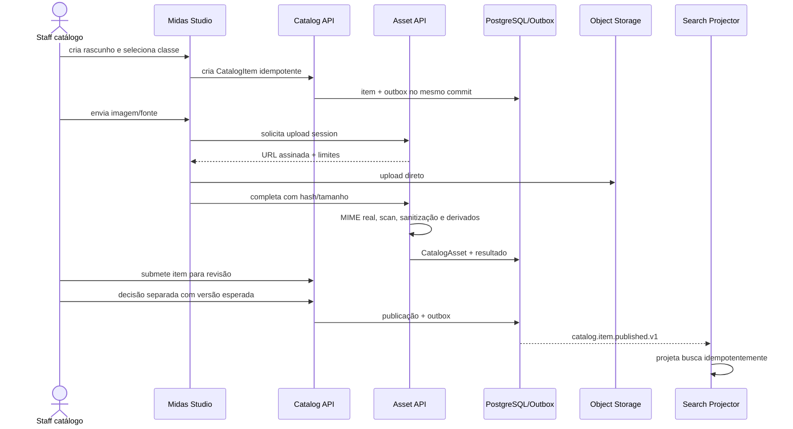
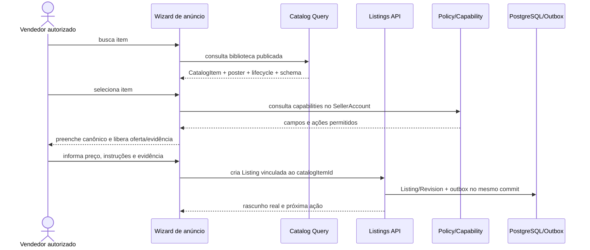
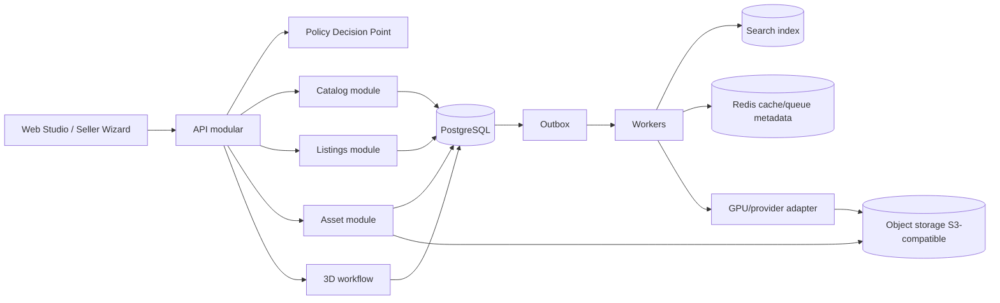

# Midas Studio — catálogo canônico 2D/3D e criação assistida de anúncios

Versão 0.1 · Especificação pré-código · 22 de agosto de 2026

## 1. Resultado esperado

O **Midas Studio** é a área profissional em que a plataforma mantém uma biblioteca compartilhada de itens digitais, imagens e modelos 3D. O staff cadastra e publica itens canônicos; vendedores pesquisam essa biblioteca e iniciam um anúncio já preenchido, informando somente o que pertence à oferta deles: preço, instruções, disponibilidade e evidência.

O Studio também recebe contribuições de vendedores. Um vendedor pode enviar uma imagem 2D, SVG permitido, GLB de origem conhecida ou um conjunto de capturas multi-view. A contribuição permanece privada e em revisão até que o staff decida vinculá-la a um item existente, criar o item canônico correspondente ou rejeitá-la. Saídas geradas por IA nunca são publicadas automaticamente.

Este documento é deliberadamente **pré-código**. Ele especifica nomes, responsabilidades, fluxos, interfaces candidatas e gates executáveis; não afirma que APIs, tabelas ou telas já existem. Não cria numeração definitiva de requisito ou tela.

### 1.1. Decisões fechadas

1. `CatalogItem` é a identidade canônica compartilhada do menor item comercialmente distinguível.
2. `Listing` é a oferta de um `SellerAccount`; não é um segundo produto nem uma variante do catálogo.
3. `CatalogAsset` é o registro canônico de uma mídia e de sua proveniência; arquivos derivados continuam vinculados à fonte por hash e versão.
4. `Model3DJob` representa processamento assíncrono; `Model3DArtifact` representa a saída 3D imutável e revisada.
5. Standoff 2 é a vertical central inicial, mas Nitro, créditos Play Store, gift cards, serviços e futuras verticais entram na mesma taxonomia sem ficarem artificialmente subordinados a Standoff.
6. Taxonomia organiza; relações de catálogo fazem upsell, cross-sell, complemento, substituição e recompra. Não misturar árvore e grafo.
7. Ciclo de consumo e política de retorno são dimensões independentes. Ser renovável ou perecível não determina, sozinho, se existe reembolso.
8. Nenhum CMS ou motor headless commerce externo será uma segunda fonte de verdade. Uma adoção futura só pode atuar como adapter/editorial sobre o domínio Midas ou substituir uma implementação por decisão arquitetural e migração explícitas.

## 2. Pesquisa técnica e consequência para o Midas

Foram examinadas documentação oficial e bases open source dos principais projetos de commerce/catalog e do ecossistema 3D. O objetivo não foi escolher uma dependência antes do benchmark; foi retirar padrões maduros sem importar nomenclatura incompatível.

| Referência | Padrão útil confirmado | Como entra no Midas | O que não copiar |
|---|---|---|---|
| [Medusa Product Module](https://docs.medusajs.com/resources/commerce-modules/product) e [module links](https://docs.medusajs.com/resources/commerce-modules/product/links-to-other-modules) | produto, opções, organização e módulos ligados sem romper seus limites | Catalog, Listings e 3D permanecem módulos separados; referências por ID e eventos | criar `Product`, `ProductVariant` e `Vendor` paralelos aos objetos já especificados |
| [Saleor Products](https://docs.saleor.io/developer/products/overview) | separação entre produto, variante, categoria hierárquica e coleção curada | categoria vira árvore; curadoria/campanha e itens relacionados ficam fora dela | exigir uma variante técnica quando `CatalogItem` já é a unidade distinguível |
| [Saleor Attributes](https://docs.saleor.io/developer/attributes/overview) | atributo humano deve ser tipado; metadata livre serve integração, não UI confiável | esquemas de atributo são versionados por classe de item | colocar campo crítico em JSON arbitrário sem schema ou validação |
| [Saleor Channels](https://docs.saleor.io/developer/channels/overview) | escopo altera visibilidade, preço e acesso | inspiração para visibilidade e capability por `SellerAccount` | mapear `Channel` para tenant; no Midas o tenant já é `SellerAccount` e o preço é do `Listing` |
| [Vendure Products](https://docs.vendure.io/current/core/core-concepts/products), [Collections](https://docs.vendure.io/current/core/core-concepts/collections) e [Channels](https://docs.vendure.io/current/core/core-concepts/channels) | facetas filtráveis, coleções curadas e escopo por canal | facetas tipadas e coleções editoriais podem projetar `CatalogItem` | tornar SellerAccount owner do catálogo global ou duplicar preço global por canal |
| [Directus File Library](https://docs.directus.io/user-guide/file-library/files) | biblioteca de mídia, pasta, metadados, permissões e transformação são capacidades de DAM | serve de referência de UX para biblioteca, filtros e auditoria | editar/reescrever o original publicado ou transformar o CMS em ledger do asset |
| [Payload Uploads](https://payloadcms.com/docs/upload/overview) | bulk upload, MIME allowlist, focal point, tamanhos derivados e preview extensível | referência para intake e preview; adoção exigiria adapter e análise de segurança | fetch remoto irrestrito; versões anteriores a 3.79.1 tiveram [advisory de SSRF](https://github.com/payloadcms/payload/security/advisories/GHSA-6r7f-q7f5-wpx8) |
| [Three.js GLTFLoader](https://threejs.org/docs/pages/GLTFLoader.html), [React Three Fiber](https://github.com/pmndrs/react-three-fiber) e [Drei useGLTF](https://github.com/pmndrs/drei/blob/master/docs/loaders/gltf-use-gltf.mdx) | GLB/glTF 2.0 no browser, carregamento declarativo e preload intencional | viewer público e preview do Studio usam o mesmo manifesto aprovado | canvas por card, preload de toda biblioteca ou esquecer descarte de bitmap/GPU |
| [glTF Transform](https://gltf-transform.dev/) e [Khronos glTF Validator](https://github.com/KhronosGroup/glTF-Validator) | inspeção, normalização, otimização reproduzível e validação contra glTF 2.0 | pipeline determinístico antes da revisão humana | considerar “otimizado” ou “válido” sinônimo de fiel à fonte |
| [TRELLIS.2](https://github.com/microsoft/TRELLIS.2) | geração image-to-3D e exportação GLB/PBR são tecnicamente possíveis | candidato atrás da porta `Model3DGenerationProvider`, sujeito a benchmark | prometer reconstrução exata ou acoplar o domínio a um provider/modelo |

Os repositórios [Medusa](https://github.com/medusajs/medusa), [Saleor](https://github.com/saleor/saleor) e [Vendure](https://github.com/vendurehq/vendure) são referências de implementação, mas têm stacks, licenças e modelos de extensão diferentes. A decisão de dependência exige ADR, inventário de licença, prova de upgrade, benchmark e custo operacional. O desenho deste documento funciona com implementação própria modular ou adapter selecionado depois.

**Confiança da pesquisa:** alta para os padrões de modelagem e tooling; média para escolha de stack, pois não há runtime Midas nem benchmark executável neste repositório.

## 3. Hierarquia do Studio



### 3.1. Fonte de verdade por objeto

| Objeto existente ou candidato | Owner de escrita | Escopo | Responsabilidade | Não contém |
|---|---|---|---|---|
| `CatalogItem` | Catalog | plataforma | identidade, slug, classe, taxonomia, atributos canônicos, lifecycle, política aplicável e ponteiros publicados | preço do vendedor, instrução de entrega, saldo ou estoque de outro tenant |
| `CatalogAsset` | Asset/Catalog | plataforma ou submissão privada | arquivo, hash, MIME verificado, dimensões, vista, origem, licença, revisão e derivados | título/preço de item duplicado ou URL pública permanente de arquivo privado |
| `Model3DJob` | 3D Assets | plataforma; proveniência pode incluir tenant | fila, tentativas, provider/configuração, custo medido e resultado técnico | estado comercial do anúncio |
| `Model3DArtifact` | 3D Assets | plataforma | manifesto imutável do GLB/poster/turntable, fontes, validação e decisão | segundo item, preço ou cópia de `Listing` |
| `Listing` | Listings | `SellerAccount` | oferta, preço, instruções, disponibilidade, evidência e plano de exposição | nome/taxonomia/asset canônico editável pelo vendedor |
| self-link de `CatalogItem` | Catalog | plataforma | `sourceItemId`, `targetItemId`, tipo de relação, peso editorial e vigência | cópia dos dois itens ou preço congelado |
| caso de submissão | Catalog Review | `SellerAccount` + staff autorizado | proposta, fontes, decisão, comentários e trilha | item publicado ou asset público antes de aprovação |

O self-link e o caso de submissão são relações/processos auxiliares, não novos catálogos. Seus nomes físicos só serão fechados no schema; neste documento são chamados, respectivamente, `CatalogItemRelation` e `CatalogSubmission` para evitar ambiguidade.

## 4. Modelo canônico sem “produto/variante” duplicado

### 4.1. Regra de granularidade

Um `CatalogItem` representa a menor identidade que precisa de histórico, busca, mídia ou regras canônicas próprias. A pergunta de decisão é:

> Se duas opções precisam de slug, histórico de preço de referência, conjunto de assets, política de entrega ou identidade pública diferentes, elas são dois `CatalogItem` relacionados. Caso contrário, a diferença pertence ao `Listing` ou a um value object já existente, como `Craft`.

Exemplos:

| Situação | Modelagem correta | Motivo |
|---|---|---|
| Duas skins com nomes e arte diferentes | dois `CatalogItem` | identidade e mídia são diferentes |
| Mesma skin, dois vendedores e preços diferentes | um `CatalogItem`, dois `Listing` | a diferença é comercial/tenant |
| Mesma skin com craft/stickers específicos daquela unidade | `CatalogItem` + dados do `Listing`/`Craft` | característica da unidade anunciada |
| Nitro mensal e anual | dois `CatalogItem` relacionados ou dois itens distinguíveis pela duração | duração muda a identidade vendável e a política |
| Gift card Play Store de R$ 50 e R$ 100 | dois `CatalogItem` | valor facial é identidade comercial canônica |
| Mesma faca com nova foto enviada pelo vendedor | mesmo `CatalogItem`; novo `CatalogAsset` em revisão | mídia não cria variante |
| GLB regenerado do mesmo item | mesmo `CatalogItem`; novo `Model3DJob`/`Model3DArtifact` | artefato é derivado versionado |

É proibido introduzir tabelas ou DTOs chamados `Product`, `ProductVariant`, `CatalogProduct`, `StudioItem`, `TenantItem` ou `SellerCatalogItem` para representar novamente a mesma identidade.

### 4.2. Campos candidatos de `CatalogItem`

Os nomes abaixo orientam o futuro schema; cada campo exige OpenAPI/JSON Schema e migração antes de ser contrato.

| Campo | Tipo lógico | Regra |
|---|---|---|
| `catalogItemId` | ID opaco | chave canônica; slug nunca autoriza acesso |
| `slug` | texto estável | único no namespace público; redirect ao renomear |
| `canonicalName` | texto localizado | editável somente por staff de catálogo |
| `verticalCode` | código tipado | raiz comercial, por exemplo `standoff2`, `subscriptions` ou `gift_cards` |
| `categoryNodeId` | referência | uma posição principal na árvore; facetas complementam |
| `productClassCode` | código de schema | seleciona atributos obrigatórios e validações |
| `lifecycleType` | enum tipado | `ONE_TIME`, `RENEWABLE`, `EXPIRING`, `CONSUMABLE` ou `SERVICE` |
| `lifecyclePolicy` | value object versionado | duração, janela de renovação, exigência de validade e unidade de consumo conforme o tipo |
| `returnPolicyRef` | referência versionada | separado de lifecycle; checkout congela a versão aplicável |
| `attributeValues` | estrutura tipada | somente chaves definidas por `productClassCode` |
| `activeModel3DArtifactId` | referência opcional | aponta somente para artefato aprovado/publicado |
| `primaryAssetId` | referência | poster/card oficial; fallback 2D obrigatório |
| `catalogStatus` | estado | rascunho, revisão, publicado, suspenso ou arquivado, com motivo |
| `version` | inteiro monotônico | usado em ETag/If-Match e snapshot do anúncio |

`attributeValues` não é um depósito de JSON livre. Campos que afetam busca, compra, entrega, retorno ou interface precisam de tipo, label, unidade, cardinalidade, validação e versão. Metadata livre fica restrita a integrações não autoritativas.

### 4.3. O que o anúncio herda e o que o vendedor edita

| Dado no wizard | Origem | Vendedor pode editar? |
|---|---|---|
| nome, vertical, categoria e identidade visual | `CatalogItem`/`CatalogAsset` publicados | não |
| modelo 3D e poster | `Model3DArtifact`/`CatalogAsset` publicados | não; pode submeter alternativa para revisão |
| lifecycle e política-base de retorno | `CatalogItem` + configuração versionada | não |
| atributos canônicos | schema da classe + `CatalogItem` | não; pode sinalizar erro |
| preço e moeda permitida | `Listing` | sim, dentro da política |
| instruções de entrega | `Listing`/template seguro | sim; segredo nunca entra em texto público |
| quantidade/disponibilidade | `Listing`/unidade vendável | sim, conforme a classe |
| craft, condição e evidência da unidade | `Listing` e objetos de prova existentes | sim, com validação e revisão |
| plano de exposição | `Listing` | sim, com taxa e benefício mostrados antes da confirmação |
| texto complementar | `Listing` | sim, em campos limitados e moderados; não substitui o nome canônico |

Ao submeter o anúncio, sua revisão congela `catalogItemId` e a versão canônica vista. Uma atualização posterior do catálogo não reescreve silenciosamente uma revisão já aprovada; a política de revalidação decide se o anúncio continua, precisa revisar ou apenas passa a ler a nova apresentação. Pedido e checkout preservam seu snapshot transacional próprio.

## 5. Taxonomia extensível e Standoff como vertical central

```text
Catálogo Midas
├── standoff2                         ← vertical central inicial
│   ├── skins
│   │   ├── knives
│   │   ├── rifles
│   │   ├── pistols
│   │   └── gloves
│   ├── stickers
│   ├── charms
│   └── accounts / services permitidos pela política
├── subscriptions
│   ├── discord-nitro
│   └── outras assinaturas digitais
├── gift-cards
│   ├── google-play
│   └── outras lojas autorizadas
├── game-entitlements
└── digital-services
```

A árvore responde “o que é e onde navega”. Conexões comerciais respondem “o que faz sentido oferecer junto”. Por isso, um item de Standoff pode apontar para Nitro ou Play Store sem mover esses produtos para dentro da categoria Standoff.

### 5.1. Relações de catálogo

| `relationType` candidato | Significado | Uso permitido |
|---|---|---|
| `ADD_ON` | complemento funcional direto | acessório, crédito ou serviço realmente relacionado |
| `CROSS_SELL` | produto conexo de outra categoria/vertical | Nitro ao lado de uma compra gamer, com explicação |
| `UPSELL` | alternativa de maior benefício/valor | versão ou item superior, sem esconder a opção atual |
| `SUBSTITUTE` | substituto comparável | quando o item está indisponível ou o usuário pede alternativa |
| `REPLENISHMENT` | recompra provável por consumo/validade | somente quando lifecycle e consentimento comportarem |
| `BUNDLE_COMPONENT` | componente de composição explícita | a venda do bundle exige regra e preço próprios; não cria cópia do item |

Campos mínimos do self-link: `sourceItemId`, `targetItemId`, `relationType`, `reasonCode`, `editorialWeight`, `activeFrom`, `activeUntil`, `status`, `version`, `createdBy`, `approvedBy`. O backend elimina self-link, duplicata e ciclo proibido; preço e disponibilidade são resolvidos em tempo real pelos `Listing` elegíveis.

Relação editorial e recomendação comportamental não são a mesma coisa. A primeira é governada no Studio; a segunda pode ordenar candidatos autorizados, mas não cria relação permanente, não usa PII bruta e precisa registrar impressão, origem e explicação.

## 6. Ciclo do produto e retorno são eixos separados

### 6.1. Lifecycle

| Tipo | Semântica | Dados obrigatórios | Recompra/pós-venda |
|---|---|---|---|
| `ONE_TIME` | unidade única ou direito consumido uma vez | unidade vendável, prova/disponibilidade e regra de consumo | não presumir recompra; oferecer conexos quando houver relação real |
| `RENEWABLE` | direito com período que pode ser renovado | duração, unidade de período, janela de aviso e forma de renovação | lembrete apenas por consentimento e proximidade calculada do vencimento |
| `EXPIRING` | código, crédito ou direito com validade real | validade mínima na publicação e `expiresAt` real na unidade/entrega | avisar antes de vencer; nunca vender como válido sem tempo restante mínimo |
| `CONSUMABLE` | saldo/unidades que se esgotam pelo uso | unidade, quantidade/denominação e regra de entrega | sugestão de reposição baseada em consumo inferido deve ser explicável e opt-out |
| `SERVICE` | obrigação de fazer ou atendimento digital | escopo, SLA, janela e critérios de conclusão | novo serviço é nova compra; recorrência só se explicitamente contratada |

`CatalogItem.lifecyclePolicy` guarda a regra da classe. O instante real de início, término, validade, revelação ou consumo pertence ao anúncio, entitlement, entrega ou pedido conforme o fato. Não inventar uma data concreta no catálogo global.

### 6.2. Política de retorno

`returnPolicyRef` aponta para uma política versionada e publicável. O conteúdo mínimo da política deve declarar:

- jurisdição/escopo e versão;
- momentos `beforePayment`, `afterPayment`, `afterReveal`, `afterRedemption` e `afterCompletion`;
- se a devolução é automática, condicionada, indisponível ou exige análise;
- janela e base temporal;
- evidências necessárias e canal de contestação;
- efeito financeiro e responsável pela decisão.

Exemplos de códigos de política, ainda sujeitos à revisão do produto e jurídico: `RETURNABLE_BEFORE_REVEAL`, `CONDITIONAL_AFTER_DELIVERY`, `NON_RETURNABLE_AFTER_REDEMPTION`, `SERVICE_REVIEW_REQUIRED`. Eles nunca são derivados somente de `lifecycleType`.



## 7. Áreas e rotas candidatas

O Studio reutiliza a árvore administrativa já prevista em `/admin/catalogo`; não cria um segundo backoffice.

| Área | Rota candidata | Papel |
|---|---|---|
| Visão geral do Studio | `/admin/catalogo` | saúde, fila, pendências, cobertura 2D/3D e ações recentes |
| Biblioteca | `/admin/catalogo/biblioteca` | pesquisar, filtrar, comparar e abrir item canônico |
| Editor canônico | `/admin/catalogo/itens/:catalogItemId` | identidade, taxonomia, atributos, lifecycle, retorno, assets e relações |
| Novo item | `/admin/catalogo/itens/novo` | criar rascunho, nunca publicar no mesmo gesto |
| Fila de submissões | `/admin/catalogo/submissoes` | triagem de contribuições de tenants |
| Revisão de submissão | `/admin/catalogo/submissoes/:submissionId` | vincular, propor novo item ou rejeitar com motivo |
| Taxonomia e schemas | `/admin/catalogo/taxonomia` | árvore, classes, atributos tipados e migração de schema |
| Relações e merchandising | `/admin/catalogo/relacoes` | upsell/cross-sell/complemento com vigência e preview |
| Job/revisão 3D | `/admin/catalogo/modelos-3d/:jobId` | acompanhar e decidir artefato no fluxo já especificado |
| Biblioteca do vendedor | `/vender/novo?etapa=biblioteca` | selecionar item e iniciar anúncio pré-preenchido |
| Submissões do vendedor | `/vender/catalogo/submissoes` | enviar fontes e acompanhar apenas seus casos |

Rotas são candidatas. O mapa mestre de telas deve incorporá-las antes de qualquer implementação e provar que não existe rota equivalente.

## 8. Wireframes funcionais

### 8.1. Studio — biblioteca

```text
┌──────────────────────────────────────────────────────────────────────────┐
│ MIDAS STUDIO / Biblioteca                  [Importar] [Criar item]        │
├──────────────────────────────────────────────────────────────────────────┤
│ [Buscar nome, slug ou ID________________] [Vertical▾] [Mídia▾] [Estado▾] │
│ Standoff 2 / Skins / Facas                         482 resultados         │
├──────────────┬───────────────────────────────────────────────────────────┤
│ Cobertura    │ [poster] Faca X                 PUBLICADO   2D + 3D       │
│ Sem poster 8 │ categoria · lifecycle · política · versão                │
│ Sem 3D 214   │ [Abrir item] [Ver 3D] [Adicionar relação]                │
│ Em revisão 9 ├───────────────────────────────────────────────────────────┤
│ Suspensos 3  │ [poster] Skin Y                 EM REVISÃO  2D            │
│              │ origem · licença pendente · atualizado há 2 h            │
│ Filas        │ [Abrir revisão]                                         │
│ Assets 12    └───────────────────────────────────────────────────────────┤
│ 3D 4         │ [Anterior] Página 1 de 25 [Próxima]                       │
└──────────────┴───────────────────────────────────────────────────────────┘
```

Nenhum card contém canvas. O poster é derivado real; **Ver 3D** navega para uma área dedicada com um artefato ativo.

### 8.2. Studio — editor do item

```text
┌──────────────────────────────────────────────────────────────────────────┐
│ ← Biblioteca  Faca X · versão 12          RASCUNHO [Salvar] [Revisar]   │
├──────────────────────────────────────┬───────────────────────────────────┤
│ Identidade                           │ Preview                           │
│ Nome canônico [___________________]  │ [ poster real ]                  │
│ Slug          [___________________]  │ 2D disponível · 3D aprovado      │
│ Vertical      [standoff2_________▾]  │ [Abrir inspeção dedicada]        │
│ Categoria     [skins / knives____▾]  │                                   │
│ Classe        [weapon_skin_______▾]  │ Cobertura                         │
│                                      │ Frente ✓ Trás ✓ Lados ✓ Topo —   │
│ Atributos tipados                    │                                   │
│ Raridade      [___________________]  │ Proveniência                      │
│ Coleção       [___________________]  │ fonte · licença · hashes · review │
│                                      │                                   │
│ Lifecycle [ONE_TIME______________▾]  │ Relações                          │
│ Política de retorno [policy______▾]  │ + Nitro (cross-sell)              │
├──────────────────────────────────────┴───────────────────────────────────┤
│ Abas: [Mídia] [Modelo 3D] [Relações] [Histórico] [Auditoria]            │
└──────────────────────────────────────────────────────────────────────────┘
```

**Revisar** valida o rascunho; não publica. Publicação é decisão separada, com capability, versão esperada e trilha de auditoria.

### 8.3. Studio — revisão de contribuição

```text
┌──────────────────────────────────────────────────────────────────────────┐
│ Submissão #... · SellerAccount ...       EM TRIAGEM  [Assumir caso]     │
├───────────────────────────────┬──────────────────────────────────────────┤
│ Fontes imutáveis              │ Correspondências sugeridas              │
│ [frente] [trás] [lado] [topo] │ 92% Faca X   [Comparar]                 │
│ PNG · hashes · MIME real      │ 71% Faca Y   [Comparar]                 │
│ origem/licença declarada      │ [Buscar manualmente__________________]  │
│ alertas do scanner            │                                          │
├───────────────────────────────┴──────────────────────────────────────────┤
│ Decisão                                                                  │
│ ( ) Vincular ao item existente   ( ) Propor novo item   ( ) Rejeitar    │
│ Motivo obrigatório [________________________________________________]    │
│ [Solicitar mais vistas]                         [Registrar decisão]      │
└──────────────────────────────────────────────────────────────────────────┘
```

Similaridade é apoio, não decisão. O staff precisa comparar conteúdo e proveniência; o solicitante não pode revisar sua própria contribuição quando a política exigir segregação.

### 8.4. Vendedor — criar anúncio pela biblioteca

```text
┌──────────────────────────────────────────────────────────────────────────┐
│ Criar anúncio  1 Biblioteca › 2 Oferta › 3 Evidência › 4 Revisão        │
├──────────────────────────────────────────────────────────────────────────┤
│ O que você vai vender?                                                   │
│ [Buscar faca, skin, Nitro, Play Store_______________________________]    │
│ [Standoff 2] [Assinaturas] [Gift cards] [Serviços]                      │
│                                                                          │
│ [poster] Faca X · 2D + 3D · ONE_TIME        [Selecionar]                │
│ [poster] Nitro mensal · RENEWABLE             [Selecionar]              │
│                                                                          │
│ Não encontrou? [Enviar item ou mídia para análise]                      │
├──────────────────────────────────────────────────────────────────────────┤
│ Ao selecionar: nome, mídia, classe e política são preenchidos e travados │
│ Você informa depois: preço, instruções, disponibilidade e evidência      │
└──────────────────────────────────────────────────────────────────────────┘
```

## 9. Estados visuais obrigatórios

| Estado | Biblioteca/admin | Wizard do vendedor | Ação segura |
|---|---|---|---|
| carregando | skeleton com mesma geometria; contagem desconhecida | mantém busca e passo atual | cancelar requisição obsoleta ao mudar filtro/item |
| vazio real | causa, filtros ativos e cobertura | “não encontrou” + submissão | limpar filtros ou criar/submeter conforme permissão |
| sem resultado | consulta visível e sugestões de correção | categorias e termos alternativos | nunca trocar silenciosamente por item parecido |
| parcial | `asOf`, campos ausentes e origem | bloqueia submissão somente no campo obrigatório | retomar fonte canônica ou abrir caso |
| mídia em quarentena | poster neutro e reason code seguro | arquivo ainda não utilizável | corrigir ou aguardar revisão |
| 3D ausente/falhou | galeria 2D real | anúncio continua em 2D | iniciar/reprocessar job apenas por capability |
| conflito de versão | mostra diff entre versão aberta e atual | preserva entrada local | recarregar e reaplicar conscientemente |
| proibido | nenhum dado do objeto | explica capability ausente sem revelar outro tenant | solicitar grant pelo fluxo administrativo |
| degradado | busca no banco com aviso de índice atrasado | criação continua se a fonte canônica responder | não servir cache de outro tenant |

## 10. Fluxos ponta a ponta

### 10.0. Máquinas de estado candidatas

Os nomes abaixo fecham a semântica do Studio, mas só se tornam contrato depois de incorporados aos schemas owner. Estado de `Listing` continua no módulo Listings e não é redefinido aqui.



| Objeto | Estados candidatos | Regra terminal/efeito |
|---|---|---|
| `CatalogItem` | `DRAFT`, `UNDER_REVIEW`, `CHANGES_REQUESTED`, `APPROVED`, `PUBLISHED`, `SUSPENDED`, `REJECTED`, `ARCHIVED` | aprovação não publica; suspensão preserva histórico; archive é tombstone |
| `CatalogSubmission` | `DRAFT`, `SUBMITTED`, `IN_TRIAGE`, `ACTION_REQUIRED`, `ACCEPTED`, `REJECTED`, `WITHDRAWN` | `ACCEPTED` referencia a decisão/vínculo criado; não vira o item |
| `CatalogAsset` review | `UPLOADING`, `QUARANTINED`, `VALIDATING`, `UNDER_REVIEW`, `APPROVED`, `REJECTED`, `REVOKED` | publicação é vínculo/ponteiro versionado; não sobrescreve o asset |
| `Model3DJob` | estados definidos no pipeline 3D | falha pertence à tentativa; job não publica artefato sozinho |
| `Model3DArtifact` | `QUARANTINED`, `APPROVED`, `SUPERSEDED`, `REVOKED` | o ponteiro ativo do item decide o publicado; artefato é imutável |

Toda transição grava versão esperada, ator, capability, motivo quando aplicável, tempo, correlação e outbox no mesmo commit. Retry nunca apaga uma tentativa anterior.

### 10.1. Staff cria e publica item 2D



### 10.2. Vendedor cria anúncio sem recadastrar produto



### 10.3. Vendedor envia mídia ou item não encontrado

1. A busca precisa ter ocorrido; a submissão conserva a consulta e as correspondências descartadas.
2. O vendedor escolhe “mídia para item existente” ou “item não encontrado”.
3. Upload direto cria `CatalogAsset` privado/quarentenado com `sellerAccountId` de proveniência e hash.
4. O caso congela fontes e texto proposto; reenvio com a mesma chave devolve o mesmo caso.
5. Scanner e classificadores podem sugerir item/categoria, mas não vinculam nem publicam.
6. Staff assume o caso, compara, solicita vistas adicionais ou decide.
7. “Vincular” adiciona a mídia como candidata do item; ainda exige a revisão/publicação de asset.
8. “Novo item” cria rascunho canônico a partir da decisão; não copia preço/instruções do vendedor.
9. O vendedor recebe o resultado e pode retomar o wizard pelo `catalogItemId` aprovado.

### 10.4. 2D/multi-view para 3D

O fluxo usa integralmente `CatalogAsset → Model3DJob → Model3DArtifact` já especificado no documento de pipeline 3D:

- single-view permanece rascunho inferido e rotulado;
- multi-view aumenta evidência, não prova exatidão;
- GLB recebido é não confiável até scan, validador e orçamento;
- job é idempotente por fontes imutáveis + configuração;
- saída passa por glTF Validator, normalização/otimização reproduzível e revisão humana;
- publicação só troca o ponteiro ativo do `CatalogItem` para o hash aprovado;
- viewer público e preview administrativo compartilham o manifesto, mas nunca duas cenas ativas.

### 10.5. Relação e oferta adicional

1. Staff cria relação entre dois `CatalogItem` publicados e informa motivo/vigência.
2. O read model busca `Listing` elegível e preço atual de cada alvo; relação sem oferta não inventa CTA.
3. Na página do item/carrinho, a UI mostra no máximo o número definido pelo experimento e explica “Complementa sua compra” ou “Você pode precisar novamente”.
4. Entrada pode usar animação DOM curta e interrompível depois de uma ação do usuário; nunca cobre preço, move o CTA ou simula escassez.
5. Impressão, clique, adição, remoção e compra carregam `relationId`/`recommendationRunId`, sem telefone, e-mail ou conteúdo de mensagem.

## 11. APIs candidatas

Todos os comandos abaixo exigem autenticação, autorização server-side, `Idempotency-Key` quando criam efeito e `If-Match` quando alteram recurso versionado. A resposta de coleção usa cursor estável; upload binário vai direto ao object storage por URL assinada.

### 11.1. Catálogo e Studio

| Método e path | `operationId` candidato | Uso |
|---|---|---|
| `GET /v1/catalog/items` | `listCatalogItems` | busca pública/publicada com filtros tipados |
| `GET /v1/catalog/items/{catalogItemId}` | `getCatalogItem` | detalhe canônico e versão |
| `GET /v1/catalog/items/{catalogItemId}/related` | `listRelatedCatalogItems` | relações + ofertas elegíveis resolvidas, sem preço copiado |
| `GET /v1/admin/catalog/items` | `adminListCatalogItems` | biblioteca completa conforme grant |
| `POST /v1/admin/catalog/items` | `createCatalogItem` | rascunho canônico idempotente |
| `PATCH /v1/admin/catalog/items/{catalogItemId}` | `updateCatalogItem` | alteração com `If-Match` |
| `POST /v1/admin/catalog/items/{catalogItemId}/submit-review` | `submitCatalogItemReview` | congela versão para revisão |
| `POST /v1/admin/catalog/items/{catalogItemId}/decision` | `recordCatalogItemDecision` | aprova/rejeita com maker-checker conforme política |
| `PUT /v1/admin/catalog/items/{catalogItemId}/active-model-3d` | `publishCatalogItemModel3D` | troca ponteiro para artefato aprovado |
| `POST /v1/admin/catalog/items/{catalogItemId}/relations` | `createCatalogItemRelation` | cria self-link governado |
| `DELETE /v1/admin/catalog/item-relations/{relationId}` | `retireCatalogItemRelation` | tombstone; não apaga auditoria |

### 11.2. Assets e 3D

| Método e path | `operationId` candidato | Uso |
|---|---|---|
| `POST /v1/assets/upload-sessions` | `createAssetUploadSession` | limites, chave privada e URL assinada |
| `POST /v1/assets/upload-sessions/{uploadSessionId}/complete` | `completeAssetUpload` | confere tamanho/hash e inicia validação |
| `GET /v1/admin/catalog/assets/{catalogAssetId}` | `getCatalogAssetReview` | fonte, derivados, scan e proveniência |
| `POST /v1/admin/catalog/assets/{catalogAssetId}/decision` | `recordCatalogAssetDecision` | aprova/rejeita hash exato |
| `POST /v1/admin/catalog/items/{catalogItemId}/model-3d-jobs` | `createModel3DJob` | job assíncrono existente |
| `GET /v1/admin/model-3d-jobs/{model3DJobId}` | `getModel3DJob` | fase, tentativa e artefato candidato |
| `POST /v1/admin/model-3d-jobs/{model3DJobId}/decision` | `recordModel3DDecision` | decisão humana auditada |

### 11.3. Vendedor

| Método e path | `operationId` candidato | Uso |
|---|---|---|
| `GET /v1/seller-accounts/{sellerAccountId}/catalog-library` | `searchSellerCatalogLibrary` | catálogo publicado + capabilities do tenant |
| `POST /v1/seller-accounts/{sellerAccountId}/listings` | `createListingFromCatalogItem` | cria oferta vinculada ao item, sem cópia editável do catálogo |
| `POST /v1/seller-accounts/{sellerAccountId}/catalog-submissions` | `createCatalogSubmission` | abre contribuição com fontes já completadas |
| `GET /v1/seller-accounts/{sellerAccountId}/catalog-submissions` | `listOwnCatalogSubmissions` | acompanha somente casos do tenant |
| `POST /v1/seller-accounts/{sellerAccountId}/catalog-submissions/{submissionId}/sources` | `appendCatalogSubmissionSources` | adiciona nova versão de fontes antes do freeze |
| `POST /v1/seller-accounts/{sellerAccountId}/catalog-submissions/{submissionId}/submit` | `submitCatalogContributionReview` | congela caso para triagem |

### 11.4. Exemplo de criação de anúncio

```json
{
  "catalogItemId": "cit_01...",
  "expectedCatalogVersion": 12,
  "price": { "amountMinor": 12990, "currency": "BRL" },
  "listingPlanCode": "BASIC",
  "deliveryInstructions": "Texto público permitido; segredo segue o cofre",
  "availability": { "quantity": 1 },
  "evidenceAssetIds": ["cas_01..."]
}
```

O servidor rejeita campos canônicos adicionais, mesmo que o cliente os envie. A resposta retorna links/capabilities e o rascunho persistido real; não retorna sucesso antes do commit.

## 12. Permissões e segregação

Permissões seguem `domínio.recurso.ação` e sempre são combinadas com escopo/objeto:

| Permissão candidata | Escopo | Ação |
|---|---|---|
| `catalog.item.read` | plataforma ou publicado | ler item e versão permitidos |
| `catalog.item.create` | plataforma | criar rascunho |
| `catalog.item.update` | item atribuído | editar versão mutável |
| `catalog.item.review` | fila/caso | assumir e revisar |
| `catalog.item.publish` | item aprovado | publicar/tombstone com step-up quando definido |
| `catalog.asset.upload` | plataforma ou tenant próprio | iniciar upload dentro de quota |
| `catalog.asset.review` | plataforma | decidir sobre fonte/hash |
| `catalog.relation.manage` | plataforma | criar/encerrar relação editorial |
| `catalog.taxonomy.manage` | plataforma | alterar árvore/schema com migração |
| `catalog.submission.create` | `SellerAccount` próprio | criar contribuição privada |
| `catalog.submission.read` | tenant próprio ou staff autorizado | acompanhar caso sem vazar outro tenant |
| `catalog.model3d.request` | plataforma/cota | iniciar job |
| `catalog.model3d.review` | staff segregado | decidir artefato |
| `listing.create` | `SellerMembership` ativa | criar anúncio a partir do catálogo publicado |

Regras:

- master concede e revoga grants; grant não remove checagem de objeto e tenant;
- staff não vê mídia privada fora da fila/finalidade autorizada;
- solicitante e revisor são pessoas diferentes quando a política de quatro-olhos estiver ativa;
- `sellerAccountId` recebido na URL é seletor, não prova de autorização;
- URL assinada é curta, restrita a operação/chave/tamanho e nunca se torna ID do asset;
- decisão, publicação, rollback e download sensível geram auditoria append-only.

## 13. Backend, persistência e cache



### 13.1. Regras operacionais

- PostgreSQL mantém itens, relacionamentos, estados, decisões, versões e outbox. Redis nunca é fonte de verdade.
- Object storage usa chaves não adivinháveis por classe e escopo: raw/quarentena, derivado privado e publicado/CDN.
- O índice de busca é projeção reconstruível. Quando atrasado, a UI informa freshness e o detalhe vem do catálogo canônico.
- Cache key inclui ambiente, versão de schema, escopo e `sellerAccountId` quando a resposta depender do tenant.
- Invalidação vem de eventos versionados; TTL é proteção, não mecanismo principal de coerência.
- Worker de mídia não compartilha processo, credencial ampla nem volume gravável com a API financeira/transacional.
- Job 3D tem fila/cota próprias; backpressure não bloqueia criação 2D nem checkout.
- Migração de taxonomia/schema é comando versionado, com dry-run, contagem de impacto, reindexação e rollback lógico.

### 13.2. Cache e busca sem vazamento

| Conteúdo | Chave conceitual | Pode ser compartilhado? |
|---|---|---|
| item público | `catalog:item:{version}:{catalogItemId}` | sim |
| busca pública | `catalog:search:{schemaVersion}:{queryHash}` | sim, sem personalização |
| eligibility/capabilities | `seller:{sellerAccountId}:catalog-cap:{membershipVersion}:{itemId}` | não |
| submissão | nunca em CDN/cache público | não |
| manifesto 3D publicado | hash/version do artefato | sim |
| raw/preview privado | URL assinada curta, sem cache compartilhado | não |

## 14. Segurança e qualidade do asset

1. Conferir assinatura mágica/MIME real; extensão nunca basta.
2. Aplicar limite de bytes, pixels, frames, nós, triângulos, materiais, texturas e referências externas antes de processamento caro.
3. Fazer upload em quarentena; scan e parsing rodam em processo isolado com timeout, CPU/memória/egress limitados.
4. SVG perde scripts, entidades, links, fontes e URIs externas; a versão pública recomendada é rasterizada/derivada segura, preservando a fonte privada quando permitido.
5. GLB passa pelo validador oficial, scan de URI, budget e renderização de vistas fixas.
6. Remover EXIF/PII não necessária do derivado público; conservar somente metadados necessários de proveniência em armazenamento protegido.
7. Guardar `sha256`, tamanho, MIME real, originador, licença/declaration, timestamps e cadeia source→derivative.
8. Deduplicação por hash não concede acesso cross-tenant; autorização continua por vínculo e finalidade.
9. Fetch por URL, se existir, usa allowlist, bloqueio de IP privado/redirect, limite de resposta e egress restrito. O padrão seguro é upload direto do cliente.
10. Conteúdo rejeitado não é apagado antes da retenção/auditoria definida, mas nunca recebe URL pública.

## 15. Design e movimento do Studio

O Studio é uma ferramenta operacional densa. Clareza vence espetáculo.

- layout desktop de três áreas: navegação/filtros, lista ou editor, contexto/preview;
- tablet preserva lista + drawer; mobile fica limitado a triagem leve e acompanhamento, não revisão 3D completa;
- cards usam poster, nome, classe, cobertura, estado e ação direta; nenhum efeito muda a legibilidade da mídia;
- badges de estado sempre têm texto e ícone, nunca só cor;
- diff de versão destaca campo, origem, valor anterior e novo;
- React Bits pode animar entrada de painel/resultado com movimento curto e finito; Three/R3F é dono exclusivo do canvas;
- upsell/cross-sell aparece depois de contexto/intenção, não interrompe checkout nem imita mensagem do sistema;
- `prefers-reduced-motion` remove deslocamento sem remover conteúdo ou ação;
- ações de publicação/rejeição não dependem de drag-and-drop e exigem label explícito.

Tokens, contraste e paleta pertencem ao documento de direção de arte. O Studio consome tokens sem inserir hex local.

## 16. Budgets de velocidade e capacidade

Os valores abaixo são **metas candidatas para o primeiro benchmark**, não medições do projeto:

| Jornada | Budget inicial | Condição de medição |
|---|---|---|
| busca na biblioteca, cache quente | p95 ≤ 250 ms no backend | corpus e filtros de referência; sem tempo de rede do usuário |
| busca, cache frio/índice saudável | p95 ≤ 600 ms no backend | mesma carga, plano de consulta registrado |
| primeira página operacional | conteúdo útil ≤ 2,5 s | perfil móvel intermediário e rede definida no teste |
| seleção → formulário pré-preenchido | ≤ 1 s após resposta | sem baixar GLB; poster responsivo |
| troca de filtros | resposta visual ≤ 100 ms; resultado assíncrono | aborta consulta anterior, sem lista piscando |
| upload | progresso real em até 500 ms | upload direto, tamanho conhecido |
| paginação | cursor estável; no máximo 50 linhas | sem `OFFSET` profundo |
| preview 3D | budgets do pipeline 3D | poster primeiro; chunk/GLB lazy; um canvas |
| reindexação | sem bloquear escrita canônica | lag e backlog observáveis |

Capacidade precisa ser benchmarkada com pelo menos: 100 mil itens canônicos, 1 milhão de listings, 10 milhões de assets/metadados, 500 relações por categoria em curadoria e concorrência de upload definida. Esses números são dataset de teste, não previsão de negócio.

## 17. Telemetria sem PII

Eventos de domínio candidatos:

```text
catalog.item.created.v1
catalog.item.review_submitted.v1
catalog.item.published.v1
catalog.item.suspended.v1
catalog.asset.uploaded.v1
catalog.asset.quarantined.v1
catalog.asset.approved.v1
catalog.submission.created.v1
catalog.submission.reviewed.v1
catalog.relation.activated.v1
catalog.relation.retired.v1
catalog.model3d.job_requested.v1
catalog.model3d.artifact_published.v1
listing.created_from_catalog.v1
```

Cada evento carrega `eventId`, versão, `occurredAt`, aggregate/version, actor permitido, `sellerAccountId` quando aplicável, correlation/causation e payload mínimo. Analytics de interface é separado:

- `studio_library_searched`;
- `studio_item_opened`;
- `catalog_submission_started/completed`;
- `listing_catalog_item_selected`;
- `related_item_impression/clicked/added`;
- `model3d_preview_opened/fallback_shown`.

Proibido incluir consulta livre integral, e-mail, telefone, texto de instrução, imagem, segredo, URL assinada ou payload da evidência. Métricas precisam de denominador, versão e `asOf`.

## 18. Plano de testes executáveis

### 18.1. Contrato e domínio

- OpenAPI valida que comandos e queries não aceitam um objeto `Product`/`Variant` paralelo.
- constraint garante que todo `Listing` aponta para um `CatalogItem` existente e versão aceitável.
- dois sellers criam ofertas distintas para o mesmo item sem copiar/alterar seus campos canônicos.
- alteração de preço/instrução nunca atualiza `CatalogItem`; alteração canônica nunca reescreve pedido concluído.
- lifecycle aceita somente campos compatíveis e rejeita ausência obrigatória por classe.
- política de retorno permanece independente: cada combinação permitida/proibida é testada por tabela de decisão.
- self-link rejeita origem=destino, duplicata e ciclos proibidos; ordenação é determinística.

### 18.2. Integração real

- executar Postgres, Redis e storage S3-compatible reais no ambiente de teste; healthchecks antecedem o suite.
- upload PNG/SVG/GLB válido percorre sessão, storage, scan, asset e outbox; nenhum sucesso antes da persistência.
- MIME forjado, zip bomb, SVG ativo, URI externa em glTF e GLB inválido são bloqueados/quarentenados.
- evento duplicado e fora de ordem mantém um efeito; reindexação do zero produz a mesma biblioteca.
- falha do índice cai para detalhe canônico e informa atraso sem servir tenant errado.
- job 3D usa adapter real selecionado em sandbox ou engine local real; função vazia/mock não satisfaz o gate.

### 18.3. Autorização e multi-tenant

- trocar path/body/query/cursor de `sellerAccountId` nunca expõe submissão, asset, capability ou rascunho alheio;
- vendedor não publica item, aprova asset nem edita campo canônico;
- staff sem grant financeiro não recebe dados financeiros ao abrir uma contribuição;
- URL assinada de um escopo não lê outra chave e expira;
- deduplicação por hash não revela que outro tenant enviou o mesmo arquivo.

### 18.4. E2E e acessibilidade

- vendedor pesquisa, seleciona item, recebe prefill travado, informa oferta e cria rascunho real;
- item não encontrado abre submissão, preserva fontes, recebe decisão e retoma o wizard aprovado;
- admin cria item 2D, revisa, publica, encontra na busca e usa em anúncio;
- admin recebe multi-view, cria job, revisa artefato e publica; o viewer abre o hash decidido;
- teclado e leitor de tela operam filtros, tabela, editor, upload, diff e decisão;
- reduced motion mantém todo conteúdo e remove apenas deslocamento;
- troca repetida de preview 3D não aumenta continuamente geometria, textura, listeners ou contextos WebGL.

### 18.5. Performance e operação

- benchmark registra p50/p95/p99, plano SQL, cache-hit, tamanho de resposta e uso de memória;
- carga invalida cache durante publicação sem servir versão impossível;
- fila sob backpressure respeita quota por tenant e não degrada checkout;
- restauração de banco + object storage + reindexação reconstrói item, asset, relações e ponteiro 3D;
- auditoria liga criação, fonte, revisão, publicação e rollback pelo mesmo correlation chain.

## 19. Gates antes de programar e liberar

### Antes do primeiro código

- [ ] incorporar áreas/rotas ao mapa mestre e eliminar equivalentes;
- [ ] fechar schemas de classe, lifecycle e política de retorno com Produto/Operações;
- [ ] publicar OpenAPI, eventos e esquema físico com owner por contexto;
- [ ] decidir se a implementação é própria ou baseada em framework, com ADR/licenças/upgrade;
- [ ] definir perfis de upload, storage, CDN, retenção e cotas;
- [ ] montar dataset dourado 2D/multi-view/GLB e benchmark do provider 3D;
- [ ] aprovar matriz de permissões e testes BOLA/IDOR.

### Bloqueadores de release

- catálogo ou variante duplicada;
- seller capaz de editar/publicar dado canônico;
- mídia privada ou URL assinada cruzando tenant;
- arquivo público sem hash, origem, licença e decisão;
- saída 3D automática sem revisão humana;
- lifecycle usado como substituto da política de retorno;
- recomendação mostrando item sem oferta/preço atual ou sem registrar impressão;
- Redis/índice/CMS tratado como fonte de verdade;
- teste financeiro/comercial satisfeito por mock ou função vazia;
- UI sem estados vazio, falha, conflito, quarentena e fallback 2D.

## 20. Handoff de implementação

Ordem recomendada:

1. schema de taxonomia/classe/lifecycle e leitura de `CatalogItem`;
2. upload direto e `CatalogAsset` 2D com quarentena/proveniência;
3. biblioteca administrativa e editor versionado;
4. busca do vendedor + `Listing` pré-preenchido;
5. submissão de mídia/item e fila de revisão;
6. relações editoriais e superfície de produtos conexos;
7. GLB importado, validação, preview e publicação;
8. geração multi-view/2D→3D atrás de adapter benchmarkado;
9. hardening, restauração, acessibilidade e performance.

Cada etapa termina com API real, persistência real, autorização adversarial, evento/outbox, UI com estados completos e evidência executável. O Studio não precisa esperar a geração por IA para entregar valor: a biblioteca 2D e o anúncio pré-preenchido formam o primeiro corte vertical útil.

## 21. Fontes primárias

- [Medusa — Product Module](https://docs.medusajs.com/resources/commerce-modules/product)
- [Medusa — Marketplace recipe](https://docs.medusajs.com/resources/recipes/marketplace)
- [Medusa — repositório e licença do core/open-core](https://github.com/medusajs/medusa)
- [Saleor — Product overview](https://docs.saleor.io/developer/products/overview)
- [Saleor — Attributes and types](https://docs.saleor.io/developer/attributes/overview)
- [Saleor — Channels](https://docs.saleor.io/developer/channels/overview)
- [Saleor — repositório](https://github.com/saleor/saleor)
- [Vendure — Products](https://docs.vendure.io/current/core/core-concepts/products)
- [Vendure — Collections](https://docs.vendure.io/current/core/core-concepts/collections)
- [Vendure — Channels](https://docs.vendure.io/current/core/core-concepts/channels)
- [Vendure — repositório](https://github.com/vendurehq/vendure)
- [Directus — File Library](https://docs.directus.io/user-guide/file-library/files)
- [Payload — Uploads](https://payloadcms.com/docs/upload/overview)
- [Three.js — GLTFLoader](https://threejs.org/docs/pages/GLTFLoader.html)
- [Three.js — limpeza e dispose](https://threejs.org/manual/en/how-to-dispose-of-objects.html)
- [React Three Fiber — repositório](https://github.com/pmndrs/react-three-fiber)
- [Drei — useGLTF](https://github.com/pmndrs/drei/blob/master/docs/loaders/gltf-use-gltf.mdx)
- [glTF Transform — documentação](https://gltf-transform.dev/)
- [Khronos — glTF Validator](https://github.com/KhronosGroup/glTF-Validator)
- [Microsoft — TRELLIS.2](https://github.com/microsoft/TRELLIS.2)
