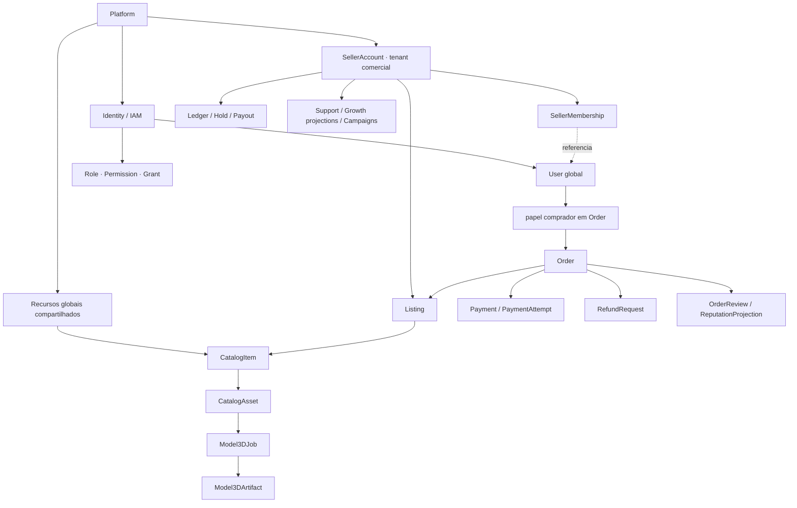
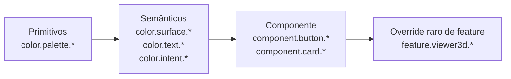
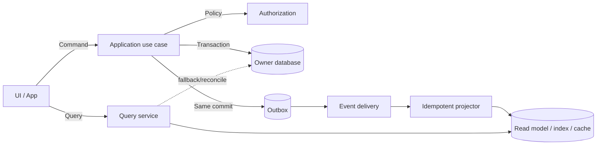

# Midas — nomenclatura e hierarquia funcional canônicas

Versão 1.0 · Convenção pré-código · 22 de agosto de 2026

## 1. Objetivo

Este documento elimina ambiguidades de nome antes da implementação. Ele define como a equipe nomeia pessoas, tenants, objetos, telas, rotas, funções, componentes, botões, estados, eventos, tabelas, caches, métricas e documentos.

A convenção central é:

```text
Platform → SellerAccount → SellerMembership ↔ User → ações autorizadas nos domínios
```

Essa seta descreve **contexto de autorização**, não contenção física. `User` é identidade global e não pertence ao `SellerAccount`; o vínculo é `SellerMembership`. Objetos comerciais pertencem ao `SellerAccount` ou à Platform conforme o domínio.

Este documento não cria numeração definitiva de requisito ou tela. Números e inventário ficam nos documentos responsáveis; aqui ficam a gramática e o significado dos nomes.

## 2. Regras invioláveis

1. **Uma coisa, um nome, um owner.** Sinônimo de interface pode existir, mas o nome técnico canônico não muda por tela.
2. **`User` autentica; `SellerAccount` é o tenant; `SellerMembership` autoriza.** Não criar `Tenant`, `Member`, `SellerUser`, `GrowthUser` ou `MasterUser` paralelos.
3. **Comprador e vendedor são papéis contextuais.** A mesma pessoa pode comprar como `User` e vender por uma `SellerMembership`.
4. **`CatalogItem` é o item canônico; `Listing` é a oferta do tenant.** Não criar `Product`/`Variant` duplicado.
5. **Dinheiro não se chama “saldo” sem qualificador.** Usar disponível, em hold, reservado para saque, pago ou obrigação externa, sempre em moeda.
6. **Estado tem dono.** Não usar um `status` genérico para anúncio, pagamento, asset, saque e pedido.
7. **Comando é verbo no imperativo técnico; evento é fato no passado.** Query não altera estado.
8. **Interface fala pt-BR; contratos e código usam inglês técnico estável.** Tradução nunca troca o identificador.
9. **Redis, índice, analytics e dashboard são projeções.** Não recebem comando canônico nem viram banco principal.
10. **ID seleciona; sessão + policy autorizam.** Saber um ID não concede acesso.

## 3. Árvore de autoridade e propriedade

### 3.1. Visão lógica



### 3.2. Leitura correta da hierarquia solicitada

| Nível | Nome canônico | Pergunta respondida | Exemplo |
|---|---|---|---|
| 0 | `Platform` | qual produto/operação global governa o recurso? | catálogo compartilhado, configuração, staff, auditoria |
| 1 | `SellerAccount` | qual tenant comercial é owner/parte da venda? | loja/equipe do vendedor |
| 2 | `SellerMembership` | por qual vínculo uma pessoa atua naquele tenant? | owner, manager, catalog operator, finance viewer |
| 3 | `User` | qual identidade global autenticada executa a ação? | pessoa que possui sessão/MFA/passkey |
| 4 | domínio + objeto | sobre qual agregado a ação ocorre? | `Listing`, `PayoutRequest`, `CatalogSubmission` |
| 5 | capability + policy | esta identidade pode executar esta ação neste objeto agora? | `listing.publish` + membership ativa + seller elegível |

O servidor sempre resolve os níveis 1–5. Não confia em role do frontend, `sellerAccountId` enviado ou botão escondido.

### 3.3. Objetos globais, tenant-owned e relacionais

| Classe | Owner de escrita | Campo de tenant | Exemplos |
|---|---|---|---|
| global | Platform/módulo global | ausente; pode ter origem de tenant separada | `User`, `CatalogItem`, política publicada, definição de nível |
| tenant-owned | módulo + `SellerAccount` | `sellerAccountId` obrigatório e indexado | `Listing`, payout, hold, equipe, campanha do seller |
| transacional entre partes | módulo transacional | IDs explícitos de cada parte | `Order` liga `buyerUserId` e `sellerAccountId` |
| vínculo | owner do relacionamento | IDs dos dois lados | `SellerMembership`, relação de catálogo |
| projeção | módulo de leitura | mesma chave de escopo da fonte | dashboard, Growth, ranking, busca, cache |

Nenhuma projeção cria um `User`, seller, pedido, saldo, produto ou estado concorrente.

## 4. Dicionário canônico pt-BR ↔ técnico

### 4.1. Identidade, tenant e autorização

| Rótulo pt-BR | Termo técnico | Definição | Evitar |
|---|---|---|---|
| Plataforma | `Platform` | contexto global Midas | tenant global, conta master |
| Pessoa usuária | `User` | identidade global autenticável | cliente/vendedor como tipo fixo |
| Conta vendedora | `SellerAccount` | tenant comercial que possui anúncios, vendas e obrigações | loja, tenant, seller user usados como entidade |
| Participação na conta | `SellerMembership` | vínculo entre `User` e `SellerAccount`, com papel/grants/status/validade | membro duplicado, perfil do seller |
| Master da plataforma | role/grants sobre `User` | pessoa com autoridade máxima de plataforma; não é tabela nem subtipo de usuário | `MasterUser`, boolean `isMaster` espalhado |
| Proprietário da conta vendedora | membership role `OWNER` | papel contextual dentro de um SellerAccount | master, dono global |
| Usuário autorizado | `User` + role/grant/membership | identidade que recebeu capability explícita | usuário admin genérico |
| Papel | `Role` | pacote nomeado de permissões | condição hard-coded por e-mail |
| Permissão | `Permission` | ação atômica nomeada | role como permissão |
| Concessão | `Grant` | atribuição de role/permission com escopo e validade | array de strings no token como fonte permanente |
| Capacidade atual | `Capability` | projeção server-side do que pode ser feito agora | botão habilitado como autorização |

“Minha conta” é rótulo de navegação, não entidade. Em documentação técnica, escrever `User`, `SellerAccount`, `SellerMembership`, destino de recebimento ou conta de ledger conforme o caso.

### 4.2. Catálogo, anúncio e mídia

| Rótulo pt-BR | Termo técnico | Definição | Evitar |
|---|---|---|---|
| Item de catálogo | `CatalogItem` | menor identidade canônica distinguível e compartilhada | Product, Variant, StudioItem |
| Mídia de catálogo | `CatalogAsset` | fonte/derivado com hash, MIME, origem, licença e revisão | arquivo solto, URL como identidade |
| Job 3D | `Model3DJob` | processamento assíncrono de fontes imutáveis | modelo temporário como produto |
| Artefato 3D | `Model3DArtifact` | manifesto imutável de saída revisada | 3DItem, ModelAsset duplicado |
| Anúncio | `Listing` | oferta comercial de um SellerAccount para um CatalogItem | produto do vendedor |
| Revisão do anúncio | `ListingRevision` | snapshot mutável/congelado do conteúdo submetido | editar anúncio publicado in place |
| Unidade vendável | `ListingUnit` | disponibilidade/reserva da unidade específica | estoque global do CatalogItem |
| Composição visual | `Craft` | atributos de craft/stickers da unidade | variante de produto |
| Submissão de catálogo | `CatalogSubmission` | caso de contribuição/revisão, não item publicado | item pendente duplicado |
| Relação de item | `CatalogItemRelation` | self-link para complemento, upsell, cross-sell ou reposição | copiar item relacionado em JSON |
| Biblioteca | `CatalogLibrary` read model | consulta projetada de itens publicados/capabilities | segundo catálogo persistente |

### 4.3. Compra, pagamento e financeiro

| Rótulo pt-BR | Termo técnico | Definição | Evitar |
|---|---|---|---|
| Carrinho | `Cart` | intenção mutável antes do pedido | pedido pendente |
| Pedido | `Order` | agregado transacional congelado | compra genérica em código |
| Pagamento | `Payment` | agregado da intenção ao estado reconciliado; redirect nunca confirma liquidação | `PaymentIntent` paralelo, `paid=true` isolado |
| Tentativa de pagamento | `PaymentAttempt` | tentativa concreta no PSP, preservada sob retry | sobrescrever a tentativa anterior |
| Caso de resolução de pagamento | `PaymentResolutionCase` | investigação auditável de pagamento não reconhecido | editar `Payment.status` pela interface |
| Lançamento contábil | `JournalEntry` + `Posting` | journal append-only, balanceado por moeda, composto por débitos/créditos | `LedgerEntry` genérico, atualizar saldo diretamente |
| Lote de saldo | `BalanceLot` | parcela rastreável da obrigação do seller por pedido/pagamento | saldo agregado sem origem |
| Retenção | `Hold` | regra e janela que protegem um `BalanceLot` até elegibilidade | `HoldLot`, saldo pendente genérico |
| Saldo disponível | `availableBalance` projection | soma reconciliada elegível para saque | wallet mutável |
| Solicitação de saque | `PayoutRequest` | pedido do seller para reservar e pagar valor disponível | transferência sem estado/auditoria |
| Tentativa de saque | `PayoutAttempt` | execução manual/PSP concreta vinculada ao request | sobrescrever erro anterior |
| Evidência de saque | `PayoutEvidence` | referência/hash/prova privada ligada à tentativa | URL pública ou “marcar como pago” sem prova |
| Solicitação de reembolso | `RefundRequest` | caso e decisão de devolução | refund do PSP antes da aprovação |
| Tentativa de reembolso | `RefundAttempt` | execução externa idempotente | novo request a cada retry |
| Moeda fiduciária | `Money` | `amountMinor` + código ISO 4217 | float, gold misturado com BRL |
| Gold do jogo | `GameCurrencyAmount` | quantidade virtual informativa | saldo sacável |

Sempre rotular valor financeiro com moeda, estado e instante: “R$ 520,00 disponível às 14:32”, “R$ 180,00 em hold até 29/08” ou “R$ 90,00 reservado no saque”.

### 4.4. Confiança, progressão e marketing

| Rótulo pt-BR | Termo técnico | Definição | Evitar |
|---|---|---|---|
| Avaliação de pedido | `OrderReview` | nota 0–5/comentário permitido entre participantes elegíveis do mesmo pedido | `Review` genérico, rating sem pedido |
| Reputação | `ReputationProjection` | agregado derivado de avaliações e sinais governados | editar média manualmente |
| Contribuição de progressão | `ProgressionContribution` | fato positivo/compensatório originado em venda elegível | somar GMV no frontend |
| Nível da conta | `AccountLevelAssignment` | progressão calculada sobre regra versionada | campo level incrementado pela UI |
| Regra de nível | `AccountLevelDefinition` | faixa, critério e vigência configurados pela Platform | limites hard-coded em card |
| Insígnia | `BadgeDefinition` | identidade visual, critério e disponibilidade | imagem solta no perfil |
| Concessão de insígnia | `BadgeAward` | fato de uma insígnia ter sido concedida a User/SellerAccount | boolean por badge |
| Recompensa | `RewardDefinition` | regra e fulfillment versionados | prêmio descrito apenas em texto |
| Concessão de recompensa | `RewardAward` | fato auditável de concessão/entrega | `RewardGrant`, crédito direto em saldo |
| Temporada do ranking | `LeaderboardSeason` | janela, fórmula, moeda, desempate e fechamento congelados | `RankingSeason` concorrente |
| Contribuição do ranking | `LeaderboardContribution` | pontos rastreáveis por evento/pedido e reversão | incrementar placar pela UI |
| Ranking | `LeaderboardProjection` | classificação temporal derivada e reproduzível | tabela editável de pontos |
| Prêmio do ranking | `LeaderboardAward` | premiação por posição vinculada à temporada final | `RankingAward` fora da temporada |
| Plano de anúncio | `ListingPlanPolicyVersion` | fee, prioridade e SLAs vigentes, versionados | plano hard-coded na tela |
| Snapshot comercial | `ListingCommercialSnapshot` | regra do plano congelada no anúncio/pedido | recalcular venda histórica com plano atual |
| Ciclo de vida do produto | `ProductLifecyclePolicy` | `ONE_TIME`, `RENEWABLE`, `EXPIRING`, `CONSUMABLE` ou `SERVICE` e seus prazos | usar política de devolução como lifecycle |
| Política de devolução congelada | `ReturnPolicySnapshot` | regra aplicável à oferta/pedido no instante comercial | inferir devolução só pela categoria |
| Insight de cliente do vendedor | `SellerCustomerInsight` read model | recência, frequência, lifecycle e elegibilidade minimizados no escopo do SellerAccount | `CustomerInsightProjection` genérica, cópia do perfil global |
| Campanha | `Campaign` | identidade e ciclo de vida da iniciativa por tenant | `CampaignDefinition` paralela, disparo avulso |
| Versão da campanha | `CampaignVersion` | público, oferta, canais, orçamento e vigência imutáveis após ativação | editar campanha em execução |
| Jornada | `Journey` + `JourneyVersion` | grafo versionado de gatilhos, esperas e saídas | `JourneyDefinition` paralela |
| Cupom | `Coupon` | código/regra de desconto versionados | desconto em texto livre |
| Resgate de cupom | `CouponRedemption` | reserva, consumo e estorno idempotentes no checkout | contador sem vínculo ao pedido |
| Atribuição | `AttributionTouch` | toque de campanha/link/cupom com janela e origem | assumir causalidade pelo último clique sem regra |
| Snapshot de atribuição | `AttributionSnapshot` | decisão congelada de crédito segundo policy | reatribuir conversão histórica silenciosamente |
| Afiliado | `AffiliateAccount` | participante e condições do programa | User duplicado; sempre referencia identidade existente |
| Comissão de afiliado | `AffiliateCommission` | obrigação derivada de conversão reconciliada | crédito calculado só no dashboard |
| Template de mensagem | `MessageTemplate` | conteúdo parametrizado e aprovação do canal | texto copiado dentro da campanha |
| Criativo | `CreativeAsset` | imagem/vídeo/documento com proveniência, licença e revisão | URL solta em disparo |
| Disparo | `Dispatch` | comando de entrega por destinatário, canal, finalidade e versão | `OutboundMessage` ou `MarketingMessage` paralelos |
| Tentativa de entrega | `DeliveryAttempt` | tentativa concreta no provedor e seu resultado | sobrescrever retry anterior |
| Evento de canal | `ChannelEvent` | aceite, entrega, leitura, falha ou opt-out normalizado | tratar leitura como compra |
| Ponto de contato | `ContactPoint` | endereço de canal cifrado/tokenizado pertencente ao User e protegido pela Platform | telefone/WhatsApp exportável ao seller |
| Consentimento | `ConsentRecord` | escolha, finalidade, canal, fonte, versão e tempo | checkbox sem histórico |
| Supressão | `SuppressionEntry` | bloqueio efetivo por canal/finalidade/destinatário | flag desconectada do consentimento |

## 5. Convenções de identificador

### 5.1. Formato

IDs públicos usam prefixo de tipo + UUIDv7 em minúsculas:

```text
usr_0194fca1-7c2a-7b51-8c60-1ea44a5c6732
sac_0194fca2-1e58-7f01-9d54-efc0ba3e31b8
lst_0194fca4-8ab4-7c1e-b63d-755f67b3ae25
```

O [RFC 9562](https://datatracker.ietf.org/doc/html/rfc9562) padroniza UUIDs e UUIDv7. O prefixo não participa da entropia; serve para inspeção humana e validação de tipo na borda. O valor completo é tratado como string opaca pelos clientes.

Regras:

- gerar somente no servidor ou serviço autorizado;
- armazenar o UUID em tipo nativo quando a stack permitir e serializar com prefixo na API;
- não reutilizar ID após tombstone;
- não colocar PII, seller, data de negócio ou sequência manual dentro do ID;
- slug, username, e-mail, número do pedido e chave PSP não substituem o ID;
- ID não é segredo e nunca substitui autorização;
- cursor é token assinado/opaco, não `offset` ou ID bruto concatenado.

### 5.2. Prefixos reservados

| Prefixo | Tipo |
|---|---|
| `usr_` | `User` |
| `sac_` | `SellerAccount` |
| `smb_` | `SellerMembership` |
| `rol_` | `Role` |
| `grt_` | `Grant` |
| `cit_` | `CatalogItem` |
| `cas_` | `CatalogAsset` |
| `m3j_` | `Model3DJob` |
| `m3a_` | `Model3DArtifact` |
| `lst_` | `Listing` |
| `lrv_` | `ListingRevision` |
| `lpp_` | `ListingPlanPolicyVersion` |
| `lcs_` | `ListingCommercialSnapshot` |
| `car_` | `Cart` |
| `ckg_` | `CheckoutGroup` |
| `ord_` | `Order` |
| `pay_` | `Payment` |
| `pma_` | `PaymentAttempt` |
| `prc_` | `PaymentResolutionCase` |
| `jrn_` | `JournalEntry` |
| `pst_` | `Posting` |
| `blt_` | `BalanceLot` |
| `hld_` | `Hold` |
| `pyr_` | `PayoutRequest` |
| `pya_` | `PayoutAttempt` |
| `pev_` | `PayoutEvidence` |
| `rfr_` | `RefundRequest` |
| `rfa_` | `RefundAttempt` |
| `orv_` | `OrderReview` |
| `rep_` | `ReputationProjection` |
| `pco_` | `ProgressionContribution` |
| `ald_` | `AccountLevelDefinition` |
| `ala_` | `AccountLevelAssignment` |
| `bdf_` | `BadgeDefinition` |
| `baw_` | `BadgeAward` |
| `rdf_` | `RewardDefinition` |
| `raw_` | `RewardAward` |
| `lbs_` | `LeaderboardSeason` |
| `lbc_` | `LeaderboardContribution` |
| `lba_` | `LeaderboardAward` |
| `tkt_` | `Ticket` |
| `cmp_` | `Campaign` |
| `cmv_` | `CampaignVersion` |
| `jny_` | `Journey` |
| `jnv_` | `JourneyVersion` |
| `dsp_` | `Dispatch` |
| `dla_` | `DeliveryAttempt` |
| `cev_` | `ChannelEvent` |
| `mtp_` | `MessageTemplate` |
| `cra_` | `CreativeAsset` |
| `cpt_` | `ContactPoint` |
| `cnr_` | `ConsentRecord` |
| `sup_` | `SuppressionEntry` |
| `cpn_` | `Coupon` |
| `crd_` | `CouponRedemption` |
| `afc_` | `AffiliateAccount` |
| `acm_` | `AffiliateCommission` |
| `att_` | `AttributionTouch` |
| `ats_` | `AttributionSnapshot` |
| `csu_` | `CatalogSubmission` |
| `cir_` | `CatalogItemRelation` |
| `plp_` | `ProductLifecyclePolicy` |
| `rps_` | `ReturnPolicySnapshot` |
| `mkp_` | `MarketPolicy` |
| `crp_` | `CrawlPolicy` |
| `evt_` | evento/outbox |
| `aud_` | evento de auditoria |

Adicionar prefixo exige atualizar este registro, parser compartilhado, OpenAPI, gerador e teste de unicidade. Não inventar prefixo local em feature.

### 5.3. Nomes de campos ID

- objeto: `catalogItemId`, `sellerAccountId`, `orderId`;
- coleção: `catalogItemIds`, nunca `items` quando são apenas IDs;
- referência externa: `providerPaymentId`, `providerEventId`;
- ator: `actorUserId`;
- comprador: `buyerUserId`;
- tenant seller: `sellerAccountId`;
- não usar apenas `user`, `seller`, `account`, `ownerId`, `tenantId` ou `externalId` sem qualificador.

## 6. Convenção por camada

| Camada | Convenção | Exemplo |
|---|---|---|
| tipo/classe/aggregate | `PascalCase` singular | `CatalogItem`, `CreateListingFromCatalogItem` |
| variável/função TypeScript | `camelCase` | `sellerAccountId`, `listCatalogItems` |
| função/módulo Python | `snake_case` | `release_eligible_holds` |
| enum técnico | `UPPER_SNAKE_CASE` | `UNDER_REVIEW`, `PAYMENT_CONFIRMED` |
| JSON request/response | `camelCase` | `amountMinor`, `nextCursor` |
| banco/tabela/coluna | `snake_case` | `seller_accounts`, `seller_account_id` |
| URL de interface | pt-BR, minúscula, plural, kebab | `/conta/saldo-de-vendas` |
| URL de API | inglês, plural, kebab | `/v1/seller-accounts/{sellerAccountId}/payout-requests` |
| query string | `camelCase` | `createdAfter`, `sellerAccountId` |
| permission | `domain.resource.action` | `catalog.item.publish` |
| evento | `domain.aggregate.past_action.vN` | `catalog.item.published.v1` |
| erro | `DOMAIN_REASON_UPPER_SNAKE` | `CATALOG_VERSION_CONFLICT` |
| métrica | `midas_domain_operation_unit` | `midas_catalog_search_duration_seconds` |
| token de design | grupos semânticos pontuados | `color.intent.danger.foreground` |
| feature flag | `domain.feature.variant` | `catalog.model3d_generation.enabled` |

## 7. Hierarquia de função no software

### 7.1. Ordem de composição

```text
Bounded Context
└── Aggregate / Read Model
    ├── Command ou Query
    │   └── Application Handler / Use Case
    │       ├── Policy / Domain Service
    │       ├── Repository Port
    │       ├── Integration Port
    │       └── Unit of Work + Outbox
    ├── Domain Event
    └── Projector / Subscriber idempotente
```

Regras:

- controller valida transporte e chama um use case; não contém regra de negócio;
- handler orquestra uma intenção; não recebe `any` nem devolve entidade ORM;
- aggregate protege invariantes próprias;
- policy decide regra que cruza fatos do mesmo contexto;
- integração externa fica atrás de porta explícita, por exemplo `PaymentProviderPort` ou `Model3DGenerationProvider`;
- repository pertence ao aggregate, não a cada tabela;
- projector escreve somente read model reconstruível;
- um use case tem verbo e objeto claros; `process`, `handleData`, `utils`, `manager` e `service` isolados são nomes proibidos.

### 7.2. Gramática de use cases

| Tipo | Gramática | Exemplos |
|---|---|---|
| comando de criação | `Create + Aggregate + Context` | `CreateListingFromCatalogItem` |
| comando de transição | `Verb + Object` | `SubmitCatalogItemReview`, `ReleaseEligibleHold` |
| decisão | `Record + Object + Decision` | `RecordPayoutDecision`, `RecordCatalogAssetDecision` |
| execução externa | `Execute + Effect` | `ExecuteRefund`, `ExecutePayoutAttempt` |
| reconciliação | `Reconcile + Source + Object` | `ReconcileProviderPayment` |
| query singular | `Get + Object` | `GetSellerBalanceSummary` |
| query coleção | `List/Search + Objects` | `SearchCatalogLibrary`, `ListPayoutRequests` |
| projeção | `Project + Event + Into + ReadModel` | `ProjectOrderCompletedIntoSellerDaily` |
| política booleana | `Can/Is/Has + Predicate` | `CanPublishListing`, `IsRefundEligible` |

Uma função chamada `approvePayment` é ambígua. Preferir `RecordPaymentResolutionDecision` para a decisão humana e `SettlePaymentFromResolutionCase` para o efeito canônico reconciliado, cada uma com idempotência, versão e auditoria.

### 7.3. Estrutura lógica de módulos

A stack física ainda será escolhida, mas a separação lógica é obrigatória:

```text
identity/
iam/
sellers/
catalog/
assets-3d/
listings/
orders-delivery/
payments-refunds/
ledger-payouts/
order-reviews-reputation/
progression-leaderboard/
customer-engagement/
promotions-attribution/
catalog-studio/
public-content-seo/
support-disputes/
growth-analytics/
notifications/
administration-audit/
```

Dentro de cada módulo:

```text
domain/          aggregates, value objects, policies, events
application/     commands, queries, handlers, DTOs
ports/           repositories e integrações
adapters/        HTTP, DB, PSP, storage, WhatsApp, search
projections/     read models e projectors
tests/           domínio, contrato, integração, autorização, E2E
```

Não criar um `shared/services` como depósito. Código compartilhado precisa ser primitive transversal estável (`Money`, `Clock`, `IdempotencyKey`, `AuditContext`) ou pertencer a um módulo owner.

## 8. Rotas, telas e navegação

### 8.1. Rotas de interface

Regras:

- público e conta usam termos pt-BR já escolhidos pelo produto;
- recurso no plural; detalhe por ID/slug;
- query representa filtro/ordenação, não estado canônico;
- modal importante tem rota ou deep link quando precisa ser compartilhado/retomado;
- alias antigo redireciona; não mantém duas implementações;
- rota admin inicia `/admin`; rota tenant seller inicia `/vender` ou `/conta` conforme a jornada;
- não colocar role, e-mail, moeda ou nome do tenant no path.

| Propósito | Forma correta | Evitar |
|---|---|---|
| item público | `/itens/:slug` | `/produto?id=` |
| inspeção 3D | `/itens/:slug/3d` | canvas oculto em todo card |
| anúncio | `/anuncios/:listingId` | `/item/:id` ambíguo |
| compras da pessoa | `/conta/compras` | `/orders` misturando idioma |
| vendas do tenant | `/conta/vendas` | `/minhas-compras-vendidas` |
| saldo | `/conta/saldo-de-vendas` | `/carteira` sem significado |
| saques | `/conta/saques` | `/pagamentos` |
| fila master | `/admin/financeiro/saques` | `/admin/requests` |
| Studio | `/admin/catalogo` | `/admin/studio-catalog-v2` |

### 8.2. Chave interna de tela

Sem numeração local, cada superfície recebe chave semântica:

```text
<audience>.<domain>.<view>
```

Exemplos:

```text
public.catalog.item_detail
public.catalog.item_3d
account.orders.purchase_history
seller.listings.create
seller.finance.balance
admin.finance.payout_queue
admin.catalog.library
admin.catalog.asset_review
```

Componente de página usa `PascalCase`: `SellerBalancePage`, `AdminPayoutQueuePage`. O inventário mestre mapeia chave, rota, persona, permission e owner; nenhuma feature inventa nova tela sem verificar esse inventário.

### 8.3. Estado de navegação

- filtros serializáveis ficam na URL;
- dados sensíveis e tokens nunca ficam na URL;
- `from`/history state só melhora Voltar; deep link funciona sem ele;
- trocar `SellerAccount` invalida cache, selection, capability e subscription do tenant anterior;
- tabs usam slug estável (`?aba=historico`) somente se não representarem recurso próprio;
- wizard persiste draft server-side; etapa visual não é fonte de verdade.

## 9. Botões, opções, cards e feedback

### 9.1. Botões

Rótulo de botão usa verbo + objeto em pt-BR. Uma região possui uma ação primária inequívoca.

| Intenção | Rótulo | Nome de ação no código | Evitar |
|---|---|---|---|
| iniciar anúncio | `Criar anúncio` | `createListing` | `Criar`, `OK` |
| enviar para revisão | `Enviar para revisão` | `submitForReview` | `Continuar` na última etapa |
| pedir saque | `Solicitar saque` | `requestPayout` | `Sacar agora` quando é manual |
| confirmar baixa | `Confirmar pagamento do saque` | `recordPayoutPaid` | `Dar baixa` sem objeto/efeito |
| resolução de pagamento | `Confirmar pagamento conciliado` | `settlePaymentFromResolutionCase` | `Aprovar compra` ou `Confirmar manualmente` sem PSP/evidência |
| ação destrutiva | `Suspender anúncio` | `suspendListing` | `Excluir` quando é tombstone |
| fechar sem salvar | `Descartar alterações` | `discardChanges` | `Cancelar` ambíguo |

Regras:

- ação financeira mostra valor, moeda, destino mascarado, efeito e idempotency state;
- confirmação não repete o mesmo label genérico: “Confirmar pagamento de R$ 1.250,00”;
- loading mantém largura e muda para “Confirmando…” com `aria-live`, sem permitir duplo envio;
- sucesso aparece somente após commit/ack canônico; “recebido para processamento” não é “concluído”;
- ação indisponível explica `reasonCode` permitido; botão escondido não é controle de acesso.

### 9.2. Opções e filtros

- label humano, value técnico estável;
- “Todos” significa ausência de filtro, não enum persistido;
- estado desconhecido é `UNKNOWN`, não vazio nem zero;
- ordenação declara direção e desempate;
- opção destrutiva não fica misturada com seleção comum;
- select com mais de 20 itens vira combobox pesquisável;
- filtros ativos são chips removíveis e serializáveis quando não sensíveis.

Exemplo:

```json
{
  "label": "Em análise",
  "value": "UNDER_REVIEW"
}
```

### 9.3. Cards

| Componente | Representa | Conteúdo obrigatório | Não pode representar |
|---|---|---|---|
| `CatalogItemCard` | identidade canônica | poster, nome, categoria, mídia disponível | preço fixo de seller |
| `ListingCard` | oferta | item, preço/moeda, seller, disponibilidade, plano/selo explicado | CatalogItem editável |
| `OrderCard` | transação | número público, partes permitidas, total, estado, próxima ação | `Payment` completo |
| `BalanceSummaryCard` | projeção financeira | disponível, hold, reservado, `asOf`, moeda | gold misturado |
| `PayoutRequestCard` | solicitação | valor, tenant, aging, status, assignee/capability | saldo genérico |
| `UserTrustCard` | reputação autorizada | nota, contagem, faixa e metodologia | PII ou score secreto |
| `MetricCard` | uma definição versionada | valor, período, comparação, freshness | total sem denominador |

Nome de componente descreve a entidade, não a estética. Evitar `PrettyCard`, `GlassCard`, `Card2` e `GenericCard` de domínio.

## 10. Estados, transições e erros

### 10.1. Nome de estado

Cada agregado possui campo qualificado:

```text
listingStatus
orderStatus
paymentIntentStatus
holdStatus
payoutStatus
refundStatus
catalogItemStatus
assetReviewStatus
model3DJobStatus
```

Valores técnicos usam `UPPER_SNAKE_CASE`; tradução é mapeamento de UI. Não persistir label pt-BR.

| Técnica | Label pt-BR | Regra |
|---|---|---|
| `DRAFT` | Rascunho | editável pelo owner permitido |
| `UNDER_REVIEW` | Em análise | versão congelada |
| `ACTION_REQUIRED` | Ação necessária | exibir responsável e próxima ação |
| `APPROVED` | Aprovado | decisão registrada; pode ainda não estar publicado/pago |
| `PUBLISHED` | Publicado | visível no escopo definido |
| `PROCESSING` | Processando | tentativa ativa; não repetir sem idempotência |
| `COMPLETED` | Concluído | terminal de sucesso do agregado específico |
| `FAILED` | Falhou | pertence à tentativa quando houver retry |
| `CANCELED` | Cancelado | terminal explícito, nunca “apagado” |
| `SUSPENDED` | Suspenso | reversível por política |
| `UNKNOWN` | Indisponível | fonte não determinou; não equivale a zero |

Não reutilizar `APPROVED` para significar pago, entregue e publicado. Cada agregado conclui no seu próprio evento.

### 10.2. Gramática de transição

```text
Command: SubmitListingReview
Transition: DRAFT → UNDER_REVIEW
Event: listing.review_submitted.v1
UI: Enviar para revisão
```

Toda transição documenta:

- estado de origem permitido;
- precondições/capability;
- idempotency key/version esperada;
- efeito e lançamentos/outbox no mesmo commit;
- estado de destino;
- evento no passado;
- compensação/reconciliação;
- label e próxima ação na UI.

### 10.3. Erros

Envelope candidato:

```json
{
  "type": "https://errors.midas.example/catalog/version-conflict",
  "title": "O item foi alterado",
  "status": 409,
  "code": "CATALOG_VERSION_CONFLICT",
  "detail": "Recarregue a versão atual antes de salvar.",
  "correlationId": "...",
  "fieldErrors": []
}
```

O hostname é placeholder até domínio oficial. Regras:

- `code` é estável e técnico; `title/detail` são localizáveis;
- não expor stack, SQL, PSP secret, existência de objeto alheio ou policy interna sensível;
- 401 = autenticação ausente/inválida; 403/404 seguem política contra enumeração; 409 = conflito; 422 = semântica inválida; 429 = quota/rate limit com retry explícito;
- erro de tentativa não muda sozinho o aggregate para terminal;
- frontend trata por `code`, nunca compara texto.

## 11. Eventos, tópicos e auditoria

### 11.1. Nome do evento

Gramática:

```text
<domain>.<subject_path>.<past_action>.v<major>
```

`subject_path` possui um ou, quando necessário, dois segmentos estáveis. A forma curta cobre `order.payment_confirmed.v1`; a forma hierárquica cobre `catalog.model3d.artifact_published.v1`. Não ampliar a profundidade para reproduzir pastas internas.

Exemplos:

```text
order.payment_confirmed.v1
ledger.hold.released.v1
payout.request.created.v1
payout.attempt.paid.v1
catalog.item.published.v1
catalog.model3d.artifact_published.v1
reputation.order_review.submitted.v1
```

No transporte CloudEvents, usar `type=midas.<nome lógico>`; a [especificação CloudEvents](https://github.com/cloudevents/spec/blob/main/cloudevents/spec.md) define envelope comum com `id`, `source`, `specversion` e `type`. `source + id` identifica replay; o consumidor ainda mantém inbox/idempotência própria.

### 11.2. Envelope mínimo

```text
eventId
eventType
schemaVersion
occurredAt
recordedAt
aggregateType
aggregateId
aggregateVersion
sellerAccountId?      somente quando existe escopo de tenant
actorUserId?          minimizado conforme finalidade
correlationId
causationId
sourceModule
payload
```

- evento é fato imutável, não comando disfarçado;
- breaking change aumenta major do tipo/schema;
- campo novo opcional não muda significado antigo;
- payload não carrega entidade inteira, PII, chat, segredo ou URL assinada;
- tópico físico não substitui `eventType`;
- auditoria registra quem, o quê, objeto, antes/depois permitido, motivo, tempo e correlação; não é analytics.

## 12. API e HTTP

### 12.1. Recursos

- API começa em `/v1` e usa substantivos plurais;
- path param recebe nome completo: `{sellerAccountId}`, não `{id}` em rota aninhada ambígua;
- `GET` é query e não altera domínio;
- `POST` cria recurso ou comando não naturalmente idempotente com `Idempotency-Key`;
- `PUT` substitui recurso/ponteiro quando semântica for idempotente;
- `PATCH` altera versão mutável com `If-Match`;
- `DELETE` normalmente cria tombstone/retirement conforme domínio; documentação declara efeito;
- transição especial pode ser subrecurso (`/decision`, `/cancel`, `/submit-review`) quando CRUD esconderia a intenção.

O [RFC 9110](https://datatracker.ietf.org/doc/html/rfc9110) define semântica e idempotência dos métodos HTTP. A aplicação ainda precisa de idempotência de negócio para comandos financeiros e webhooks.

### 12.2. `operationId`

Formato `camelCase`, verbo + objeto + contexto:

```text
getCatalogItem
searchSellerCatalogLibrary
createListingFromCatalogItem
settlePaymentFromResolutionCase
listAdminPayoutRequests
recordPayoutPaid
```

A [OpenAPI Specification](https://spec.openapis.org/oas/v3.1.2.html) exige `operationId` único quando fornecido. O CI falha em duplicata, rota sem tag/permission/error schema ou request/response sem exemplo válido.

### 12.3. Paginação, ordenação e tempo

```text
?limit=25&cursor=<opaque>&sort=-createdAt,payoutRequestId
```

- cursor carrega ordenação e escopo assinados;
- `limit` possui mínimo/máximo;
- toda ordenação tem desempate único;
- timestamp usa RFC 3339 UTC (`createdAt`, `availableAt`), exibido no fuso do usuário;
- intervalo usa `createdFrom` inclusivo e `createdBefore` exclusivo;
- respostas derivadas incluem `asOf`, `projectedAt`, `freshness` e `nextCursor`.

## 13. Banco de dados

### 13.1. Tabelas e colunas

Plural `snake_case`:

```text
users
seller_accounts
seller_memberships
catalog_items
catalog_assets
model_3d_jobs
model_3d_artifacts
listings
listing_revisions
listing_plan_policy_versions
listing_commercial_snapshots
return_policy_snapshots
carts
cart_lines
checkout_groups
orders
payments
payment_attempts
payment_resolution_cases
journal_entries
postings
balance_lots
holds
payout_requests
payout_attempts
payout_evidence
refund_requests
refund_attempts
order_reviews
reputation_projections
progression_contributions
account_level_definitions
account_level_assignments
badge_definitions
badge_awards
reward_definitions
reward_awards
leaderboard_seasons
leaderboard_contributions
leaderboard_projections
leaderboard_awards
contact_points
campaigns
campaign_versions
journeys
journey_versions
message_templates
creative_assets
dispatches
delivery_attempts
channel_events
consent_records
suppression_entries
coupons
coupon_redemptions
affiliate_accounts
attribution_touches
attribution_snapshots
affiliate_commissions
catalog_submissions
catalog_item_relations
product_lifecycle_policies
market_policies
crawl_policies
outbox_events
audit_events
```

Regras:

- foreign key `<singular>_id` (`seller_account_id`);
- timestamp `<action>_at`; boolean somente para fato realmente binário (`is_test`), nunca para máquina de estado;
- valor monetário `<name>_amount_minor` + `<name>_currency` ou composite `Money` validado;
- `version` monotônico em aggregate mutável;
- `created_at`/`updated_at` não substituem tempo de negócio (`paid_at`, `available_at`);
- soft delete usa estado/tombstone e `retired_at`/`deleted_at` conforme semântica; não apaga ledger/auditoria;
- índice/constraint recebe nome `<table>_<columns>_<kind>`, por exemplo `listings_seller_account_id_status_idx`;
- toda tabela tenant-owned possui `seller_account_id NOT NULL`, FK, índices e policy de isolamento quando RLS for adotada.

A [documentação de Row Security do PostgreSQL](https://www.postgresql.org/docs/current/ddl-rowsecurity.html) orienta a defesa em profundidade, mas RLS não substitui autorização de aplicação nem teste BOLA/IDOR.

### 13.2. Ownership físico

- um módulo escreve suas tabelas e publica evento;
- outro módulo referencia ID ou mantém projeção declarada;
- join cross-module em read path pode existir via query layer, nunca para alterar tabela alheia;
- migration fica no módulo owner;
- view/materialized view termina em `_projection` ou `_daily` e é reconstruível;
- trigger financeira invisível é proibida; efeito financeiro passa por use case/ledger explícito.

## 14. Redis, cache, filas e locks

### 14.1. Chaves

Formato:

```text
midas:<env>:<domain>:<scope>:<resource>:<version>:<key>
```

Exemplos:

```text
midas:prod:catalog:public:item:v12:cit_...
midas:prod:seller:sac_...:capabilities:v7:usr_...
midas:prod:growth:sac_...:dashboard:v3:2026-08-22
```

Regras:

- nunca incluir e-mail, telefone, nome, token, segredo ou payload bruto;
- toda chave tenant-dependent contém `sellerAccountId` e versão de membership/policy relevante;
- TTL é explícito por classe; ausência de TTL exige justificativa;
- namespace muda em schema incompatível;
- cache miss consulta fonte canônica; cache hit ainda respeita escopo;
- invalidação é event-driven e idempotente;
- Redis indisponível degrada leitura/controla backpressure; não inventa saldo/estado.

### 14.2. Lock e idempotência

| Mecanismo | Nome | Uso |
|---|---|---|
| idempotency record | `idempotency:<actorScope>:<operation>:<key>` | efeito de comando, com request hash e resposta persistida |
| lock curto | `lock:<domain>:<aggregateId>:<purpose>` | coordenação não substituível por constraint; TTL e fencing token |
| dedupe de evento | `inbox:<consumer>:<eventId>` | otimização; dedupe durável fica no banco do consumidor quando crítico |
| rate limit | `rate:<policy>:<subjectHash>:<window>` | limite com subject pseudonimizado |

Constraint/transação no banco vence lock distribuído quando protege unicidade financeira ou de reserva.

## 15. Métricas, logs e traces

### 15.1. Métricas

Formato Prometheus/OpenTelemetry:

```text
midas_<domain>_<operation>_<unit>
```

Exemplos:

```text
midas_catalog_search_duration_seconds
midas_model3d_job_total
midas_payment_webhook_total
midas_payout_queue_age_seconds
midas_projection_lag_seconds
```

Labels allowlisted: `environment`, `result`, `provider`, `status`, `operation`, `schema_version`. Proibidos: `userId`, `sellerAccountId`, `orderId`, e-mail e error message livre; alta cardinalidade fica em logs/traces protegidos.

### 15.2. Logs

Campos estruturados:

```text
timestamp, level, service, environment, operation, result,
correlationId, traceId, spanId, errorCode, durationMs
```

IDs de objeto/tenant entram somente quando necessários, com classificação/retention e acesso protegidos. Não logar request/response integral de auth, payment, WhatsApp, ticket, asset ou entrega segura.

### 15.3. Traces

Span: `<domain>.<operation>`, por exemplo `catalog.search_items`, `payments.reconcile_webhook`, `payouts.record_paid`. Atributos seguem convenções OpenTelemetry; dados de negócio ficam minimizados e erros usam `error.type`/`errorCode`, não segredo.

## 16. Design system, cores e movimento

Valores visuais pertencem à direção de arte. Esta convenção define a hierarquia dos tokens, inspirada no formato estável publicado pelo [Design Tokens Community Group](https://www.designtokens.org/technical-reports/).



### 16.1. Gramática de token

```text
<category>.<role>.<variant>.<state>
```

| Categoria | Exemplos | Regra |
|---|---|---|
| cor | `color.surface.canvas`, `color.text.muted`, `color.intent.danger.background` | componente usa semântico, não hex |
| espaço | `space.2`, `space.4`, `space.8` | escala única; nome não contém pixel |
| tipografia | `font.body.md`, `font.label.sm`, `font.metric.lg` | papel semântico, não nome visual |
| raio | `radius.control`, `radius.card`, `radius.pill` | limitado pela direção de arte |
| sombra | `shadow.surface.raised`, `shadow.focus` | foco não é efeito decorativo |
| duração | `motion.duration.fast`, `motion.duration.standard` | reduced motion resolve alias apropriado |
| easing | `motion.easing.enter`, `motion.easing.exit` | canvas 3D possui owner próprio |
| breakpoint | `layout.breakpoint.compact` | layout sem nome de dispositivo específico |

### 16.2. Semântica de cor

```text
neutral    superfícies, bordas, texto
brand      identidade e ação primária
info       informação sem urgência
success    efeito concluído e confirmado
warning    atenção/risco recuperável
danger     erro, bloqueio ou destruição
finance    valor monetário, sem confundir sucesso
trust      reputação/verificação com explicação
```

Nunca usar verde para pagamento antes da confirmação canônica. Hold, saque solicitado, processamento e pago precisam de labels/ícones próprios; cor apenas reforça.

### 16.3. Componentes e biblioteca UI

```text
ui/primitives/      Button, Input, Dialog, Table, Badge
ui/patterns/        DataTable, MetricCard, EmptyState, Stepper
features/catalog/   CatalogItemCard, AssetReviewPanel
features/finance/   BalanceSummaryCard, PayoutQueue
features/model3d/   ModelViewerShell, ModelReviewPanel
```

- primitive não conhece Order, SellerAccount ou payout;
- pattern conhece comportamento recorrente, não regra de domínio;
- feature component recebe DTO/capability do seu módulo;
- React Bits entra como implementação de primitive/pattern auditada, não como nome do componente de negócio;
- Three/R3F é owner do canvas; UI DOM apenas envolve, informa e controla;
- duplicação visual é medida por contrato/props, não resolvida com componente universal de cinquenta opções.

## 17. Classes de velocidade e execução

Toda função/tela declara sua classe; “rápido” sem condição de teste não é requisito.

| Classe | Nome técnico | Expectativa | Exemplos |
|---|---|---|---|
| resposta local | `IMMEDIATE_FEEDBACK` | feedback visual ≤ 100 ms | clique, filtro selecionado, validação local |
| leitura interativa | `INTERACTIVE_QUERY` | budget p95 definido por endpoint e dataset | busca, dashboard, fila |
| comando curto | `SYNCHRONOUS_COMMAND` | commit e resposta em segundos, sem trabalho pesado | criar rascunho, solicitar saque |
| workflow assíncrono | `ASYNC_WORKFLOW` | `202` + status resource/evento | 2D→3D, importação, exportação |
| processamento em lote | `BATCH_JOB` | janela, checkpoint, backpressure e ETA só se mensurável | reindexação, recomputar ranking |
| integração eventual | `EVENTUAL_PROJECTION` | freshness/lag explícitos | Growth, reputação, ranking |

Regras:

- API não espera GPU, exportação ou disparo de campanha;
- loading, queued, processing, delayed, stale e failed têm estados diferentes;
- timeout, retry, circuit breaker e idempotência pertencem ao adapter/use case, não à tela;
- SLO usa p50/p95/p99, taxa de erro e saturação; média sozinha não vale;
- teste declara ambiente, dataset, concorrência, cache e rede;
- otimização não pode remover autorização, auditoria ou reconciliação.

## 18. Fluxo de dados e ownership

### 18.1. Escalabilidade sem quebrar ownership

| Pressão | Unidade de particionamento | Estratégia | Invariante preservada |
|---|---|---|---|
| catálogo público | `catalogItemId`/vertical + versão | CDN, índice e cache compartilhados | Catalog continua owner; cache é reconstruível |
| Listings | `sellerAccountId` + `listingId` | índices compostos, paginação por cursor e projeção de busca | nenhuma oferta cruza tenant |
| pedidos/pagamentos | `orderId` e chave PSP | transação local, outbox, consumidor idempotente | um efeito financeiro por fato canônico |
| ledger/saques | `sellerAccountId` + moeda | serialização/lock por conta lógica, journals append-only | total de débitos e créditos fecha |
| assets/3D | hash + scope + jobId | object storage, fila dedicada, cota e workers isolados | raw privado; artefato publicado é imutável |
| Growth/ranking | janela + dimensão + sellerAccountId quando aplicável | buckets incrementais, replay e batch checkpoint | projeção explica fonte, versão e freshness |
| campanhas | campaignId + recipient shard | fila com consent check no envio, rate limit e dedupe | comunicação respeita finalidade e opt-out |

Escalar começa por leitura/projeção e workers. Separar banco ou serviço só entra quando métricas reais provarem contenção que o modular monolith não resolve. Shard key nunca é inferida do ator: todo registro tenant-dependent carrega `sellerAccountId` explícito. Migração de partição mantém IDs, eventos, idempotency records, auditoria e reconciliação.

### 18.2. Fluxo canônico



| Tipo de fluxo | Nome | Regra |
|---|---|---|
| intenção do usuário | command | valida capability/invariante, idempotente quando necessário |
| leitura | query | sem efeito de domínio, informa freshness |
| fato | domain event | passado, imutável, versionado |
| mudança externa recebida | integration event/webhook | autenticada, inbox/dedupe, reconciliada antes de virar fato |
| atualização de projeção | projector | replayable e idempotente |
| ação externa | adapter attempt | tentativa persistida, resultado reconciliável |

## 19. Ownership documental

### 19.1. Fonte por decisão

| Artefato | É owner de | Não deve duplicar |
|---|---|---|
| relatório mestre | estado real do repositório, lacunas e índice de documentação | requisito detalhado, enum completo |
| PRD | problema, escopo funcional, regra e aceite do produto | schema físico e layout pixel a pixel |
| UML/arquitetura | limites, agregados, dependências, sequências e invariantes | backlog/tarefa operacional |
| direção de arte | valores de marca, tokens, contraste, motion e aplicação visual | estado de pagamento |
| segurança/compliance/operação | controles, threat model, retenção, SLO e runbooks | catálogo de telas |
| backlog/roadmap | ordem, dependência, gate e definição de pronto | requisito canônico reescrito |
| mapa de telas/fluxos | inventário, rota, persona, dados, ações e wireframes | regra de domínio completa |
| ADRs | decisão arquitetural aceita/proposta, alternativas e consequências | inventário funcional |
| Growth | métrica, dimensão, projeção, freshness e dashboards analíticos | objeto transacional paralelo |
| plano React Bits | governança da biblioteca de movimento | tokens/cores canônicos |
| pipeline 3D | fontes, jobs, artefatos, validação, viewer e budgets 3D | catálogo/Listing duplicados |
| matriz de implementação | vínculo requisito→tela→API→estado→teste | definição original de cada item |
| Studio | catálogo 2D/3D, prefill, submissão e relação de itens | modelo financeiro/marketing completo |
| este documento | gramática de nomes, hierarquia e ownership | número definitivo de requisito/tela |
| OpenAPI/JSON Schema futuro | contrato executável de transporte e dados | intenção de produto |
| migrations futuras | schema físico aplicado | regra de negócio não documentada |

### 19.2. Regra de conflito

1. Interromper implementação e identificar o owner da informação.
2. Se a divergência for decisão arquitetural, criar/alterar ADR antes do código.
3. Alterar o documento owner e substituir duplicatas por link/resumo.
4. Atualizar matriz e contratos derivados no mesmo change set.
5. CI confirma links, schemas, exemplos, Mermaid e inventário.

Não resolver conflito escolhendo o texto mais recente sem entender o owner. Data de edição não substitui autoridade documental.

### 19.3. Cabeçalho mínimo de artefato

```text
Título
Versão
Status: proposta | aceita | substituída | bloqueada
Owner
Revisores
Última atualização
Substitui / substituído por
Contratos relacionados
```

## 20. Governança de mudança

Uma mudança de nome canônico exige:

- razão e escopo;
- busca global de usos;
- compatibilidade/alias/deprecation;
- migração de banco/evento/API/telemetria;
- atualização de tradução e analytics;
- teste que impede o termo antigo em novos contratos;
- data de remoção quando houver compatibilidade temporária.

### 20.1. Termos bloqueados sem qualificador

```text
account
member
user account
seller user
tenant
item
product
variant
balance
payment
status
data
service
manager
process
handle
request
approve
complete
```

Eles podem aparecer em linguagem natural, mas código/contrato precisa indicar o conceito: `sellerAccount`, `availableBalance`, `Payment`, `PayoutRequest`, `settlePaymentFromResolutionCase`.

### 20.2. Checklist de pull request futuro

- [ ] nome existe no dicionário ou foi adicionado ao owner;
- [ ] não cria entidade paralela;
- [ ] owner de escrita e `sellerAccountId` estão explícitos;
- [ ] command/query/event seguem gramática;
- [ ] estado e erro têm campo/código qualificados;
- [ ] rota e `operationId` são únicos;
- [ ] permission e capability estão mapeadas;
- [ ] cache/índice carregam escopo e freshness;
- [ ] componente usa tokens, não valor local;
- [ ] botão descreve o efeito real;
- [ ] telemetry evita PII/cardinalidade alta;
- [ ] documentação owner, matriz e teste foram atualizados.

## 21. Testes e lint arquitetural

### 21.1. Estáticos

- parser valida todos os IDs/prefixos em schemas e exemplos;
- OpenAPI falha em `operationId` repetido, `{id}` ambíguo, path fora da gramática ou schema sem owner;
- linter de eventos valida `domain.subject_path.past_action.vN` e envelope;
- linter de permission valida três segmentos e registro no IAM;
- SQL lint exige `seller_account_id` em tabela classificada como tenant-owned;
- imports impedem módulo de escrever repository de outro módulo;
- frontend falha em hex, shadow, duration ou z-index fora de token allowlisted;
- forbidden-terms lint sinaliza `Tenant`, `MasterUser`, `ProductVariant`, `SellerCatalogItem`, `walletBalance` e funções genéricas;
- link checker e Mermaid renderer validam documentos.

### 21.2. Contrato e integração

- JSON request/response usa camelCase; DB mapping usa snake_case sem perder significado;
- exemplos OpenAPI validam contra schema e executam em API real de teste;
- idempotency replay devolve o mesmo efeito/recurso;
- evento duplicado/fora de ordem não duplica projeção;
- cursor de tenant A é rejeitado no tenant B;
- cache quente/frio preserva autorização e versão;
- tela traduz enum sem branch por texto; enum desconhecido cai em label seguro e telemetria;
- operação manual financeira registra ator, motivo, evidência, versão e journal, sem mutação direta.

### 21.3. Testes de linguagem de interface

- snapshot/axe confirma nome acessível de botão e estado;
- ação pendente não usa label concluído;
- cor não é único indicador;
- dinheiro sempre mostra moeda e estado;
- card de `CatalogItem` não mostra preço sem resolver `Listing`;
- card de `Listing` não permite editar identidade canônica;
- erro nunca revela outro SellerAccount.

## 22. Fontes normativas e referências primárias

- [RFC 9562 — UUIDs e UUIDv7](https://datatracker.ietf.org/doc/html/rfc9562)
- [RFC 3986 — sintaxe de URI](https://datatracker.ietf.org/doc/html/rfc3986)
- [RFC 9110 — semântica HTTP e idempotência](https://datatracker.ietf.org/doc/html/rfc9110)
- [OpenAPI Specification 3.1.2](https://spec.openapis.org/oas/v3.1.2.html)
- [CloudEvents Specification](https://github.com/cloudevents/spec/blob/main/cloudevents/spec.md)
- [Design Tokens Community Group — Technical Reports](https://www.designtokens.org/technical-reports/)
- [PostgreSQL — Row Security Policies](https://www.postgresql.org/docs/current/ddl-rowsecurity.html)
- [Medusa — módulos e module links](https://docs.medusajs.com/resources/commerce-modules/product/links-to-other-modules)
- [Saleor — Products e Attributes](https://docs.saleor.io/developer/products/overview)
- [Vendure — Products, Facets e Channels](https://docs.vendure.io/current/core/core-concepts/products)
- [Three.js — descarte de objetos](https://threejs.org/manual/en/how-to-dispose-of-objects.html)

## 23. Handoff

Antes de criar qualquer runtime, a equipe deve usar esta convenção para gerar quatro artefatos executáveis:

1. catálogo de tipos/IDs/permissions/eventos em schema versionado;
2. OpenAPI com `operationId`, erros e exemplos;
3. linter arquitetural para termos proibidos, ownership e tenant scope;
4. mapa gerado que liga tela → rota → use case → objeto → permission → evento → teste.

O primeiro merge de código só passa quando esses artefatos detectarem, automaticamente, uma tentativa de criar `Tenant`, `MasterUser`, `ProductVariant`, saldo mutável ou `status` financeiro genérico. Assim, a hierarquia deixa de ser apenas desenho e vira uma restrição verificável do projeto.
