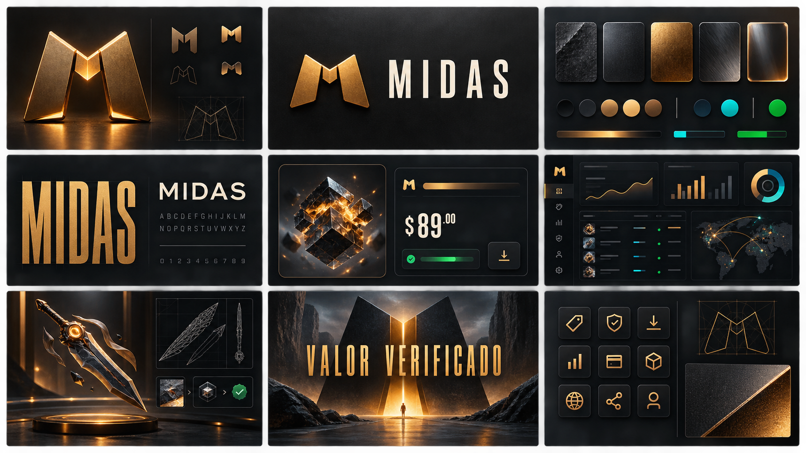

# MIDAS — Brand kit, design system e conversão responsável

Versão 1.0 · Documento pré-código · 22 de agosto de 2026

> **Estado verificável:** direção e regras propostas para validação. Não existe, neste repositório, logotipo final registrado, biblioteca de componentes executável nem pacote de tokens publicado.

Este documento traduz a estratégia comercial em linguagem visual e verbal sem substituir a [Direção de arte](03-DIRECAO-DE-ARTE.md). A direção de arte define como a interface se comporta; este brand kit define o que a marca significa, como suas famílias se organizam e como campanhas e produto permanecem coerentes.

## 1. Arquitetura da marca

```text
MIDAS                                      marca-mãe
├── Midas Market                           descoberta e transação pública
├── Midas Studio                           biblioteca 2D/3D e criação de anúncio
├── Midas Growth                           análise e pós-venda do SellerAccount
└── Midas Operações                        workbenches internos de staff/Master
```

`Midas Foundry` é o nome da **direção visual**, não outro produto nem outro tenant. `P2P`, `Midas` e futuras categorias comerciais são canais/selos dentro do Market; não viram marcas independentes.

Regras:

1. o logotipo principal diz `MIDAS`;
2. nomes de módulos aparecem como descritores, não como novos logotipos;
3. a identidade do tenant pode aparecer no contexto autorizado, mas não substitui a marca que oferece a proteção transacional;
4. campanha de terceiro, afiliado ou creator precisa ser identificada como tal;
5. nomes, símbolo e disponibilidade marcária precisam de busca e validação jurídica antes do lançamento.

## 2. Núcleo estratégico

### 2.1 Proposta

**Valor digital, verificado de ponta a ponta.**

Midas deve significar que catálogo, vendedor, pagamento, entrega e saldo possuem estados compreensíveis e evidência rastreável. Ouro comunica valor validado; nunca promessa de enriquecimento.

### 2.2 Posicionamento

Para pessoas que compram ou vendem produtos digitais e precisam reduzir incerteza, Midas é um marketplace transacional que conecta descoberta, negociação, confirmação, entrega e pós-venda. Diferentemente de uma vitrine ou conversa informal, mostra a origem do item, o estado da operação e a próxima ação permitida.

### 2.3 Pilares

| Pilar | Promessa | Prova de produto |
|---|---|---|
| Verificação | estado não depende de alegação | webhook reconciliado, trilha e referência |
| Clareza | preço, taxa e prazo não se escondem | breakdown, data, origem e motivo |
| Controle | a pessoa sabe o que pode fazer | próxima ação, recuperação e histórico |
| Expressão | produto digital merece apresentação precisa | 2D licenciado, 3D revisado e fallback |
| Continuidade | a relação não termina no pagamento | entrega, suporte, avaliação e pós-venda consentido |

### 2.4 Personalidade e limites

| Somos | Não somos |
|---|---|
| precisos | frios ou burocráticos |
| intensos | agressivos |
| premium | ornamentais |
| confiáveis | paternalistas |
| conhecedores de games | imitadores de uma propriedade de terceiro |
| persuasivos | manipuladores |

Não usar linguagem de cassino, aposta, “dinheiro fácil”, falsa exclusividade, urgência inventada ou imagem que glorifique arma real. O objeto visual é um item digital colecionável; contexto e rotulagem não podem sugerir venda de armamento físico.

## 3. Sistema verbal

### 3.1 Voz

- **Decisão:** direta — “Revise a taxa e confirme”.
- **Estado:** factual — “Pagamento recebido pelo provedor; reconciliação em andamento”.
- **Ajuda:** humana — “O que aconteceu e como resolver”.
- **Campanha:** energética, mas comprovável — “Seu Nitro está perto da renovação” somente quando houver data e consentimento válidos.
- **Risco:** sóbria — “O saque precisa de revisão” com motivo permitido e caminho de recurso.

### 3.2 Fórmula de hook responsável

```text
contexto real + benefício específico + evidência disponível + próxima ação reversível
```

Exemplos:

| Contexto | Hook permitido | Prova necessária |
|---|---|---|
| carrinho abandonado | “Seu carrinho ainda tem 2 itens disponíveis” | reserva/estoque e expiração reais |
| renovação | “Seu benefício vence em 3 dias” | `expiresAt` canônico |
| cross-sell | “Combine com itens compatíveis” | regra de compatibilidade ou curadoria identificada |
| anúncio patrocinado | “Destaque Premium” | selo publicitário e política de ordenação |
| ranking | “Você está a 8 pontos do próximo nível” | fórmula, janela e projeção atualizadas |

Proibido: “última chance” sem prazo real, avaliações fabricadas, preço riscado sem histórico, demanda artificial, culpa, contato sem consentimento, botão de recusa escondido ou renovação silenciosa.

### 3.3 Vocabulário principal

O [vocabulário canônico da interface](03-DIRECAO-DE-ARTE.md#7-conteúdo-e-microcopy) continua obrigatório. A marca adiciona:

- `Biblioteca do Studio`, não “banco mágico de skins”;
- `Modelo 3D aprovado`, `Prévia 3D` e `Imagem 2D`, sem chamar inferência de réplica exata;
- `Produto relacionado`, `Adicionar ao pedido` e `Ver compatibilidade`, não “você também precisa”;
- `Mensagem de pós-venda`, `Jornada` e `Consentimento de canal`;
- `Nível da conta`, `Insígnia` e `Temporada do ranking`;
- `Destaque Básico`, `Destaque VIP` e `Destaque Premium`, sempre com taxa e critério visíveis.

## 4. Assinatura e símbolo

### 4.1 Conceito proposto

Um monograma `M` é construído por duas placas inclinadas que se encontram como um lingote sendo prensado. O negativo central sugere um portal/escudo: descoberta na frente, proteção por trás. A geometria deve funcionar em 16 px sem lâmina, coroa, moeda, arma ou gradiente indispensável.

### 4.2 Conjunto necessário

| Ativo | Uso | Critério |
|---|---|---|
| assinatura horizontal | cabeçalho e institucional | símbolo + MIDAS, legível em 120 px |
| assinatura compacta | mobile e app shell | símbolo + MIDAS sem descritor |
| símbolo | favicon/avatar | reconhecível em 16 e 32 px |
| versão monocromática | documentos e alto contraste | uma tinta, sem perda de forma |
| área de proteção | qualquer aplicação | no mínimo a largura da haste do `M` |

O board visual citado ao fim é exploração, não ativo marcário final. Antes de produção: desenhar em vetor, ajustar hinting, testar redução, pesquisar colidência e registrar a decisão de uso.

## 5. Cor

### 5.1 Diagrama de papéis

```text
FUNDO            ESTRUTURA          CONTEÚDO          AÇÃO/VALOR       ESTADO
paper 13%   →    rule 31%      →    ink 94%      →    accent 78%      danger/success/info
paper-2 17%      rule-2 26%         ink-2 78%         focus 84%       sempre ícone + texto
paper-3 22%                         muted 66%
```

Tokens canônicos, em OKLCH, permanecem definidos na [Direção de arte](03-DIRECAO-DE-ARTE.md#3-sistema-cromático-proposto):

| Token semântico | Valor | Função |
|---|---|---|
| `paper` | `oklch(13% 0.012 75)` | fundo da aplicação |
| `paper-2` | `oklch(17% 0.014 75)` | superfície principal |
| `paper-3` | `oklch(22% 0.016 75)` | superfície elevada |
| `ink` | `oklch(94% 0.012 85)` | texto primário |
| `ink-2` | `oklch(78% 0.012 80)` | texto secundário |
| `muted` | `oklch(66% 0.012 75)` | metadado não crítico |
| `rule` | `oklch(31% 0.016 75)` | borda forte |
| `rule-2` | `oklch(26% 0.014 75)` | divisor suave |
| `accent` | `oklch(78% 0.160 80)` | ação e valor-chave |
| `accent-ink` | `oklch(18% 0.018 75)` | conteúdo sobre ouro |
| `focus` | `oklch(84% 0.190 80)` | foco de teclado |
| `danger` | `oklch(65% 0.190 28)` | erro/risco confirmado |
| `success` | `oklch(72% 0.130 150)` | conclusão confirmada |
| `info` | `oklch(74% 0.120 225)` | informação operacional |

### 5.2 Regras de proporção

- superfícies escuras: 80–90% da composição;
- texto, borda e mídia: 7–15%;
- ouro: aproximadamente 3–5%, nunca como fundo de página inteira;
- cores de estado: somente no componente que possui o estado;
- preço, gold do jogo e dinheiro fiduciário não compartilham símbolo nem tratamento.

Toda combinação real precisa passar por contraste automatizado e inspeção nos temas suportados. Alvo: WCAG 2.2 AA, 4,5:1 para texto comum e 3:1 para texto grande/controles. Cor nunca é a única diferença.

### 5.3 Níveis e insígnias

Nível é expresso por número, nome acessível, progresso e forma — nunca só por cor. A paleta sazonal pertence ao `BadgeDefinition`; não cria novos tokens globais. Insígnias de evento exibem origem, data e critério. Uma insígnia Premium não pode parecer verificação de identidade ou garantia da plataforma.

## 6. Arquitetura de tokens

```text
Primitivo                 Semântico                   Componente
gold-500            →     action-primary        →    button-primary-bg
charcoal-900        →     surface-canvas        →    page-bg
green-500           →     status-success        →    status-chip-success
space-3             →     inset-control         →    input-padding-inline
duration-fast       →     feedback-immediate    →    toggle-duration
```

Regras:

1. componentes consomem tokens semânticos; não usam valor bruto;
2. campanha pode compor tokens da marca, mas não redefinir estados de produto;
3. tenant recebe apenas slots aprovados de identidade; não altera contraste, estados financeiros ou foco;
4. cada token tem nome, intenção, tema, valor, depreciação e teste visual;
5. mudanças incompatíveis exigem versão do pacote e changelog.

Escalas propostas:

- espaçamento base 4 px: `1, 2, 3, 4, 6, 8, 12, 16`;
- raios: 6 px controle, 10 px card, 14 px modal; pílula só para chip;
- borda: 1 px padrão, 2 px foco/seleção;
- sombra: curta e difusa, usada apenas quando a luminosidade não separa superfícies;
- largura de conteúdo: 1280 px operacional, 1200 px público, 720 px leitura.

## 7. Tipografia, ícones e mídia

### 7.1 Tipografia

- **Big Shoulders Display 700/800:** títulos curtos e números editoriais;
- **IBM Plex Sans 400/500/600/700:** corpo, navegação e controles;
- **IBM Plex Mono 400/600:** IDs, timestamps, códigos e tabelas financeiras.

Fonte deve ser autohospedada quando a licença e a política de privacidade permitirem. `font-display: swap`, subset latino e orçamento conjunto WOFF2 são obrigatórios. Número financeiro usa `tabular-nums`.

### 7.2 Ícones

Uma família SVG de traço consistente, preferencialmente Lucide ou equivalente com licença verificada. Ícone nunca substitui rótulo em ação financeira. Armas estilizadas não entram na navegação; categorias usam taxonomia textual e thumbnail autorizada.

### 7.3 Fotografia, 2D e 3D

- fundo neutro e luz que revele, não esconda, acabamento;
- sem inventar raridade, condição ou compatibilidade;
- mídia recebe origem, licença, hash, revisão e versão;
- 3D publicado é `Model3DArtifact`; 2D aprovado é um `CatalogAsset` com papel explícito;
- render de campanha nunca substitui a galeria factual do anúncio;
- conteúdo gerado por IA é rotulado quando puder ser confundido com o produto.

## 8. Gramática de layout

### 8.1 Estrutura

```text
Shell
├── Contexto global: canal, tenant, busca e identidade
├── Contexto local: breadcrumb, título, estado e ações
├── Conteúdo primário: decisão/objeto atual
├── Conteúdo de apoio: prova, histórico e relacionados
└── Próximo passo: ação permitida e consequência
```

Grade desktop de 12 colunas; tablet de 8; mobile de 4. Cards não determinam a arquitetura: primeiro se define objeto, decisão e hierarquia; depois se escolhe card, tabela, lista, gráfico ou detalhe.

### 8.2 Componentes de marca

| Nome canônico | Conteúdo | Onde não usar |
|---|---|---|
| `ValueProof` | valor + fonte + horário + frescor | saldo sem fonte financeira |
| `TrustTrace` | sinais verificáveis de reputação | selo promocional |
| `ProductStage` | mídia 2D/3D + estado + fallback | múltiplos canvases simultâneos |
| `RelatedOfferRail` | relação, preço e motivo | checkout sem opt-in explícito |
| `LifecycleNotice` | expiração/renovação/uso | produto sem lifecycle canônico |
| `ConsentStatus` | canal, finalidade e estado | consentimento inferido |
| `LevelProgress` | nível, regra, progresso e janela | promessa de prêmio não publicado |
| `SponsoredPriority` | plano e natureza do destaque | resultado orgânico disfarçado |

Os nomes acima descrevem composição visual. Entidades e comandos canônicos ficam no documento de [nomenclatura funcional](17-NOMENCLATURA-HIERARQUIA-FUNCIONAL.md).

## 9. Motion e React Bits

A marca usa movimento como acabamento de entrada e relação espacial. Os limites técnicos completos estão em [Plano React Bits](10-PLANO-REACT-BITS.md).

- entrada de produto relacionado: deslocamento curto de 8–16 px, uma vez, 180–260 ms;
- confirmação de adição: mudança de estado, sem confete financeiro;
- hero editorial: um efeito de fundo aprovado por vez;
- viewer: introdução finita de 650–900 ms controlada por Three.js/R3F, não por React Bits;
- dashboards: nada anima mudança de saldo, risco ou ranking como celebração;
- `prefers-reduced-motion`: conteúdo final imediato ou crossfade de até 150 ms.

Nenhum efeito pode atrasar CTA, ocultar preço, reordenar oferta sem explicação ou bloquear leitura.

## 10. Sistema de campanhas e criativos

### 10.1 Hierarquia de mensagem

```text
Campanha
├── Objetivo mensurável
├── Público e base legal/consentimento
├── Oferta e condição verificável
├── Conceito criativo
├── Peças por canal
├── Link/cupom e atribuição
└── janela, frequência, supressão e resultado
```

### 10.2 Templates mínimos

| Template | Estrutura | Canais |
|---|---|---|
| produto hero | produto, prova, preço/condição, CTA | site, Instagram, WhatsApp |
| carrinho | itens, validade real, retorno ao carrinho | WhatsApp, e-mail, push |
| renovação | benefício, expiração, alternativa e opt-out | WhatsApp, e-mail |
| cross-sell | item comprado, relação explicada, adicional | pós-compra e CRM |
| creator/afiliado | creator identificado, cupom/link, condição | social e landing |
| ranking | janela, fórmula, posição e prêmio publicado | painel e social |
| confiança | processo, evidência e suporte | onboarding e institucional |

Peça para WhatsApp aceita imagem ou vídeo apenas quando o template/provedor permitir e quando o asset estiver aprovado. Texto possui variante curta; CTA usa URL assinada/atribuída. A mesma campanha não dispara de novo após conversão, opt-out, disputa aberta ou frequência excedida.

### 10.3 Conteúdo por etapa

| Etapa | Pergunta da pessoa | Resposta de marca |
|---|---|---|
| descoberta | “isso é para mim?” | categoria, benefício e compatibilidade |
| consideração | “posso confiar?” | origem, reputação, entrega e proteção |
| checkout | “quanto e o que acontece?” | total, taxa, prazo e próxima etapa |
| entrega | “onde está?” | timeline factual e suporte contextual |
| pós-venda | “o que faço agora?” | instrução, avaliação, renovação ou relacionado |
| fidelização | “vale voltar?” | histórico, benefício e recomendação explicada |

## 11. Aplicações essenciais

### Vitrine e detalhe

Produto e compatibilidade são primários; estética de campanha é secundária. Plano pago ganha rótulo `Patrocinado`/`Destaque`, sem eliminar relevância, segurança ou disponibilidade da ordenação.

### Carrinho e checkout

Cross-sell fica antes do resumo final e desmarcado por padrão. Atualização de total é imediata e anunciada. Não há item pré-adicionado, tarifa oculta, recusa visualmente menor nem contagem falsa.

### Studio

O Studio usa palco neutro: catálogo à esquerda, composição ao centro, instruções/proveniência à direita. Ouro identifica publicação e seleção; ciano indica informação técnica. Prévia promocional e representação factual são separadas.

### Growth e pós-venda

Priorizar coortes, lifecycle, elegibilidade e próxima ação. “Propensão de recompra” só aparece com método, janela, dados mínimos e explicação; caso contrário o estado é `INSUFFICIENT_DATA`.

### Staff/Master

Densidade operacional, não aparência de campanha. Ação sensível usa descrição do efeito, evidência, step-up e trilha. Ouro não transforma exceção financeira em CTA rotineiro.

## 12. Governança e qualidade

### 12.1 Responsáveis

| Papel | Aprova |
|---|---|
| Brand owner | estratégia, assinatura e campanhas institucionais |
| Design system owner | tokens, componentes e acessibilidade |
| Product owner | hierarquia, comportamento e conteúdo funcional |
| Compliance/privacidade | claims, consentimento, promoção e uso de dado |
| Catalog/Studio reviewer | origem, licença e fidelidade do asset |
| Growth owner | objetivo, audiência, frequência e mensuração |

### 12.2 Gate antes de código

- [ ] pesquisa de marca e domínio concluída;
- [ ] assinatura vetorial e versões reduzidas aprovadas;
- [ ] contraste dos pares de tokens aprovado;
- [ ] matriz nome visual ↔ entidade ↔ evento revisada;
- [ ] telas-chave em 320, 375, 768, 1280 e 1440 px;
- [ ] estados vazio, erro, bloqueio, stale e reduced motion;
- [ ] campanhas com consentimento, opt-out, frequência e prova;
- [ ] provenance/licença dos assets;
- [ ] teste com leitor de tela e teclado;
- [ ] decisão documentada sobre biblioteca de ícones e fontes.

### 12.3 Gate de cada peça

```text
brief aprovado → copy factual → asset licenciado → revisão de contraste
→ revisão legal/consentimento quando aplicável → QA de link/cupom
→ publicação versionada → mensuração → expiração/arquivamento
```

## 13. Entregáveis de produção ainda necessários

| Artefato | Estado atual | Prova para concluir |
|---|---|---|
| logo vetorial | proposto | SVG fonte + exports + teste de redução |
| tokens | especificados | pacote versionado + Storybook + testes |
| biblioteca de componentes | não implementada | componentes reais e estados documentados |
| templates de campanha | especificados | arquivos editáveis + QA por canal |
| iconografia | não escolhida | licença, bundle e cobertura aprovados |
| guidelines de tenant | especificadas | controles e preview com contraste |
| visual regression | não implementada | baseline em viewports e temas obrigatórios |
| brand portal | não implementado | versão publicada, owners e changelog |

## 14. Board de direção visual



O board exploratório foi gerado e inspecionado em `reports/assets/midas-brandkit-board-v1.png`. Ele valida a hipótese de composição, contraste entre carvão e ouro, tipografia condensada e palco técnico do Studio. Símbolos, letras auxiliares, ícones, preço ilustrativo e render 3D presentes na imagem são **referência visual não produtiva**: não viram asset, dado, UI ou claim. O board não substitui SVG, tokens, protótipo nem telas reais.

## 15. Critério de aceite deste documento

O brand kit está pronto para orientar protótipo quando:

1. a arquitetura de nomes não conflitar com domínio e rotas;
2. a promessa puder ser demonstrada por estados reais do produto;
3. cores, tipografia, motion e mídia tiverem regras testáveis;
4. cada campanha possuir audiência, consentimento, prova, frequência e atribuição;
5. design, produto, marketing e compliance aprovarem a mesma fonte versionada.

Até lá, a direção é **proposta**, não uma identidade final implementada.
