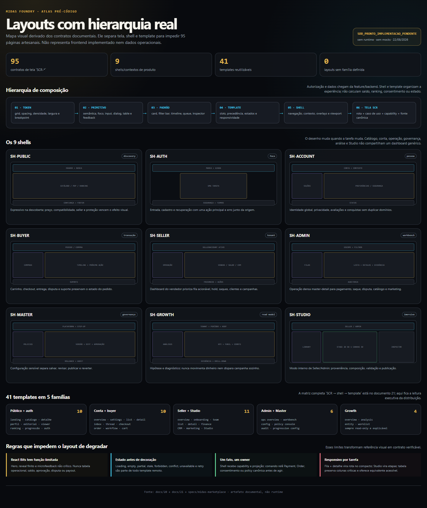

# Sistema de layouts e templates de UI — Midas

> Estado: **PROPOSTO / NÃO IMPLEMENTADO**  
> Escopo deste documento: arquitetura visual e composicional das **95 telas já catalogadas**.  
> Data da pesquisa externa: **22 de agosto de 2026**.  
> Regra de rastreabilidade: este documento **não cria** identificadores `RF-*`, `RNF-*` ou `SCR-*`. Ele somente referencia os 95 `SCR-*` existentes em `07-MAPA-DE-TELAS-E-FLUXOS.md` e `12-MATRIZ-DE-IMPLEMENTACAO.md`.

---

## 1. Resultado esperado

Este documento define um sistema de composição capaz de entregar as 95 telas sem transformar cada rota em um layout isolado. A unidade de reúso é:

```text
token de layout
  └── primitivo de UI
      └── padrão reutilizável
          └── template de página
              └── shell de produto
                  └── tela SCR existente
```

O resultado arquitetural é:

- nove contextos de shell, dos quais oito são navegações e um é modo de trabalho do Studio;
- templates reutilizáveis com slots e comportamento responsivo definidos;
- componentes de domínio encaixados nos templates, sem regra de negócio dentro do shell;
- uma matriz exata `SCR → shell → template`, com 95 entradas e nenhuma tela nova;
- dashboards operacionais densos, mas legíveis;
- experiência pública mais expressiva, sem levar animação decorativa para fluxos financeiros, jurídicos ou de risco;
- Studio 2D/3D reutilizando as rotas Seller/Admin existentes, e não uma família artificial de telas.

### 1.1 Limites

Este documento não:

- implementa componentes, rotas ou dados;
- instala ou aprova bibliotecas;
- cria exemplos com números que possam ser confundidos com dados reais;
- copia estrutura visual, textos, tokens ou trade dress de marketplace proprietário;
- altera regras de pagamento, reputação, progressão, marketing ou Studio definidas nos documentos de domínio;
- substitui `18-BRAND-KIT-DESIGN-SYSTEM.md`; apenas transforma seus tokens e princípios em arquitetura de página.

### 1.2 Inventário fechado de telas

| Família existente | Quantidade |
|---|---:|
| Público `SCR-PUB-*` | 15 |
| Conta `SCR-ACC-*` | 16 |
| Comprador `SCR-BUY-*` | 12 |
| Vendedor `SCR-SEL-*` | 17 |
| Administração `SCR-ADM-*` | 18 |
| Master `SCR-MST-*` | 8 |
| Growth `SCR-GRW-*` | 9 |
| **Total** | **95** |

Não existe uma oitava família `SCR-STU-*` no inventário vigente. O Studio ocupa `SCR-SEL-017` e `SCR-ADM-018`; a revisão de jobs 3D ocupa `SCR-ADM-015` e o viewer público ocupa `SCR-PUB-013`.

---

## 2. Pesquisa oficial e decisão de uso

### 2.1 Regra de decisão

As fontes abaixo servem para verificar capacidade, manutenção observável e licença. Nenhuma linha significa adoção. Antes de qualquer dependência entrar no projeto, ainda são obrigatórios:

1. POC isolada no stack real;
2. orçamento de bundle e desempenho;
3. auditoria de teclado, leitor de tela e `prefers-reduced-motion`;
4. revisão da licença no commit ou versão fixada;
5. inventário de dependências transitivas e avisos;
6. ADR de adoção, substituição ou rejeição.

### 2.2 Radar de referências

| Referência oficial | Capacidade observada | Licença verificada | Uso permitido neste desenho | Estado neste projeto |
|---|---|---|---|---|
| [React Bits](https://github.com/DavidHDev/react-bits) | Coleção de componentes e efeitos animados copiáveis/customizáveis | [MIT + condição Commons Clause](https://github.com/DavidHDev/react-bits/blob/main/LICENSE.md); o texto atual impede vender, sublicenciar ou redistribuir os componentes em si | Referência/POC somente para expressão pública e microinteração não crítica | **Não adotado; revisão jurídica obrigatória** |
| [shadcn/ui](https://github.com/shadcn-ui/ui) | Código aberto e distribuído para o time compor sua própria biblioteca | [MIT](https://github.com/shadcn-ui/ui/blob/main/LICENSE.md) | Referência de distribuição e composição de componentes | **Não adotado** |
| [Radix Primitives](https://github.com/radix-ui/primitives) | Primitivos de baixo nível para design systems acessíveis e customizáveis | [MIT](https://github.com/radix-ui/primitives/blob/main/LICENSE) | Candidato de POC para comportamento de diálogo, menu, tabs, popover e select | **Não adotado** |
| [TanStack Table](https://github.com/TanStack/table) | Engine headless de tabela/data grid com controle de marcação e estilo | [MIT](https://github.com/TanStack/table/blob/main/LICENSE) | Candidato de POC para estado de ordenação, filtros, seleção e paginação | **Não adotado** |
| [Tremor](https://github.com/tremorlabs/tremor) | Componentes copiáveis para dashboards e gráficos | [Apache-2.0 com componentes/avisos de terceiros](https://github.com/tremorlabs/tremor/blob/main/LICENSE) | Referência de anatomia e candidato de POC; sem copiar aparência | **Não adotado** |
| [Recharts](https://github.com/recharts/recharts) | Gráficos declarativos React/SVG sobre D3 | [MIT](https://github.com/recharts/recharts/blob/main/LICENSE) | Candidato de POC para renderização; sempre acompanhado de resumo/tabulação acessível | **Não adotado** |
| [React Three Fiber](https://github.com/pmndrs/react-three-fiber) | Renderer React para Three.js | [MIT](https://github.com/pmndrs/react-three-fiber/blob/master/LICENSE) | Candidato já previsto para o único canvas do viewer/Studio, carregado por rota | **Não adotado** |
| [React Admin](https://github.com/marmelab/react-admin) | Framework para aplicações administrativas sobre APIs REST/GraphQL | [MIT no núcleo](https://github.com/marmelab/react-admin/blob/master/LICENSE.md) | Referência arquitetural para provider, lista, detalhe e ações; aparência não é referência visual | **Não adotado** |

“Repositório oficial acessível” não equivale a compatibilidade, segurança ou escolha aprovada. Licenças e manutenção devem ser reconfirmadas no momento da decisão.

### 2.3 Estado upstream observado

O recorte abaixo é factual para **22/08/2026** e evita a expressão vaga “biblioteca atual”:

- React Bits: branch principal pública; README anuncia 165+ itens, quatro variantes e distribuição por cópia/CLI; licença do repositório traz copyright 2026 e a condição Commons Clause.
- shadcn/ui: branch principal pública com estrutura `apps/v4`; README se apresenta como código aberto para compor uma biblioteca própria.
- Radix Primitives: o repositório oficial declara manutenção pela WorkOS e aponta changelog de releases.
- TanStack Table: o repositório oficial mantém core headless e adapters para múltiplos frameworks, além de estrutura de testes/performance.
- Tremor: o repositório oficial publicado descreve 35+ componentes copiáveis, mantém guia de contribuição e licença Apache-2.0 com avisos de terceiros.
- Recharts: o repositório oficial contém changelog, Storybook, testes visuais e controle de bundle; continua se apresentando como biblioteca React/D3 declarativa.
- React Three Fiber: o README oficial explicita a compatibilidade de major — v8 com React 18 e v9 com React 19 —, que precisa entrar no POC.
- React Admin: o projeto oficial declara manutenção pela Marmelab e oferece documentação/releases; é somente referência de arquitetura neste documento.

Isto confirma o estado **observável**, não promete suporte futuro. A decisão deve fixar versão/commit e repetir a auditoria.

### 2.4 Clean-room visual

- O ponto de partida é a necessidade Midas e seus tokens próprios, nunca um screenshot de concorrente.
- Referências externas podem ensinar uma categoria de padrão — tabela headless, diálogo acessível, renderer de gráfico — mas não determinam medidas, cores, hierarquia ou cópia.
- Componentes copiados por distribuição de código só podem entrar após licença, proveniência e revisão linha a linha.
- Qualquer inspiração deve ser registrada como capacidade abstrata: “lista + detalhe”, “barra de filtros”, “canvas + inspector”.
- Nenhum layout proprietário, logotipo, iconografia exclusiva ou microcopy de terceiro integra esta especificação.

---

## 3. Hierarquia canônica da interface

### 3.1 Árvore de composição

```text
AppRoot
├── SkipLink
├── GlobalLiveRegion
├── GlobalOverlayLayer
│   ├── ToastViewport
│   ├── ConfirmDialogHost
│   └── CommandPaletteHost [somente se autorizado]
└── RouteBoundary
    ├── AuthzBoundary
    ├── FeatureFlagBoundary
    ├── ErrorBoundary
    └── Shell
        ├── ShellHeader
        ├── ShellNavigation
        ├── ContextRail [opcional]
        ├── PageViewport
        │   ├── Breadcrumbs [quando necessário]
        │   ├── PageHeader
        │   ├── PageStatus
        │   └── PageTemplate
        │       ├── PrimarySlot
        │       ├── SecondarySlot [opcional]
        │       ├── InspectorSlot [opcional]
        │       └── StickyActionSlot [opcional]
        └── ShellFooter [somente público/conta]
```

### 3.2 Responsabilidades

| Camada | Pode conhecer | Não pode conhecer |
|---|---|---|
| Token de layout | medidas, espaços, breakpoints, densidade | entidade, permissão, chamada de API |
| Primitivo | semântica HTML, foco, estado visual | fluxo de negócio |
| Padrão | seleção, paginação visual, slots, composição | cálculo financeiro ou autorização |
| Componente de domínio | entidade canônica e ações candidatas | regra duplicada de backend |
| Template | regiões, precedência e comportamento responsivo | identidade do tenant ou dado concreto |
| Shell | navegação, contexto, autorização de entrada, overlays | conteúdo interno da tela |
| Tela | orquestração da rota e do caso de uso | redefinição de tokens e padrões |

### 3.3 Entidades canônicas preservadas

Os componentes de domínio devem usar os nomes existentes, inclusive `User`, `SellerAccount`, `Order`, `Payment`, `Ledger`, `BalanceLot`, `PayoutRequest`, `CatalogAsset`, `Model3DJob` e `Model3DArtifact`. “Card de saldo” é uma apresentação; não cria uma nova entidade “WalletCardData”.

---

## 4. Tokens de layout

Os tokens cromáticos, tipográficos, espaciais e de raio continuam sendo definidos em `18-BRAND-KIT-DESIGN-SYSTEM.md`. Esta seção acrescenta apenas medidas estruturais.

### 4.1 Três camadas

```text
primitivo
  --layout-space-4
  --layout-width-1280
  --layout-rail-256

semântico
  --page-gutter
  --page-max-operational
  --shell-navigation-width

componente
  --data-table-row-height
  --studio-library-width
  --drawer-inline-size
```

O componente consome token semântico/componente; não consome um valor bruto espalhado.

### 4.2 Medidas propostas

| Token semântico | Valor largo | Valor compacto | Uso |
|---|---:|---:|---|
| `--page-max-public` | 1200 px | 100% | descoberta, conteúdo e detalhe público |
| `--page-max-operational` | 1280 px | 100% | conta, seller, admin e growth |
| `--page-max-reading` | 720 px | 100% | ajuda, política, segurança e formulários lineares |
| `--page-gutter` | 32 px | 16 px | margem do conteúdo |
| `--shell-header-height` | 64 px | 56 px | cabeçalho fixo |
| `--shell-navigation-width` | 256 px | 100% em drawer | admin/seller/growth |
| `--shell-navigation-collapsed` | 72 px | não aplicável | rail com ícone e tooltip |
| `--shell-master-navigation` | 272 px | 100% em drawer | Master |
| `--context-rail-width` | 240 px | 100% em drawer | conta |
| `--drawer-inline-sm` | 400 px | 100vw | filtro/contexto |
| `--drawer-inline-md` | 480 px | 100vw | detalhe simples |
| `--drawer-inline-lg` | 640 px | 100vw | revisão densa |
| `--sticky-action-height` | 72 px | 64 px | submit/ações críticas |
| `--studio-library-width` | 280 px | drawer | biblioteca |
| `--studio-inspector-width` | 320 px | drawer/tela cheia | inspector |

### 4.3 Breakpoints semânticos

| Faixa | Largura | Grid | Margem | Gutter | Mudança principal |
|---|---:|---:|---:|---:|---|
| `compact` | 0–479 px | 4 colunas | 16 px | 16 px | navegação em drawer; ações críticas fixas abaixo |
| `narrow` | 480–767 px | 4 colunas | 24 px | 16 px | cards podem formar 2 colunas se o container permitir |
| `medium` | 768–1023 px | 8 colunas | 24 px | 20 px | rail compacto; inspector vira drawer |
| `wide` | 1024–1279 px | 12 colunas | 32 px | 24 px | navegação persistente; secundário 4/12 |
| `expanded` | 1280–1535 px | 12 colunas | 32 px | 24 px | largura máxima por shell |
| `ultra` | ≥1536 px | 12 colunas | auto + 32 px | 24 px | não esticar tabelas/linhas além do máximo |

Viewports mínimos de teste visual: **320, 375, 768, 1280 e 1440 px**. O breakpoint responde ao container sempre que o componente puder existir em rail, drawer ou página; media query fica reservada ao shell.

### 4.4 Regras do grid

- A origem de todos os alinhamentos é o grid do `PageViewport`, não a borda do monitor.
- Conteúdo principal ocupa 8/12 e secundário 4/12 em `wide+`; financeiro denso pode ocupar 12/12.
- Formulário linear não excede 720 px, mesmo dentro de 12 colunas.
- Card de KPI: 3/12 em quatro colunas, 4/12 em três, 4/8 em duas e 4/4 em uma.
- Detalhe com inspector: 8/12 + 4/12; abaixo de 1024 px o inspector vira drawer ou bloco após o conteúdo.
- Tabela nunca define a largura da página. Colunas secundárias são ocultadas por prioridade ou movidas para expansão da linha.
- Canvas 3D usa o container disponível, com `aspect-ratio` e altura mínima; não ocupa viewport inteira se instruções críticas desaparecerem.

### 4.5 Densidade

| Perfil | Altura de controle | Linha de lista/tabela | Espaço vertical | Contextos |
|---|---:|---:|---:|---|
| `comfortable` | 48 px | 56 px | 24–32 px | público, autenticação, checkout, política |
| `standard` | 40 px | 48 px | 16–24 px | conta, comprador, seller |
| `dense` | 36–40 px | 40 px | 12–16 px | admin, master, growth em `wide+` |

Regras:

- `dense` não reduz fonte abaixo do token de corpo nem área interativa abaixo de 24 × 24 px; a meta interna do Midas é 44 × 44 px para ações principais e touch.
- Em `compact/narrow`, `dense` volta para `standard` e tabelas operacionais viram lista de registros ou scroll explicitamente rotulado.
- A preferência de densidade pode ser local ao ambiente operacional; não altera a experiência pública.
- Valores financeiros, IDs, timestamps e estados mantêm alinhamento e largura estáveis entre densidades.

---

## 5. Shells

### 5.1 Catálogo

| Shell | Contexto | Navegação persistente em `wide+` | Conteúdo máximo | Densidade padrão |
|---|---|---|---:|---|
| `SH-PUBLIC` | descoberta, catálogo, conteúdo, ranking | header horizontal | 1200 px | comfortable |
| `SH-AUTH` | entrada, cadastro, recuperação e verificação | marca + ajuda; sem menu comercial dispersivo | 720 px | comfortable |
| `SH-ACCOUNT` | preferências, segurança e conquistas | context rail de 240 px | 1280 px | standard |
| `SH-BUYER` | compra, mensagens, pedido e suporte | rail da conta + contexto comprador | 1280 px | standard |
| `SH-SELLER` | operação do vendedor | nav de 256/72 px | 1280 px | standard |
| `SH-ADMIN` | filas e workbenches da operação | nav de 256/72 px | 1280 px | dense |
| `SH-MASTER` | governança e configuração sensível | nav de 272 px | 1280 px | dense |
| `SH-GROWTH` | análise multitenant e oportunidades | nav de 256/72 px + barra global de escopo | 1280 px | dense |
| `SH-STUDIO` | modo imersivo dentro de Seller/Admin | library + stage + inspector | viewport útil | standard |

`SH-STUDIO` não é uma nova área de autenticação ou nova família de rota. Ele substitui o `PageViewport` interno de `SH-SELLER`/`SH-ADMIN` quando a rota existente entra em modo Studio.

### 5.2 `SH-PUBLIC`

```text
┌──────────────────────────────────────────────────────────┐
│ marca | mercado | Midas | busca       ajuda | conta     │ 64
├──────────────────────────────────────────────────────────┤
│ breadcrumbs/alerta de confiança                          │
│ PageHeader                                               │
│ conteúdo público                                         │ max 1200
├──────────────────────────────────────────────────────────┤
│ políticas | segurança | suporte | região/idioma          │
└──────────────────────────────────────────────────────────┘
```

- Busca é campo expandido em `wide+` e ação que abre search sheet em `compact/medium`.
- Header pode ser sticky, mas nunca esconde alerta de risco, cookie/consentimento ou erro de pagamento.
- A home aceita no máximo um background/efeito expressivo e uma animação de título.
- Catálogo, checkout e páginas jurídicas usam fundo estável.

### 5.3 `SH-AUTH`

```text
marca ───────────────────────────────────── ajuda
             ┌──────────────────┐
             │ título + contexto│
             │ formulário       │ max 480
             │ segurança/termos │
             │ ação             │
             └──────────────────┘
```

- Uma tarefa principal por tela.
- Erro de campo aparece junto ao campo; erro global antes do primeiro campo.
- Cadastro e verificação mostram progresso textual, não “etapas concluídas” fictícias.

### 5.4 `SH-ACCOUNT` e `SH-BUYER`

```text
┌──────────── header global ───────────────────────────────┐
├──────────────┬───────────────────────────────────────────┤
│ context rail │ PageHeader                                │
│ 240          │ template                                  │
│              │                                           │
└──────────────┴───────────────────────────────────────────┘
```

- O rail agrupa Perfil, Segurança, Privacidade, Compras, Vendas e Conquistas segundo autorização.
- `SH-BUYER` adiciona contexto de pedido/conversa, mas reaproveita o mesmo esqueleto.
- Em `compact/medium`, rail vira drawer acionado por botão com rótulo “Seções da conta”.
- Estado atual deve existir em texto/`aria-current`, nunca apenas cor.

### 5.5 `SH-SELLER`

- Header: tenant/SellerAccount ativo, busca contextual, notificações operacionais, conta.
- Nav: visão geral, anúncios, vendas, carteira, clientes, marketing e Studio conforme permissão.
- PageHeader: título, escopo temporal, status de atualização e ação primária única.
- Avisos de retenção, disputa ou limitação de conta ficam antes dos KPIs.
- Troca de `SellerAccount` exige confirmação visual do contexto antes de ação destrutiva.

### 5.6 `SH-ADMIN`

```text
┌─ nav 256/72 ─┬───────────────────────────────────────────┐
│ filas        │ command/context bar                       │
│ financeiro   ├───────────────────────────────────────────┤
│ confiança    │ filtros globais + SavedView               │
│ catálogo     ├───────────────────────┬────────────────────┤
│ marketing    │ Queue/List            │ Workbench/Inspector│
└──────────────┴───────────────────────┴────────────────────┘
```

- O shell mostra ambiente, papel ativo e escopo tenant/global.
- Ação irreversível ou sensível exige motivo, resumo do impacto e confirmação.
- Contadores de fila são informativos; não alteram a autorização.
- Uma rota `[/:id]` pode usar lista e workbench lado a lado; o ID deve permanecer na URL.
- Sem animação decorativa, parallax ou contagem crescente.

### 5.7 `SH-MASTER`

- Aparência deliberadamente sóbria e distinta do seller.
- Banner permanente de escopo: plataforma, tenant específico ou simulação.
- Mudança de política exibe versão atual, proposta, impacto, aprovação e trilha.
- Integrações e segredos mostram estado e último teste, nunca o valor secreto.
- “Salvar” não significa “publicar”: configurações versionáveis separam rascunho, revisão e ativação.

### 5.8 `SH-GROWTH`

- Barra de escopo persistente: tenant, janela temporal, timezone, moeda, canal e consentimento.
- Todos os números mostram período de comparação e data de atualização.
- Filtro global gera estado serializável na URL.
- Drill-down preserva o contexto anterior e oferece retorno explícito.
- Oportunidade automática é hipótese: mostra evidência, confiança e próxima ação; nunca executa campanha por conta própria.

### 5.9 `SH-STUDIO`

```text
┌──────────────┬──────────────────────────────┬──────────────┐
│ Library 280  │ Stage min 440 / flex         │ Inspector 320│
│ busca/filtro │ 2D OU um único canvas 3D     │ propriedades │
│ assets       │ composição e safe areas      │ instruções   │
│ proveniência │ timeline/status não modal    │ validação    │
└──────────────┴──────────────────────────────┴──────────────┘
```

- Em `expanded+`: três painéis persistentes.
- Em `wide`: library 240–280 px, stage flexível, inspector em drawer de 400 px quando necessário.
- Em `medium`: stage ocupa a página; Library e Inspector são drawers mutuamente exclusivos.
- Em `compact/narrow`: modo por etapas “Biblioteca → Composição → Revisão”; o rascunho é preservado.
- O stage renderiza 2D **ou** um único canvas 3D. Preview secundário usa poster, não um segundo WebGL.
- Jobs `Model3DJob` continuam numa fila/drawer de status; não bloqueiam toda a tela.
- `CatalogAsset`, `Model3DArtifact`, licença, versão e proveniência ficam visíveis no Inspector.

---

## 6. Templates reutilizáveis

Um template define regiões e comportamento, não conteúdo concreto. “Variação” é configurada por slots/props documentados; não é uma cópia do template.

### 6.1 Público e autenticação

| Template | Slots obrigatórios | Comportamento responsivo |
|---|---|---|
| `TPL-PUB-LANDING` | hero, value proof, discovery rail, trust trace, lifecycle CTA | hero 7/12 + prova 5/12; empilha em `medium-` |
| `TPL-PUB-CATALOG` | title, search, filter bar, result summary, product grid/list, pagination | filtros laterais em `wide+` e sheet abaixo; grid 4→3→2→1 |
| `TPL-PUB-DETAIL` | media/stage, identity, trust, commercial action, related offers | 7/12 + 5/12; ação principal sticky no compacto |
| `TPL-PUB-PROFILE` | identity, trust summary, reputation, inventory, policies | resumo 4/12 + conteúdo 8/12; empilha |
| `TPL-PUB-EDITORIAL-INDEX` | title, search, category navigation, article cards | 3 colunas→1; leitura não excede 720 px |
| `TPL-PUB-EDITORIAL` | breadcrumbs, title/meta, toc, body, related links | TOC 3/12 + body 8/12; TOC vira disclosure |
| `TPL-PUB-VIEWER` | poster/loading, one canvas, viewer controls, asset facts, fallback | canvas por rota; controles abaixo em compacto |
| `TPL-PUB-RANKING` | season/filter, podium, methodology, leaderboard, rewards | top 3 horizontal em `wide+`; lista semântica abaixo |
| `TPL-PUB-PROGRESSION` | current level, progress, reward catalog, badge gallery, rules | status 4/12 + progressão 8/12 |
| `TPL-AUTH` | title, context, form, recovery/terms, primary action | coluna única, formulário máximo 480 px |

### 6.2 Conta e comprador

| Template | Slots obrigatórios | Comportamento responsivo |
|---|---|---|
| `TPL-ACCOUNT-OVERVIEW` | identity, alerts, quick actions, recent activity | resumo 4/12 + atividade 8/12 |
| `TPL-ACCOUNT-SETTINGS` | section nav, form sections, save status, action bar | nav local vira select/disclosure; form ≤720 px |
| `TPL-ACCOUNT-LIST` | toolbar, filters, records, empty/error, pagination | tabela/lista troca por prioridade de coluna |
| `TPL-ACCOUNT-DETAIL` | summary, status timeline, details, evidence, actions | 8/12 + rail 4/12; rail empilha |
| `TPL-COMMS-INBOX` | conversation filters, conversation list, preview/empty | 4/12 + 8/12; no compacto abre rota de thread |
| `TPL-COMMS-THREAD` | context header, messages, attachments, composer, safety action | composer sticky; metadados em drawer |
| `TPL-CHECKOUT` | steps, order summary, payer data, payment method, consent, submit | formulário 7/12 + resumo 5/12; resumo disclosure no compacto |
| `TPL-ORDER-DETAIL` | order status, parties, payment/delivery trace, evidence, actions | timeline e fatos antes de upsell/suporte |
| `TPL-WORKFLOW` | progress, current task, evidence/form, guidance, actions | passo atual único; ações sticky no compacto |
| `TPL-CART` | item list, related offers, totals, consent, checkout action | itens 8/12 + total 4/12; total sticky abaixo |

### 6.3 Seller, finanças, CRM e marketing

| Template | Slots obrigatórios | Comportamento responsivo |
|---|---|---|
| `TPL-SELLER-OVERVIEW` | alerts, KPI strip, sales trend, action queue, recent orders | KPIs 4→2→1; fila antes de gráfico no compacto |
| `TPL-SELLER-ONBOARDING` | eligibility, progress, form/evidence, review status | formulário linear + rail de requisitos |
| `TPL-SELLER-TEAM` | member table, invitations, role summary, audit hint | membros em lista compacta; permissão em drawer |
| `TPL-SELLER-LIST` | toolbar, filters, records, batch actions, pagination | batch bar só após seleção |
| `TPL-SELLER-DETAIL` | entity header, status, facts, performance, history, actions | 8/12 + inspector 4/12 |
| `TPL-FINANCE-OVERVIEW` | balance buckets, freshness, hold schedule, payout CTA, ledger excerpt | saldos estáveis; cards 4→2→1 |
| `TPL-FINANCE-LEDGER` | opening/closing summary, filters, immutable entries, export | tabela 12/12; coluna de ID fixável |
| `TPL-FINANCE-DETAIL` | payout/hold summary, timeline, references, evidence, actions | rail de estado 4/12; comprovante sem preview inseguro |
| `TPL-CRM` | customer segments, lifecycle filters, customer records, next action | lista + inspector; PII mascarada por padrão |
| `TPL-MARKETING` | objective, audience, journey, creative, schedule, consent, KPI | workspace por etapas; preview isolado |
| `TPL-STUDIO` | library, stage, inspector, job status, provenance | usa `SH-STUDIO` e suas regras de um canvas |

### 6.4 Admin e Master

| Template | Slots obrigatórios | Comportamento responsivo |
|---|---|---|
| `TPL-OPS-OVERVIEW` | queue health, risk alerts, KPI strip, SLA breaches, audit activity | sem efeitos; prioridade por severidade |
| `TPL-OPS-WORKBENCH` | saved view, filter bar, queue, selected-case header, evidence, decision form, audit trace | split 5/12 + 7/12 em `expanded+`; rota de detalhe em menor largura |
| `TPL-CONFIG` | scope, current version, editable sections, diff, validation, publish workflow | editor 8/12 + impacto 4/12; impacto vira etapa |
| `TPL-POLICY-CONSOLE` | subjects, roles, capabilities, constraints, simulation, audit | matriz em desktop; fluxo por papel no compacto |
| `TPL-AUDIT` | immutable filters, event list, event detail, correlation trace, export | lista + detalhe; payload grande em disclosure |
| `TPL-PROGRESSION-CONFIG` | level rules, reward/badge slots, preview, versioning, publish | regras 7/12 + preview 5/12 |

### 6.5 Growth

| Template | Slots obrigatórios | Comportamento responsivo |
|---|---|---|
| `TPL-GROWTH-OVERVIEW` | scope bar, funnel health, cohort signal, opportunities, anomalies | gráficos + tabela/resumo acessível |
| `TPL-GROWTH-ANALYSIS` | query context, chart, breakdown table, explanation, drill-down | gráfico 8/12 + explicação 4/12; empilha |
| `TPL-GROWTH-ENTITY` | entity header, health, journey, interactions, cohorts, actions | timeline 8/12 + next best action 4/12 |
| `TPL-GROWTH-WORKLIST` | opportunity filters, evidence, confidence, owner, next action | worklist + drawer; execução exige fluxo próprio |

---

## 7. Anatomia dos padrões

### 7.1 Cards

```text
Card
├── CardHeader
│   ├── eyebrow/contexto
│   ├── title
│   └── state/action
├── CardBody
│   ├── primary value/content
│   ├── comparison/explanation
│   └── evidence/freshness
└── CardFooter [opcional]
    ├── secondary action
    └── provenance/methodology
```

Variantes permitidas:

| Padrão | Obrigatório | Proibido |
|---|---|---|
| `MetricCard` | rótulo, valor, unidade, período, atualização | valor inventado, CountUp financeiro |
| `StatusCard` | estado textual, impacto, próxima ação | comunicar só por cor |
| `EntityCard` | identidade, atributos prioritários, status, CTA | card inteiro com múltiplas ações ambíguas |
| `EvidenceCard` | fonte, timestamp, integridade, vínculo à entidade | imagem/comprovante sem controle de acesso |
| `ProductCard` | mídia, título, preço, seller/trust, plano patrocinado identificável | prioridade paga não sinalizada |
| `OpportunityCard` | hipótese, evidência, confiança, janela, dono | disparo automático escondido |
| `BadgeCard` | nome, critério, estado, data/proveniência | sugerir conquista antes de confirmada |

Cards de uma mesma grade têm header e área de valor alinhados; altura igual não deve gerar espaços artificiais que afastem ações críticas.

### 7.2 Tabelas e listas operacionais

```text
DataTable
├── TableCaption / accessible name
├── TableToolbar
│   ├── Search
│   ├── FilterChips
│   ├── SavedView
│   ├── ColumnControl
│   └── Export [autorizado]
├── DataFreshness
├── TableViewport
│   ├── Header [sticky]
│   ├── Rows
│   └── RowExpansion [opcional]
├── BulkActionBar [somente após seleção]
└── Pagination
```

Regras:

- O estado de filtro, ordenação, página e entidade selecionada deve ser serializável na URL.
- Paginação do servidor é o padrão para conjuntos não limitados.
- Virtualização só entra após benchmark; acima de 200 linhas renderizadas é gatilho de avaliação, não autorização automática.
- Cabeçalho sticky e primeira coluna fixada só quando não encobrirem foco/zoom.
- Seleção persiste apenas dentro do mesmo filtro/escopo; mudar tenant limpa a seleção.
- A coluna de estado sempre apresenta texto.
- Em telas estreitas, `RecordList` preserva identidade, estado, valor/risco e ação; campos restantes entram em expansão.
- Tabela financeira pode manter scroll horizontal, desde que haja rótulo, primeira coluna identificadora e indicador de conteúdo lateral.
- `Empty` significa zero registros no escopo; `FilteredEmpty` informa que filtros eliminaram resultados.
- Exportação mostra escopo, colunas, timezone, formato e classificação dos dados antes de gerar o arquivo.

### 7.3 Formulários

```text
Form
├── FormSummary [objetivo/impacto]
├── FormSection*
│   ├── heading
│   ├── description
│   └── FieldGroup*
│       ├── Label
│       ├── Control
│       ├── HelpText
│       └── FieldError
├── ValidationSummary
└── FormActions
    ├── save status
    ├── secondary
    └── primary
```

- Um campo ocupa 12/12; pares simples podem ocupar 6/12 em `medium+`.
- Label nunca depende de placeholder.
- Validação local ajuda, mas erro do servidor continua autoritativo e fica associado ao campo.
- Formulário longo possui seções nomeadas e resumo de erros com links.
- Autosave só é permitido para rascunho; pagamento, publicação, política, acesso e decisão operacional exigem submit explícito.
- Saída com alterações não salvas oferece continuar editando, descartar ou salvar rascunho quando o domínio permitir.
- Ações críticas descrevem o objeto e impacto: “Publicar plano”, não “Confirmar”.

### 7.4 Drawers, sheets e diálogos

| Contêiner | Uso | Largura | Regra |
|---|---|---:|---|
| Filter sheet | filtros transitórios | 400 px / fullscreen | aplicar/limpar explícito; estado refletido na URL |
| Context drawer | metadados ou ajuda | 480 px / fullscreen | não substitui rota necessária para compartilhar |
| Review drawer | evidência e decisão curta | 640 px / fullscreen | ID e estado visíveis; deep link quando operacional |
| Dialog | confirmação ou escolha curta | 400–560 px | foco preso, título, descrição e retorno de foco |
| Fullscreen task | tarefa longa em compacto | 100vw/100dvh | URL preservada; header e ação sticky |

Drawer não hospeda checkout inteiro, disputa complexa, política ou edição extensa. Esses casos recebem rota/template.

### 7.5 Navegação, filtros e ações

- Breadcrumb mostra hierarquia, não histórico do navegador.
- Tabs alternam vistas do mesmo recurso; rotas diferentes usam navegação.
- Filtros globais ficam no shell Growth/Admin; filtros locais ficam no template.
- Ação primária: no máximo uma por PageHeader.
- Ação destrutiva fica em menu secundário ou zona de perigo, nunca ao lado do CTA positivo sem separação.
- Atalhos de teclado são opcionais, descobríveis e jamais o único caminho.

---

## 8. Dashboards e workspaces de domínio

### 8.1 Dashboard financeiro

Ordem visual:

1. banner de limitação, disputa ou dado desatualizado;
2. período/moeda e timestamp da última reconciliação;
3. buckets de saldo: pendente/hold, disponível, solicitado e pago;
4. agenda de liberação de `BalanceLot`;
5. chamada para `PayoutRequest` conforme elegibilidade;
6. extrato de `Ledger`;
7. histórico e referências.

Invariantes de UI:

- nenhum valor financeiro usa animação de contagem;
- saldo não é inferido somando cards no cliente;
- moeda e timezone aparecem com o valor/período;
- “disponível” e “em hold” jamais compartilham o mesmo tratamento;
- dado stale mantém o último valor rotulado como desatualizado; não vira zero;
- botão de saque explica indisponibilidade e requisito, sem CTA falso;
- evidência de baixa manual mostra referência e autorização, não expõe segredo.

### 8.2 Dashboard de marketing

```text
Escopo/consentimento
  → objetivo
  → audiência/segmento
  → jornada e gatilho
  → criativo/canal
  → agenda/frequência
  → revisão
  → resultado/atribuição
```

Layout:

- KPI superior: elegíveis, alcançados, entregues, convertidos e opt-out, todos com denominador/período;
- funil com tabela equivalente;
- lista de jornadas/campanhas por estado;
- editor em etapas, nunca canvas infinito;
- preview não dispara mensagem;
- estado de consentimento e canal disponível precedem qualquer ação;
- WhatsApp/Instagram são integrações condicionais; ausência de integração gera estado explicativo, não simulação.

### 8.3 Reputação e confiança

- Resumo: nota agregada, total elegível, distribuição 0–5, taxa bilateral e janela.
- Lista: `Order`, papel avaliador/avaliado, elegibilidade, publicação, contestação e moderação.
- Confiança: fatores explicados separadamente de estrelas; não comprimir tudo em um “score mágico”.
- Moderação: fila + evidência + regra aplicada + decisão + trilha.
- Perfil público não expõe PII, texto moderado ou sinal interno antifraude.
- Sem estrela preenchida por padrão no formulário; “0” precisa ser uma escolha consciente quando o domínio permitir.

### 8.4 Progressão, recompensas e badges

- `LevelProgress` mostra nível atual, acumulado elegível, próximo limiar e regra.
- Master vê tabela L1–L10, reward/badge slot, vigência, versão e preview.
- Badge de evento mostra emissor, critério/evento, data e eventual expiração.
- Estado de configuração: rascunho, em revisão, agendado, ativo, encerrado.
- Preview usa rótulos estruturais, nunca um prêmio inventado.
- Mudança de regra deve exibir impacto em usuários afetados antes de publicar.

### 8.5 Ranking

- Contexto obrigatório: mês/temporada, timezone, moeda base, fórmula, atualização e estado provisório/final.
- Top 3 é destaque editorial, mas a tabela completa continua a fonte navegável.
- Pontuação, desempate e elegibilidade têm link para metodologia.
- Plano patrocinado ou bônus aparece como fator identificado.
- Ranking não anima posições em dashboard operacional; mudança é apresentada por delta textual.
- Tela vazia distingue “temporada ainda não começou”, “processamento” e “nenhum elegível”.

### 8.6 Studio

#### Library

- busca por produto/asset;
- filtros por 2D/3D, categoria, jogo, status, licença e disponibilidade tenant;
- item com thumbnail/poster, nome, versão, proveniência e estado;
- upload/cadastro somente para papel autorizado;
- nenhum asset sintético preenche ausência de catálogo.

#### Stage

- safe area e proporção do destino;
- grade/snap opcionais e desativáveis;
- 2D usa imagem/SVG autorizado; 3D usa `Model3DArtifact`;
- seleção, transformação, câmera e iluminação têm controles nomeados;
- falha WebGL oferece poster e informações, preservando a tarefa 2D;
- undo/redo reflete comandos reais do rascunho.

#### Inspector

- propriedades do elemento selecionado;
- instruções do anúncio/produto;
- versão, licença, direitos e proveniência;
- validações de resolução, peso, formato e compatibilidade;
- estado de `Model3DJob` e link para revisão quando autorizado;
- publicar/exportar somente após validação real.

---

## 9. Estados de interface

### 9.1 Máquina visual comum

```text
INITIAL
  → LOADING
      → READY
      → EMPTY
      → FILTERED_EMPTY
      → PARTIAL
      → STALE
      → ERROR_RECOVERABLE
      → ERROR_BLOCKING

qualquer estado autorizado
  → FORBIDDEN | NOT_FOUND | OFFLINE
```

| Estado | Renderização | Ação |
|---|---|---|
| `INITIAL` | estrutura mínima antes da consulta | nenhuma conclusão sobre dados |
| `LOADING` | skeleton da forma conhecida ou progresso textual | cancelar se operação longa |
| `READY` | dado + atualização + ações autorizadas | fluxo normal |
| `EMPTY` | causa do zero no escopo e próxima ação legítima | criar/importar se permitido |
| `FILTERED_EMPTY` | filtros ativos e zero resultados | limpar/editar filtros |
| `PARTIAL` | blocos disponíveis + blocos falhos identificados | repetir bloco falho |
| `STALE` | último dado rotulado e timestamp | atualizar; nunca substituir por zero |
| `ERROR_RECOVERABLE` | problema, efeito e tentativa | tentar novamente |
| `ERROR_BLOCKING` | tarefa interrompida, correlação e suporte | voltar/abrir suporte |
| `FORBIDDEN` | falta de capacidade sem revelar dado | solicitar acesso quando existir fluxo |
| `NOT_FOUND` | recurso ausente/inacessível sem enumeração indevida | retornar à coleção |
| `OFFLINE` | dados locais claramente marcados e ações bloqueadas | reconectar |

Skeleton replica geometria, não números, nomes ou produtos falsos. “Sem dados” nunca é demonstrado com mock.

### 9.2 Estado de ação

Toda ação mutável expõe:

```text
IDLE → VALIDATING → SUBMITTING → SUCCEEDED
                         └──────→ FAILED_RETRYABLE
                         └──────→ FAILED_FINAL
```

- Desabilitar dupla submissão não remove feedback.
- Sucesso explica o que mudou e o próximo estado.
- Falha preserva entrada segura; dado sensível não fica em armazenamento indevido.
- Operação assíncrona recebe ID/status real e pode ser retomada.

---

## 10. Motion

### 10.1 Tokens e limites

| Token | Duração | Uso |
|---|---:|---|
| `motion-fast` | 120 ms | hover/focus e feedback local |
| `motion-base` | 180 ms | disclosure, menu, troca curta |
| `motion-slow` | 280 ms | entrada de seção relacionada |
| `motion-viewer-intro` | 650–900 ms | enquadramento inicial 3D, uma vez |

- Deslocamento máximo: 8 px local, 16 px entre seções.
- Apenas `opacity` e `transform` em animação frequente.
- Financeiro, risco, reputação, progressão e ranking não animam valores/ordem.
- Home aceita um efeito de fundo e um efeito de texto; catálogo e detalhe preferem reveal simples.
- `prefers-reduced-motion: reduce` entrega estado final imediato ou crossfade de até 150 ms.
- Canvas pausa fora de visibilidade e quando a aba está oculta.
- React Bits, se algum dia aprovado, entra por adapter auditado e somente nos pontos listados em `10-PLANO-REACT-BITS.md`.

### 10.2 Matriz de intensidade

| Ambiente | Intensidade | Exemplos permitidos |
|---|---|---|
| Público/home | moderada e focal | background único, título, reveal |
| Catálogo/detalhe | baixa | hover, fade de imagem, disclosure |
| Conta/comprador/seller | mínima | feedback de estado e transição de painel |
| Admin/Master/Growth | funcional | menu, drawer, seleção; sem decoração |
| Studio | funcional/espacial | seleção, câmera, transformação; respeita reduced motion |

---

## 11. Acessibilidade

Baseline proposto: WCAG 2.2 AA, com testes baseados também no [ARIA Authoring Practices Guide](https://www.w3.org/WAI/ARIA/apg/).

### 11.1 Estrutura e teclado

- landmarks `header/nav/main/aside/footer` com nomes não duplicados;
- skip link visível ao foco;
- um `h1` por tela e hierarquia de headings sem saltos cosméticos;
- ordem DOM acompanha ordem visual;
- foco visível com contraste/área verificáveis;
- retorno de foco ao fechar drawer/dialog;
- Escape fecha apenas a camada superior e nunca descarta alteração sem aviso;
- tabs, menu, dialog, combobox e grid seguem padrão de teclado correspondente;
- atalhos não conflitam com tecnologia assistiva.

### 11.2 Conteúdo e percepção

- contraste AA para texto/controles; foco não depende só de cor;
- ícone sem texto recebe nome acessível;
- estado combina texto, forma/ícone e cor;
- tooltip não contém informação indispensável;
- gráfico possui título, resumo, período, unidade e tabela/lista equivalente;
- canvas 3D oferece poster, nome do asset, fatos e controles externos acessíveis;
- erro explica correção e associa mensagem ao campo;
- toast crítico também aparece no fluxo persistente;
- zoom de 200% e reflow a 400% não perdem ação ou dado essencial.

### 11.3 Alvos e touch

O [WCAG 2.2 — Target Size (Minimum)](https://www.w3.org/WAI/WCAG22/Understanding/target-size-minimum.html) estabelece 24 × 24 CSS px com exceções. O Midas usa meta mais conservadora de 44 × 44 px nas ações principais/touch; controles densos menores precisam de espaçamento equivalente e teste.

### 11.4 Testes mínimos

- teclado completo nas 95 rotas/template variants;
- leitor de tela em autenticação, checkout, tabela, dialog, suporte, financeiro e Studio fallback;
- axe/checagem automática sem tratar automação como prova suficiente;
- high contrast/forced colors;
- reduced motion;
- zoom/reflow;
- idioma `pt-BR` e leitura de moeda/data/ID.

---

## 12. Performance e robustez

### 12.1 Metas de experiência

Medir dados reais no percentil 75, separados por mobile/desktop. As metas públicas seguem os [Core Web Vitals](https://web.dev/articles/vitals):

| Métrica | Meta |
|---|---:|
| LCP | ≤ 2,5 s |
| INP | ≤ 200 ms |
| CLS | ≤ 0,1 |
| feedback visual após ação | ≤ 100 ms |
| filtro local simples após dados carregados | ≤ 100 ms |

### 12.2 Orçamentos propostos para validação no stack real

| Bloco | Orçamento inicial | Gate |
|---|---:|---|
| shell público inicial, JS gzip | ≤ 180 KB | CI por rota |
| shell operacional inicial, JS gzip | ≤ 230 KB | CI por rota |
| enhancement animado | chunk separado, nunca bloqueia LCP | análise de bundle |
| viewer/Studio 3D | chunk exclusivo da rota | não baixar no catálogo/listas |
| imagem hero LCP | ≤ 250 KB em viewport padrão | formatos responsivos |
| poster de produto | ≤ 120 KB por item visível | `srcset/sizes` e lazy fora da dobra |

Esses valores são **propostos**, pois ainda não há bundle executável para medi-los. Se o framework real exigir ajuste, a alteração deve ser registrada com medição, não removida silenciosamente.

### 12.3 Estratégias

- route-level code splitting para Admin, Master, Growth e Studio;
- gráfico só hidrata quando visível/necessário; tabela e resumo aparecem primeiro;
- uma única instância WebGL por workspace;
- imagens com dimensões reservadas para evitar CLS;
- server pagination e busca debounce/cancelável;
- cache não mascara freshness financeira;
- prefetch apenas de próxima rota provável, sem baixar 3D por hover acidental em touch;
- erros de bloco não derrubam o shell;
- observabilidade correlaciona rota, template, tenant anonimizado, Core Web Vitals e erro.

---

## 13. Privacidade e autorização na camada visual

- Ocultar botão não é autorização; backend continua autoritativo.
- O shell recebe capacidades resolvidas, não interpreta papel por nome.
- PII fica mascarada por padrão em Admin/Growth e exige capacidade + motivo para revelar.
- Troca de tenant/`SellerAccount` limpa seleção, cache visual sensível e filtros incompatíveis.
- Screenshot/preview de comprovante ou documento não deve aparecer em listagem.
- Exportação e download são ações auditáveis.
- Master possui distinção visual de escopo e ação; “visualizar como” não concede mutação.
- Growth consome dados agregados por padrão e respeita consentimento/finalidade.

---

## 14. Matriz exata das 95 telas

Legenda de densidade: `C` = comfortable, `S` = standard, `D` = dense. A coluna “composição” nomeia o uso do template; não cria tela ou requisito.

### 14.1 Público — 15

| SCR existente | Rota existente | Shell | Template | Densidade | Composição |
|---|---|---|---|:---:|---|
| `SCR-PUB-001` | `/` | `SH-PUBLIC` | `TPL-PUB-LANDING` | C | descoberta, prova de valor, confiança |
| `SCR-PUB-002` | `/market` | `SH-PUBLIC` | `TPL-PUB-CATALOG` | C | busca P2P e resultados |
| `SCR-PUB-003` | `/midas` | `SH-PUBLIC` | `TPL-PUB-CATALOG` | C | inventário Midas |
| `SCR-PUB-004` | `/buscar` | `SH-PUBLIC` | `TPL-PUB-CATALOG` | C | busca e filtros completos |
| `SCR-PUB-005` | `/itens/:slug` | `SH-PUBLIC` | `TPL-PUB-DETAIL` | C | item, offers e acesso ao viewer |
| `SCR-PUB-006` | `/anuncios/:listingId` | `SH-PUBLIC` | `TPL-PUB-DETAIL` | C | anúncio, seller, preço e comandos |
| `SCR-PUB-007` | `/vendedores/:sellerAccountId` | `SH-PUBLIC` | `TPL-PUB-PROFILE` | C | perfil público e reputação |
| `SCR-PUB-008` | `/ajuda` | `SH-PUBLIC` | `TPL-PUB-EDITORIAL-INDEX` | C | índice pesquisável de ajuda |
| `SCR-PUB-009` | `/ajuda/:articleSlug` | `SH-PUBLIC` | `TPL-PUB-EDITORIAL` | C | artigo e links relacionados |
| `SCR-PUB-010` | `/seguranca` | `SH-PUBLIC` | `TPL-PUB-EDITORIAL` | C | conteúdo de confiança |
| `SCR-PUB-011` | `/politicas` | `SH-PUBLIC` | `TPL-PUB-EDITORIAL-INDEX` | C | índice de políticas |
| `SCR-PUB-012` | `/politicas/:policySlug` | `SH-PUBLIC` | `TPL-PUB-EDITORIAL` | C | versão e corpo da política |
| `SCR-PUB-013` | `/itens/:slug/3d` | `SH-PUBLIC` | `TPL-PUB-VIEWER` | C | um canvas, fatos e fallback |
| `SCR-PUB-014` | `/ranking` | `SH-PUBLIC` | `TPL-PUB-RANKING` | C | temporada, top 3 e tabela |
| `SCR-PUB-015` | `/recompensas` | `SH-PUBLIC` | `TPL-PUB-PROGRESSION` | C | níveis, recompensas e badges |

### 14.2 Conta — 16

| SCR existente | Rota existente | Shell | Template | Densidade | Composição |
|---|---|---|---|:---:|---|
| `SCR-ACC-001` | `/entrar` | `SH-AUTH` | `TPL-AUTH` | C | login |
| `SCR-ACC-002` | `/cadastro` | `SH-AUTH` | `TPL-AUTH` | C | cadastro |
| `SCR-ACC-003` | `/recuperar-acesso` | `SH-AUTH` | `TPL-AUTH` | C | recuperação |
| `SCR-ACC-004` | `/verificar-idade` | `SH-AUTH` | `TPL-WORKFLOW` | C | verificação por etapas reais |
| `SCR-ACC-005` | `/conta` | `SH-ACCOUNT` | `TPL-ACCOUNT-OVERVIEW` | S | visão geral |
| `SCR-ACC-006` | `/conta/seguranca` | `SH-ACCOUNT` | `TPL-ACCOUNT-SETTINGS` | S | controles de segurança |
| `SCR-ACC-007` | `/conta/seguranca/sessoes` | `SH-ACCOUNT` | `TPL-ACCOUNT-LIST` | S | sessões |
| `SCR-ACC-008` | `/conta/seguranca/dispositivos` | `SH-ACCOUNT` | `TPL-ACCOUNT-LIST` | S | dispositivos |
| `SCR-ACC-009` | `/conta/favoritos` | `SH-ACCOUNT` | `TPL-ACCOUNT-LIST` | S | favoritos |
| `SCR-ACC-010` | `/conta/preferencias` | `SH-ACCOUNT` | `TPL-ACCOUNT-SETTINGS` | S | preferências |
| `SCR-ACC-011` | `/conta/privacidade` | `SH-ACCOUNT` | `TPL-ACCOUNT-SETTINGS` | S | privacidade |
| `SCR-ACC-012` | `/conta/privacidade/solicitacoes/:requestId` | `SH-ACCOUNT` | `TPL-ACCOUNT-DETAIL` | S | solicitação de privacidade |
| `SCR-ACC-013` | `/conta/recurso` | `SH-ACCOUNT` | `TPL-WORKFLOW` | S | recurso |
| `SCR-ACC-014` | `/conta/notificacoes` | `SH-ACCOUNT` | `TPL-ACCOUNT-LIST` | S | notificações |
| `SCR-ACC-015` | `/conta/avaliacoes` | `SH-ACCOUNT` | `TPL-ACCOUNT-LIST` | S | avaliações bilaterais |
| `SCR-ACC-016` | `/conta/conquistas` | `SH-ACCOUNT` | `TPL-PUB-PROGRESSION` | S | progressão pessoal e badges |

### 14.3 Comprador — 12

| SCR existente | Rota existente | Shell | Template | Densidade | Composição |
|---|---|---|---|:---:|---|
| `SCR-BUY-001` | `/mensagens` | `SH-BUYER` | `TPL-COMMS-INBOX` | S | inbox e preview |
| `SCR-BUY-002` | `/mensagens/:conversationId` | `SH-BUYER` | `TPL-COMMS-THREAD` | S | conversa e contexto |
| `SCR-BUY-003` | `/checkout/:paymentId` | `SH-BUYER` | `TPL-CHECKOUT` | C | checkout e consentimento |
| `SCR-BUY-004` | `/conta/compras` | `SH-BUYER` | `TPL-ACCOUNT-LIST` | S | lista de compras |
| `SCR-BUY-005` | `/conta/compras/:orderId` | `SH-BUYER` | `TPL-ORDER-DETAIL` | S | pedido e rastros |
| `SCR-BUY-006` | `/pedidos/:orderId/entrega` | `SH-BUYER` | `TPL-WORKFLOW` | S | entrega |
| `SCR-BUY-007` | `/pedidos/:orderId/disputa/:disputeId` | `SH-BUYER` | `TPL-WORKFLOW` | S | disputa e evidências |
| `SCR-BUY-008` | `/conta/suporte` | `SH-BUYER` | `TPL-ACCOUNT-LIST` | S | tickets |
| `SCR-BUY-009` | `/conta/suporte/:ticketId` | `SH-BUYER` | `TPL-COMMS-THREAD` | S | ticket e mensagens |
| `SCR-BUY-010` | `/conta/reembolsos` | `SH-BUYER` | `TPL-ACCOUNT-LIST` | S | solicitações de reembolso |
| `SCR-BUY-011` | `/conta/reembolsos/:refundRequestId` | `SH-BUYER` | `TPL-ACCOUNT-DETAIL` | S | detalhe do reembolso |
| `SCR-BUY-012` | `/carrinho` | `SH-BUYER` | `TPL-CART` | C | carrinho, conexos e total |

### 14.4 Vendedor — 17

| SCR existente | Rota existente | Shell | Template | Densidade | Composição |
|---|---|---|---|:---:|---|
| `SCR-SEL-001` | `/vender/cadastro` | `SH-SELLER` | `TPL-SELLER-ONBOARDING` | S | onboarding e elegibilidade |
| `SCR-SEL-002` | `/vender` | `SH-SELLER` | `TPL-SELLER-OVERVIEW` | S | dashboard de vendas |
| `SCR-SEL-003` | `/vender/equipe` | `SH-SELLER` | `TPL-SELLER-TEAM` | S | membros e papéis |
| `SCR-SEL-004` | `/vender/novo` | `SH-SELLER` | `TPL-WORKFLOW` | S | criação de anúncio |
| `SCR-SEL-005` | `/vender/anuncios` | `SH-SELLER` | `TPL-SELLER-LIST` | S | anúncios |
| `SCR-SEL-006` | `/vender/anuncios/:listingId` | `SH-SELLER` | `TPL-SELLER-DETAIL` | S | detalhe e performance |
| `SCR-SEL-007` | `/vender/anuncios/:listingId/prova-posse` | `SH-SELLER` | `TPL-WORKFLOW` | S | prova de posse |
| `SCR-SEL-008` | `/conta/vendas` | `SH-SELLER` | `TPL-SELLER-LIST` | S | vendas |
| `SCR-SEL-009` | `/conta/vendas/:orderId` | `SH-SELLER` | `TPL-ORDER-DETAIL` | S | detalhe da venda |
| `SCR-SEL-010` | `/conta/carteira` | `SH-SELLER` | `TPL-FINANCE-OVERVIEW` | S | saldos, hold e saque |
| `SCR-SEL-011` | `/conta/carteira/extrato` | `SH-SELLER` | `TPL-FINANCE-LEDGER` | S | extrato do Ledger |
| `SCR-SEL-012` | `/conta/carteira/retencoes` | `SH-SELLER` | `TPL-FINANCE-LEDGER` | S | BalanceLots em hold |
| `SCR-SEL-013` | `/conta/saques` | `SH-SELLER` | `TPL-SELLER-LIST` | S | solicitações de saque |
| `SCR-SEL-014` | `/conta/saques/:payoutId` | `SH-SELLER` | `TPL-FINANCE-DETAIL` | S | detalhe do PayoutRequest |
| `SCR-SEL-015` | `/conta/vendas/clientes` | `SH-SELLER` | `TPL-CRM` | S | clientes e lifecycle |
| `SCR-SEL-016` | `/conta/vendas/marketing` | `SH-SELLER` | `TPL-MARKETING` | S | campanhas e pós-venda |
| `SCR-SEL-017` | `/vender/studio` | `SH-STUDIO` dentro de `SH-SELLER` | `TPL-STUDIO` | S | composição 2D/3D |

### 14.5 Administração — 18

| SCR existente | Rota existente | Shell | Template | Densidade | Composição |
|---|---|---|---|:---:|---|
| `SCR-ADM-001` | `/admin` | `SH-ADMIN` | `TPL-OPS-OVERVIEW` | D | saúde de filas e riscos |
| `SCR-ADM-002` | `/admin/anuncios[/:listingId]` | `SH-ADMIN` | `TPL-OPS-WORKBENCH` | D | moderação de anúncios |
| `SCR-ADM-003` | `/admin/catalogo[/:resourceType/:resourceId]` | `SH-ADMIN` | `TPL-OPS-WORKBENCH` | D | catálogo |
| `SCR-ADM-004` | `/admin/vendedores[/:onboardingId]` | `SH-ADMIN` | `TPL-OPS-WORKBENCH` | D | onboarding de sellers |
| `SCR-ADM-005` | `/admin/confianca[/:caseId]` | `SH-ADMIN` | `TPL-OPS-WORKBENCH` | D | casos de confiança |
| `SCR-ADM-006` | `/admin/usuarios[/:userId]` | `SH-ADMIN` | `TPL-OPS-WORKBENCH` | D | usuários |
| `SCR-ADM-007` | `/admin/pedidos[/:orderId]` | `SH-ADMIN` | `TPL-OPS-WORKBENCH` | D | pedidos |
| `SCR-ADM-008` | `/admin/disputas[/:disputeId]` | `SH-ADMIN` | `TPL-OPS-WORKBENCH` | D | disputas |
| `SCR-ADM-009` | `/admin/suporte[/:ticketId]` | `SH-ADMIN` | `TPL-OPS-WORKBENCH` | D | suporte |
| `SCR-ADM-010` | `/admin/reembolsos[/:refundRequestId]` | `SH-ADMIN` | `TPL-OPS-WORKBENCH` | D | reembolsos |
| `SCR-ADM-011` | `/admin/financeiro[/:caseType/:caseId]` | `SH-ADMIN` | `TPL-OPS-WORKBENCH` | D | reconciliação e casos |
| `SCR-ADM-012` | `/admin/pagamentos[/:paymentId]` | `SH-ADMIN` | `TPL-OPS-WORKBENCH` | D | pagamentos |
| `SCR-ADM-013` | `/admin/saques[/:payoutId]` | `SH-ADMIN` | `TPL-OPS-WORKBENCH` | D | fila/baixa de saques |
| `SCR-ADM-014` | `/admin/midas[/:inventoryId]` | `SH-ADMIN` | `TPL-OPS-WORKBENCH` | D | inventário próprio |
| `SCR-ADM-015` | `/admin/catalogo/modelos-3d/:jobId` | `SH-ADMIN` | `TPL-OPS-WORKBENCH` | D | revisão de Model3DJob |
| `SCR-ADM-016` | `/admin/avaliacoes[/:orderReviewId]` | `SH-ADMIN` | `TPL-OPS-WORKBENCH` | D | moderação de avaliações |
| `SCR-ADM-017` | `/admin/marketing[/:resourceType/:resourceId]` | `SH-ADMIN` | `TPL-OPS-WORKBENCH` | D | governança de marketing |
| `SCR-ADM-018` | `/admin/studio[/:resourceType/:resourceId]` | `SH-STUDIO` dentro de `SH-ADMIN` | `TPL-STUDIO` | S | biblioteca e Studio global |

### 14.6 Master — 8

| SCR existente | Rota existente | Shell | Template | Densidade | Composição |
|---|---|---|---|:---:|---|
| `SCR-MST-001` | `/master` | `SH-MASTER` | `TPL-OPS-OVERVIEW` | D | governança da plataforma |
| `SCR-MST-002` | `/master/acessos` | `SH-MASTER` | `TPL-POLICY-CONSOLE` | D | capacidades delegadas |
| `SCR-MST-003` | `/master/configuracoes` | `SH-MASTER` | `TPL-CONFIG` | D | configurações versionadas |
| `SCR-MST-004` | `/master/integracoes` | `SH-MASTER` | `TPL-CONFIG` | D | integrações e saúde |
| `SCR-MST-005` | `/master/auditoria` | `SH-MASTER` | `TPL-AUDIT` | D | eventos e correlação |
| `SCR-MST-006` | `/master/progressao` | `SH-MASTER` | `TPL-PROGRESSION-CONFIG` | D | níveis, rewards e badges |
| `SCR-MST-007` | `/master/planos-de-anuncio` | `SH-MASTER` | `TPL-CONFIG` | D | planos, prioridades e vigência |
| `SCR-MST-008` | `/master/marketing` | `SH-MASTER` | `TPL-CONFIG` | D | políticas de marketing |

### 14.7 Growth — 9

| SCR existente | Rota existente | Shell | Template | Densidade | Composição |
|---|---|---|---|:---:|---|
| `SCR-GRW-001` | `/admin/growth` | `SH-GROWTH` | `TPL-GROWTH-OVERVIEW` | D | visão multitenant |
| `SCR-GRW-002` | `/admin/growth/funil` | `SH-GROWTH` | `TPL-GROWTH-ANALYSIS` | D | funil |
| `SCR-GRW-003` | `/admin/growth/tenants` | `SH-GROWTH` | `TPL-GROWTH-WORKLIST` | D | lista e saúde de tenants |
| `SCR-GRW-004` | `/admin/growth/tenants/:sellerAccountId` | `SH-GROWTH` | `TPL-GROWTH-ENTITY` | D | tenant e jornada |
| `SCR-GRW-005` | `/admin/growth/membros` | `SH-GROWTH` | `TPL-GROWTH-WORKLIST` | D | membros |
| `SCR-GRW-006` | `/admin/growth/membros/:membershipId` | `SH-GROWTH` | `TPL-GROWTH-ENTITY` | D | membro e interações |
| `SCR-GRW-007` | `/admin/growth/coortes` | `SH-GROWTH` | `TPL-GROWTH-ANALYSIS` | D | coortes |
| `SCR-GRW-008` | `/admin/growth/interacoes` | `SH-GROWTH` | `TPL-GROWTH-ANALYSIS` | D | interações |
| `SCR-GRW-009` | `/admin/growth/oportunidades` | `SH-GROWTH` | `TPL-GROWTH-WORKLIST` | D | oportunidades e evidência |

---

## 15. Cobertura por template

Esta tabela é derivada da matriz anterior e serve como controle de reúso.

| Template | Telas |
|---|---:|
| `TPL-PUB-LANDING` | 1 |
| `TPL-PUB-CATALOG` | 3 |
| `TPL-PUB-DETAIL` | 2 |
| `TPL-PUB-PROFILE` | 1 |
| `TPL-PUB-EDITORIAL-INDEX` | 2 |
| `TPL-PUB-EDITORIAL` | 3 |
| `TPL-PUB-VIEWER` | 1 |
| `TPL-PUB-RANKING` | 1 |
| `TPL-PUB-PROGRESSION` | 2 |
| `TPL-AUTH` | 3 |
| `TPL-ACCOUNT-OVERVIEW` | 1 |
| `TPL-ACCOUNT-SETTINGS` | 3 |
| `TPL-ACCOUNT-LIST` | 8 |
| `TPL-ACCOUNT-DETAIL` | 2 |
| `TPL-COMMS-INBOX` | 1 |
| `TPL-COMMS-THREAD` | 2 |
| `TPL-CHECKOUT` | 1 |
| `TPL-ORDER-DETAIL` | 2 |
| `TPL-WORKFLOW` | 6 |
| `TPL-CART` | 1 |
| `TPL-SELLER-OVERVIEW` | 1 |
| `TPL-SELLER-ONBOARDING` | 1 |
| `TPL-SELLER-TEAM` | 1 |
| `TPL-SELLER-LIST` | 3 |
| `TPL-SELLER-DETAIL` | 1 |
| `TPL-FINANCE-OVERVIEW` | 1 |
| `TPL-FINANCE-LEDGER` | 2 |
| `TPL-FINANCE-DETAIL` | 1 |
| `TPL-CRM` | 1 |
| `TPL-MARKETING` | 1 |
| `TPL-STUDIO` | 2 |
| `TPL-OPS-OVERVIEW` | 2 |
| `TPL-OPS-WORKBENCH` | 16 |
| `TPL-CONFIG` | 4 |
| `TPL-POLICY-CONSOLE` | 1 |
| `TPL-AUDIT` | 1 |
| `TPL-PROGRESSION-CONFIG` | 1 |
| `TPL-GROWTH-OVERVIEW` | 1 |
| `TPL-GROWTH-ANALYSIS` | 3 |
| `TPL-GROWTH-ENTITY` | 2 |
| `TPL-GROWTH-WORKLIST` | 3 |
| **Total** | **95** |

---

## 16. Contratos de implementação

### 16.1 Estrutura candidata de pastas

Não representa código existente; é a fronteira proposta:

```text
ui/
├── tokens/
├── primitives/
├── patterns/
│   ├── cards/
│   ├── data-display/
│   ├── forms/
│   ├── feedback/
│   └── overlays/
├── templates/
│   ├── public/
│   ├── account/
│   ├── commerce/
│   ├── operations/
│   ├── growth/
│   └── studio/
└── shells/

features/
├── catalog/
├── orders/
├── finance/
├── reputation/
├── progression/
├── marketing/
├── growth/
└── model3d/
```

### 16.2 Interfaces conceituais

Sem prescrever framework, cada template deve receber:

- `title/meta` da rota;
- `breadcrumbs` quando houver hierarquia;
- slots renderizáveis;
- `capabilities` já resolvidas;
- estado comum `loading/empty/error/stale`;
- contexto de escopo e freshness;
- callbacks de navegação/ação, nunca acesso direto à infraestrutura.

O template não busca `Order`, `Payment` ou `CatalogAsset`. A feature da tela resolve dados e injeta componentes.

### 16.3 Critérios de aceite de um template

- funciona em todos os SCR mapeados sem branching por pathname;
- não contém texto/valor fictício para “preencher” slot;
- passa nos cinco viewports mínimos;
- não perde foco ao reordenar responsivamente;
- expõe nomes acessíveis para regiões;
- possui todos os estados comuns;
- não aumenta o bundle de rotas que não o usam;
- permite teste isolado com fixtures técnicas claramente rotuladas em ambiente de teste, nunca mock de produção.

---

## 17. Testes P0

### 17.1 Estrutura e cobertura

1. extrair todos os `SCR-*` deste documento;
2. comparar como conjunto com `12-MATRIZ-DE-IMPLEMENTACAO.md`;
3. falhar se houver ausente, extra ou duplicado;
4. validar que cada SCR possui shell e template;
5. validar que nenhuma rota Studio criou novo SCR.

### 17.2 Responsivo

- 320/375: header, drawer, ação sticky e formulários sem overflow involuntário;
- 768: rail compacto, tabelas/listas e inspector em drawer;
- 1280/1440: grids 12 colunas, workbench e Studio;
- conteúdo jurídico com 200%/400% de zoom;
- teclado atravessa header → nav → main → rail na mesma ordem visual.

### 17.3 Fluxos críticos

- login/cadastro/idade com erros de campo e servidor;
- checkout sem dupla submissão e com resumo visível;
- pedido/disputa/suporte com evidência e retorno de foco;
- saldos/hold/extrato/saque sem animação ou zero falso;
- workbench Admin com URL do caso, mudança de filtro e decisão auditável;
- Master com diff, revisão e publicação separadas;
- ranking/reputação/progressão com método, período e dados vazios legítimos;
- Growth com troca de tenant limpando seleção sensível;
- Studio 2D sem WebGL, 3D com um canvas, falha WebGL e reduced motion.

### 17.4 Acessibilidade

- landmarks/headings/skip link;
- dialog/drawer/menu/combobox/tabs/table;
- focus appearance e retorno;
- gráfico com alternativa textual;
- estados por texto + ícone/cor;
- touch target e forced colors;
- leitor de tela nos templates críticos.

### 17.5 Performance

- bundle por shell/rota;
- LCP/INP/CLS em laboratório e RUM;
- canvas ausente em rotas não 3D;
- imagem responsiva e espaço reservado;
- tabela de 200 registros como benchmark de decisão;
- pausa de canvas fora de visibilidade;
- falha parcial de gráfico não derruba dashboard.

---

## 18. Métricas de qualidade do sistema

| Métrica | Definição | Meta inicial |
|---|---|---:|
| cobertura de SCR | SCR com shell + template | 95/95 |
| telas fora de template | rota com layout artesanal | 0 |
| duplicação estrutural | templates equivalentes sem justificativa | 0 |
| estados completos | template com matriz comum implementada | 100% |
| acessibilidade automática crítica | violações bloqueadoras conhecidas | 0 |
| conclusão por teclado | fluxos P0 concluíveis | 100% |
| Core Web Vitals | sessões aprovadas no p75 | ≥ 75%, depois elevar |
| bundle indevido 3D | rotas não 3D baixando engine | 0 |
| erro sem recuperação | erro recuperável sem ação | 0 |
| dado sem freshness | KPI operacional sem período/atualização | 0 |

---

## 19. Riscos e controles

| Risco | Efeito | Controle |
|---|---|---|
| transformar React Bits em design system | inconsistência, bundle e acessibilidade | limitar a adapter expressivo após POC/licença |
| assumir “MIT” no React Bits | risco jurídico | tratar licença atual como MIT + condição Commons Clause e revisar |
| copiar dashboard de terceiro | trade dress e UI sem domínio | clean-room + tokens Midas |
| template genérico demais | condicionais e acessibilidade divergente | slots finitos e variantes documentadas |
| template específico demais | 95 layouts artesanais | gate de reuse e tabela de cobertura |
| tabela desktop no mobile | overflow e perda de ação | prioridade de coluna + RecordList |
| gráfico como única fonte | exclusão e baixa auditabilidade | resumo + tabela equivalente |
| animação em valor crítico | percepção falsa/motion sickness | valores estáveis e reduced motion |
| múltiplos canvases | memória/GPU e crash | um canvas; posters nos secundários |
| drawer para tarefa longa | URL/foco e perda de contexto | promover a rota/template |
| densidade extrema | erro operacional | limites tipográficos/alvo + modo standard no touch |
| shell decidir autorização | exposição de ação/dado | capability do backend + teste negativo |
| dado stale virar zero | decisão financeira errada | estado STALE explícito |

---

## 20. Sequência recomendada

1. congelar o conjunto de 95 SCR como teste de contrato;
2. materializar tokens de layout sobre o design system existente;
3. implementar primitivas acessíveis e estados comuns;
4. construir `SH-PUBLIC`, `SH-AUTH` e `SH-ACCOUNT`;
5. construir `DataTable/RecordList`, formulários, drawers e PageHeader;
6. implementar templates públicos/conta/comprador;
7. construir `SH-SELLER` e templates financeiros/marketing;
8. construir `SH-ADMIN`/`SH-MASTER` e `TPL-OPS-WORKBENCH`;
9. construir `SH-GROWTH`;
10. construir `SH-STUDIO` com 2D primeiro, depois viewer 3D por rota;
11. realizar POCs das bibliotecas candidatas, uma capacidade por vez;
12. liberar somente após gates P0 de acessibilidade, bundle, responsivo e autorização.

---

## 21. Fontes

### UI e componentes

- [React Bits — repositório oficial](https://github.com/DavidHDev/react-bits)
- [React Bits — licença vigente no repositório](https://github.com/DavidHDev/react-bits/blob/main/LICENSE.md)
- [shadcn/ui — repositório oficial](https://github.com/shadcn-ui/ui)
- [shadcn/ui — licença MIT](https://github.com/shadcn-ui/ui/blob/main/LICENSE.md)
- [Radix Primitives — repositório oficial](https://github.com/radix-ui/primitives)
- [Radix Primitives — licença MIT](https://github.com/radix-ui/primitives/blob/main/LICENSE)
- [TanStack Table — repositório oficial](https://github.com/TanStack/table)
- [TanStack Table — licença MIT](https://github.com/TanStack/table/blob/main/LICENSE)
- [Tremor — repositório oficial](https://github.com/tremorlabs/tremor)
- [Tremor — Apache-2.0 e avisos de componentes de terceiros](https://github.com/tremorlabs/tremor/blob/main/LICENSE)
- [Recharts — repositório oficial](https://github.com/recharts/recharts)
- [Recharts — licença MIT](https://github.com/recharts/recharts/blob/main/LICENSE)
- [React Three Fiber — repositório oficial](https://github.com/pmndrs/react-three-fiber)
- [React Three Fiber — licença MIT](https://github.com/pmndrs/react-three-fiber/blob/master/LICENSE)
- [React Admin — repositório oficial](https://github.com/marmelab/react-admin)
- [React Admin — licença MIT do núcleo](https://github.com/marmelab/react-admin/blob/master/LICENSE.md)

### Acessibilidade e desempenho

- [W3C — Web Content Accessibility Guidelines 2.2](https://www.w3.org/TR/WCAG22/)
- [W3C — ARIA Authoring Practices Guide](https://www.w3.org/WAI/ARIA/apg/)
- [W3C — Understanding Target Size (Minimum)](https://www.w3.org/WAI/WCAG22/Understanding/target-size-minimum.html)
- [W3C — Understanding Focus Appearance](https://www.w3.org/WAI/WCAG22/Understanding/focus-appearance.html)
- [web.dev — Core Web Vitals](https://web.dev/articles/vitals)

---

## 22. Definition of Done desta especificação

- [x] 95 SCR existentes mapeados, sem criar novos `SCR-*`;
- [x] shells público, conta, comprador, seller, admin, master, growth e Studio definidos;
- [x] grid, breakpoints, densidade e limites de conteúdo definidos;
- [x] templates por família e regras de reúso definidos;
- [x] anatomia de cards, tabelas, forms, drawers e dialogs definida;
- [x] financeiro, marketing, reputação, progressão, ranking e Studio detalhados;
- [x] estados, motion, acessibilidade, performance, privacidade e autorização cobertos;
- [x] bibliotecas pesquisadas em fonte oficial, com licença e status de não adoção;
- [x] nenhum dado, função ou integração mockada;
- [ ] implementação e validação executável — fora do escopo deste documento.

---

## 23. Atlas visual desta taxonomia

[Abrir o atlas navegável](../reports/MIDAS-ATLAS-DE-LAYOUTS.html)



O atlas é uma representação documental desta especificação: mostra a hierarquia `token → primitivo → padrão → template → shell → tela`, os nove shells e a distribuição dos 41 templates. Não é screenshot de aplicação, não contém dado real e não prova frontend implementado.
