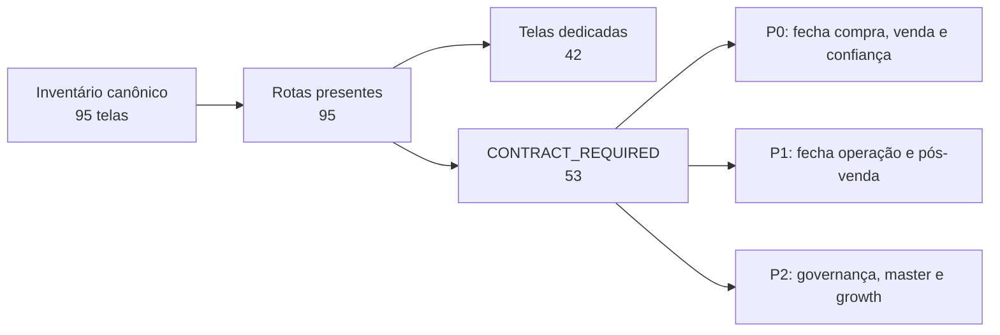
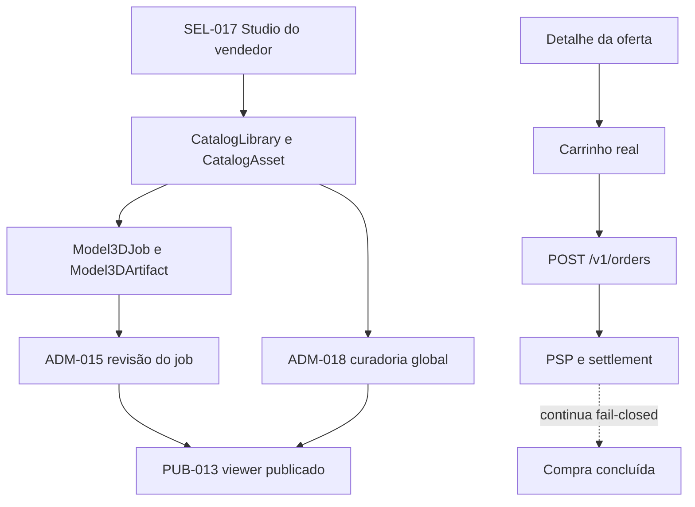

# Telas faltantes e ordem de integração

Data da verificação: 2026-08-25  
Comando executado: `pnpm report:screens:functional`

## Resposta curta

O inventário canônico tem **95 telas e 95 rotas presentes**. Não há URL ausente. O déficit real é funcional:

| Estado | Quantidade |
|---|---:|
| Tela dedicada | 42 |
| `CONTRACT_REQUIRED` | 53 |
| Rota ausente | 0 |

O comando termina com código 1 de propósito: o gate estrito considera placeholder contratual como lacuna, mesmo quando a rota responde HTTP 200.



## Cobertura por família

| Família | Rotas | Dedicadas | `CONTRACT_REQUIRED` |
|---|---:|---:|---:|
| Pública | 15 | 9 | 6 |
| Conta | 16 | 10 | 6 |
| Comprador | 12 | 8 | 4 |
| Vendedor | 17 | 13 | 4 |
| Admin | 18 | 1 | 17 |
| Master | 8 | 1 | 7 |
| Growth | 9 | 0 | 9 |
| **Total** | **95** | **42** | **53** |

## Ordem recomendada

### P0. Fechar a jornada comercial sem fingir capability

1. `SCR-ACC-004` `/verificar-idade`: age assurance e contestação. É gate de elegibilidade anterior ao pedido.
2. `SCR-ADM-002` `/admin/anuncios[/:listingId]`: claim, checklist e decisão segregada da revisão do anúncio.
3. `SCR-SEL-017` `/vender/studio`: biblioteca e contribuição de assets. A prévia local 2.5D não substitui submissão, revisão ou publicação.
4. `SCR-ADM-015` `/admin/catalogo/modelos-3d/:jobId`: job e revisão de uma saída 3D real.
5. `SCR-ADM-018` `/admin/studio[/:resourceType/:resourceId]`: curadoria, proveniência e publicação separada da criação.
6. `SCR-BUY-002` `/mensagens/:conversationId`: conversa e proposta estruturada com controle anti-BOLA e anti-PII.
7. `SCR-PUB-010` `/seguranca`: conteúdo versionado de proteção, fraude, denúncia e recuperação.

Nota: o detalhe da oferta também precisa deixar de marcar `POST /v1/orders` como inexistente. A rota está registrada e o carrinho já a usa; a correção deve encaminhar para o carrinho real, preservando pagamento e settlement fail-closed.

### P1. Fechar suporte, dinheiro e confiança pública

- Público: `SCR-PUB-003`, `SCR-PUB-008`, `SCR-PUB-009`, `SCR-PUB-011`, `SCR-PUB-012`.
- Conta: `SCR-ACC-003`, `SCR-ACC-011`, `SCR-ACC-012`, `SCR-ACC-013`.
- Compra: `SCR-BUY-001`, `SCR-BUY-008`, `SCR-BUY-009`.
- Venda: `SCR-SEL-002`, `SCR-SEL-003`, `SCR-SEL-014`.
- Operação: `SCR-ADM-004` a `SCR-ADM-014`, além de `SCR-ADM-016` e `SCR-ADM-017`.

### P2. Fechar governança e leitura gerencial

- Master: `SCR-MST-002` a `SCR-MST-008`.
- Growth: `SCR-GRW-001` a `SCR-GRW-009`.
- Progressão de conta: `SCR-ACC-016`.

## Inventário completo das 53 lacunas

### Pública, 6

| ID | Rota | Resultado funcional esperado |
|---|---|---|
| SCR-PUB-003 | `/midas` | Estoque próprio rotulado e derivado de fonte canônica. |
| SCR-PUB-008 | `/ajuda` | Busca, categorias e suporte contextual. |
| SCR-PUB-009 | `/ajuda/:articleSlug` | Artigo versionado, endereçável e mensurável. |
| SCR-PUB-010 | `/seguranca` | Proteção, fraude, denúncia e recuperação com conteúdo aprovado. |
| SCR-PUB-011 | `/politicas` | Índice de políticas vigentes e versões publicáveis. |
| SCR-PUB-012 | `/politicas/:policySlug` | Snapshot versionado de cada política. |

### Conta, 6

| ID | Rota | Resultado funcional esperado |
|---|---|---|
| SCR-ACC-003 | `/recuperar-acesso` | Recuperação não enumerável e revogação de sessões de risco. |
| SCR-ACC-004 | `/verificar-idade` | Age assurance minimizada, status e contestação. |
| SCR-ACC-011 | `/conta/privacidade` | Exercício de direitos e acompanhamento de protocolos. |
| SCR-ACC-012 | `/conta/privacidade/solicitacoes/:requestId` | Status e entrega autorizada da solicitação LGPD. |
| SCR-ACC-013 | `/conta/recurso` | Restrição, evidência, prazo e devido processo. |
| SCR-ACC-016 | `/conta/conquistas` | Nível, progresso e recompensas com regra e origem. |

### Comprador, 4

| ID | Rota | Resultado funcional esperado |
|---|---|---|
| SCR-BUY-001 | `/mensagens` | Lista de conversas e propostas sem vazamento. |
| SCR-BUY-002 | `/mensagens/:conversationId` | Thread, mensagem e proposta estruturada. |
| SCR-BUY-008 | `/conta/suporte` | Criar e listar tickets vinculados ao contexto correto. |
| SCR-BUY-009 | `/conta/suporte/:ticketId` | Thread, SLA, anexos e reabertura. |

### Vendedor, 4

| ID | Rota | Resultado funcional esperado |
|---|---|---|
| SCR-SEL-002 | `/vender` | Saúde comercial e próximas ações do SellerAccount. |
| SCR-SEL-003 | `/vender/equipe` | Convite, escopo, validade e revogação de membros. |
| SCR-SEL-014 | `/conta/saques/:payoutId` | Tentativas, falha, retry, retorno e comprovante. |
| SCR-SEL-017 | `/vender/studio` | Biblioteca, inspeção e submissão sem duplicar catálogo. |

### Admin, 17

| ID | Rota | Resultado funcional esperado |
|---|---|---|
| SCR-ADM-001 | `/admin` | Filas, SLA, alertas e freshness por grant. |
| SCR-ADM-002 | `/admin/anuncios[/:listingId]` | Claim e decisão segregada sobre revisão congelada. |
| SCR-ADM-004 | `/admin/vendedores[/:onboardingId]` | Revisão KYC/KYB sem copiar dossiê do provedor. |
| SCR-ADM-005 | `/admin/confianca[/:caseId]` | Risco, dispositivo, restrição e recurso auditáveis. |
| SCR-ADM-006 | `/admin/usuarios[/:userId]` | Visão 360 mascarada e comandos autorizados. |
| SCR-ADM-007 | `/admin/pedidos[/:orderId]` | Timeline de pedido, pagamento, entrega e hold. |
| SCR-ADM-008 | `/admin/disputas[/:disputeId]` | Evidência, decisão, recurso e efeito financeiro. |
| SCR-ADM-009 | `/admin/suporte[/:ticketId]` | Inbox, SLA, contexto e resposta governada. |
| SCR-ADM-010 | `/admin/reembolsos[/:refundRequestId]` | Decisão humana separada da execução PSP. |
| SCR-ADM-011 | `/admin/financeiro[/:caseType/:caseId]` | Conciliação, holds e exceções com maker-checker. |
| SCR-ADM-012 | `/admin/pagamentos[/:paymentId]` | Settlement tardio e quarentena sem dupla venda. |
| SCR-ADM-013 | `/admin/saques[/:payoutId]` | Aprovação, retry, reversão de reserva e risco. |
| SCR-ADM-014 | `/admin/midas[/:inventoryId]` | Inventário próprio, preço e publicação segregados. |
| SCR-ADM-015 | `/admin/catalogo/modelos-3d/:jobId` | Revisão de mesh, textura e proveniência do job real. |
| SCR-ADM-016 | `/admin/avaliacoes[/:orderReviewId]` | Moderação, recurso e reconstrução de reputação. |
| SCR-ADM-017 | `/admin/marketing[/:resourceType/:resourceId]` | Canal, consentimento, campanhas e abuso. |
| SCR-ADM-018 | `/admin/studio[/:resourceType/:resourceId]` | Curadoria, relations, lifecycle e publicação separada. |

### Master, 7

| ID | Rota | Resultado funcional esperado |
|---|---|---|
| SCR-MST-002 | `/master/acessos` | Roles, grants, validade, maker-checker e break-glass. |
| SCR-MST-003 | `/master/configuracoes` | Configuração versionada, impacto, aprovação e rollback. |
| SCR-MST-004 | `/master/integracoes` | Health e rotação por referência, sem retornar segredo. |
| SCR-MST-005 | `/master/auditoria` | Consulta e exportação governada de trilha append-only. |
| SCR-MST-006 | `/master/progressao` | Políticas versionadas de nível, prêmio e insígnia. |
| SCR-MST-007 | `/master/planos-de-anuncio` | Planos, fees, simulação e vigência sem alterar históricos. |
| SCR-MST-008 | `/master/marketing` | Governança, consentimento, frequência e kill switches. |

### Growth, 9

| ID | Rota | Resultado funcional esperado |
|---|---|---|
| SCR-GRW-001 | `/admin/growth` | Aquisição, ativação, transação, retenção e risco. |
| SCR-GRW-002 | `/admin/growth/funil` | Conversão por estágio, versão, período e bloqueio. |
| SCR-GRW-003 | `/admin/growth/tenants` | Sellers por estágio, bloqueio e próxima ação derivada. |
| SCR-GRW-004 | `/admin/growth/tenants/:sellerAccountId` | Jornada consolidada do SellerAccount. |
| SCR-GRW-005 | `/admin/growth/membros` | Memberships pseudonimizadas por padrão. |
| SCR-GRW-006 | `/admin/growth/membros/:membershipId` | Jornada autorizada sem chat, segredo ou payload bruto. |
| SCR-GRW-007 | `/admin/growth/coortes` | Retenção e conversão com definição estável. |
| SCR-GRW-008 | `/admin/growth/interacoes` | Eventos allowlisted, consentidos e com freshness. |
| SCR-GRW-009 | `/admin/growth/oportunidades` | Próxima ação derivada, read-only e explicável. |

## Dependências que o mapa de código expõe



O Graphify confirma a concentração de páginas em `ScreenContractPage` e conecta Studio, catálogo, viewer, carrinho e contratos. A fonte de verdade para o número é o relatório funcional executável, não apenas a existência de nós ou arquivos no grafo.

## Critério para uma tela deixar de ser “faltante”

Uma rota só migra para dedicada quando houver, em conjunto:

1. view específica, sem `ScreenContractPage`;
2. contrato/API real ou indisponibilidade explícita e fail-closed;
3. autorização e isolamento de objeto quando aplicável;
4. estados loading, vazio, erro, sucesso e conflito;
5. teste funcional do fluxo principal e do bloqueio crítico;
6. acessibilidade e QA desktop/mobile;
7. rastreabilidade atualizada em `docs/12-MATRIZ-DE-IMPLEMENTACAO.md`.

## Como reproduzir

```powershell
pnpm report:screens:functional
pnpm test:screens
```

Fontes canônicas: `docs/07-MAPA-DE-TELAS-E-FLUXOS.md`, `docs/12-MATRIZ-DE-IMPLEMENTACAO.md`, `apps/web/lib/screen-contracts.generated.json` e `apps/web/app/**/page.tsx`.
