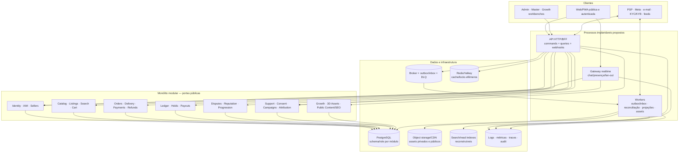
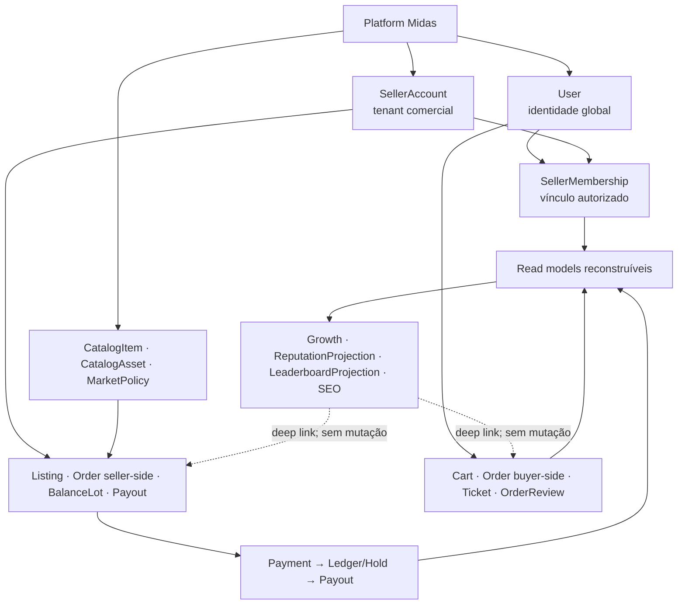
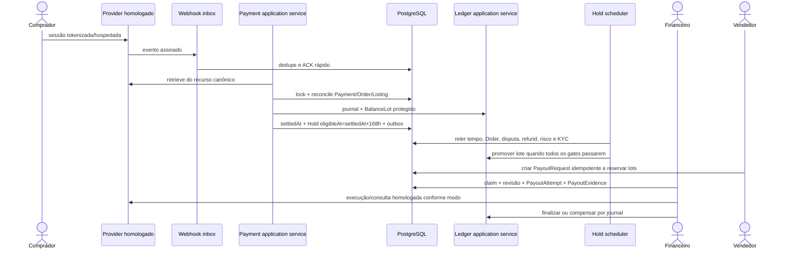
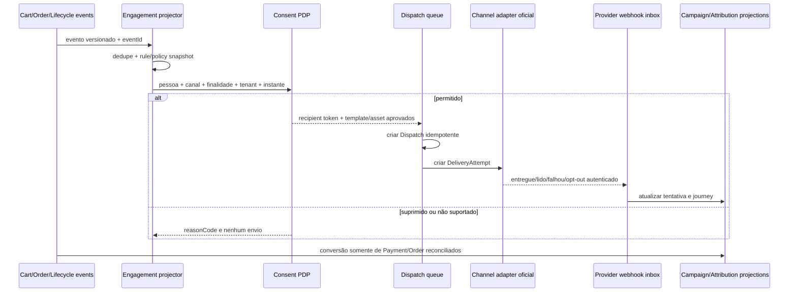
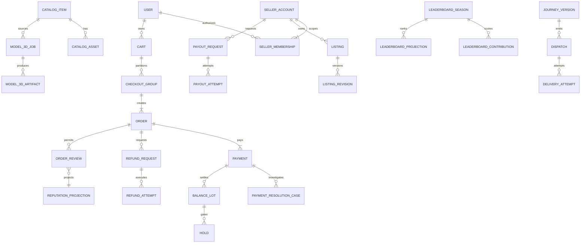
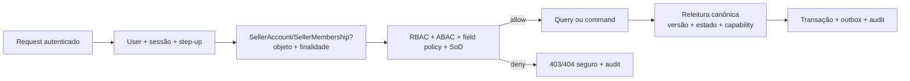

# Design — Midas Marketplace

Versão: 1.0  
Status: **SDD_PRONTO_IMPLEMENTACAO_PENDENTE**  
Owner: Arquitetura + Engenharia  
Revisores requeridos: Produto, Segurança, Operações, Financeiro, Jurídico, Privacidade, Catálogo, Marketing, Dados e Design  
Última atualização: 22 de agosto de 2026  
Substitui: nenhum artefato canônico  
Contratos relacionados: [requirements.md](requirements.md), [tasks.md](tasks.md), [benchmark clean-room](../../docs/20-BENCHMARK-COMPETIDORES-E-LAYOUTS.md), [sistema de layouts e templates](../../docs/21-SISTEMA-DE-LAYOUTS-E-TEMPLATES-UI.md)

## Visão geral

Este design descreve a arquitetura-alvo do Midas Marketplace para implementar `RF-001–300` sem criar domínios paralelos. Ele é deliberadamente referencial: o repositório contém documentação, mas não contém runtime confirmado. Stack, manifests, schemas, rotas executáveis e provedores ainda precisam ser materializados e validados pelas tarefas deste SDD.

O estilo proposto pelas ADRs é um **monólito modular orientado a domínios**, com processos separados para API/BFF, realtime e workers. PostgreSQL é o armazenamento canônico; outbox/inbox transportam fatos com semântica at-least-once; read models são reconstruíveis; Redis/Valkey, índice de busca e CDN/object storage são aceleradores, nunca fontes financeiras ou de consentimento.

### Ordem de autoridade documental

| Decisão | Owner canônico | Uso neste SDD |
|---|---|---|
| problema, escopo, regra e aceite | [PRD](../../docs/01-PRD-MIDAS.md) | fonte de `RF-001–300` e `RNF-001–050` |
| limites, agregados, estados, sequências e invariantes | [UML/arquitetura](../../docs/02-UML-ARQUITETURA.md) | modelo lógico e fluxos |
| rota, ator, fonte, ação e wireframe | [mapa de telas](../../docs/07-MAPA-DE-TELAS-E-FLUXOS.md) | 95 telas `SCR-*` canônicas |
| escolha arquitetural e trade-off | [ADRs](../../docs/08-ADRS-DECISOES-ARQUITETURAIS.md) | decisões ADR-001..019, ainda propostas salvo aceite formal |
| ordem, gates e dependências | [backlog](../../docs/05-BACKLOG-ROADMAP.md) e [matriz](../../docs/12-MATRIZ-DE-IMPLEMENTACAO.md) | ondas e evidência de saída |
| segurança, privacidade e operação | [segurança/operações](../../docs/04-SEGURANCA-COMPLIANCE-OPERACOES.md) | threat model, SLO, retenção e runbook |
| vocabulário e ownership | [nomenclatura](../../docs/17-NOMENCLATURA-HIERARQUIA-FUNCIONAL.md) | nomes de entidade, rota, evento, tabela e componente |
| composição visual | [direção de arte](../../docs/03-DIRECAO-DE-ARTE.md), [React Bits](../../docs/10-PLANO-REACT-BITS.md) e [brand kit](../../docs/18-BRAND-KIT-DESIGN-SYSTEM.md) | tokens, layout, motion e acessibilidade |
| padrões externos que merecem teste ou recusa | [benchmark clean-room](../../docs/20-BENCHMARK-COMPETIDORES-E-LAYOUTS.md) | evidência comparativa; não é owner de aparência, tela ou regra de domínio |
| composição `SCR → shell → template` | [sistema de layouts e templates](../../docs/21-SISTEMA-DE-LAYOUTS-E-TEMPLATES-UI.md) | 95 telas, 9 shells e 41 templates reutilizáveis; matriz exata e critérios P0 |

Se houver conflito, a implementação deve parar, identificar o owner, resolver a decisão no artefato próprio e só então atualizar contratos derivados. Data de edição não supera autoridade documental.

## Princípios de arquitetura

1. **Uma fonte por fato.** `User`, `SellerAccount`, `CatalogItem`, `Listing`, `Order`, `Payment`, ledger, `Ticket` e consentimento têm um único owner de escrita.
2. **Tenant explícito.** `SellerAccount` é o tenant; `SellerMembership` autoriza `User`; não existem `Tenant`, `Member`, `GrowthUser`, `StudioProduct` ou saldo de dashboard paralelos.
3. **Dinheiro não nasce na UI.** Valores usam unidade mínima + moeda; `Payment`, `JournalEntry`/`Posting`, `BalanceLot`/`Hold`, `RefundRequest`/`RefundAttempt` e `PayoutRequest`/`PayoutAttempt` têm responsabilidades distintas.
4. **Comando relê; query projeta.** Read model aceita consistência eventual informada, mas não autoriza mutação nem vira fonte de saldo, conversão, consentimento ou disponibilidade.
5. **Fato e publicação atômicos.** Agregado + outbox no mesmo commit; inbox + efeito no mesmo commit; consumidores idempotentes e replayáveis.
6. **Integração real e verificável.** Adapter expõe capabilities por contrato/país/moeda/conta; ausência falha fechado. Sandbox oficial comprova caminhos externos antes de “pronto”.
7. **Progressive enhancement.** HTML/DOM e poster entregam conteúdo crítico; motion, React Bits e WebGL enriquecem sem bloquear decisão, acessibilidade ou compra.
8. **Privacidade e finalidade.** Seller opera segmentos e resultados agregados; contato bruto fica no cofre da Platform e todo `Dispatch` reavalia consentimento/supressão.

## Arquitetura de alto nível



O gateway realtime não possui credencial para decidir pagamento, saldo, refund ou payout. Workers pesados 3D/marketing/projeção possuem pools, quotas e limites separados da API transacional.

## Hierarquia de autoridade e escopo



Toda rota seller-side resolve `sellerAccountId` pelo contexto selecionado e confirma `SellerMembership`/grants no servidor. Toda rota pessoal deriva `userId` da sessão; IDs recebidos jamais definem o sujeito autorizado.

## Bounded contexts e ownership

| Contexto | Agregados/fatos próprios | Interfaces publicadas | Proibições centrais |
|---|---|---|---|
| Identity / IAM / Sellers | `User`, sessão, fator, `SellerAccount`, `SellerMembership`, grants | autenticação, PDP, capabilities, onboarding | seller separado de `User`; grant implícito |
| Catalog / 3D Assets | `CatalogItem`, versões, `CatalogAsset`, `CatalogSubmission`, `Model3DJob`, `Model3DArtifact` | biblioteca, manifesto, submission, job/review | catálogo por tenant/tela; 3D como produto |
| Listings / Moderation / Search | `Listing`, `ListingRevision`, prova, reserva, índices | draft/review/publication/search | revisão sobrescrita; publicação automática P2P |
| Conversation / Cart | `Conversation`, `Offer`, `Cart`, `CheckoutGroup` | mensagens/propostas/carrinho | PII pré-compra; carrinho como reserva infinita |
| Orders / Delivery | `Order`, delivery room/package/confirmations | criação, timeline, entrega, conclusão | uma parte confirmar pela outra |
| Payments / Refunds | `Payment`, `PaymentAttempt`, `PaymentResolutionCase`, `RefundRequest`, `RefundAttempt` | provider/reconcile/resolve/refund | redirect confirmar pagamento; editar `PAID` |
| Ledger / Payouts | `JournalEntry`, `Posting`, `BalanceLot`, `Hold`, `PayoutRequest`, `PayoutAttempt`, `PayoutEvidence` | balances, release, payout operations | saldo mutável de dashboard; baixa sem prova |
| Disputes / Reputation | `Dispute*`, `OrderReview`, `ReputationProjection` | decisão/recurso/review/projection | ticket virar disputa; nota ausente virar zero |
| Progression / Rewards | `ProgressionContribution`, `AccountLevel*`, `Badge*`, `Reward*`, `Leaderboard*` | policies, projections, awards | editar pontos; reordenar temporada fechada |
| Engagement / Consent | `ContactPoint`, `ConsentRecord`, `SuppressionEntry`, `Campaign*`, `Journey*`, `Dispatch`, `DeliveryAttempt` | eligibility/dispatch/adapters | exportar PII ao seller; fallback sem consentimento |
| Promotions / Attribution | `Coupon*`, `AffiliateAccount`, `AttributionTouch`, `AttributionSnapshot`, `AffiliateCommission` | redeem/attribute/mature | URL/pixel confirmar venda ou comissão |
| Support / Mailbox | `Ticket`, `TicketMessage`, anexos e SLA | thread/context/queue | ticket substituir refund/disputa |
| Growth / Public Content | metric definitions, contributions, read models, `CrawlPolicy`, SEO health | queries/freshness/SSR/sitemap | command por dashboard; SEO editar fato canônico |

O diagrama completo de classes e o modelo relacional pertencem ao [UML](../../docs/02-UML-ARQUITETURA.md); este SDD não cria entidades alternativas.

## Fluxos críticos

### Pagamento, hold e payout



Se o evento não convergir automaticamente, `PaymentResolutionCase` coleta uma única tentativa/evidência e a decisão autorizada chama o mesmo settlement command. Nunca há operação genérica para alterar `Payment.status`.

### Pós-venda e dispatch consentido



## Componentes e interfaces lógicas

Os nomes abaixo são contratos de design; caminhos físicos e linguagem serão confirmados na tarefa de fundação.

```text
ApplicationCommand<I, O>
  execute(input, actorContext, idempotencyKey?, expectedVersion?) -> O

ApplicationQuery<F, R>
  execute(filter, actorContext, cursor?) -> Page<R> | R

PolicyDecisionPoint
  authorize(subject, action, resource, tenantScope?, purpose?, fieldSet?) -> Decision

DomainRepository<A>
  getForUpdate(id, expectedVersion?) -> A
  save(aggregate, outboxEvents[]) -> version

Projector<E, P>
  apply(event, inboxKey) -> projectionRevision

PaymentProviderPort
  capabilities(market, currency, accountType) -> ProviderCapabilities
  retrievePayment(providerPaymentId) -> ProviderPaymentSnapshot
  createRefund(command) -> ProviderAttempt
  retrievePayout(providerPayoutId) -> ProviderPayoutSnapshot

ChannelAdapterPort
  capabilities(channel, market, sender) -> ChannelCapabilities
  dispatch(Dispatch, DeliveryAttempt) -> ProviderMessageReference
  verifyWebhook(headers, body) -> ChannelEvent

Model3DGeneratorPort
  capabilities(inputClass, profile) -> Model3DCapabilities
  submit(Model3DJob) -> ProviderJobReference
  fetchArtifact(providerJobId) -> CandidateArtifact
```

### API e contratos de transporte

- REST começa em `/v1`, usa substantivos plurais e `operationId` único em camelCase.
- OpenAPI 3.1 é o contrato de HTTP; JSON Schema/AsyncAPI ou schema registry versiona eventos.
- `GET` não altera domínio. `POST` financeiro ou externo exige `Idempotency-Key`; mudança concorrente usa `If-Match`/versão esperada.
- Listagens usam cursor opaco assinado, limite, ordenação estável e desempate único.
- Respostas derivadas incluem `asOf`, `projectedAt`, `freshness` e, quando pertinente, moeda/unidade/definição.
- Erros usam `application/problem+json`, `code` estável, `correlationId` e `fieldErrors`; mensagens não revelam objeto alheio, stack, SQL ou segredo.
- Webhooks validam assinatura/timestamp, persistem inbox/dedupe e respondem rápido; reconciliação ocorre fora do request quando apropriado.

Rotas candidatas só podem ser materializadas quando mapeadas ao inventário canônico. Exemplos já documentados: `/v1/payouts`, `/v1/me/overview`, `/v1/me/purchases`, `/v1/admin/tickets/{ticketId}/context` e os recursos 3D/Studio detalhados nos documentos especializados. A implementação deve preferir extensão de contrato existente à criação de endpoint equivalente.

### Eventos

Gramática canônica: `<domain>.<subject_path>.<past_action>.v<major>`, transportada como CloudEvent quando adotado. Exemplos já definidos incluem `order.payment_confirmed.v1`, `ledger.hold.released.v1`, `payout.request.created.v1`, `payout.attempt.paid.v1`, `catalog.model3d.artifact_published.v1` e `reputation.order_review.submitted.v1`.

Envelope mínimo: `eventId`, `eventType`, `schemaVersion`, timestamps, aggregate/type/id/version, `sellerAccountId?`, ator minimizado, `correlationId`, `causationId`, módulo e payload allowlisted. Payload não carrega entidade inteira, PII, chat, segredo ou URL assinada.

## Modelo de dados e invariantes



Invariantes mínimas:

- IDs são opacos, tipados por contexto e imutáveis; tabelas/colunas seguem `snake_case`, código segue o dicionário de [nomenclatura](../../docs/17-NOMENCLATURA-HIERARQUIA-FUNCIONAL.md).
- dinheiro é inteiro em unidade mínima + ISO 4217; gold é referência separada; moedas cruas nunca são somadas.
- `JournalEntry` possui pelo menos dois `Posting` e soma zero por moeda/livro.
- um settlement, hold e efeito financeiro por `Payment`/policy; `(providerAccountId, providerPaymentId)` e provider event são únicos.
- `eligibleAt = Payment.settledAt + 168h`; conclusão, disputa, refund, risco e KYC são gates, não novos relógios.
- uma `OrderReview` ativa por `(orderId, reviewerRole)`; nota `0` é diferente de `null`.
- temporada encerrada e policy publicada são imutáveis; correção cria versão ou contribuição compensatória.
- um evento gera no máximo uma contribuição por consumidor/projetor/definição; replay converge.
- `Dispatch` é o envio lógico; `DeliveryAttempt` é tentativa; provider não é fonte de consentimento ou conversão.
- `Model3DArtifact` é derivado do `CatalogItem`; promoção troca ponteiro ativo, não sobrescreve versão.

## Taxonomia de telas, shells e templates

A taxonomia canônica é definida em [docs/21](../../docs/21-SISTEMA-DE-LAYOUTS-E-TEMPLATES-UI.md): **95 telas `SCR-*`**, compostas por **9 shells** e **41 templates reutilizáveis**. Tela, shell e template são conceitos distintos:

```text
token → primitivo → padrão → template de página → shell de produto → tela SCR existente
```

- a **tela** orquestra a rota e o caso de uso;
- o **shell** fornece navegação, contexto, entrada autorizada e overlays;
- o **template** define regiões, slots e comportamento responsivo, sem buscar domínio ou decidir autorização.

### Inventário fechado de telas

| Família canônica | Intervalo | Telas |
|---|---:|---:|
| Público | `SCR-PUB-001..015` | 15 |
| Identidade e conta | `SCR-ACC-001..016` | 16 |
| Comprador | `SCR-BUY-001..012` | 12 |
| Vendedor | `SCR-SEL-001..017` | 17 |
| Administração | `SCR-ADM-001..018` | 18 |
| Master | `SCR-MST-001..008` | 8 |
| Growth | `SCR-GRW-001..009` | 9 |
| **Total** |  | **95** |

### Catálogo de shells

| Shell | Contexto | Regra estrutural |
|---|---|---|
| `SH-PUBLIC` | descoberta, catálogo, conteúdo e ranking | header público; conteúdo crítico estável |
| `SH-AUTH` | login, cadastro, recuperação e verificação | uma tarefa principal; sem navegação comercial dispersiva |
| `SH-ACCOUNT` | preferências, segurança e conquistas | context rail da conta, responsivo |
| `SH-BUYER` | compras, mensagens, pedido e suporte | reaproveita esqueleto da conta e adiciona contexto transacional |
| `SH-SELLER` | operação do `SellerAccount` | tenant ativo visível antes de ação |
| `SH-ADMIN` | filas e workbenches | master-detail com campos/ações por grant |
| `SH-MASTER` | governança sensível | versão, diff, aprovação e ativação separados |
| `SH-GROWTH` | análise multi-tenant | escopo/freshness persistentes; sem mutação |
| `SH-STUDIO` | modo imersivo dentro de Seller/Admin | library + stage + inspector; um canvas |

`SH-STUDIO` não cria família `SCR-STU-*`: ele substitui o viewport interno de `SH-SELLER` ou `SH-ADMIN` em `SCR-SEL-017` e `SCR-ADM-018`.

### Catálogo de templates por família

| Grupo de templates | Quantidade | Cobertura estrutural |
|---|---:|---|
| Público e autenticação | 10 | landing, catálogo, detalhe, perfil, editorial, viewer, ranking, progressão e auth |
| Conta e comprador | 10 | overview/settings/list/detail, comunicações, checkout, pedido, workflow e carrinho |
| Seller, finanças, CRM e marketing | 11 | overview/onboarding/team/list/detail, financeiro, CRM, marketing e Studio |
| Admin e Master | 6 | overview/workbench, configuração, policy, auditoria e progressão |
| Growth | 4 | overview, análise, entidade e worklist |
| **Total** | **41** | **95 telas pela matriz `SCR → shell → template` de docs/21** |

Este SDD não reproduz as 95 linhas nem a distribuição individual dos 41 templates. A matriz exata, slots, responsividade e cobertura pertencem a `docs/21`; CI deve compará-la como conjunto ao mapa de telas e à matriz de implementação.

Estrutura comum:

```text
Shell
├── contexto global: canal, tenant, busca e identidade
├── contexto local: breadcrumb, título, estado/freshness e ações
├── conteúdo primário: objeto ou decisão corrente
├── conteúdo de apoio: prova, histórico, timeline e relacionados
└── próximo passo: ação permitida, consequência, erro e recuperação
```

Grade proposta: 12 colunas desktop, 8 tablet, 4 mobile. Objeto e decisão determinam se a representação é card, lista, tabela, gráfico ou detalhe. `ValueProof`, `TrustTrace`, `ProductStage`, `RelatedOfferRail`, `LifecycleNotice`, `ConsentStatus`, `LevelProgress` e `SponsoredPriority` são composições visuais do brand kit, não entidades de domínio.

### Contrato de estado da interface

Toda tela remota precisa tratar `initial-loading`, `refreshing`, `success`, `empty`, `partial`, `stale`, `forbidden/not-found` não enumerável, `conflict`, `rate-limited`, `dependency-unavailable` e `fatal-recoverable`. A UI conserva filtros/cursor quando seguro, apresenta `asOf` e oferece retry ou deep link ao owner. Skeleton não inventa linha, valor, usuário ou progresso; job assíncrono exibe apenas fase/progresso persistido.

React Bits, se aceito, fica em wrappers do design system e somente no shell DOM. Three.js/R3F controla câmera/modelo. Motion deve respeitar reduced motion, orçamento e foco; nunca anima alteração de saldo, risco, ranking ou decisão como celebração.

## Autorização, segurança e privacidade



- BOLA/BFLA são testadas em toda rota pessoal, seller, admin e Master.
- Acesso staff filtra seção, campo e ação; função de suporte não herda finanças/disputa.
- Ações financeiras, grants, policy publication, export e evidência exigem step-up conforme risco e maker-checker conforme policy.
- Sessões administrativas usam origem e política mais restritas; break-glass é temporal, justificado e revisável.
- PII, contato, destino financeiro, chat e evidência não entram em logs/analytics; arquivos privados usam scan, hash, URLs temporárias e retenção.
- PAN/CVV não trafega pelo Midas; KYC/KYB e payment details preferem sessão hospedada/tokenizada.
- Standoff 2 e assets de terceiros permanecem condicionados a autorização/licença; ausência bloqueia publicação/operação dependente, não a construção genérica clean-room.

## Concorrência, cache e falhas

| Risco | Controle de design | Evidência requerida |
|---|---|---|
| duas reservas/unidade | unique constraint + lock + ordem de aquisição | teste concorrente PostgreSQL |
| webhook duplicado/fora de ordem | inbox única + aggregate version + retrieve/reconcile | replay e permuta de eventos |
| saque/refund duplo | `Idempotency-Key`, versão, allocation/amount sob lock | duas requisições simultâneas |
| decisão concorrente | `If-Match`, claim/lease, SoD | vencedor único + conflito 409 |
| outbox após crash | agregado + outbox na mesma transação | fault injection pós-commit |
| cache stale | chave escopada + TTL + freshness; comando relê DB/provider | teste stale→revalidação |
| worker/adapter indisponível | timeout, retry/jitter, circuit breaker, DLQ e reconciliação | sandbox/serviço desligado e recovery |
| asset malformado | upload direto, quarentena, egress bloqueado, scan e budgets | corpus adversarial 2D/GLB |
| fila noisy-neighbor | quota por tenant, backpressure e pools separados | carga multi-tenant |

Redis/Valkey pode hospedar cache, rate limit, lease e coordenação descartável. Não hospeda ledger, consentimento, estado final, elegibilidade ou único relógio. Chave sempre inclui namespace, versão e `sellerAccountId` quando aplicável.

## Observabilidade e operação

- OpenTelemetry propaga `correlationId`/trace por API, worker e adapter; logs estruturados são redigidos.
- Métricas mínimas: latência/erro por operation, outbox age, inbox duplicate, DLQ, projector lag, reconciliation divergence, payout/refund failures, channel suppression/delivery, asset queue/budget e Web Vitals.
- Audit é append-only e separado de analytics; registra ator, ação, alvo, before/after permitido, motivo, instante, contexto e correlação.
- SLOs e capacidade só serão fixados após benchmark/carga; não se adotam números inventados neste SDD. Cada endpoint/pipeline deve publicar medição p50/p95/p99, throughput, erro e saturação antes do piloto.
- Backup/PITR, restore e DR precisam de prova executada; runbooks cobrem PSP, payout, late payment, refund, fraude, consentimento, provider de canal, asset e projeção.

## Estratégia de testes e gates

Nenhum teste isolado substitui integração real. A suíte deve usar containers locais reais (Podman) para PostgreSQL/cache/broker/object storage escolhidos e sandboxes oficiais para PSP/Meta/e-mail/KYC/3D quando a capability for declarada pronta. Funções de sucesso simuladas não contam como evidência.

1. **Estáticos/arquitetura:** imports entre módulos, ciclos, SQL cross-schema, nomes bloqueados, RF/SCR/route/schema/event/test/owner órfãos, OpenAPI/AsyncAPI lint.
2. **Unitários determinísticos:** policies, dinheiro, state transitions, status mapping, lifecycle, fee, ranking, consent eligibility e serializers.
3. **Integração:** migrations e constraints no PostgreSQL real; outbox/inbox; repositories; object storage; cache invalidation; adapters em sandbox.
4. **Concorrência/fault injection:** reserva, webhook, late settlement, refund, hold release, payout, cupom, dispatch, projector replay e claims.
5. **Autorização/segurança:** cross-user, cross-tenant, role escalation, field policy, step-up, SSRF/upload, secret/PII leakage e webhook forgery.
6. **E2E por tela:** happy path, vazio, erro, stale, conflito e recuperação para cada uma das 95 telas `SCR-ID`; ação sensível inclui negativo de autorização. Testes estruturais adicionais validam os 9 shells e os 41 templates sem branching por pathname.
7. **Acessibilidade/visual:** axe + teclado + leitor de tela + zoom 200% + reduced motion; screenshots por breakpoint; sem dependência apenas de cor.
8. **Performance/soak:** API, queries, queues, projection replay, viewer 3D cleanup, SSR/Web Vitals e isolamento de tenant.
9. **Reconciliação/DR:** provider↔`Payment`↔ledger, projections↔sources, restore/PITR e replay com checksum.

Gates G0–G3 condicionam autorização, dados, PSP e policies; G4 exige matriz executável; G5 segurança; G6 operação; G7 piloto; G8 lançamento. Uma capability pode avançar em implementação clean-room e sandbox sem declarar operação comercial liberada.

## Decisões e trade-offs

| Decisão proposta | ADR owner | Benefício | Custo/condição |
|---|---|---|---|
| monólito modular + processos especializados | ADR-001 | consistência local e menor custo inicial | release coordenado; teste de fronteira obrigatório |
| PostgreSQL + outbox/inbox | ADR-002 | atomicidade e replay verificável | retenção, DLQ e idempotência explícitas |
| `User`/`SellerAccount`/`SellerMembership` | ADR-003 | identidade e tenant sem duplicação | escopo obrigatório em todo seller flow |
| PSP/ledger/hold/refund/payout separados | ADR-004/006/014 | auditabilidade financeira | mais estados, reconciliação e SoD |
| CQRS pragmático | ADR-007/008 | dashboards rápidos e reconstruíveis | freshness/lag e reconciliation |
| pipeline 3D assíncrono revisado | ADR-013 | segurança e provenance | custo de worker/benchmark; fidelity limitada |
| projeções de reputação/progressão | ADR-015 | rebuild e compensação | não podem autorizar ou virar fato manual |
| consent/capability no dispatch | ADR-016 | privacidade e fail-closed | integrações e políticas por canal/mercado |
| Studio sobre Catalog/Listing | ADR-017 | prefill sem catálogo paralelo | curadoria/submission antes da publicação |
| SSR/SEO derivados de políticas | ADR-019 | conteúdo consistente e indexável | testes por template/locale |

As ADRs estão documentadas como propostas; a tarefa inicial precisa registrar aceite, substituição ou pendência antes de congelar stack e contratos físicos.

## Matriz de rastreabilidade do design

| Requisito Kiro | RF | Contexto/entidades | ADRs/docs principais |
|---:|---|---|---|
| 1 | 001–010 | `User`, sessão, device | ADR-003/009 · docs 02/04 |
| 2 | 011–018 | `CatalogItem`, `CatalogAsset` | ADR-002/017 · docs 02/15 |
| 3–4 | 019–043 | `Listing`, `ListingRevision`, moderação | ADR-001/009/018 · docs 02/07 |
| 5–6 | 044–062 | Search, Recommendation, Price | ADR-007 · docs 01/02 |
| 7 | 063–076 | `Conversation`, `Offer` | ADR-009/011 · docs 02/04 |
| 8–9 | 077–102 | `Order`, `Payment`, ledger, hold, payout | ADR-002/004/014 · docs 02/13 |
| 10 | 103–109 | Midas Inventory | ADR-007 · docs 01/07 |
| 11 | 110–120 | `Ticket`, mailbox | ADR-002/009 · docs 02/04 |
| 12–13 | 121–138 | IAM, Audit, Notifications | ADR-009/011/012 · docs 04/08 |
| 14 | 139–148 | `Dispute*` | ADR-004/006/009 · docs 02/04 |
| 15–18 | 149–175 | Seller, Privacy, Policy | ADR-003/009/012 · docs 01/04 |
| 19 | 176–180 | `Payment` quarantine | ADR-005 · docs 02/08 |
| 20–23 | 181–202 | account/sales read sides, `RefundRequest`, 360° | ADR-006/007/009 · docs 07/13 |
| 24 | 203–211 | Growth definitions/projections | ADR-008 · docs 09/12 |
| 25–26 | 212–224 | `Model3DJob`, `Model3DArtifact` | ADR-013 · docs 11/15 |
| 27 | 225–229 | `PaymentResolutionCase`, `Payout*` | ADR-014 · docs 13 |
| 28 | 230–236 | `OrderReview`, `ReputationProjection` | ADR-015 · docs 13 |
| 29 | 237–247 | `AccountLevel*`, `Badge*`, `Reward*`, `Leaderboard*` | ADR-015 · docs 13 |
| 30 | 248–255 | `ListingPlanPolicyVersion`, snapshot | ADR-018 · docs 13 |
| 31 | 256–267 | `Cart`, lifecycle, relations, insights | ADR-016/017 · docs 14/15 |
| 32 | 268–282 | consent, `Campaign*`, `Journey*`, `Dispatch`, attribution | ADR-016 · docs 14/16 |
| 33 | 283–292 | Catalog/Asset/Listing/Submission/3D | ADR-017 · docs 15 |
| 34 | 293–300 | `CrawlPolicy`, `MarketPolicy`, SEO read side | ADR-019 · docs 16 |
| 35 | RNF-001–050 | transversal | ADR-001..019 · docs 04/08/12/17 |

## Pendências e bloqueios reais

- aceitar/substituir as 19 ADRs e escolher stack de frontend, backend, persistência/ORM e test runners;
- obter autorização/licença para operação e assets Standoff 2 ou manter catálogo genérico clean-room;
- selecionar e contratar PSP/capabilities por país/moeda, inclusive fluxo manual e payout;
- fechar policies jurídicas, financeiras, fiscais, refund/disputa, idade e retenção;
- contratar/homologar feeds, Meta/WhatsApp/Instagram, e-mail, KYC/KYB e provider 3D aplicáveis;
- transformar os contratos em OpenAPI/AsyncAPI/JSON Schema e migrations executáveis;
- medir SLOs, budgets e capacidade em ambiente real antes do piloto.

Enquanto essas evidências não existirem, este design permanece **SDD_PRONTO_IMPLEMENTACAO_PENDENTE** e não autoriza afirmar runtime, integração ou disponibilidade comercial.
